# raise a Temple, worship another bloodline’s god, and keep the gained Action on top

## Ariadne gathers Theseus at the table

Viewpoint: **Ariadne**.

<table>
<tr><th>Desktop · 1440 × 1000</th><th>Phone · 393 × 852</th></tr>
<tr>
<td valign="top"><a href="../../screenshots/raise-a-temple-worship-another-bloodline-s-god-and-keep-the-gained-action-on-top/000-friends-desktop-darwin.png">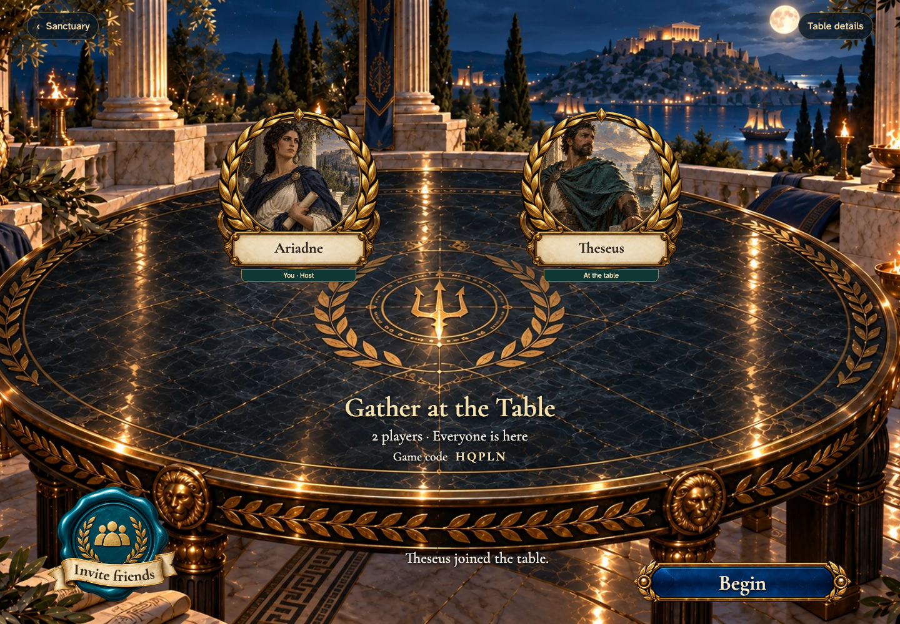</a></td>
<td valign="top"><a href="../../screenshots/raise-a-temple-worship-another-bloodline-s-god-and-keep-the-gained-action-on-top/000-friends-phone-darwin.png">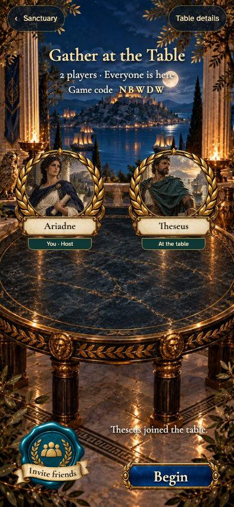</a></td>
</tr>
</table>

Tabletop · 3840 × 2160 — expand screenshot

<a href="../../screenshots/raise-a-temple-worship-another-bloodline-s-god-and-keep-the-gained-action-on-top/000-friends-tabletop-4k-darwin.png">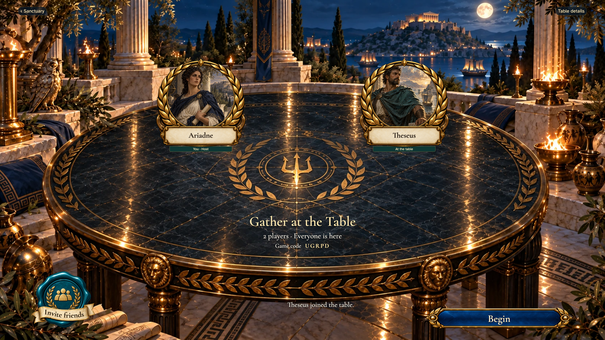</a>

- [x] Ariadne gathers Theseus at the table

## Theseus chooses Thaleia and brings Athena to the shared table

Viewpoint: **Theseus**.

<table>
<tr><th>Desktop · 1440 × 1000</th><th>Phone · 393 × 852</th></tr>
<tr>
<td valign="top"><a href="../../screenshots/raise-a-temple-worship-another-bloodline-s-god-and-keep-the-gained-action-on-top/001-choose-athena-desktop-darwin.png">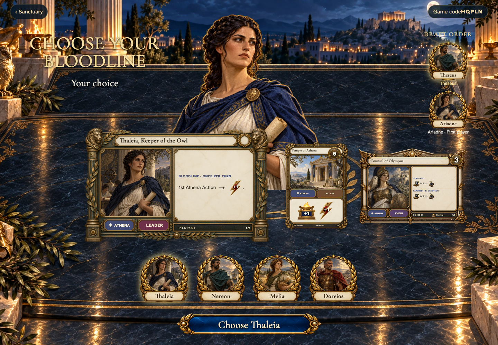</a></td>
<td valign="top"><a href="../../screenshots/raise-a-temple-worship-another-bloodline-s-god-and-keep-the-gained-action-on-top/001-choose-athena-phone-darwin.png">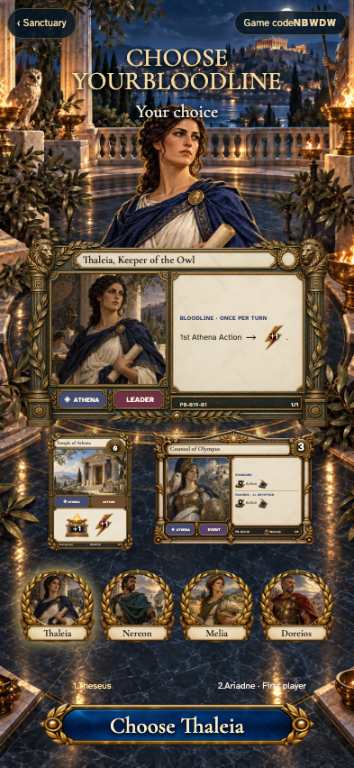</a></td>
</tr>
</table>

Tabletop · 3840 × 2160 — expand screenshot

<a href="../../screenshots/raise-a-temple-worship-another-bloodline-s-god-and-keep-the-gained-action-on-top/001-choose-athena-tabletop-4k-darwin.png">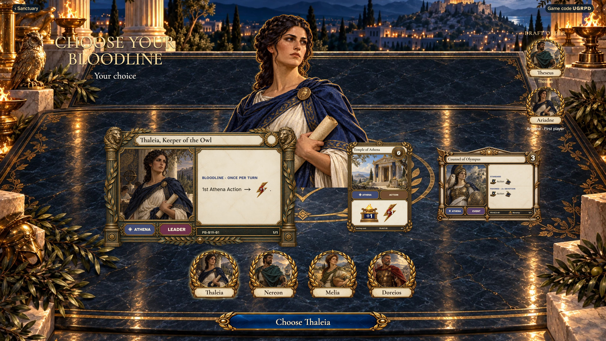</a>

- [x] Theseus chooses Thaleia and brings Athena to the shared table

## Ariadne chooses Nereon and his Temple of Poseidon

Viewpoint: **Ariadne**.

<table>
<tr><th>Desktop · 1440 × 1000</th><th>Phone · 393 × 852</th></tr>
<tr>
<td valign="top"><a href="../../screenshots/raise-a-temple-worship-another-bloodline-s-god-and-keep-the-gained-action-on-top/002-choose-poseidon-desktop-darwin.png">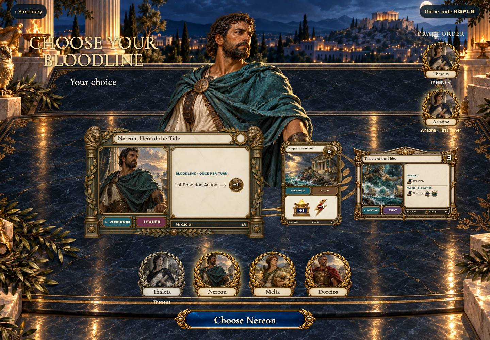</a></td>
<td valign="top"><a href="../../screenshots/raise-a-temple-worship-another-bloodline-s-god-and-keep-the-gained-action-on-top/002-choose-poseidon-phone-darwin.png">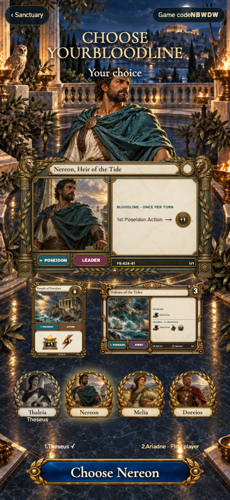</a></td>
</tr>
</table>

Tabletop · 3840 × 2160 — expand screenshot

<a href="../../screenshots/raise-a-temple-worship-another-bloodline-s-god-and-keep-the-gained-action-on-top/002-choose-poseidon-tabletop-4k-darwin.png">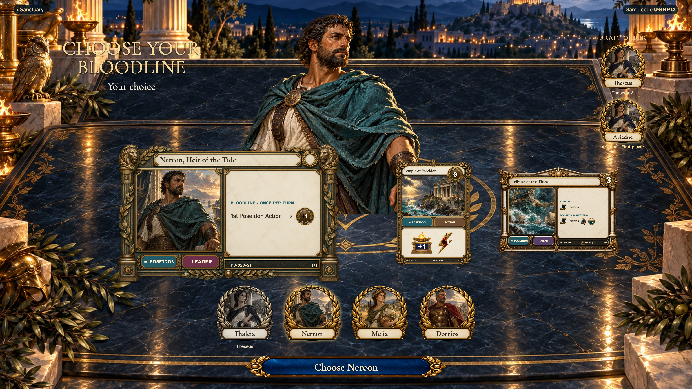</a>

- [x] Ariadne chooses Nereon and his Temple of Poseidon

## Ariadne receives her Temple and four Obols

Viewpoint: **Ariadne**.

<table>
<tr><th>Desktop · 1440 × 1000</th><th>Phone · 393 × 852</th></tr>
<tr>
<td valign="top"><a href="../../screenshots/raise-a-temple-worship-another-bloodline-s-god-and-keep-the-gained-action-on-top/003-opening-desktop-darwin.png">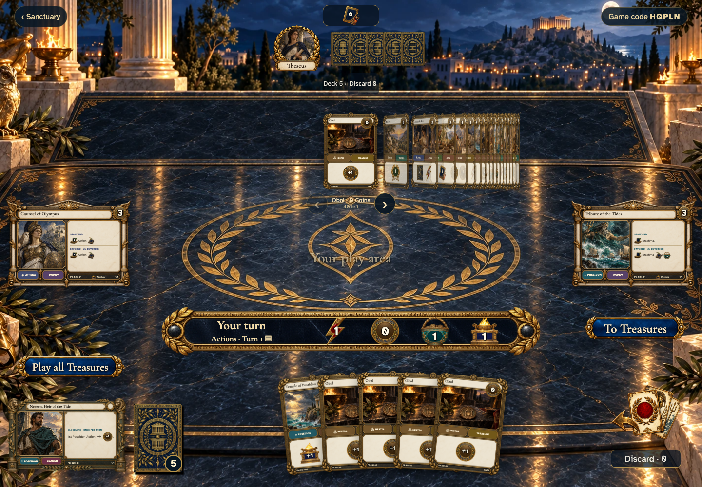</a></td>
<td valign="top"><a href="../../screenshots/raise-a-temple-worship-another-bloodline-s-god-and-keep-the-gained-action-on-top/003-opening-phone-darwin.png">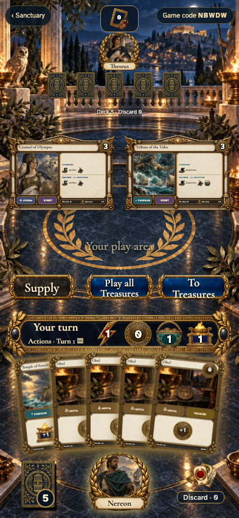</a></td>
</tr>
</table>

Tabletop · 3840 × 2160 — expand screenshot

<a href="../../screenshots/raise-a-temple-worship-another-bloodline-s-god-and-keep-the-gained-action-on-top/003-opening-tabletop-4k-darwin.png">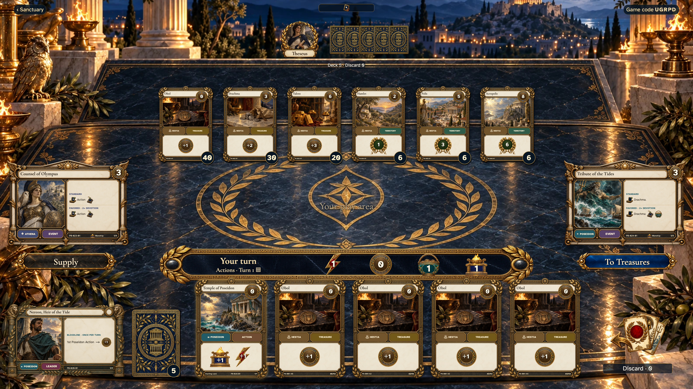</a>

- [x] Ariadne receives her Temple and four Obols

## Read the Temple before playing it

Viewpoint: **Ariadne**.

<table>
<tr><th>Desktop · 1440 × 1000</th><th>Phone · 393 × 852</th></tr>
<tr>
<td valign="top"><a href="../../screenshots/raise-a-temple-worship-another-bloodline-s-god-and-keep-the-gained-action-on-top/004-temple-desktop-darwin.png">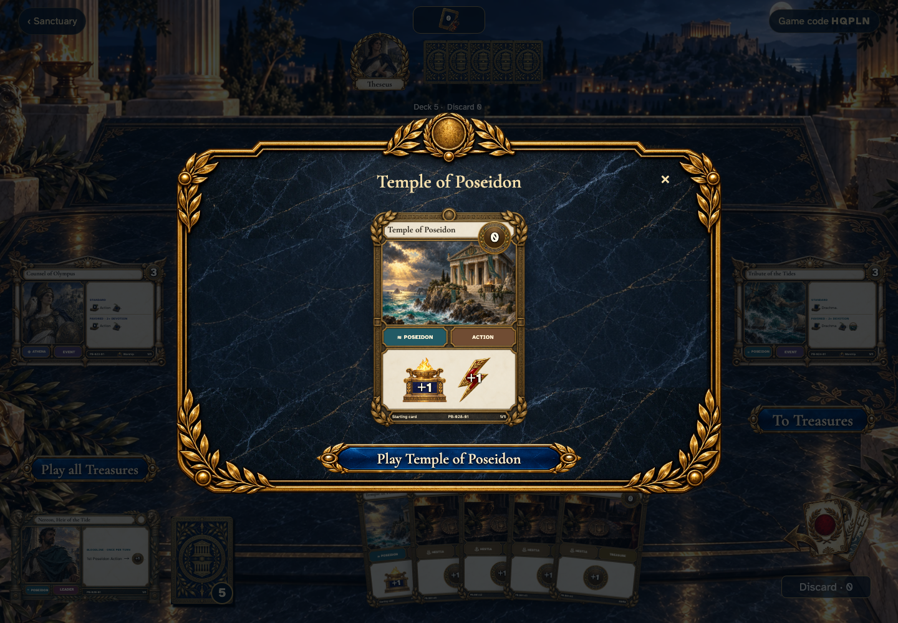</a></td>
<td valign="top"><a href="../../screenshots/raise-a-temple-worship-another-bloodline-s-god-and-keep-the-gained-action-on-top/004-temple-phone-darwin.png">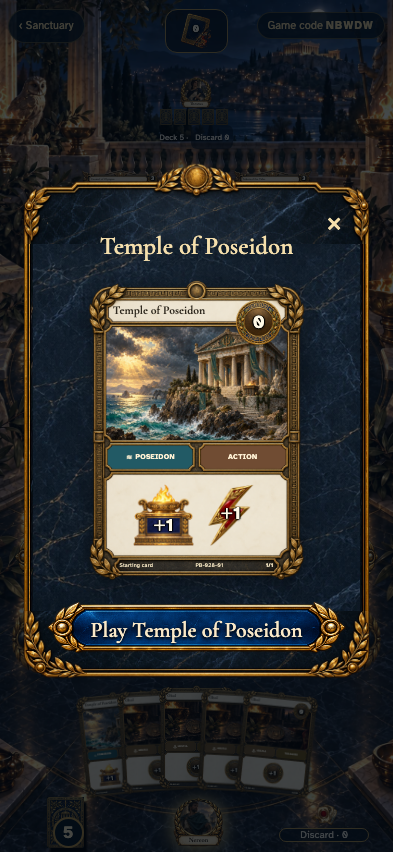</a></td>
</tr>
</table>

Tabletop · 3840 × 2160 — expand screenshot

<a href="../../screenshots/raise-a-temple-worship-another-bloodline-s-god-and-keep-the-gained-action-on-top/004-temple-tabletop-4k-darwin.png">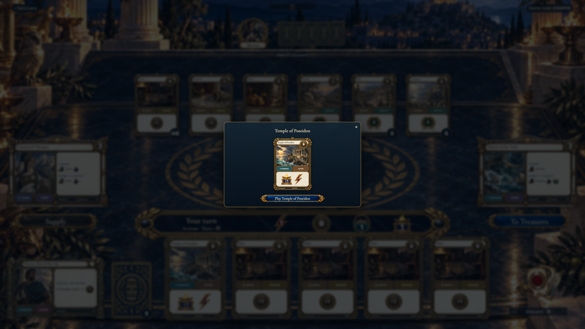</a>

- [x] Read the Temple before playing it

## The Temple grants Worship and Nereon grants one Coin

Viewpoint: **Ariadne**.

<table>
<tr><th>Desktop · 1440 × 1000</th><th>Phone · 393 × 852</th></tr>
<tr>
<td valign="top"><a href="../../screenshots/raise-a-temple-worship-another-bloodline-s-god-and-keep-the-gained-action-on-top/005-temple-played-desktop-darwin.png">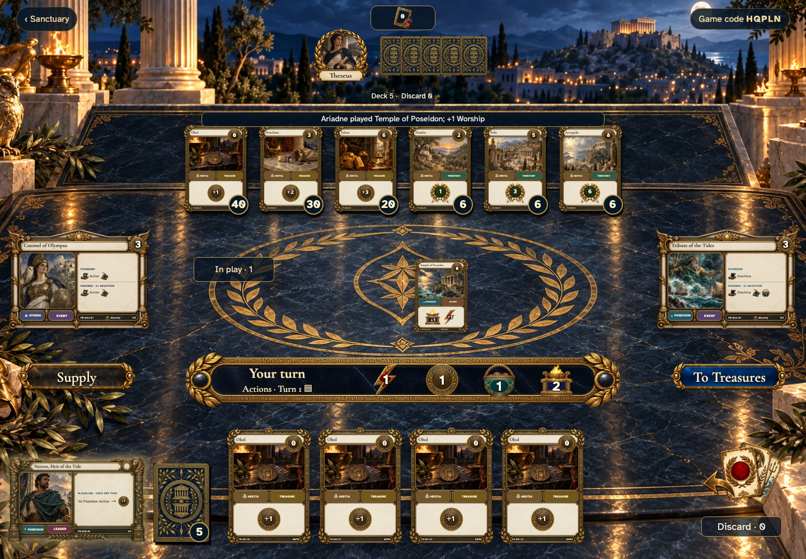</a></td>
<td valign="top"><a href="../../screenshots/raise-a-temple-worship-another-bloodline-s-god-and-keep-the-gained-action-on-top/005-temple-played-phone-darwin.png">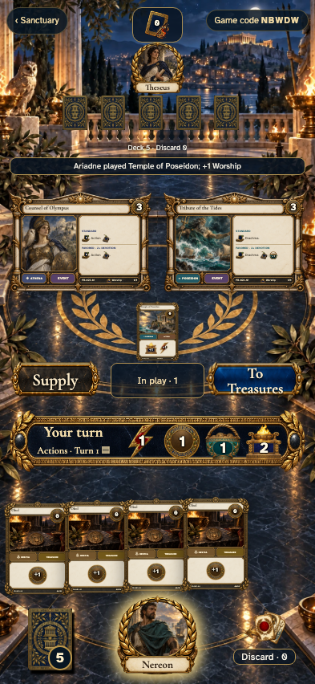</a></td>
</tr>
</table>

Tabletop · 3840 × 2160 — expand screenshot

<a href="../../screenshots/raise-a-temple-worship-another-bloodline-s-god-and-keep-the-gained-action-on-top/005-temple-played-tabletop-4k-darwin.png">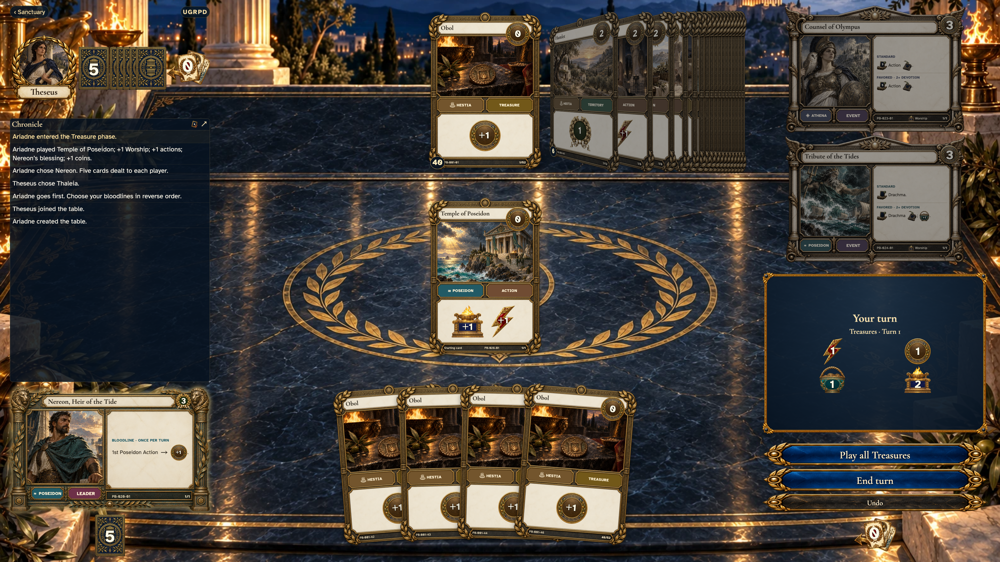</a>

- [x] The Temple grants Worship and Nereon grants one Coin

## One matching Action gives one Devotion and the Standard effect

Viewpoint: **Ariadne**.

<table>
<tr><th>Desktop · 1440 × 1000</th><th>Phone · 393 × 852</th></tr>
<tr>
<td valign="top"><a href="../../screenshots/raise-a-temple-worship-another-bloodline-s-god-and-keep-the-gained-action-on-top/006-one-devotion-desktop-darwin.png">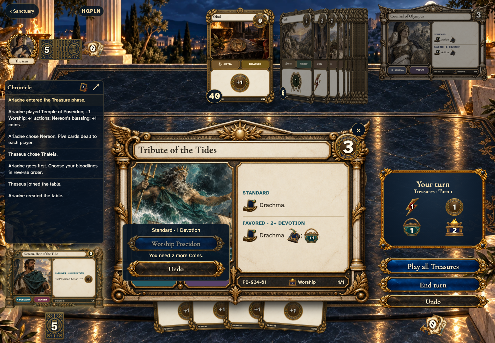</a></td>
<td valign="top"><a href="../../screenshots/raise-a-temple-worship-another-bloodline-s-god-and-keep-the-gained-action-on-top/006-one-devotion-phone-darwin.png">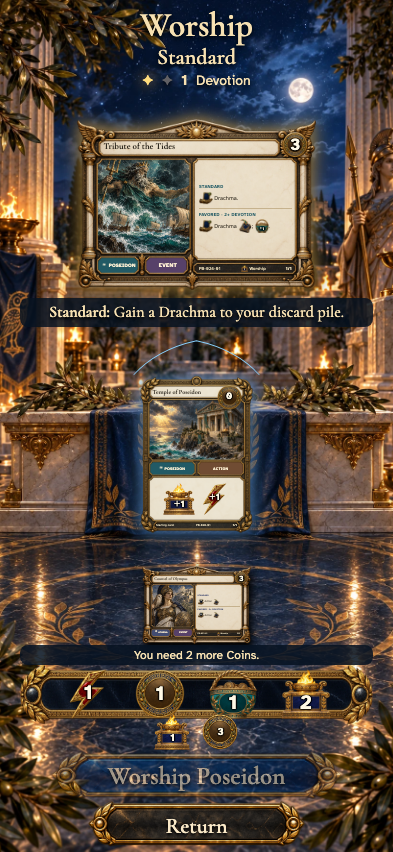</a></td>
</tr>
</table>

Tabletop · 3840 × 2160 — expand screenshot

<a href="../../screenshots/raise-a-temple-worship-another-bloodline-s-god-and-keep-the-gained-action-on-top/006-one-devotion-tabletop-4k-darwin.png">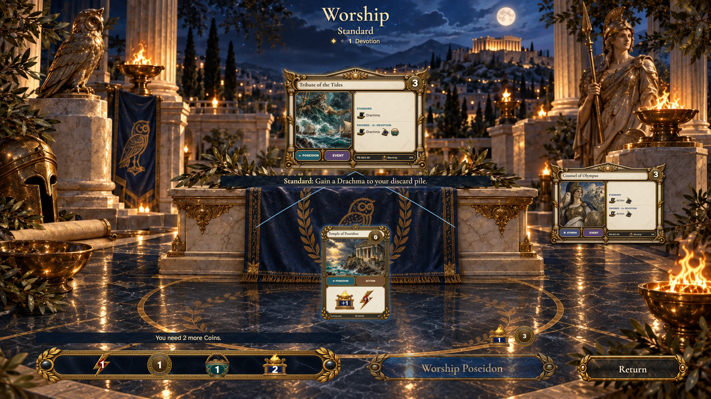</a>

- [x] One matching Action gives one Devotion and the Standard effect

## Four Obols bring the shared turn counters to five Coins

Viewpoint: **Ariadne**.

<table>
<tr><th>Desktop · 1440 × 1000</th><th>Phone · 393 × 852</th></tr>
<tr>
<td valign="top"><a href="../../screenshots/raise-a-temple-worship-another-bloodline-s-god-and-keep-the-gained-action-on-top/007-wealth-desktop-darwin.png">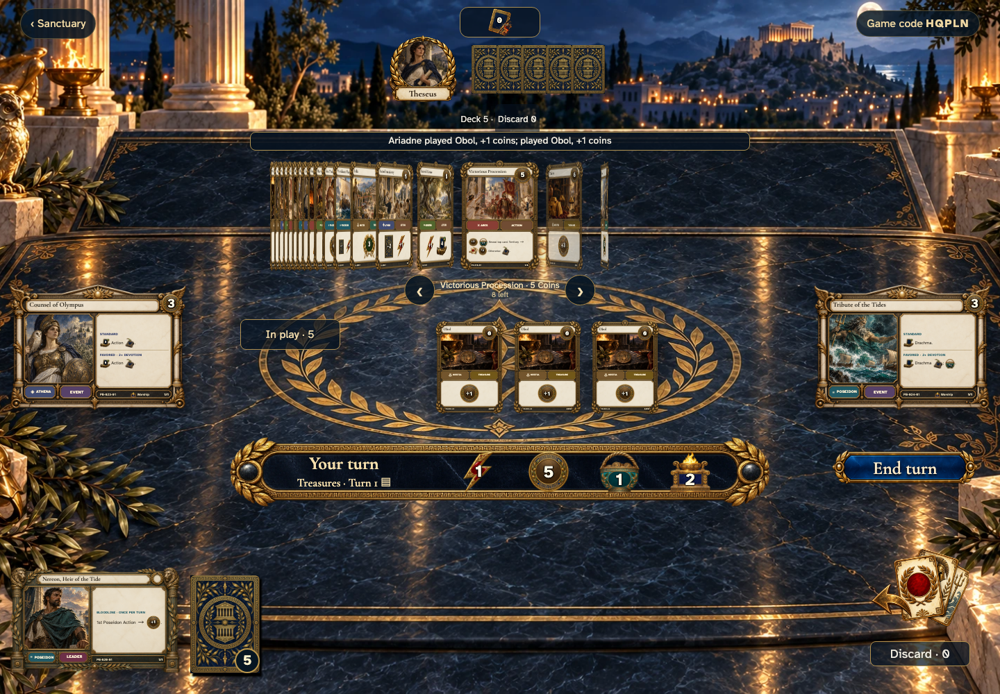</a></td>
<td valign="top"><a href="../../screenshots/raise-a-temple-worship-another-bloodline-s-god-and-keep-the-gained-action-on-top/007-wealth-phone-darwin.png">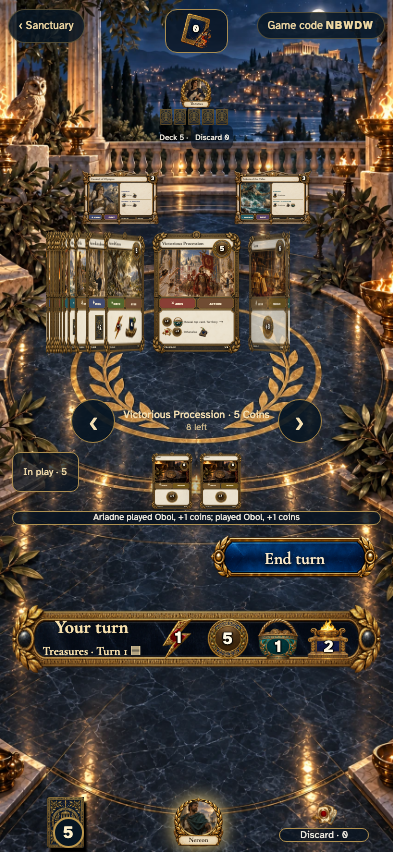</a></td>
</tr>
</table>

Tabletop · 3840 × 2160 — expand screenshot

<a href="../../screenshots/raise-a-temple-worship-another-bloodline-s-god-and-keep-the-gained-action-on-top/007-wealth-tabletop-4k-darwin.png">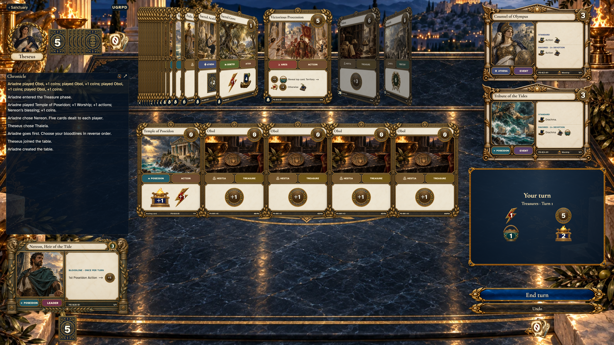</a>

- [x] Four Obols bring the shared turn counters to five Coins

## Ariadne can Worship Athena with zero Devotion despite following Poseidon

Viewpoint: **Ariadne**.

<table>
<tr><th>Desktop · 1440 × 1000</th><th>Phone · 393 × 852</th></tr>
<tr>
<td valign="top"><a href="../../screenshots/raise-a-temple-worship-another-bloodline-s-god-and-keep-the-gained-action-on-top/008-shared-athena-desktop-darwin.png">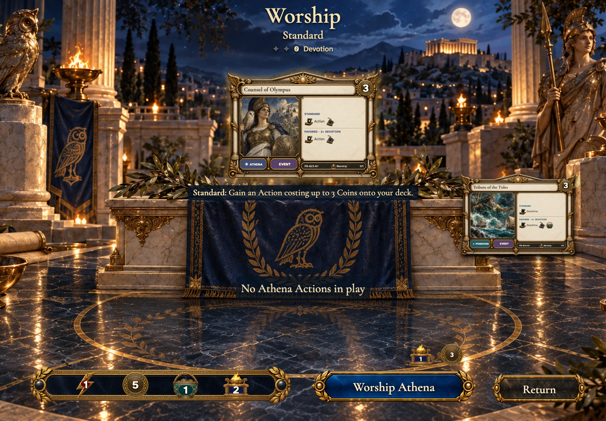</a></td>
<td valign="top"><a href="../../screenshots/raise-a-temple-worship-another-bloodline-s-god-and-keep-the-gained-action-on-top/008-shared-athena-phone-darwin.png">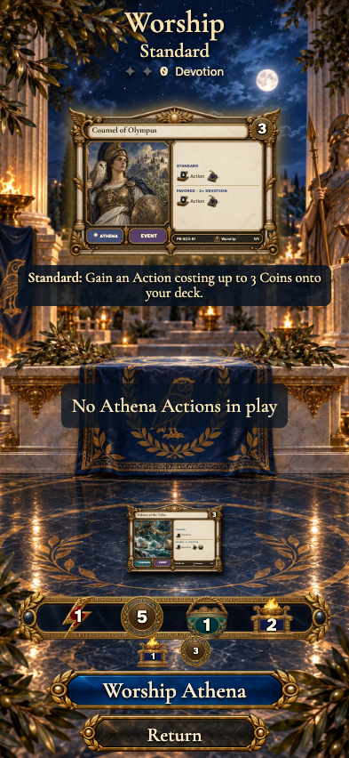</a></td>
</tr>
</table>

Tabletop · 3840 × 2160 — expand screenshot

<a href="../../screenshots/raise-a-temple-worship-another-bloodline-s-god-and-keep-the-gained-action-on-top/008-shared-athena-tabletop-4k-darwin.png">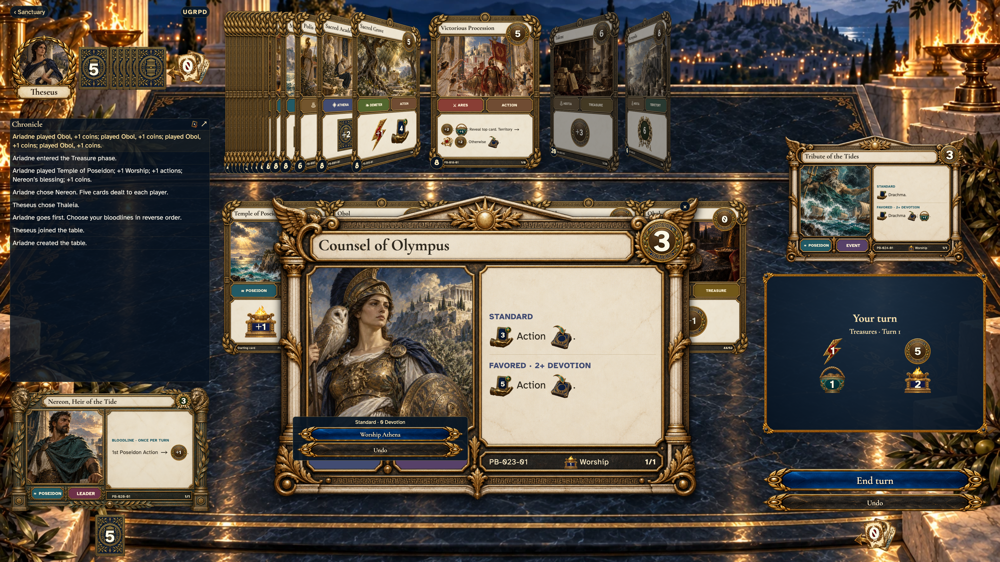</a>

- [x] Ariadne can Worship Athena with zero Devotion despite following Poseidon

## Read both effects on the actual landscape event

Viewpoint: **Ariadne**.

<table>
<tr><th>Desktop · 1440 × 1000</th><th>Phone · 393 × 852</th></tr>
<tr>
<td valign="top"><a href="../../screenshots/raise-a-temple-worship-another-bloodline-s-god-and-keep-the-gained-action-on-top/009-event-inspection-desktop-darwin.png">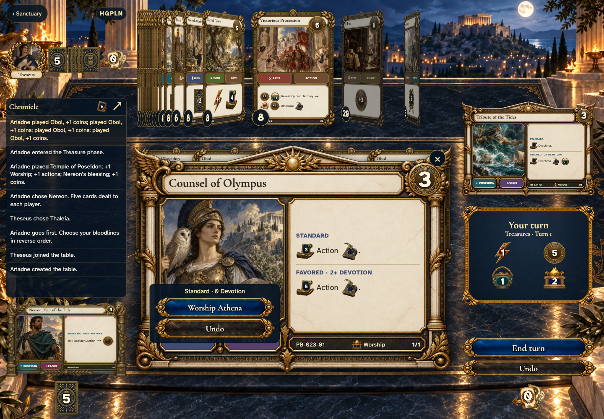</a></td>
<td valign="top"><a href="../../screenshots/raise-a-temple-worship-another-bloodline-s-god-and-keep-the-gained-action-on-top/009-event-inspection-phone-darwin.png">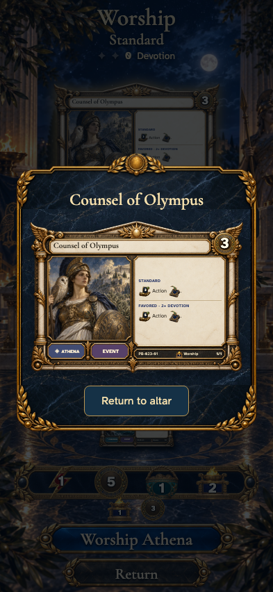</a></td>
</tr>
</table>

Tabletop · 3840 × 2160 — expand screenshot

<a href="../../screenshots/raise-a-temple-worship-another-bloodline-s-god-and-keep-the-gained-action-on-top/009-event-inspection-tabletop-4k-darwin.png">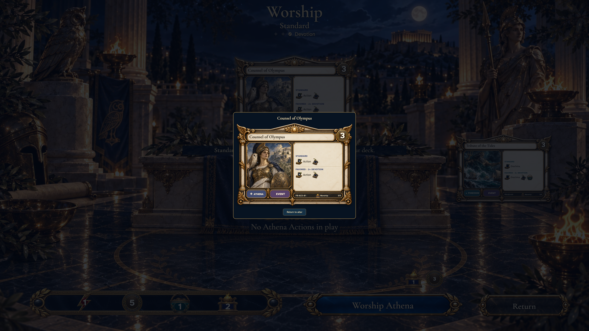</a>

- [x] Read both effects on the actual landscape event

## Pay one Worship and three Coins, then choose an Action costing up to three

Viewpoint: **Ariadne**.

<table>
<tr><th>Desktop · 1440 × 1000</th><th>Phone · 393 × 852</th></tr>
<tr>
<td valign="top"><a href="../../screenshots/raise-a-temple-worship-another-bloodline-s-god-and-keep-the-gained-action-on-top/010-gain-choice-desktop-darwin.png">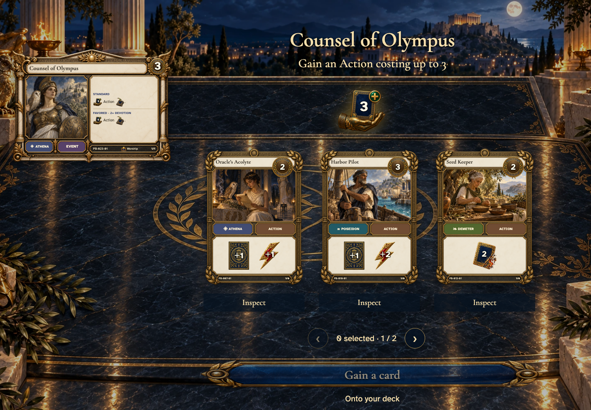</a></td>
<td valign="top"></td>
</tr>
</table>

Tabletop · 3840 × 2160 — expand screenshot

<a href="../../screenshots/raise-a-temple-worship-another-bloodline-s-god-and-keep-the-gained-action-on-top/010-gain-choice-tabletop-4k-darwin.png">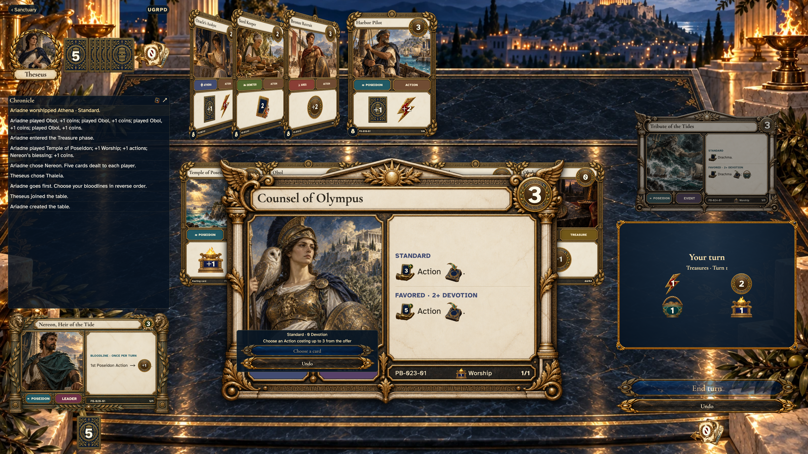</a>

- [x] Pay one Worship and three Coins, then choose an Action costing up to three

## Theseus sees which god Ariadne invoked while her gain choice is pending

Viewpoint: **Theseus**.

<table>
<tr><th>Desktop · 1440 × 1000</th><th>Phone · 393 × 852</th></tr>
<tr>
<td valign="top"><a href="../../screenshots/raise-a-temple-worship-another-bloodline-s-god-and-keep-the-gained-action-on-top/011-waiting-observer-desktop-darwin.png">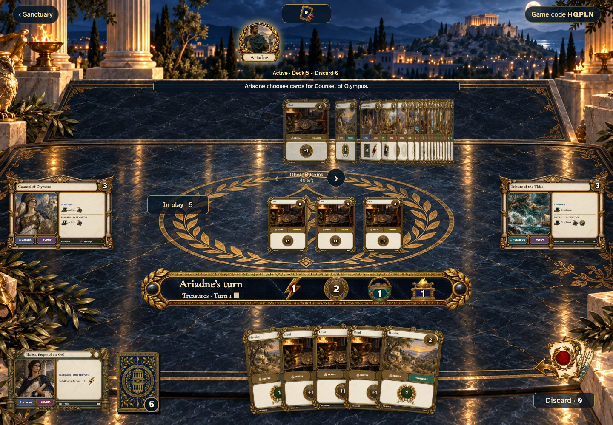</a></td>
<td valign="top"><a href="../../screenshots/raise-a-temple-worship-another-bloodline-s-god-and-keep-the-gained-action-on-top/011-waiting-observer-phone-darwin.png">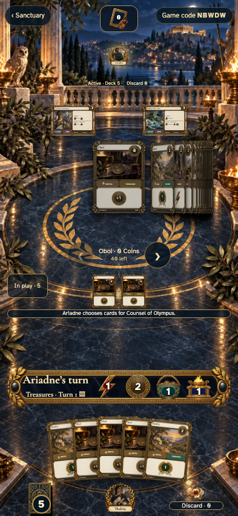</a></td>
</tr>
</table>

Tabletop · 3840 × 2160 — expand screenshot

<a href="../../screenshots/raise-a-temple-worship-another-bloodline-s-god-and-keep-the-gained-action-on-top/011-waiting-observer-tabletop-4k-darwin.png">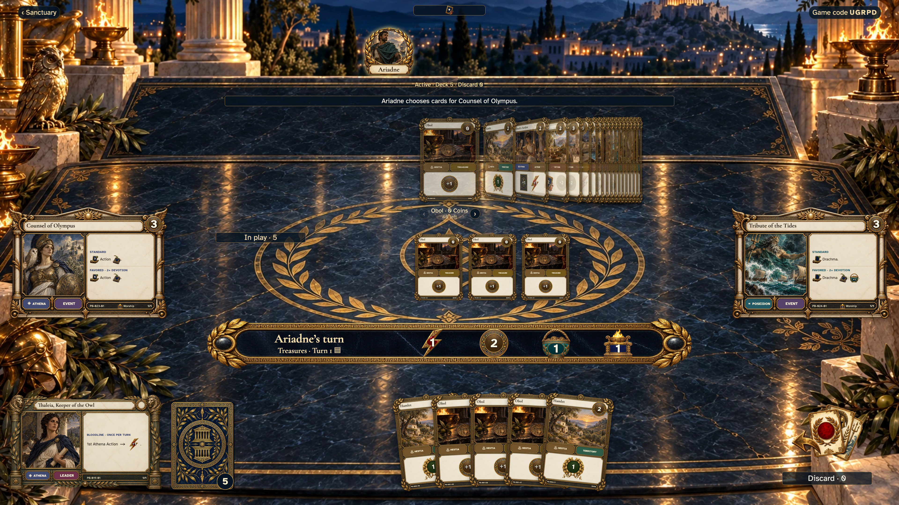</a>

- [x] Theseus sees which god Ariadne invoked while her gain choice is pending

## Ariadne returns to exactly the same paid gain choice

Viewpoint: **Ariadne**.

<table>
<tr><th>Desktop · 1440 × 1000</th><th>Phone · 393 × 852</th></tr>
<tr>
<td valign="top"></td>
<td valign="top"><a href="../../screenshots/raise-a-temple-worship-another-bloodline-s-god-and-keep-the-gained-action-on-top/012-choice-restored-phone-darwin.png">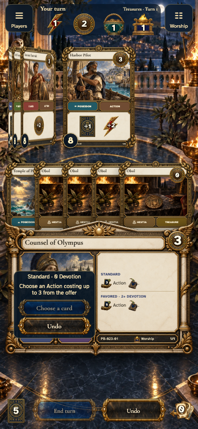</a></td>
</tr>
</table>

Tabletop · 3840 × 2160 — expand screenshot

- [x] Ariadne returns to exactly the same paid gain choice

## The selected Action is ready to be placed on the deck

Viewpoint: **Ariadne**.

<table>
<tr><th>Desktop · 1440 × 1000</th><th>Phone · 393 × 852</th></tr>
<tr>
<td valign="top"><a href="../../screenshots/raise-a-temple-worship-another-bloodline-s-god-and-keep-the-gained-action-on-top/013-selected-gain-desktop-darwin.png">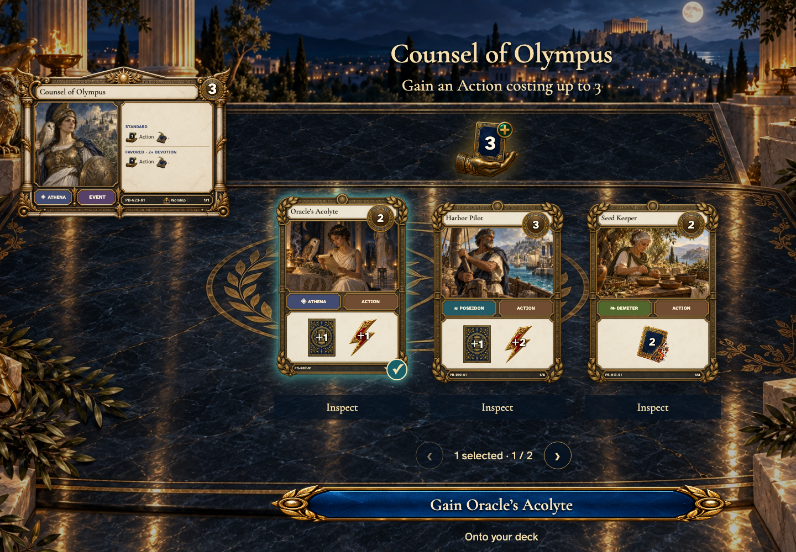</a></td>
<td valign="top"><a href="../../screenshots/raise-a-temple-worship-another-bloodline-s-god-and-keep-the-gained-action-on-top/013-selected-gain-phone-darwin.png">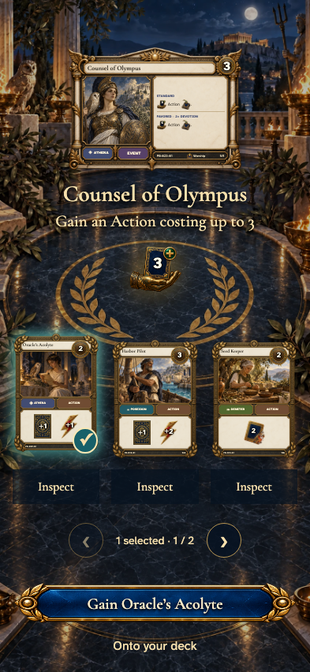</a></td>
</tr>
</table>

Tabletop · 3840 × 2160 — expand screenshot

<a href="../../screenshots/raise-a-temple-worship-another-bloodline-s-god-and-keep-the-gained-action-on-top/013-selected-gain-tabletop-4k-darwin.png">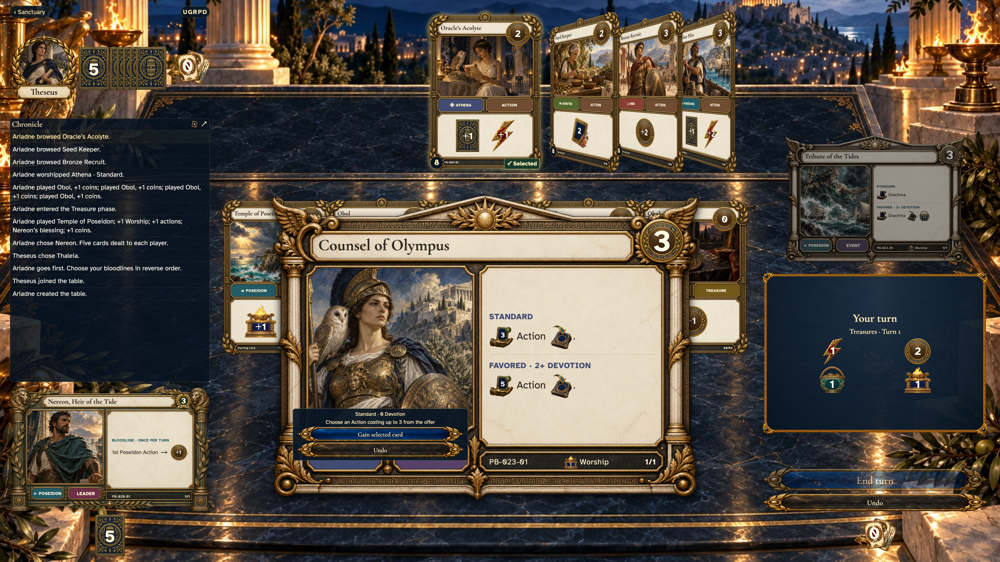</a>

- [x] The selected Action is ready to be placed on the deck

## Theseus sees the same market position while Ariadne chooses

Viewpoint: **Theseus**.

<table>
<tr><th>Desktop · 1440 × 1000</th><th>Phone · 393 × 852</th></tr>
<tr>
<td valign="top"><a href="../../screenshots/raise-a-temple-worship-another-bloodline-s-god-and-keep-the-gained-action-on-top/014-shared-market-desktop-darwin.png">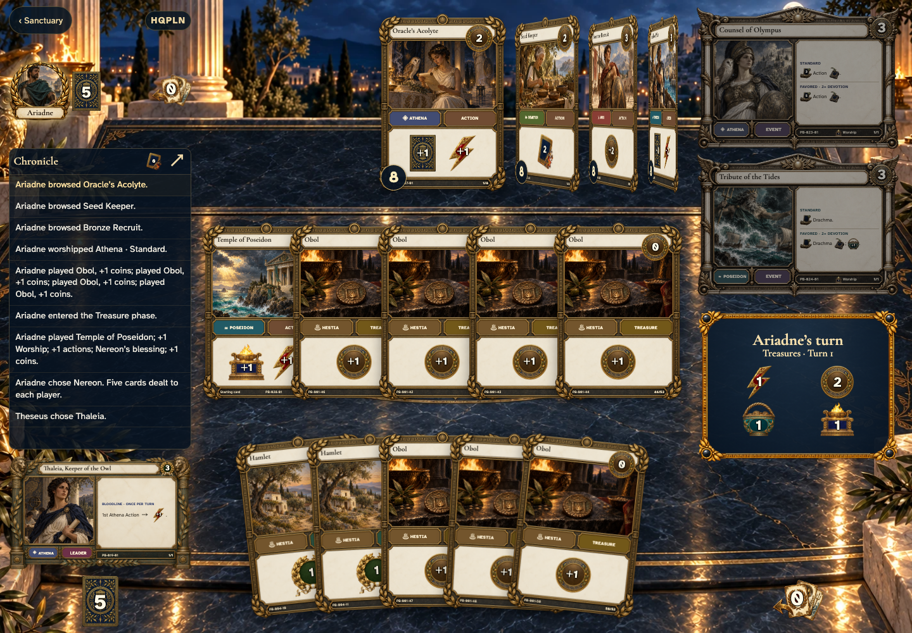</a></td>
<td valign="top"><a href="../../screenshots/raise-a-temple-worship-another-bloodline-s-god-and-keep-the-gained-action-on-top/014-shared-market-phone-darwin.png">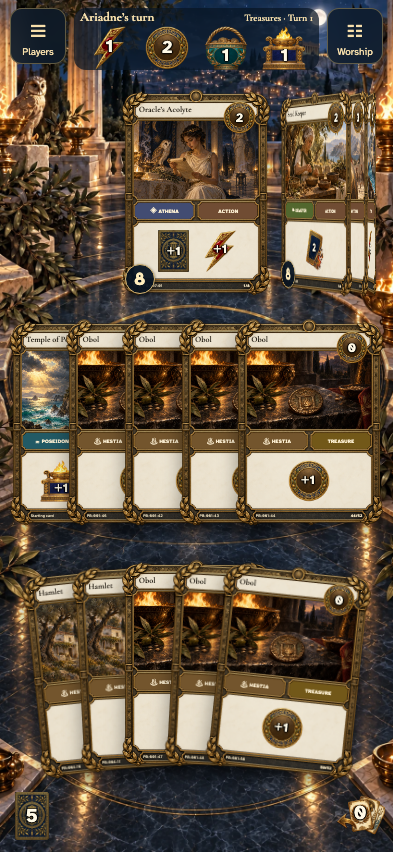</a></td>
</tr>
</table>

Tabletop · 3840 × 2160 — expand screenshot

<a href="../../screenshots/raise-a-temple-worship-another-bloodline-s-god-and-keep-the-gained-action-on-top/014-shared-market-tabletop-4k-darwin.png">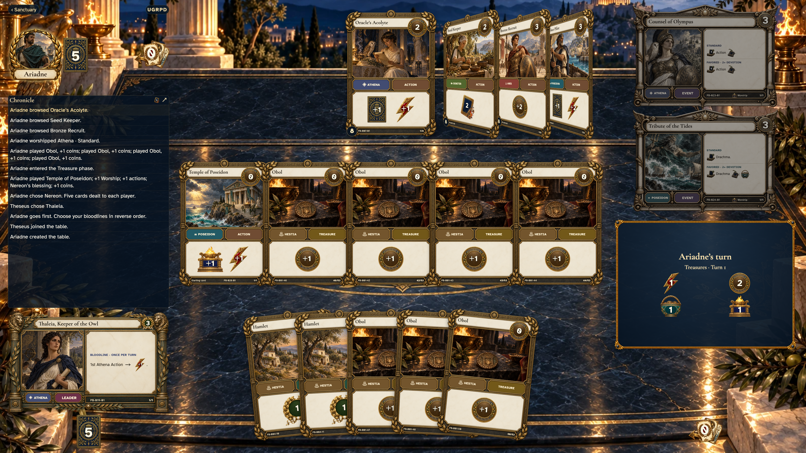</a>

- [x] Theseus sees the same market position while Ariadne chooses

## The gained Action is public, the Buy is kept, and the Treasure phase remains open

Viewpoint: **Ariadne**.

<table>
<tr><th>Desktop · 1440 × 1000</th><th>Phone · 393 × 852</th></tr>
<tr>
<td valign="top"><a href="../../screenshots/raise-a-temple-worship-another-bloodline-s-god-and-keep-the-gained-action-on-top/015-topdecked-desktop-darwin.png">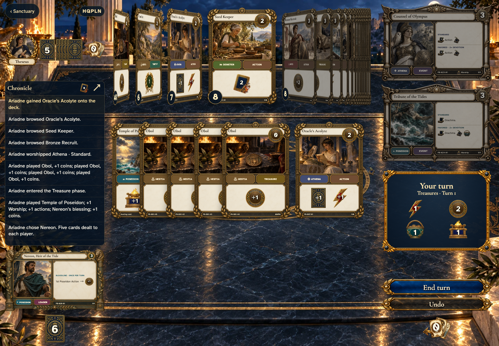</a></td>
<td valign="top"><a href="../../screenshots/raise-a-temple-worship-another-bloodline-s-god-and-keep-the-gained-action-on-top/015-topdecked-phone-darwin.png">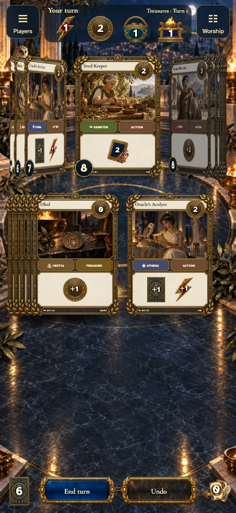</a></td>
</tr>
</table>

Tabletop · 3840 × 2160 — expand screenshot

<a href="../../screenshots/raise-a-temple-worship-another-bloodline-s-god-and-keep-the-gained-action-on-top/015-topdecked-tabletop-4k-darwin.png">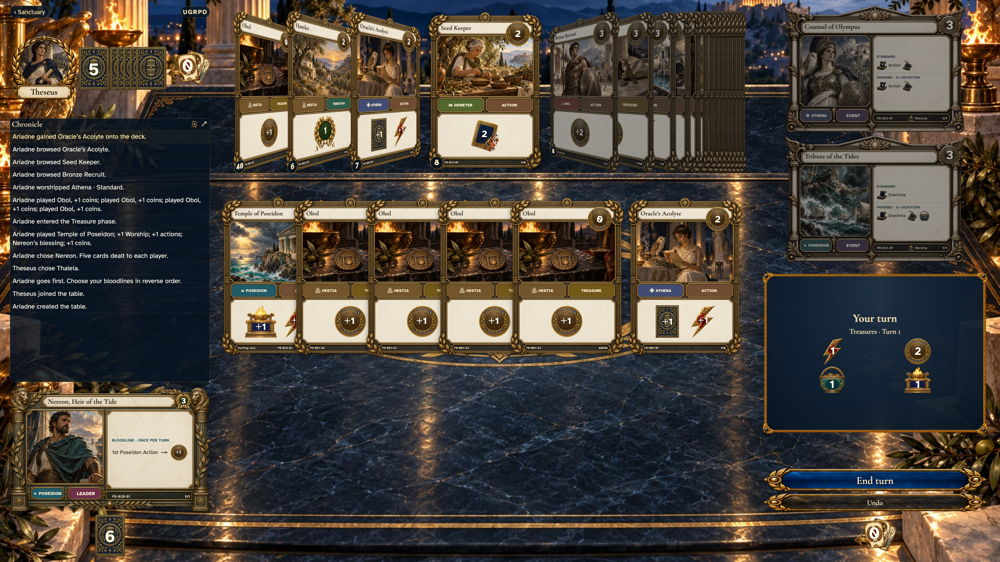</a>

- [x] The gained Action is public, the Buy is kept, and the Treasure phase remains open

## Theseus sees the gained card and its topdeck destination

Viewpoint: **Theseus**.

<table>
<tr><th>Desktop · 1440 × 1000</th><th>Phone · 393 × 852</th></tr>
<tr>
<td valign="top"><a href="../../screenshots/raise-a-temple-worship-another-bloodline-s-god-and-keep-the-gained-action-on-top/016-gain-observer-desktop-darwin.png">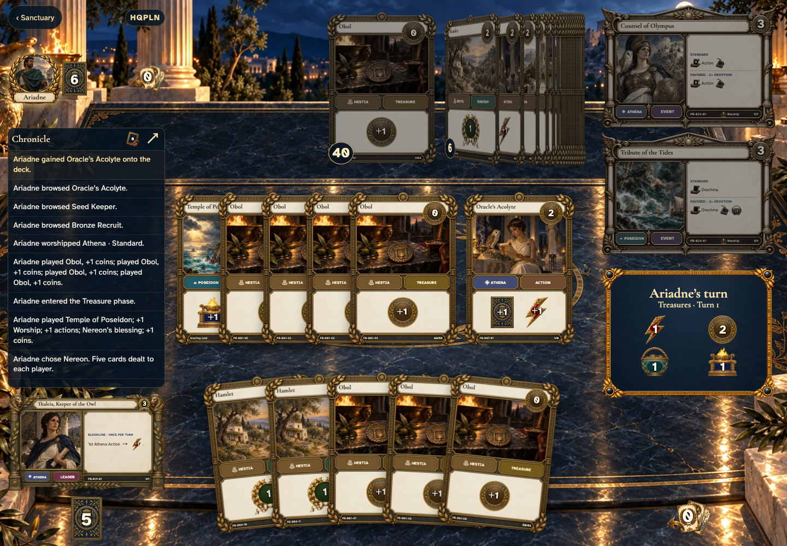</a></td>
<td valign="top"><a href="../../screenshots/raise-a-temple-worship-another-bloodline-s-god-and-keep-the-gained-action-on-top/016-gain-observer-phone-darwin.png">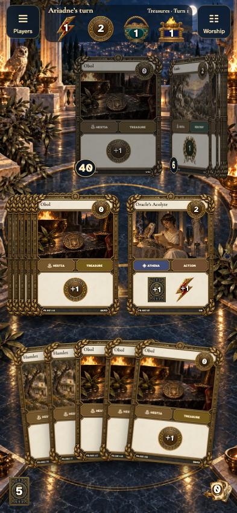</a></td>
</tr>
</table>

Tabletop · 3840 × 2160 — expand screenshot

<a href="../../screenshots/raise-a-temple-worship-another-bloodline-s-god-and-keep-the-gained-action-on-top/016-gain-observer-tabletop-4k-darwin.png">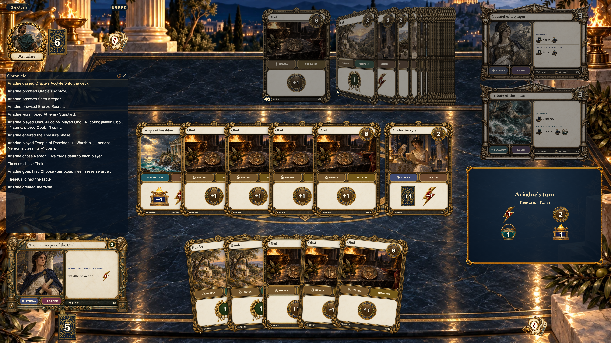</a>

- [x] Theseus sees the gained card and its topdeck destination

## The payment is kept and another Worship needs one more Coin

Viewpoint: **Ariadne**.

<table>
<tr><th>Desktop · 1440 × 1000</th><th>Phone · 393 × 852</th></tr>
<tr>
<td valign="top"><a href="../../screenshots/raise-a-temple-worship-another-bloodline-s-god-and-keep-the-gained-action-on-top/017-no-refund-desktop-darwin.png">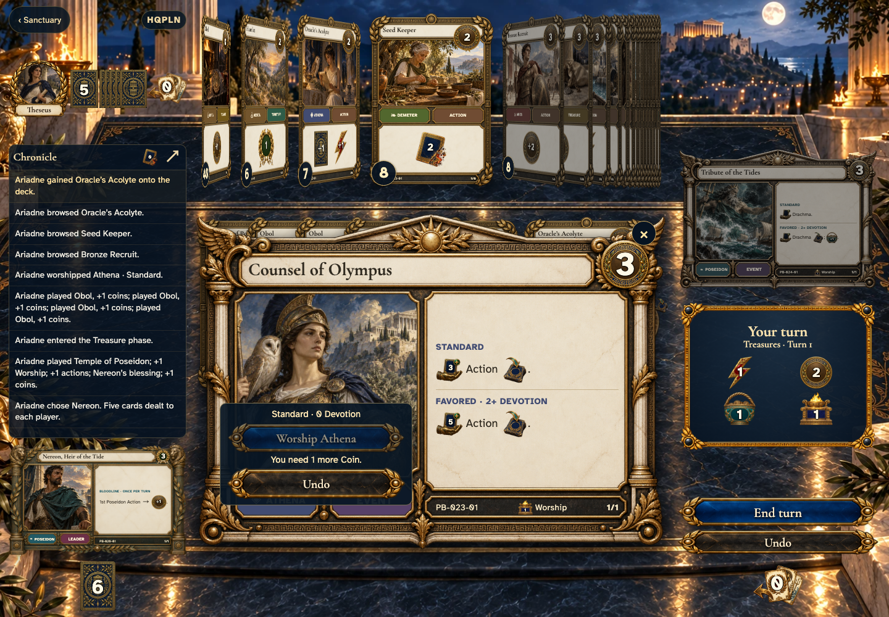</a></td>
<td valign="top"><a href="../../screenshots/raise-a-temple-worship-another-bloodline-s-god-and-keep-the-gained-action-on-top/017-no-refund-phone-darwin.png">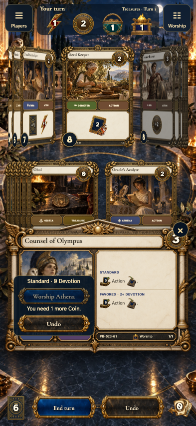</a></td>
</tr>
</table>

Tabletop · 3840 × 2160 — expand screenshot

<a href="../../screenshots/raise-a-temple-worship-another-bloodline-s-god-and-keep-the-gained-action-on-top/017-no-refund-tabletop-4k-darwin.png">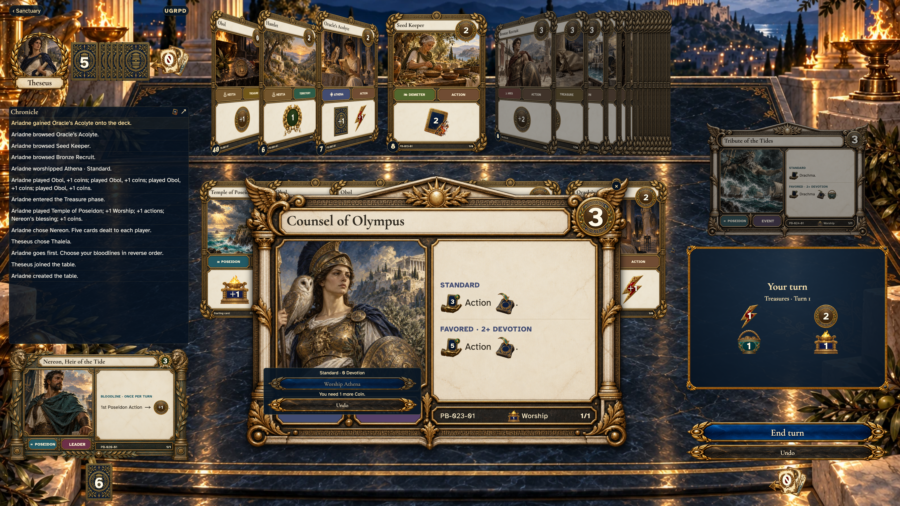</a>

- [x] The payment is kept and another Worship needs one more Coin
