# 2 empires finish at the last Acropolis

Recorded-history integration scenario. A complete legal match prepares the last cleanup in the emulator. The illustrated journey begins before the ending turn is confirmed; the prior turns are not presented as UI interactions.

## The empty pile waits for the current turn to finish

<table>
<tr><th>Desktop · 1440 × 1000</th><th>Phone · 393 × 852</th></tr>
<tr>
<td valign="top"><a href="../../screenshots/2-empires-finish-at-the-last-acropolis/000-last-turn-desktop-darwin.png">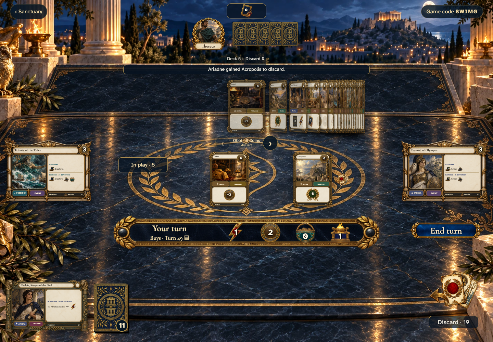</a></td>
<td valign="top"><a href="../../screenshots/2-empires-finish-at-the-last-acropolis/000-last-turn-phone-darwin.png">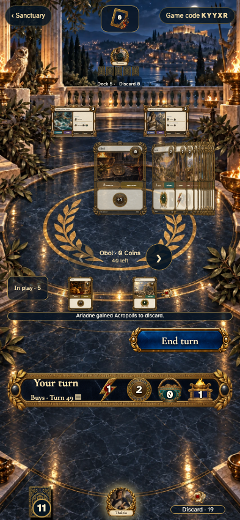</a></td>
</tr>
</table>

Tabletop · 3840 × 2160 — expand screenshot

<a href="../../screenshots/2-empires-finish-at-the-last-acropolis/000-last-turn-tabletop-4k-darwin.png">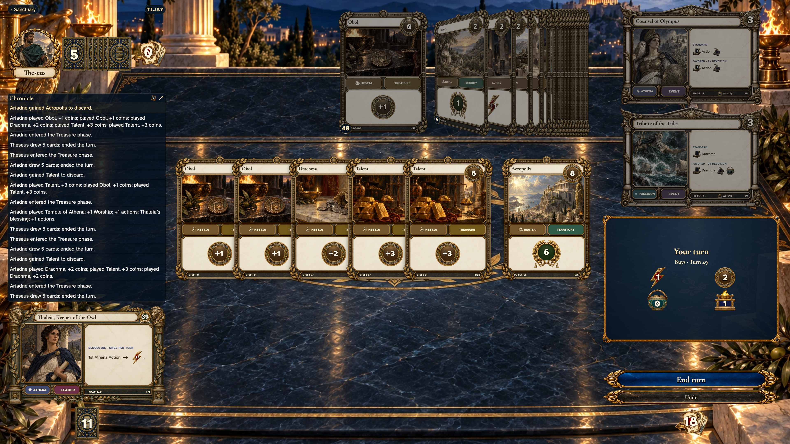</a>

- [x] Buys are spent, the table is still playable, and results are not shown early.

## Cleanup completes and every empire receives its final score

<table>
<tr><th>Desktop · 1440 × 1000</th><th>Phone · 393 × 852</th></tr>
<tr>
<td valign="top"></td>
<td valign="top"></td>
</tr>
</table>

Tabletop · 3840 × 2160 — expand screenshot

<a href="../../screenshots/2-empires-finish-at-the-last-acropolis/001-results-tabletop-4k-darwin.png">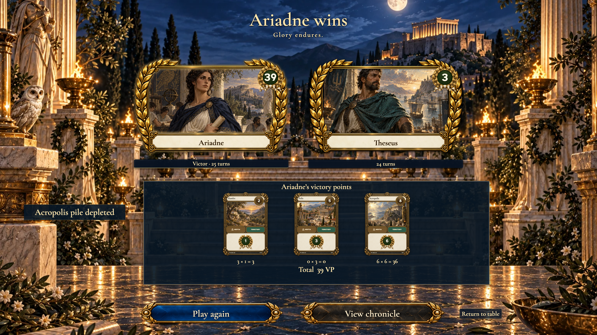</a>

- [x] Every player has a visible score and turn count; no turn controls remain.

## Theseus sees the same persistent result

Viewpoint: **Theseus**.

<table>
<tr><th>Desktop · 1440 × 1000</th><th>Phone · 393 × 852</th></tr>
<tr>
<td valign="top"></td>
<td valign="top"></td>
</tr>
</table>

Tabletop · 3840 × 2160 — expand screenshot

- [x] Both players see the same ending and all ranked empires.

## Inspect another empire’s Territory arithmetic

<table>
<tr><th>Desktop · 1440 × 1000</th><th>Phone · 393 × 852</th></tr>
<tr>
<td valign="top"></td>
<td valign="top"></td>
</tr>
</table>

Tabletop · 3840 × 2160 — expand screenshot

- [x] The selected player’s owned Territories and total are shown.

## Read the actual Hamlet card behind the score

<table>
<tr><th>Desktop · 1440 × 1000</th><th>Phone · 393 × 852</th></tr>
<tr>
<td valign="top"><a href="../../screenshots/2-empires-finish-at-the-last-acropolis/004-territory-desktop-darwin.png">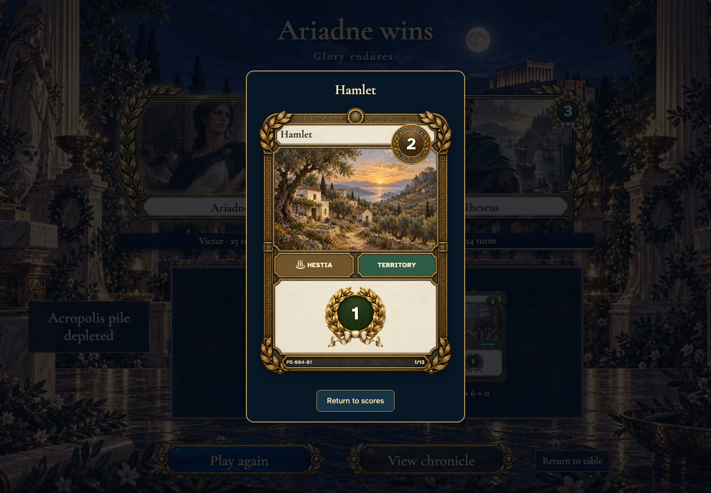</a></td>
<td valign="top"><a href="../../screenshots/2-empires-finish-at-the-last-acropolis/004-territory-phone-darwin.png">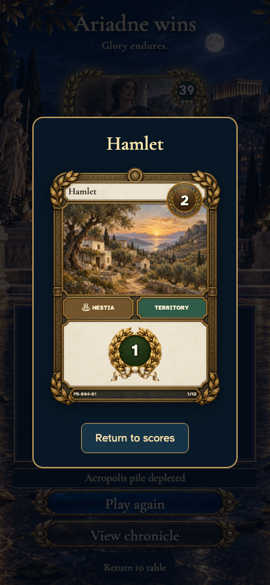</a></td>
</tr>
</table>

Tabletop · 3840 × 2160 — expand screenshot

<a href="../../screenshots/2-empires-finish-at-the-last-acropolis/004-territory-tabletop-4k-darwin.png">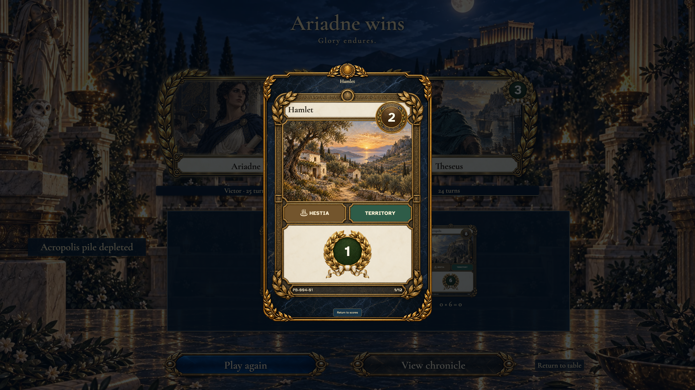</a>

- [x] The full card remains inspectable after the match.

## Return to the same score breakdown

<table>
<tr><th>Desktop · 1440 × 1000</th><th>Phone · 393 × 852</th></tr>
<tr>
<td valign="top"></td>
<td valign="top"></td>
</tr>
</table>

Tabletop · 3840 × 2160 — expand screenshot

- [x] Focus returns to Hamlet without changing the selected empire.

## The finished table keeps its result on return

<table>
<tr><th>Desktop · 1440 × 1000</th><th>Phone · 393 × 852</th></tr>
<tr>
<td valign="top"><a href="../../screenshots/2-empires-finish-at-the-last-acropolis/006-restored-desktop-darwin.png">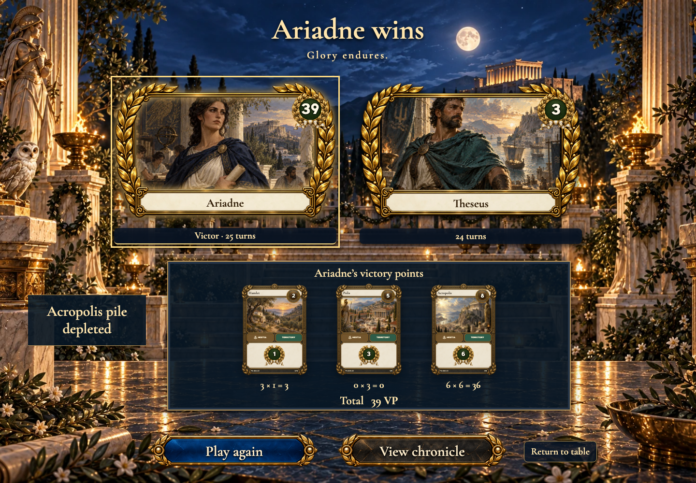</a></td>
<td valign="top"><a href="../../screenshots/2-empires-finish-at-the-last-acropolis/006-restored-phone-darwin.png">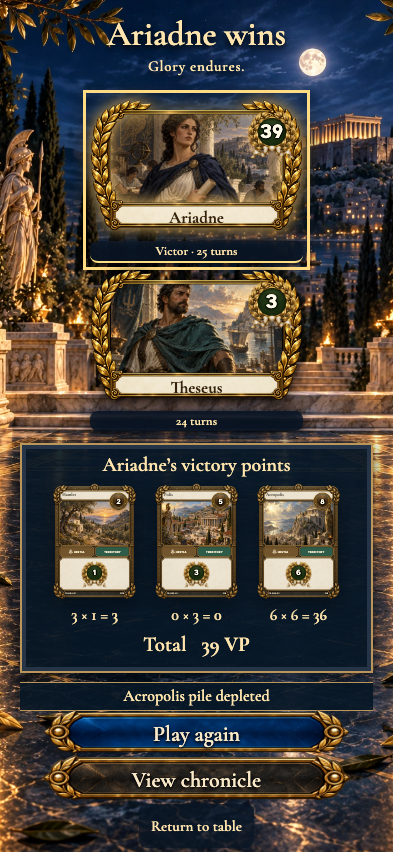</a></td>
</tr>
</table>

Tabletop · 3840 × 2160 — expand screenshot

- [x] The same winners and totals return without another cleanup.

## The finished game’s final moves remain available

<table>
<tr><th>Desktop · 1440 × 1000</th><th>Phone · 393 × 852</th></tr>
<tr>
<td valign="top"></td>
<td valign="top"></td>
</tr>
</table>

Tabletop · 3840 × 2160 — expand screenshot

<a href="../../screenshots/2-empires-finish-at-the-last-acropolis/007-chronicle-tabletop-4k-darwin.png">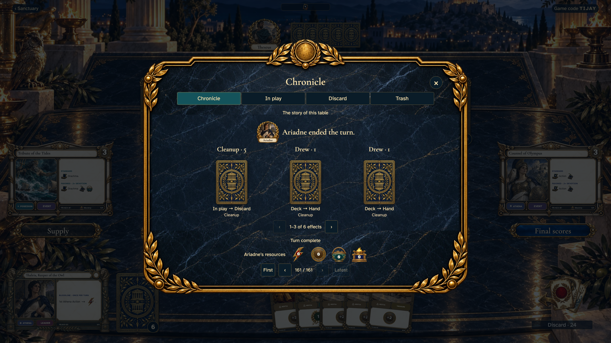</a>

- [x] The Chronicle includes the final cleanup.

## The beginning of the game is still part of its Chronicle

<table>
<tr><th>Desktop · 1440 × 1000</th><th>Phone · 393 × 852</th></tr>
<tr>
<td valign="top"><a href="../../screenshots/2-empires-finish-at-the-last-acropolis/008-first-moves-desktop-darwin.png">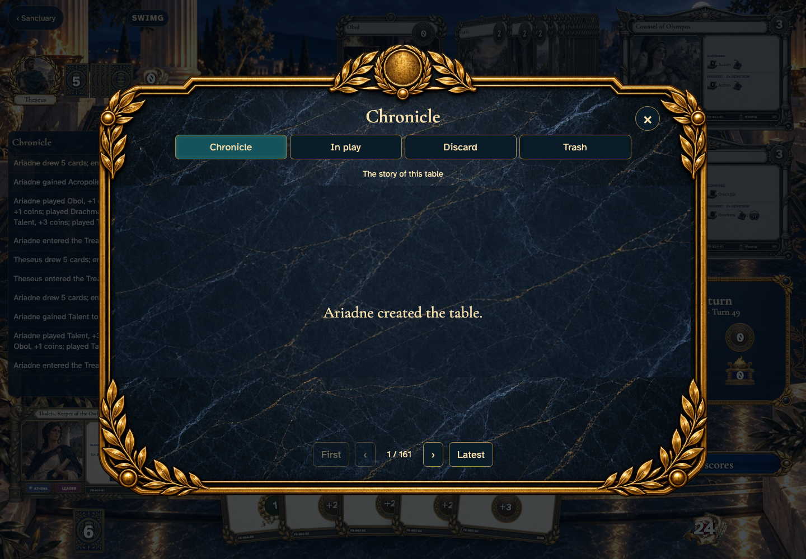</a></td>
<td valign="top"><a href="../../screenshots/2-empires-finish-at-the-last-acropolis/008-first-moves-phone-darwin.png">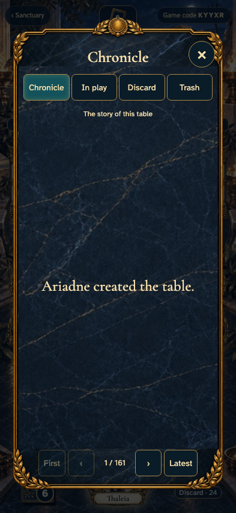</a></td>
</tr>
</table>

Tabletop · 3840 × 2160 — expand screenshot

<a href="../../screenshots/2-empires-finish-at-the-last-acropolis/008-first-moves-tabletop-4k-darwin.png">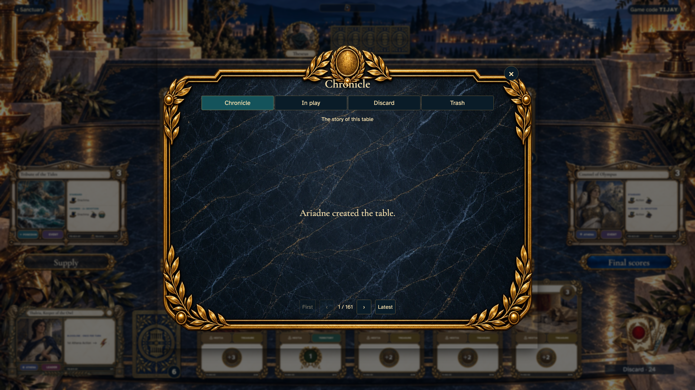</a>

- [x] The first page includes creation and joining, with no earlier page.

## Return to the final cleanup at the end of the Chronicle

<table>
<tr><th>Desktop · 1440 × 1000</th><th>Phone · 393 × 852</th></tr>
<tr>
<td valign="top"><a href="../../screenshots/2-empires-finish-at-the-last-acropolis/009-last-moves-desktop-darwin.png">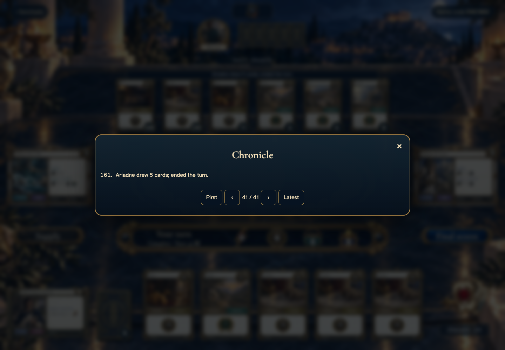</a></td>
<td valign="top"><a href="../../screenshots/2-empires-finish-at-the-last-acropolis/009-last-moves-phone-darwin.png">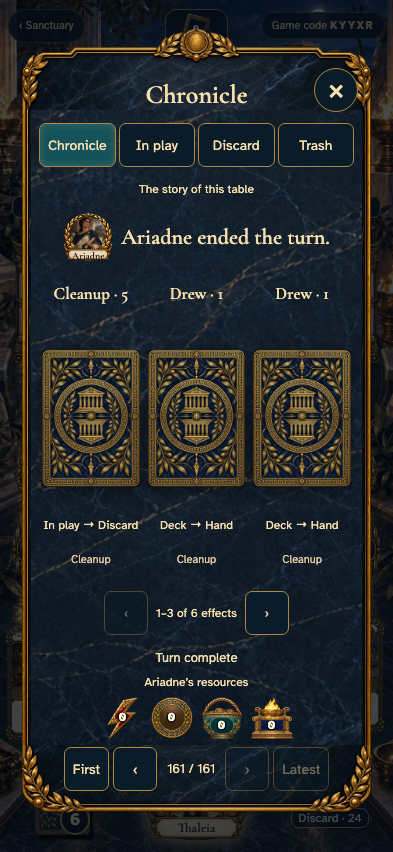</a></td>
</tr>
</table>

Tabletop · 3840 × 2160 — expand screenshot

- [x] The latest page is complete and cannot advance beyond the last move.

## The table remains inspectable after scoring

<table>
<tr><th>Desktop · 1440 × 1000</th><th>Phone · 393 × 852</th></tr>
<tr>
<td valign="top"><a href="../../screenshots/2-empires-finish-at-the-last-acropolis/010-finished-table-desktop-darwin.png">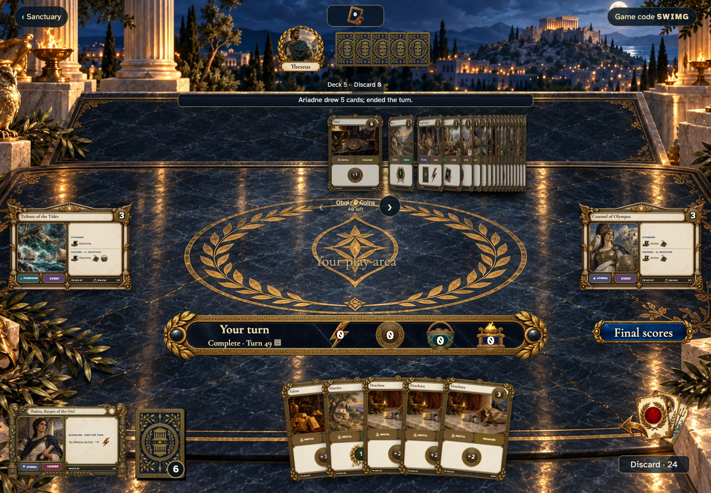</a></td>
<td valign="top"><a href="../../screenshots/2-empires-finish-at-the-last-acropolis/010-finished-table-phone-darwin.png">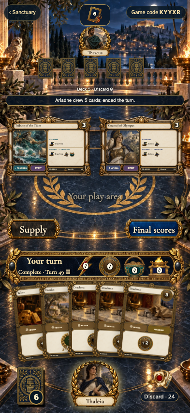</a></td>
</tr>
</table>

Tabletop · 3840 × 2160 — expand screenshot

<a href="../../screenshots/2-empires-finish-at-the-last-acropolis/010-finished-table-tabletop-4k-darwin.png">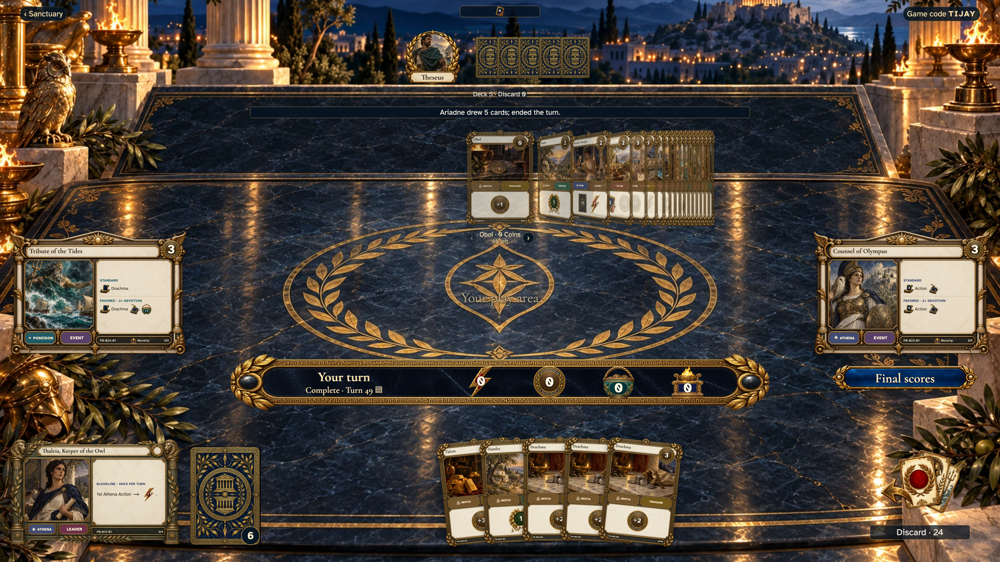</a>

- [x] Final scores can be reopened, and no play commands are offered.

## Return to the same final standings

<table>
<tr><th>Desktop · 1440 × 1000</th><th>Phone · 393 × 852</th></tr>
<tr>
<td valign="top"></td>
<td valign="top"></td>
</tr>
</table>

Tabletop · 3840 × 2160 — expand screenshot

- [x] The winner and Territory total have not changed.

## Ariadne can gather a fresh table from the finished game

<table>
<tr><th>Desktop · 1440 × 1000</th><th>Phone · 393 × 852</th></tr>
<tr>
<td valign="top"></td>
<td valign="top"></td>
</tr>
</table>

Tabletop · 3840 × 2160 — expand screenshot

- [x] Play again is enabled after the result returns.

## Play again creates a separate two-player gathering

<table>
<tr><th>Desktop · 1440 × 1000</th><th>Phone · 393 × 852</th></tr>
<tr>
<td valign="top"><a href="../../screenshots/2-empires-finish-at-the-last-acropolis/013-new-table-desktop-darwin.png">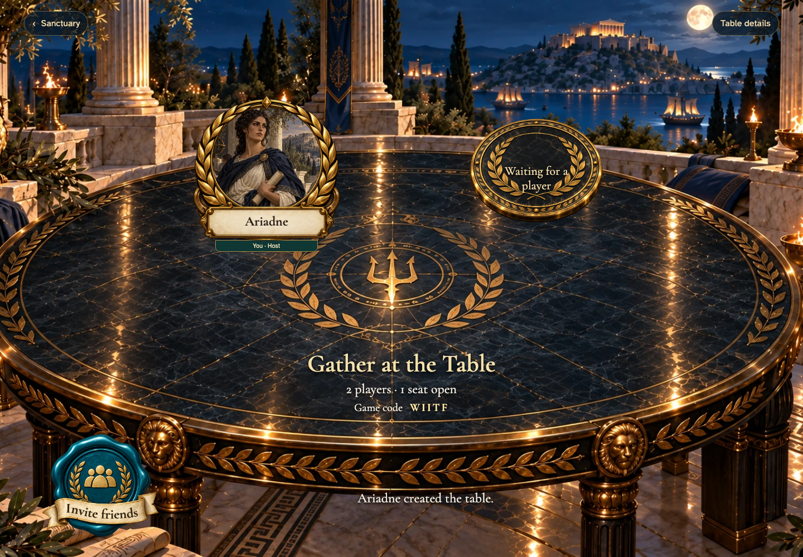</a></td>
<td valign="top"><a href="../../screenshots/2-empires-finish-at-the-last-acropolis/013-new-table-phone-darwin.png">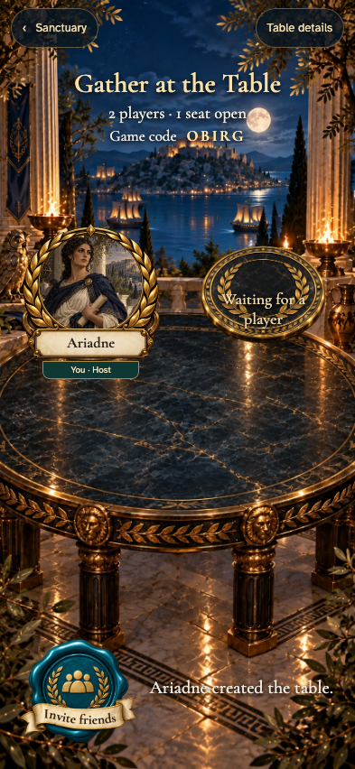</a></td>
</tr>
</table>

Tabletop · 3840 × 2160 — expand screenshot

<a href="../../screenshots/2-empires-finish-at-the-last-acropolis/013-new-table-tabletop-4k-darwin.png">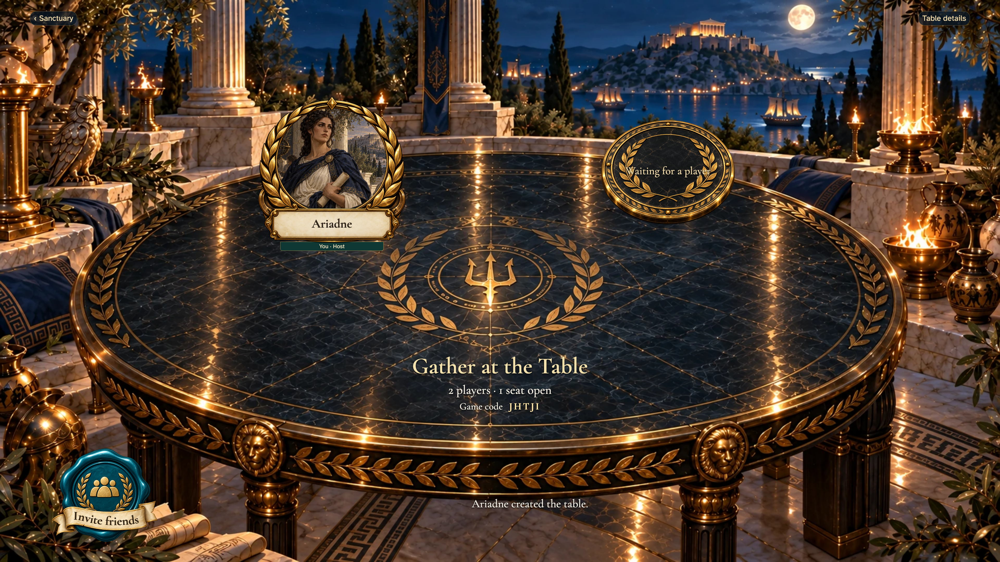</a>

- [x] Ariadne keeps her name, receives a new code, and occupies exactly one seat.

## Theseus can still review the original finished match

Viewpoint: **Theseus**.

<table>
<tr><th>Desktop · 1440 × 1000</th><th>Phone · 393 × 852</th></tr>
<tr>
<td valign="top"></td>
<td valign="top"></td>
</tr>
</table>

Tabletop · 3840 × 2160 — expand screenshot

- [x] Starting a new gathering does not reset the other player’s table.
