# 2 empires finish with fewer turns deciding victory

Recorded-history integration scenario. A complete legal match prepares the last cleanup in the emulator. The illustrated journey begins before the ending turn is confirmed; the prior turns are not presented as UI interactions.

## The empty pile waits for the current turn to finish

<table>
<tr><th>Desktop · 1440 × 1000</th><th>Phone · 393 × 852</th></tr>
<tr>
<td valign="top"></td>
<td valign="top"><a href="../../screenshots/2-empires-finish-with-fewer-turns-deciding-victory/000-last-turn-phone-darwin.png">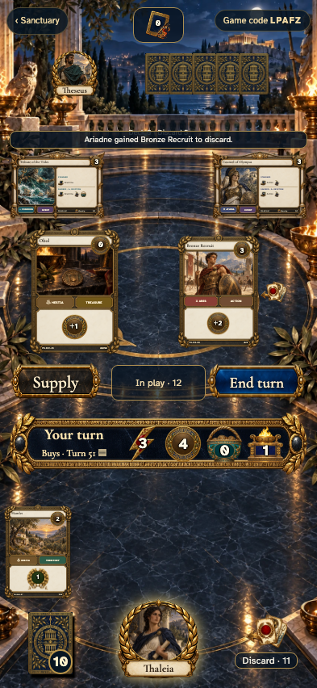</a></td>
</tr>
</table>

Tabletop · 3840 × 2160 — expand screenshot

<a href="../../screenshots/2-empires-finish-with-fewer-turns-deciding-victory/000-last-turn-tabletop-4k-darwin.png">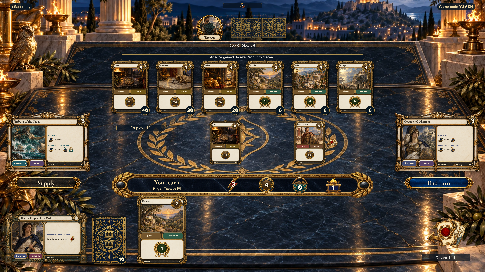</a>

- [x] Buys are spent, the table is still playable, and results are not shown early.

## The last affordable Worship is still available before cleanup

<table>
<tr><th>Desktop · 1440 × 1000</th><th>Phone · 393 × 852</th></tr>
<tr>
<td valign="top"><a href="../../screenshots/2-empires-finish-with-fewer-turns-deciding-victory/001-remaining-desktop-darwin.png">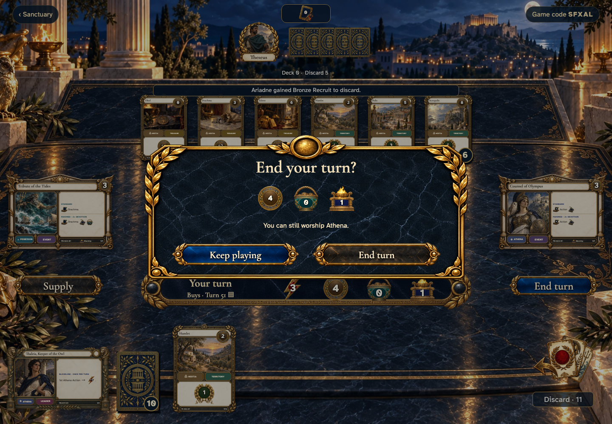</a></td>
<td valign="top"><a href="../../screenshots/2-empires-finish-with-fewer-turns-deciding-victory/001-remaining-phone-darwin.png">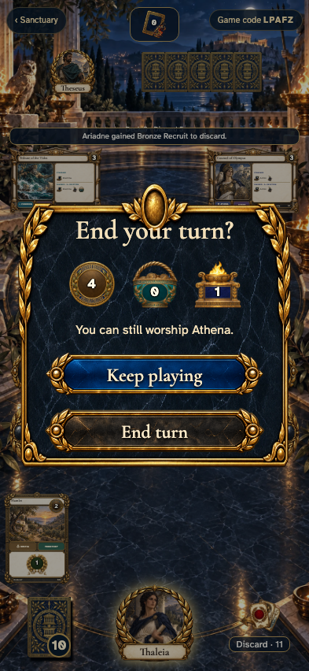</a></td>
</tr>
</table>

Tabletop · 3840 × 2160 — expand screenshot

- [x] The confirmation names a remaining god.

## Keep playing preserves the final turn and every remaining resource

<table>
<tr><th>Desktop · 1440 × 1000</th><th>Phone · 393 × 852</th></tr>
<tr>
<td valign="top"><a href="../../screenshots/2-empires-finish-with-fewer-turns-deciding-victory/002-declined-desktop-darwin.png">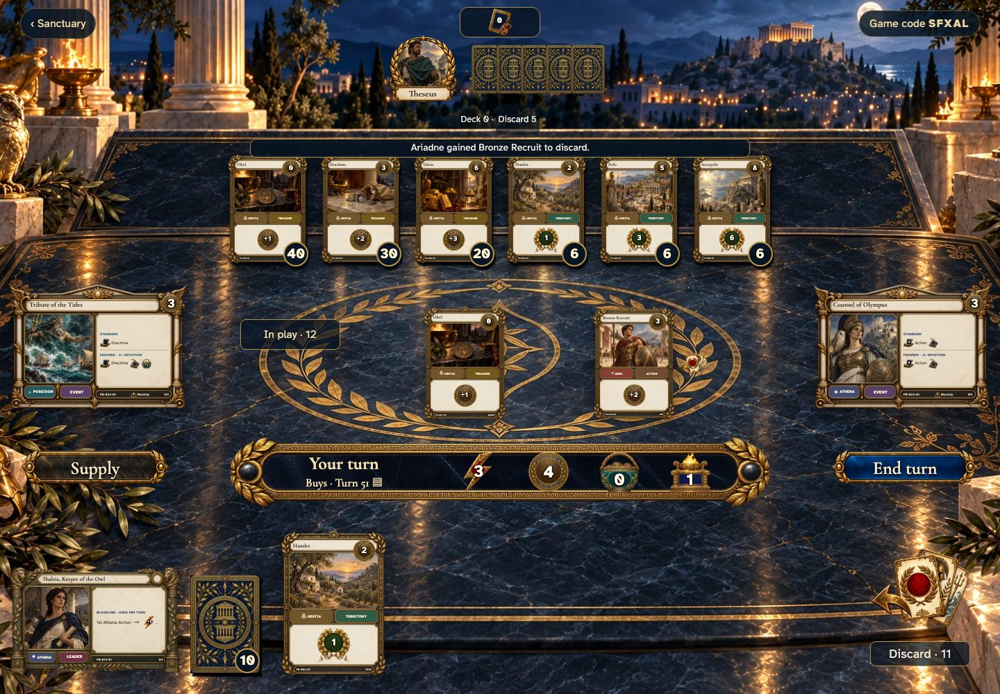</a></td>
<td valign="top"></td>
</tr>
</table>

Tabletop · 3840 × 2160 — expand screenshot

- [x] Declining appends no event and restores End turn focus.

## Choose to finish without spending the remaining Worship

<table>
<tr><th>Desktop · 1440 × 1000</th><th>Phone · 393 × 852</th></tr>
<tr>
<td valign="top"></td>
<td valign="top"></td>
</tr>
</table>

Tabletop · 3840 × 2160 — expand screenshot

<a href="../../screenshots/2-empires-finish-with-fewer-turns-deciding-victory/003-confirm-ending-tabletop-4k-darwin.png">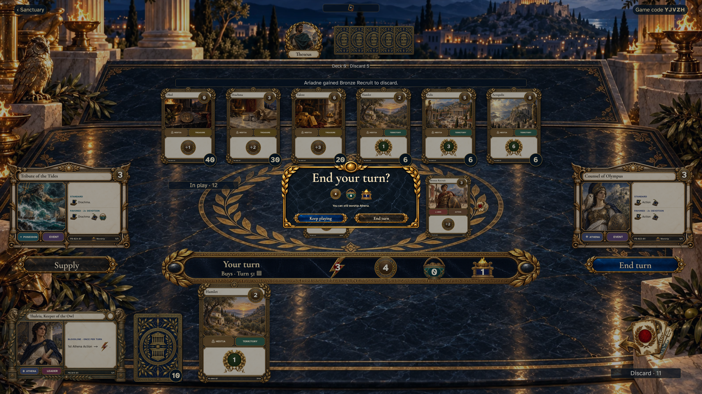</a>

- [x] The same meaningful choice is offered.

## Cleanup completes and every empire receives its final score

<table>
<tr><th>Desktop · 1440 × 1000</th><th>Phone · 393 × 852</th></tr>
<tr>
<td valign="top"></td>
<td valign="top"></td>
</tr>
</table>

Tabletop · 3840 × 2160 — expand screenshot

- [x] Every player has a visible score and turn count; no turn controls remain.

## Theseus sees the same persistent result

Viewpoint: **Theseus**.

<table>
<tr><th>Desktop · 1440 × 1000</th><th>Phone · 393 × 852</th></tr>
<tr>
<td valign="top"><a href="../../screenshots/2-empires-finish-with-fewer-turns-deciding-victory/005-observer-desktop-darwin.png">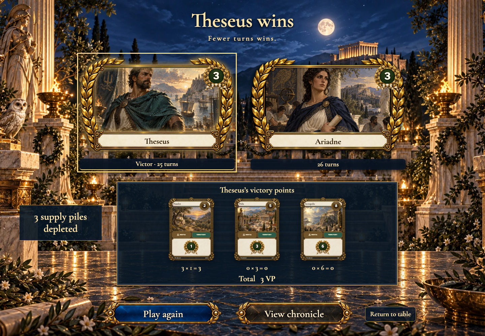</a></td>
<td valign="top"></td>
</tr>
</table>

Tabletop · 3840 × 2160 — expand screenshot

<a href="../../screenshots/2-empires-finish-with-fewer-turns-deciding-victory/005-observer-tabletop-4k-darwin.png">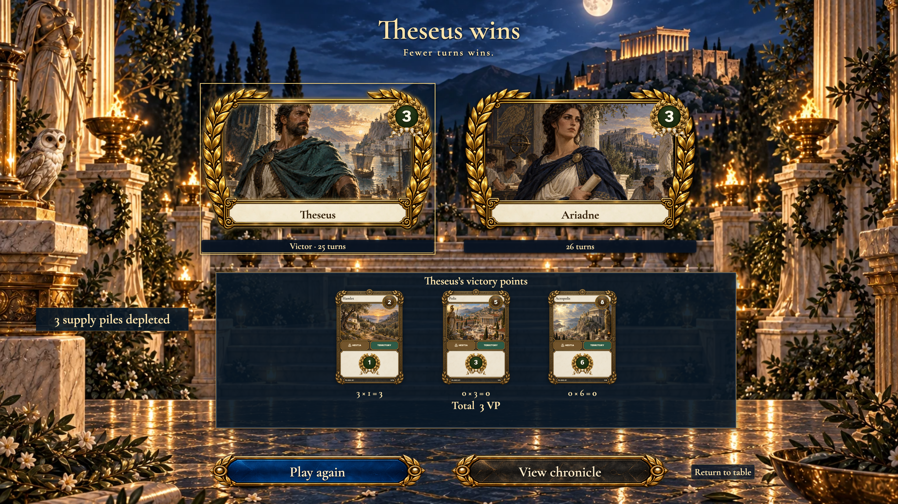</a>

- [x] Both players see the same ending and all ranked empires.

## Inspect another empire’s Territory arithmetic

<table>
<tr><th>Desktop · 1440 × 1000</th><th>Phone · 393 × 852</th></tr>
<tr>
<td valign="top"></td>
<td valign="top"></td>
</tr>
</table>

Tabletop · 3840 × 2160 — expand screenshot

- [x] The selected player’s owned Territories and total are shown.

## Read the actual Hamlet card behind the score

<table>
<tr><th>Desktop · 1440 × 1000</th><th>Phone · 393 × 852</th></tr>
<tr>
<td valign="top"><a href="../../screenshots/2-empires-finish-with-fewer-turns-deciding-victory/007-territory-desktop-darwin.png">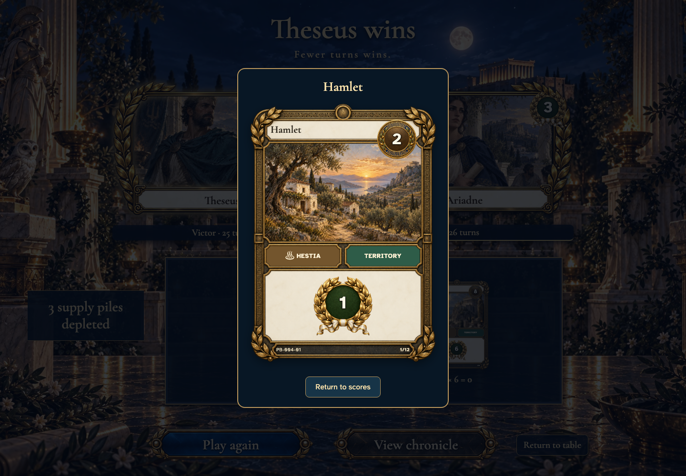</a></td>
<td valign="top"><a href="../../screenshots/2-empires-finish-with-fewer-turns-deciding-victory/007-territory-phone-darwin.png">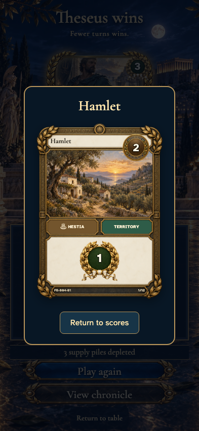</a></td>
</tr>
</table>

Tabletop · 3840 × 2160 — expand screenshot

<a href="../../screenshots/2-empires-finish-with-fewer-turns-deciding-victory/007-territory-tabletop-4k-darwin.png">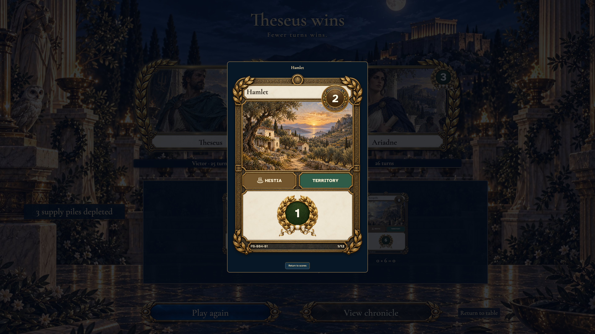</a>

- [x] The full card remains inspectable after the match.

## Return to the same score breakdown

<table>
<tr><th>Desktop · 1440 × 1000</th><th>Phone · 393 × 852</th></tr>
<tr>
<td valign="top"></td>
<td valign="top"><a href="../../screenshots/2-empires-finish-with-fewer-turns-deciding-victory/008-returned-phone-darwin.png">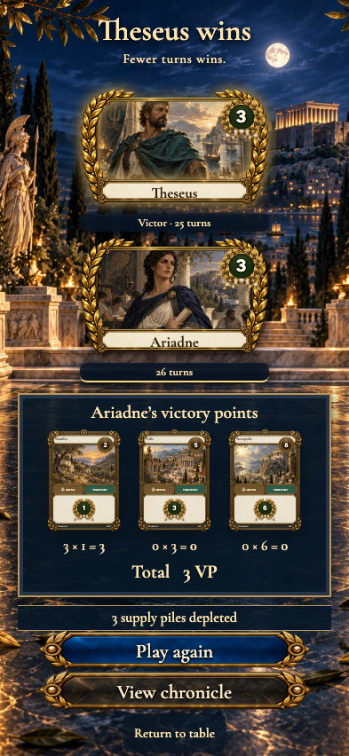</a></td>
</tr>
</table>

Tabletop · 3840 × 2160 — expand screenshot

- [x] Focus returns to Hamlet without changing the selected empire.

## The finished table keeps its result on return

<table>
<tr><th>Desktop · 1440 × 1000</th><th>Phone · 393 × 852</th></tr>
<tr>
<td valign="top"></td>
<td valign="top"><a href="../../screenshots/2-empires-finish-with-fewer-turns-deciding-victory/009-restored-phone-darwin.png">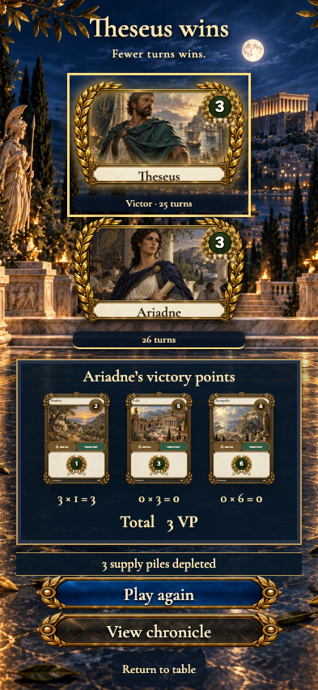</a></td>
</tr>
</table>

Tabletop · 3840 × 2160 — expand screenshot

<a href="../../screenshots/2-empires-finish-with-fewer-turns-deciding-victory/009-restored-tabletop-4k-darwin.png">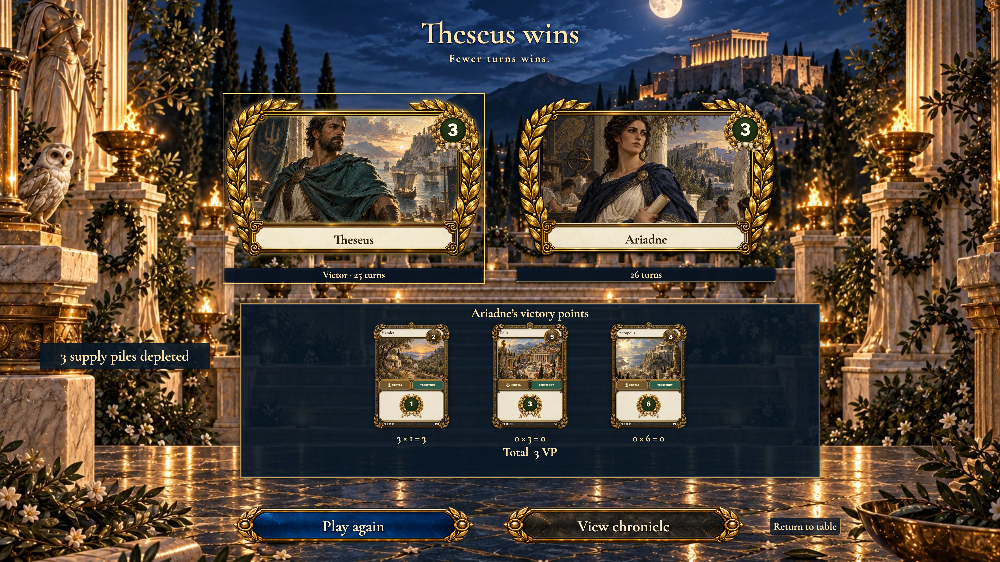</a>

- [x] The same winners and totals return without another cleanup.
