# keep playing a Temple, spend the last Buy, and hand the turn to a friend exactly once

## Ariadne opens a two-player table

Viewpoint: **Ariadne**.

<table>
<tr><th>Desktop · 1440 × 1000</th><th>Phone · 393 × 852</th></tr>
<tr>
<td valign="top"><a href="../../screenshots/keep-playing-a-temple-spend-the-last-buy-and-hand-the-turn-to-a-friend-exactly-once/000-gather-desktop-darwin.png">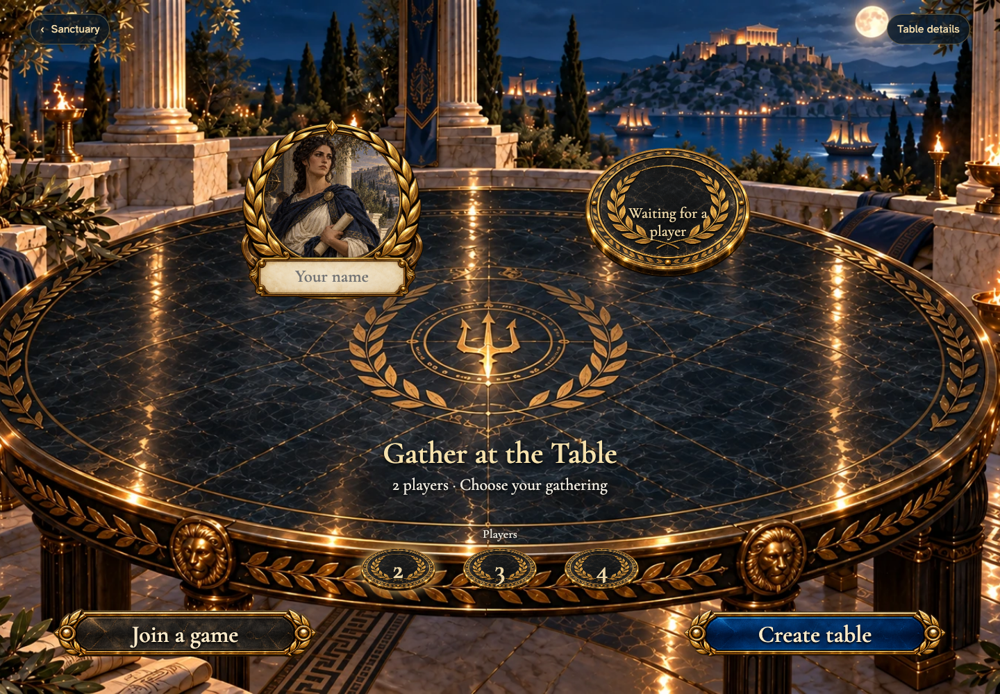</a></td>
<td valign="top"></td>
</tr>
</table>

Tabletop · 3840 × 2160 — expand screenshot

<a href="../../screenshots/keep-playing-a-temple-spend-the-last-buy-and-hand-the-turn-to-a-friend-exactly-once/000-gather-tabletop-4k-darwin.png">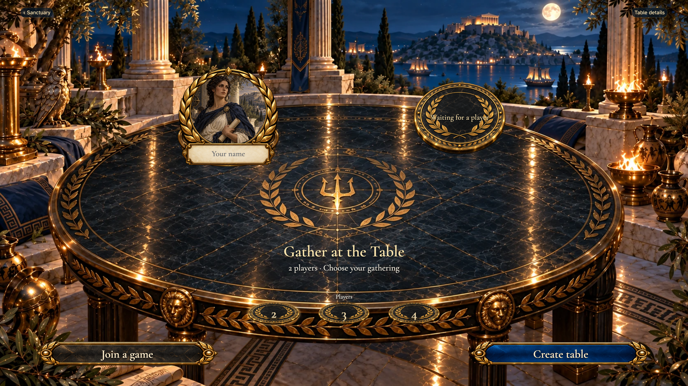</a>

- [x] Ariadne opens a two-player table

## Ariadne waits for her friend

Viewpoint: **Ariadne**.

<table>
<tr><th>Desktop · 1440 × 1000</th><th>Phone · 393 × 852</th></tr>
<tr>
<td valign="top"><a href="../../screenshots/keep-playing-a-temple-spend-the-last-buy-and-hand-the-turn-to-a-friend-exactly-once/001-waiting-desktop-darwin.png">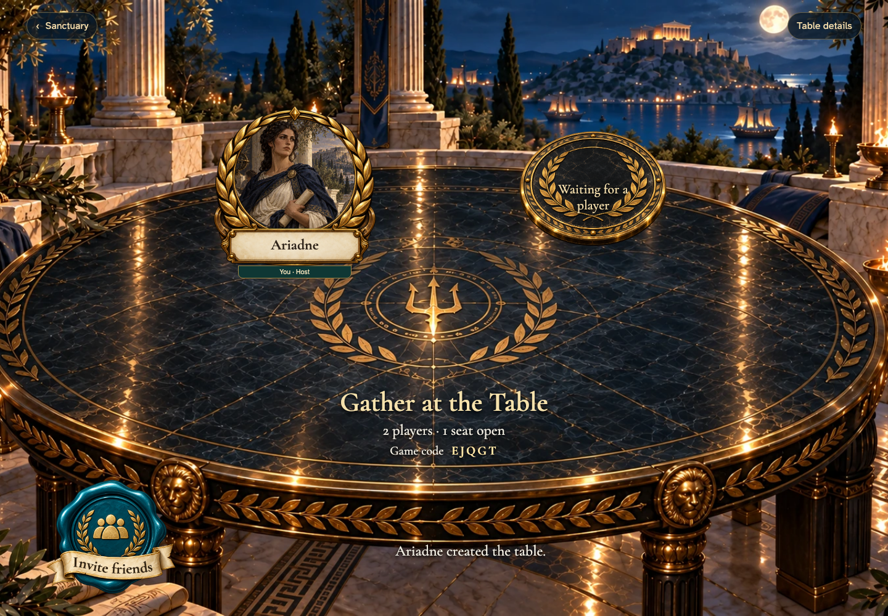</a></td>
<td valign="top"><a href="../../screenshots/keep-playing-a-temple-spend-the-last-buy-and-hand-the-turn-to-a-friend-exactly-once/001-waiting-phone-darwin.png">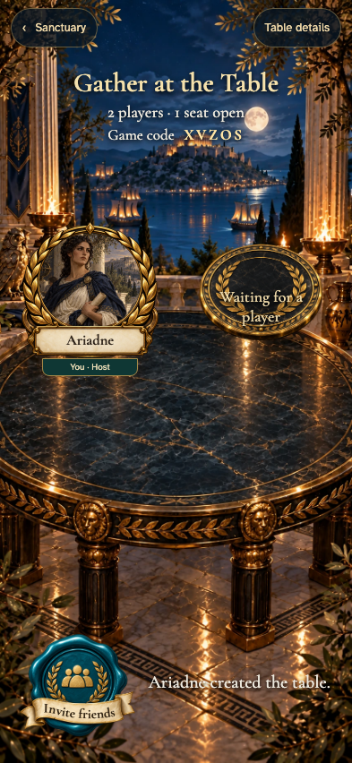</a></td>
</tr>
</table>

Tabletop · 3840 × 2160 — expand screenshot

<a href="../../screenshots/keep-playing-a-temple-spend-the-last-buy-and-hand-the-turn-to-a-friend-exactly-once/001-waiting-tabletop-4k-darwin.png">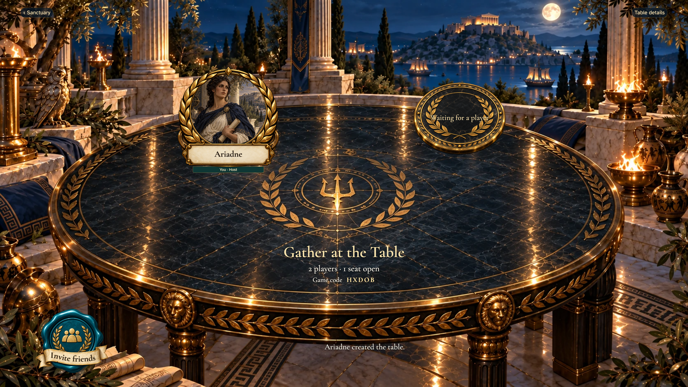</a>

- [x] Ariadne waits for her friend

## Theseus joins Ariadne’s table

Viewpoint: **Ariadne**.

<table>
<tr><th>Desktop · 1440 × 1000</th><th>Phone · 393 × 852</th></tr>
<tr>
<td valign="top"><a href="../../screenshots/keep-playing-a-temple-spend-the-last-buy-and-hand-the-turn-to-a-friend-exactly-once/002-together-desktop-darwin.png">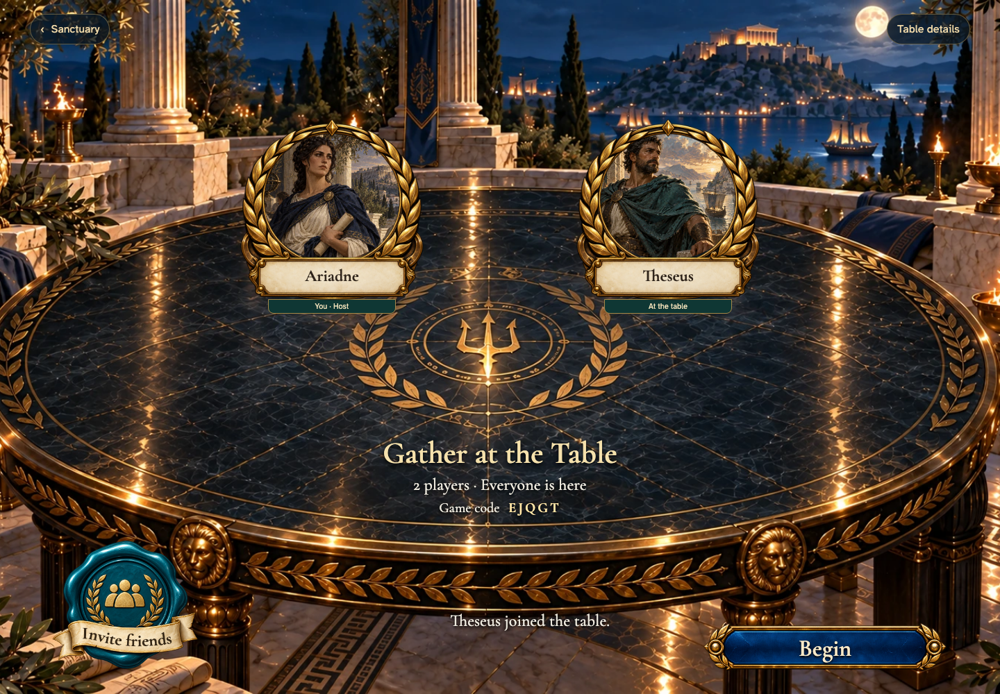</a></td>
<td valign="top"><a href="../../screenshots/keep-playing-a-temple-spend-the-last-buy-and-hand-the-turn-to-a-friend-exactly-once/002-together-phone-darwin.png">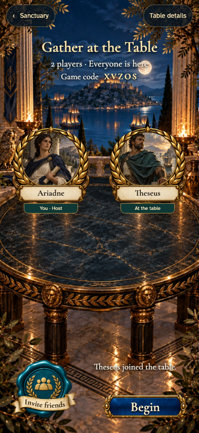</a></td>
</tr>
</table>

Tabletop · 3840 × 2160 — expand screenshot

<a href="../../screenshots/keep-playing-a-temple-spend-the-last-buy-and-hand-the-turn-to-a-friend-exactly-once/002-together-tabletop-4k-darwin.png">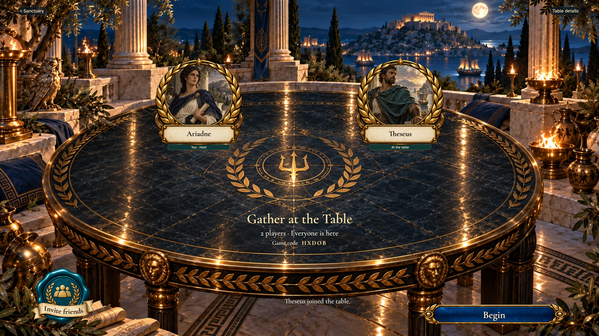</a>

- [x] Theseus joins Ariadne’s table

## Theseus chooses his bloodline first

Viewpoint: **Theseus**.

<table>
<tr><th>Desktop · 1440 × 1000</th><th>Phone · 393 × 852</th></tr>
<tr>
<td valign="top"><a href="../../screenshots/keep-playing-a-temple-spend-the-last-buy-and-hand-the-turn-to-a-friend-exactly-once/003-draft-desktop-darwin.png">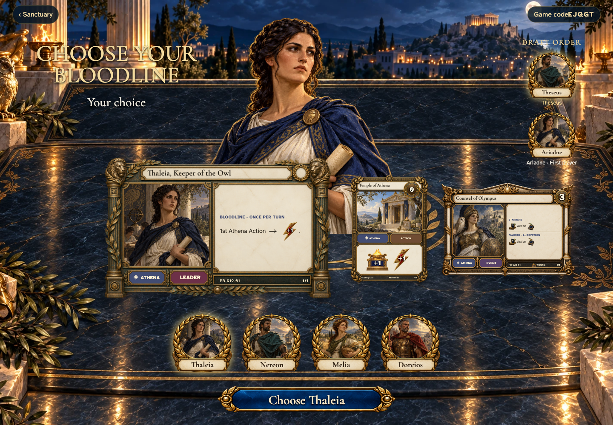</a></td>
<td valign="top"><a href="../../screenshots/keep-playing-a-temple-spend-the-last-buy-and-hand-the-turn-to-a-friend-exactly-once/003-draft-phone-darwin.png">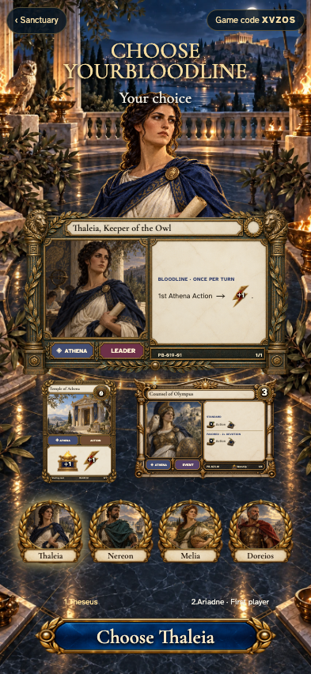</a></td>
</tr>
</table>

Tabletop · 3840 × 2160 — expand screenshot

<a href="../../screenshots/keep-playing-a-temple-spend-the-last-buy-and-hand-the-turn-to-a-friend-exactly-once/003-draft-tabletop-4k-darwin.png">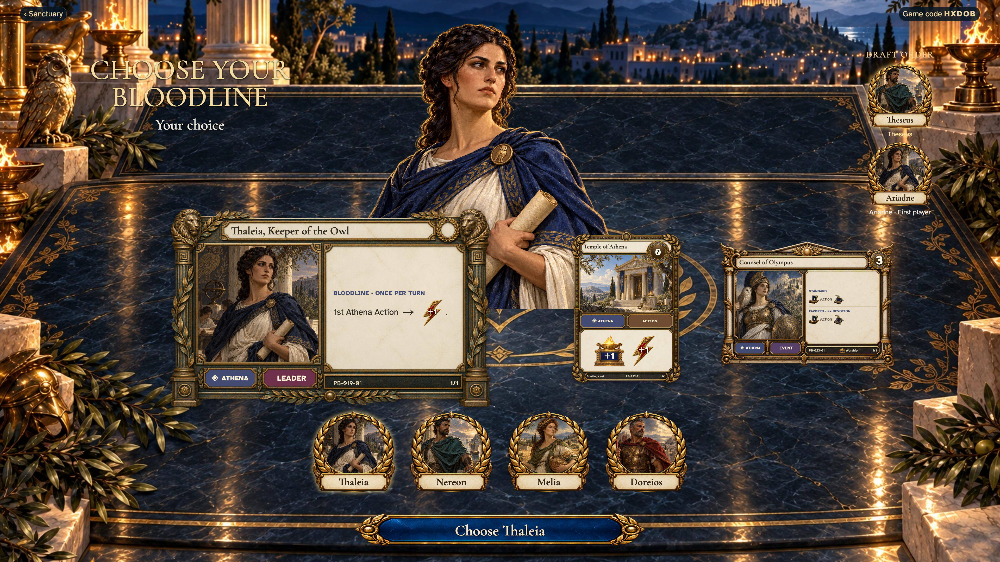</a>

- [x] Theseus chooses his bloodline first

## Theseus considers Nereon’s Temple and god

Viewpoint: **Theseus**.

<table>
<tr><th>Desktop · 1440 × 1000</th><th>Phone · 393 × 852</th></tr>
<tr>
<td valign="top"><a href="../../screenshots/keep-playing-a-temple-spend-the-last-buy-and-hand-the-turn-to-a-friend-exactly-once/004-nereon-desktop-darwin.png">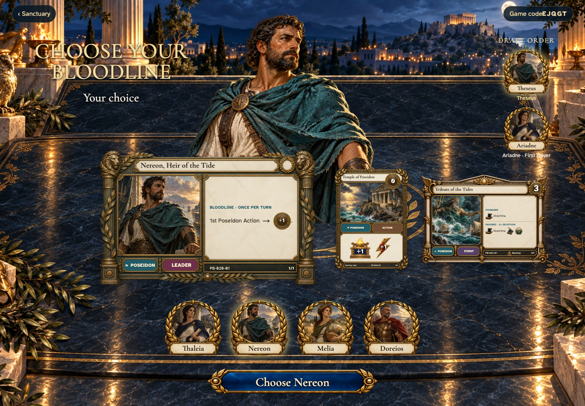</a></td>
<td valign="top"><a href="../../screenshots/keep-playing-a-temple-spend-the-last-buy-and-hand-the-turn-to-a-friend-exactly-once/004-nereon-phone-darwin.png">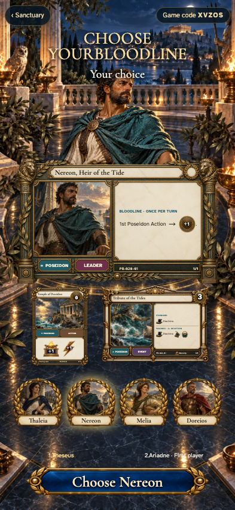</a></td>
</tr>
</table>

Tabletop · 3840 × 2160 — expand screenshot

<a href="../../screenshots/keep-playing-a-temple-spend-the-last-buy-and-hand-the-turn-to-a-friend-exactly-once/004-nereon-tabletop-4k-darwin.png">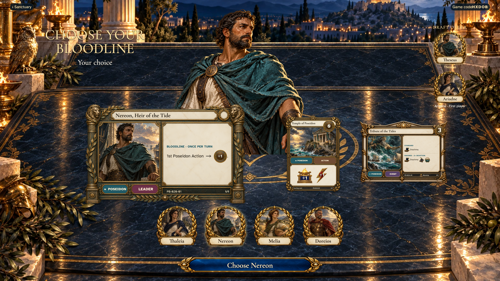</a>

- [x] Theseus considers Nereon’s Temple and god

## Ariadne chooses Thaleia for her empire

Viewpoint: **Ariadne**.

<table>
<tr><th>Desktop · 1440 × 1000</th><th>Phone · 393 × 852</th></tr>
<tr>
<td valign="top"><a href="../../screenshots/keep-playing-a-temple-spend-the-last-buy-and-hand-the-turn-to-a-friend-exactly-once/005-thaleia-desktop-darwin.png">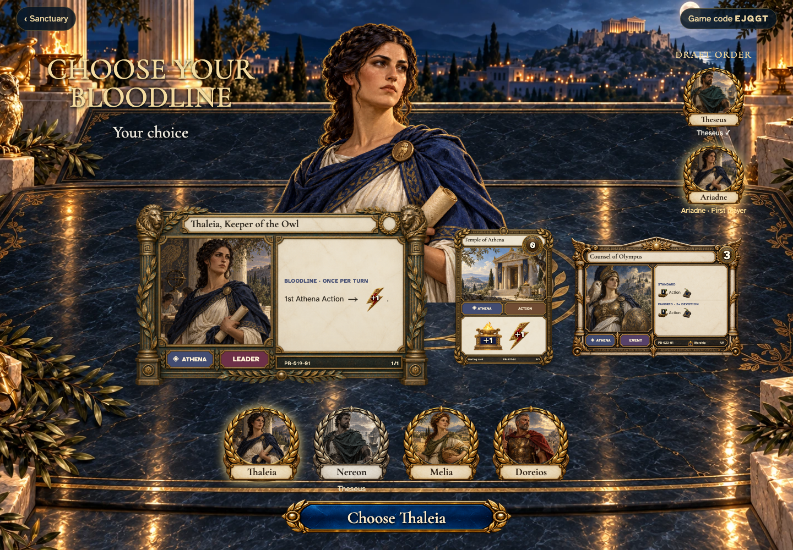</a></td>
<td valign="top"><a href="../../screenshots/keep-playing-a-temple-spend-the-last-buy-and-hand-the-turn-to-a-friend-exactly-once/005-thaleia-phone-darwin.png">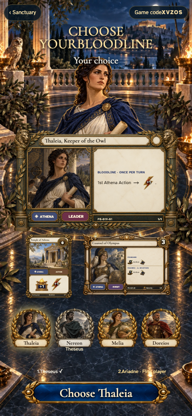</a></td>
</tr>
</table>

Tabletop · 3840 × 2160 — expand screenshot

<a href="../../screenshots/keep-playing-a-temple-spend-the-last-buy-and-hand-the-turn-to-a-friend-exactly-once/005-thaleia-tabletop-4k-darwin.png">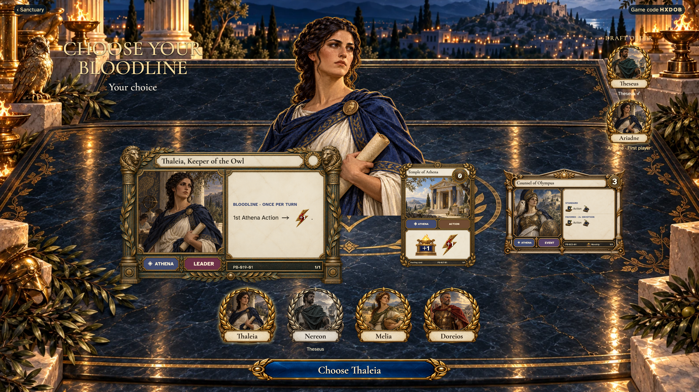</a>

- [x] Ariadne chooses Thaleia for her empire

## Ariadne receives a Temple and four Obols

Viewpoint: **Ariadne**.

<table>
<tr><th>Desktop · 1440 × 1000</th><th>Phone · 393 × 852</th></tr>
<tr>
<td valign="top"><a href="../../screenshots/keep-playing-a-temple-spend-the-last-buy-and-hand-the-turn-to-a-friend-exactly-once/006-hand-desktop-darwin.png">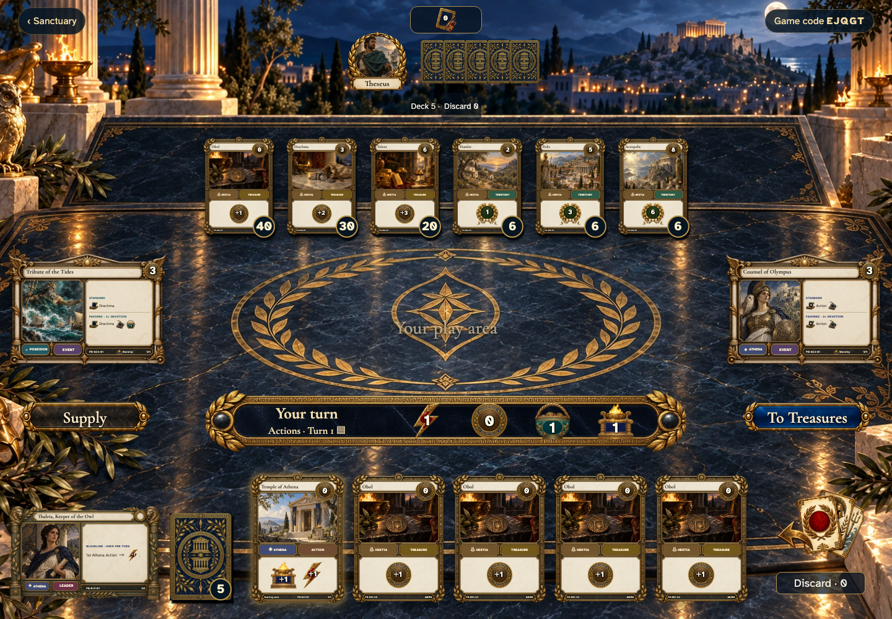</a></td>
<td valign="top"><a href="../../screenshots/keep-playing-a-temple-spend-the-last-buy-and-hand-the-turn-to-a-friend-exactly-once/006-hand-phone-darwin.png">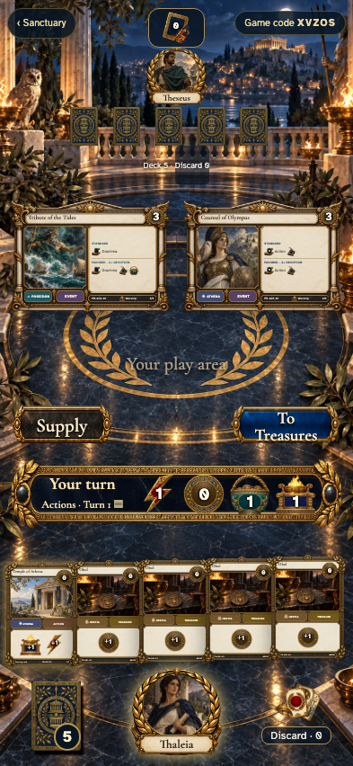</a></td>
</tr>
</table>

Tabletop · 3840 × 2160 — expand screenshot

<a href="../../screenshots/keep-playing-a-temple-spend-the-last-buy-and-hand-the-turn-to-a-friend-exactly-once/006-hand-tabletop-4k-darwin.png">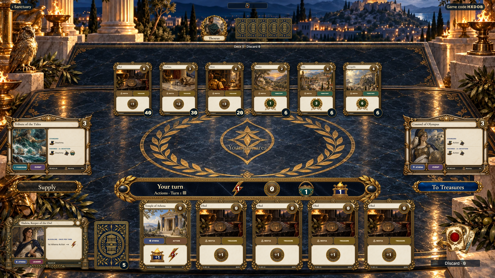</a>

- [x] Ariadne receives a Temple and four Obols

## The Temple can be read before it is played

Viewpoint: **Ariadne**.

<table>
<tr><th>Desktop · 1440 × 1000</th><th>Phone · 393 × 852</th></tr>
<tr>
<td valign="top"><a href="../../screenshots/keep-playing-a-temple-spend-the-last-buy-and-hand-the-turn-to-a-friend-exactly-once/007-temple-desktop-darwin.png">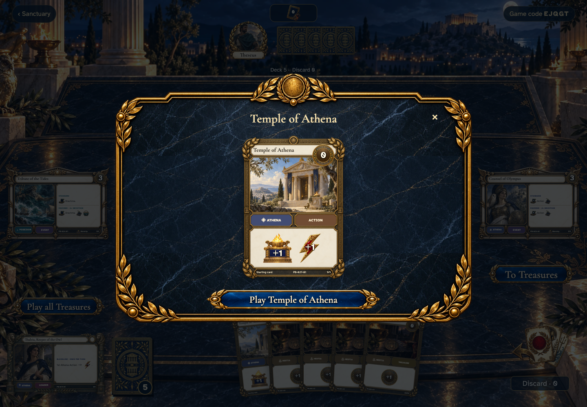</a></td>
<td valign="top"><a href="../../screenshots/keep-playing-a-temple-spend-the-last-buy-and-hand-the-turn-to-a-friend-exactly-once/007-temple-phone-darwin.png">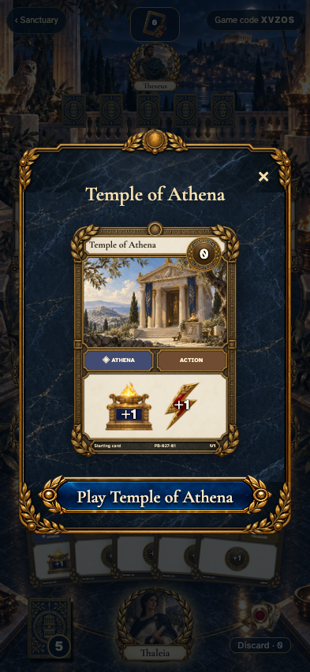</a></td>
</tr>
</table>

Tabletop · 3840 × 2160 — expand screenshot

<a href="../../screenshots/keep-playing-a-temple-spend-the-last-buy-and-hand-the-turn-to-a-friend-exactly-once/007-temple-tabletop-4k-darwin.png">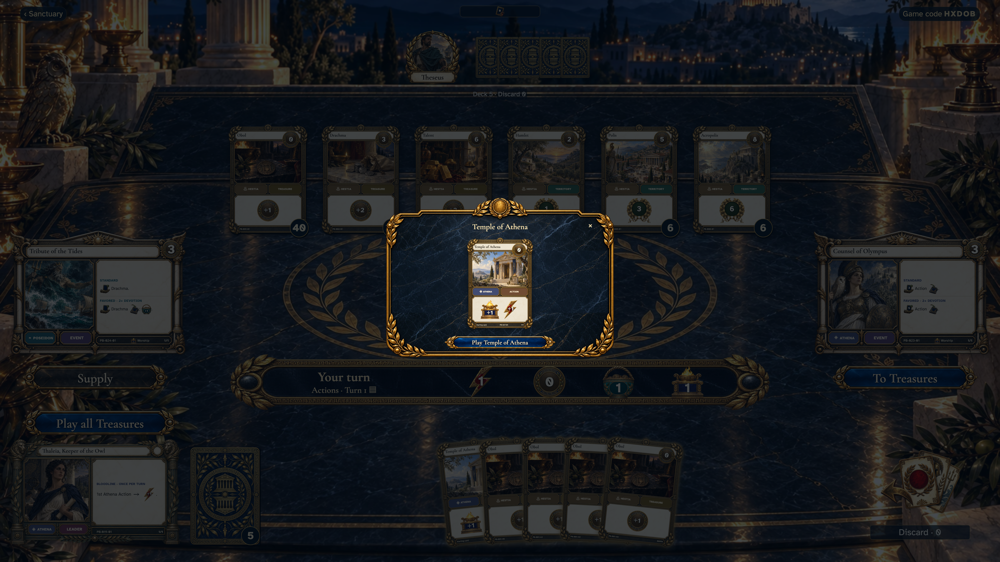</a>

- [x] The Temple can be read before it is played

## The Temple and Thaleia leave two Actions and two Worship

Viewpoint: **Ariadne**.

<table>
<tr><th>Desktop · 1440 × 1000</th><th>Phone · 393 × 852</th></tr>
<tr>
<td valign="top"></td>
<td valign="top"><a href="../../screenshots/keep-playing-a-temple-spend-the-last-buy-and-hand-the-turn-to-a-friend-exactly-once/008-played-phone-darwin.png">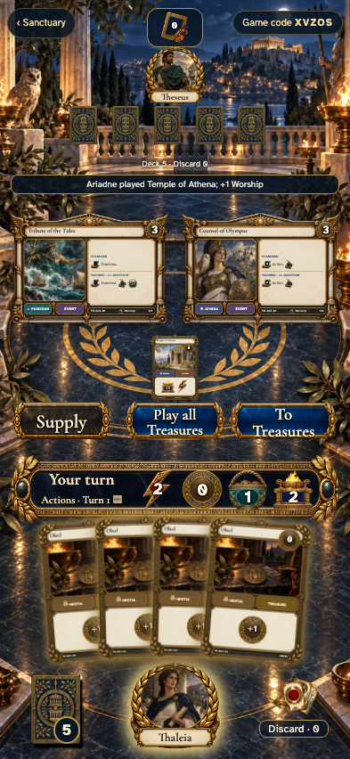</a></td>
</tr>
</table>

Tabletop · 3840 × 2160 — expand screenshot

<a href="../../screenshots/keep-playing-a-temple-spend-the-last-buy-and-hand-the-turn-to-a-friend-exactly-once/008-played-tabletop-4k-darwin.png">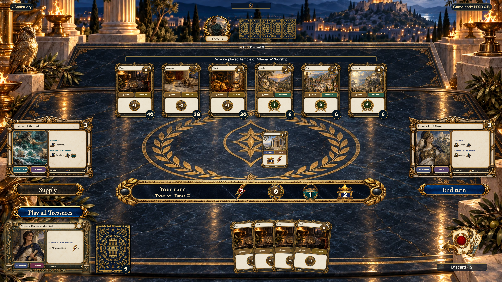</a>

- [x] The Temple and Thaleia leave two Actions and two Worship

## Ariadne can now play her wealth

Viewpoint: **Ariadne**.

<table>
<tr><th>Desktop · 1440 × 1000</th><th>Phone · 393 × 852</th></tr>
<tr>
<td valign="top"><a href="../../screenshots/keep-playing-a-temple-spend-the-last-buy-and-hand-the-turn-to-a-friend-exactly-once/009-treasures-desktop-darwin.png">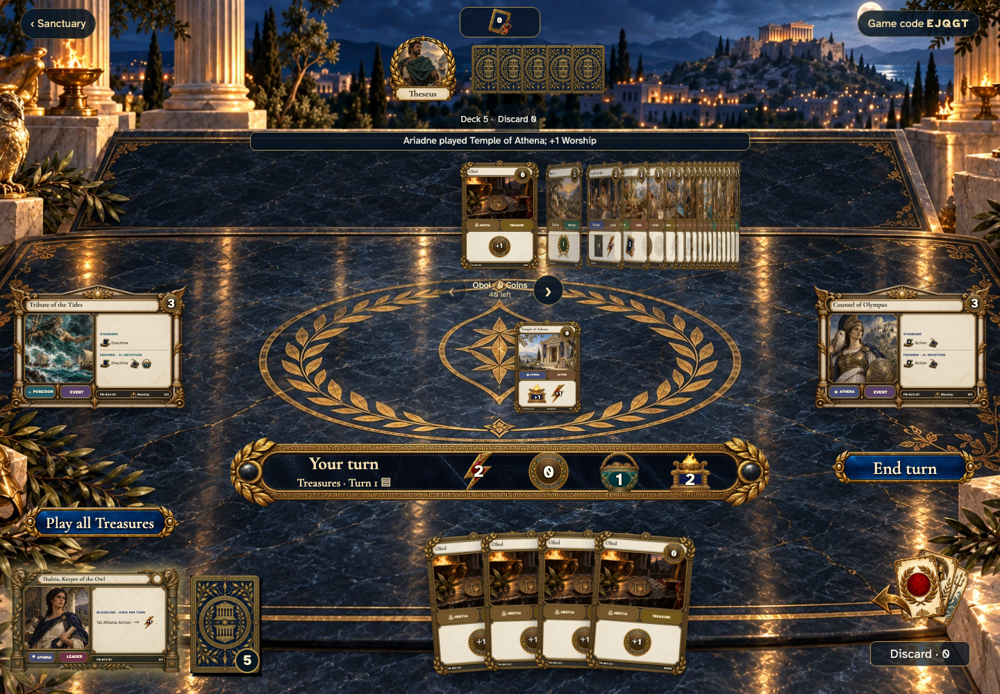</a></td>
<td valign="top"><a href="../../screenshots/keep-playing-a-temple-spend-the-last-buy-and-hand-the-turn-to-a-friend-exactly-once/009-treasures-phone-darwin.png">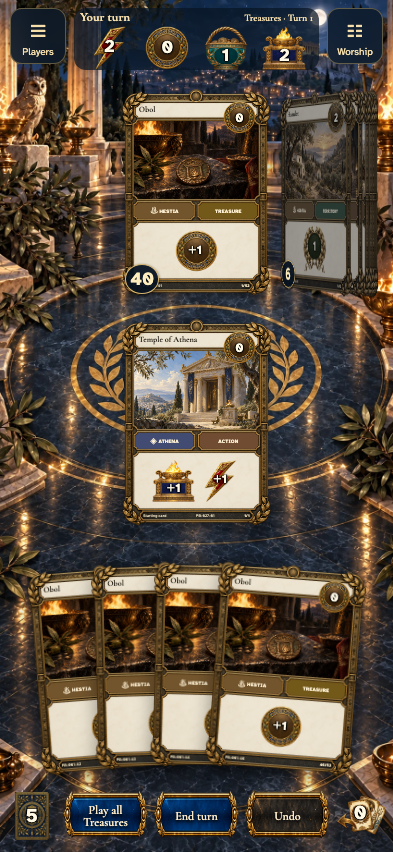</a></td>
</tr>
</table>

Tabletop · 3840 × 2160 — expand screenshot

<a href="../../screenshots/keep-playing-a-temple-spend-the-last-buy-and-hand-the-turn-to-a-friend-exactly-once/009-treasures-tabletop-4k-darwin.png">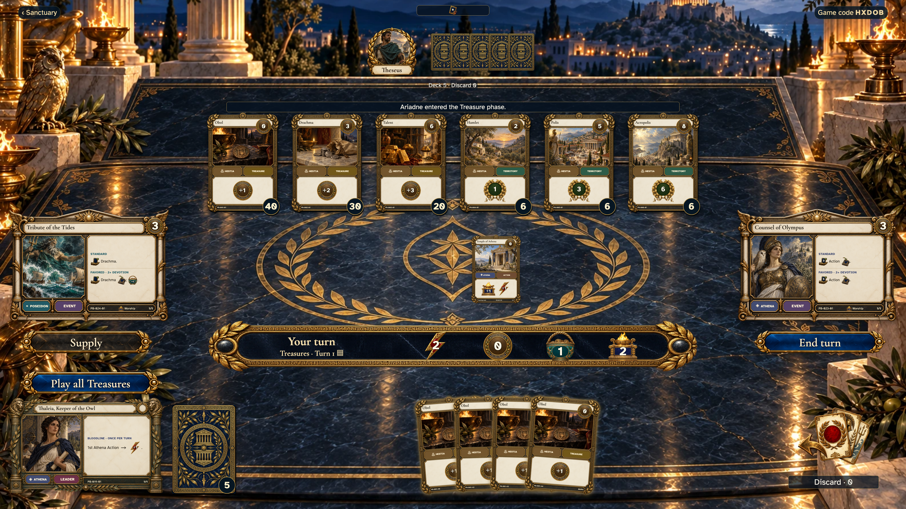</a>

- [x] Ariadne can now play her wealth

## Four Obols provide four Coins

Viewpoint: **Ariadne**.

<table>
<tr><th>Desktop · 1440 × 1000</th><th>Phone · 393 × 852</th></tr>
<tr>
<td valign="top"><a href="../../screenshots/keep-playing-a-temple-spend-the-last-buy-and-hand-the-turn-to-a-friend-exactly-once/010-wealth-desktop-darwin.png">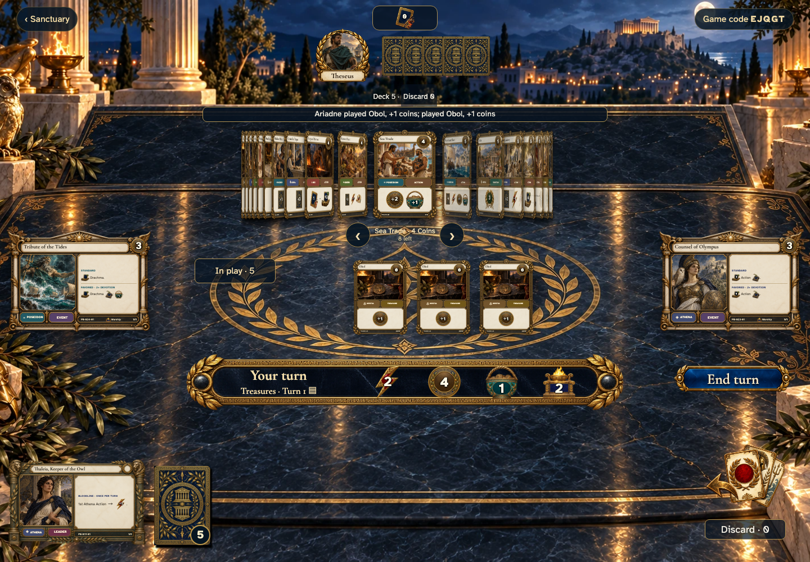</a></td>
<td valign="top"><a href="../../screenshots/keep-playing-a-temple-spend-the-last-buy-and-hand-the-turn-to-a-friend-exactly-once/010-wealth-phone-darwin.png">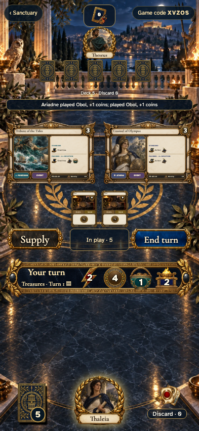</a></td>
</tr>
</table>

Tabletop · 3840 × 2160 — expand screenshot

<a href="../../screenshots/keep-playing-a-temple-spend-the-last-buy-and-hand-the-turn-to-a-friend-exactly-once/010-wealth-tabletop-4k-darwin.png">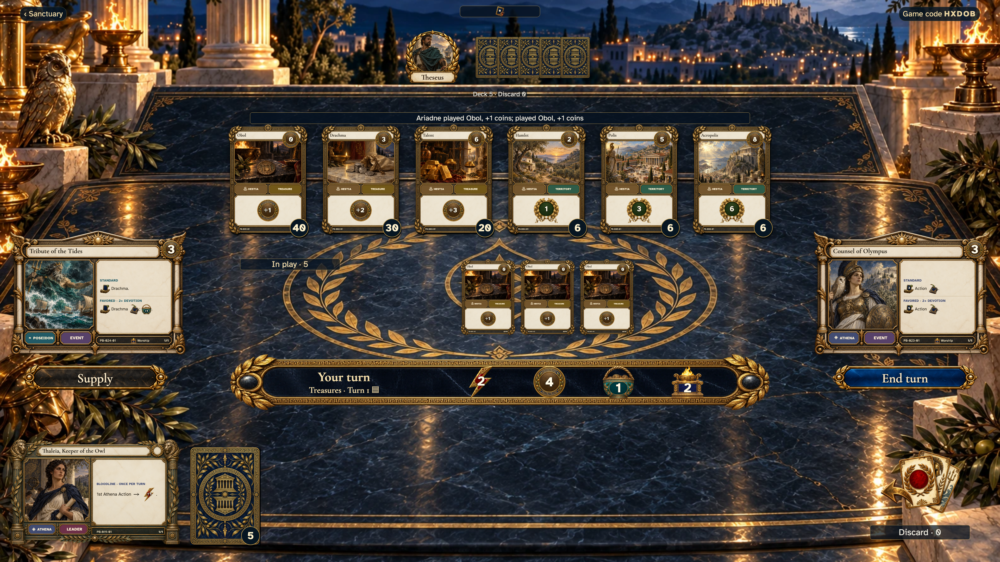</a>

- [x] Four Obols provide four Coins

## The supply offers both Basics and Actions

Viewpoint: **Ariadne**.

<table>
<tr><th>Desktop · 1440 × 1000</th><th>Phone · 393 × 852</th></tr>
<tr>
<td valign="top"></td>
<td valign="top"><a href="../../screenshots/keep-playing-a-temple-spend-the-last-buy-and-hand-the-turn-to-a-friend-exactly-once/011-supply-phone-darwin.png">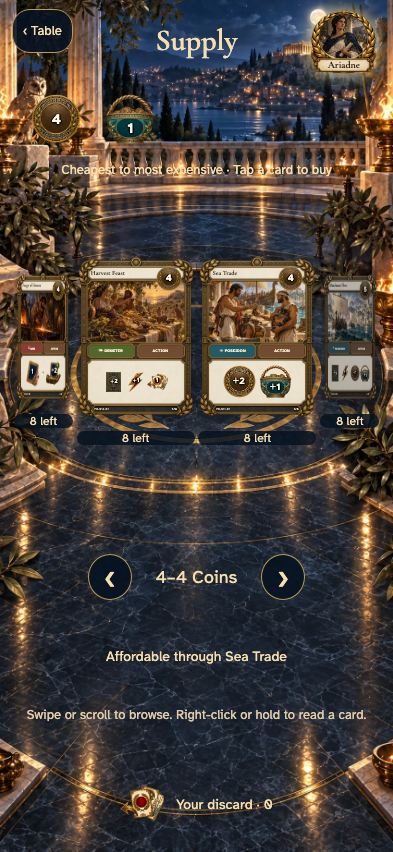</a></td>
</tr>
</table>

Tabletop · 3840 × 2160 — expand screenshot

- [x] The supply offers both Basics and Actions

## Ariadne explores Action cards

Viewpoint: **Ariadne**.

<table>
<tr><th>Desktop · 1440 × 1000</th><th>Phone · 393 × 852</th></tr>
<tr>
<td valign="top"></td>
<td valign="top"><a href="../../screenshots/keep-playing-a-temple-spend-the-last-buy-and-hand-the-turn-to-a-friend-exactly-once/012-actions-phone-darwin.png">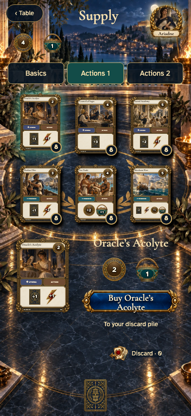</a></td>
</tr>
</table>

Tabletop · 3840 × 2160 — expand screenshot

<a href="../../screenshots/keep-playing-a-temple-spend-the-last-buy-and-hand-the-turn-to-a-friend-exactly-once/012-actions-tabletop-4k-darwin.png">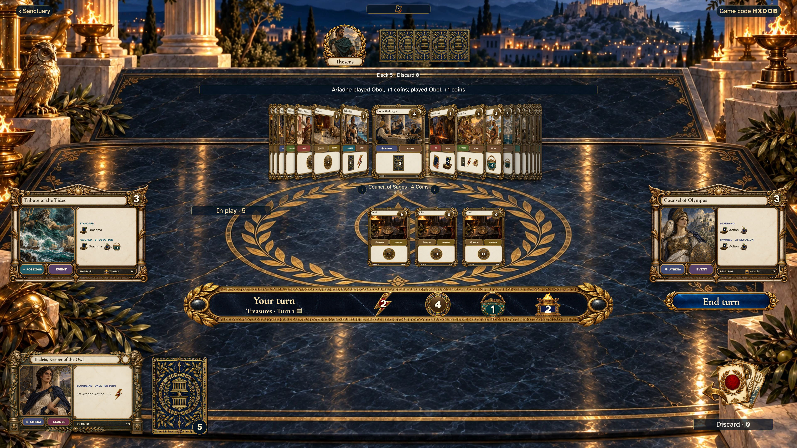</a>

- [x] Ariadne explores Action cards

## Council of Sages costs all four Coins

Viewpoint: **Ariadne**.

<table>
<tr><th>Desktop · 1440 × 1000</th><th>Phone · 393 × 852</th></tr>
<tr>
<td valign="top"><a href="../../screenshots/keep-playing-a-temple-spend-the-last-buy-and-hand-the-turn-to-a-friend-exactly-once/013-council-desktop-darwin.png">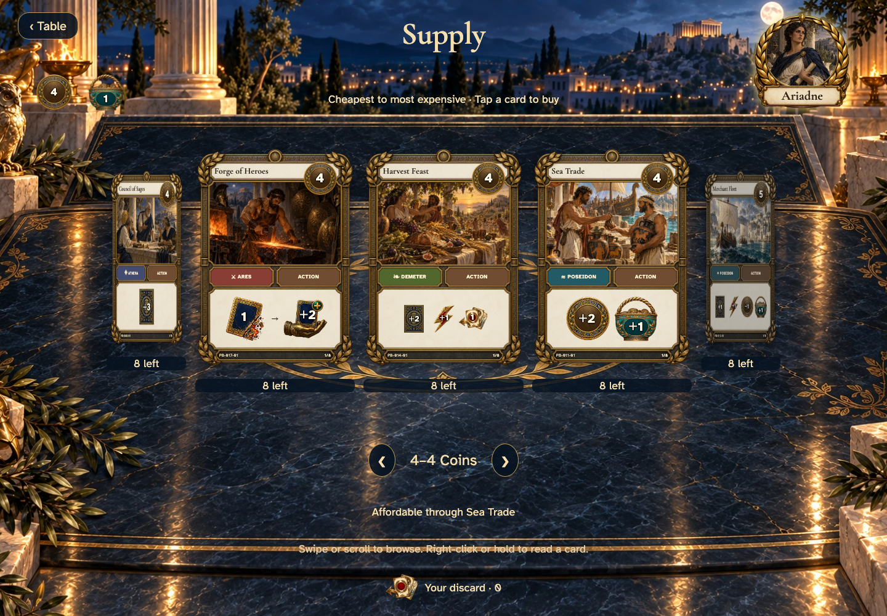</a></td>
<td valign="top"><a href="../../screenshots/keep-playing-a-temple-spend-the-last-buy-and-hand-the-turn-to-a-friend-exactly-once/013-council-phone-darwin.png">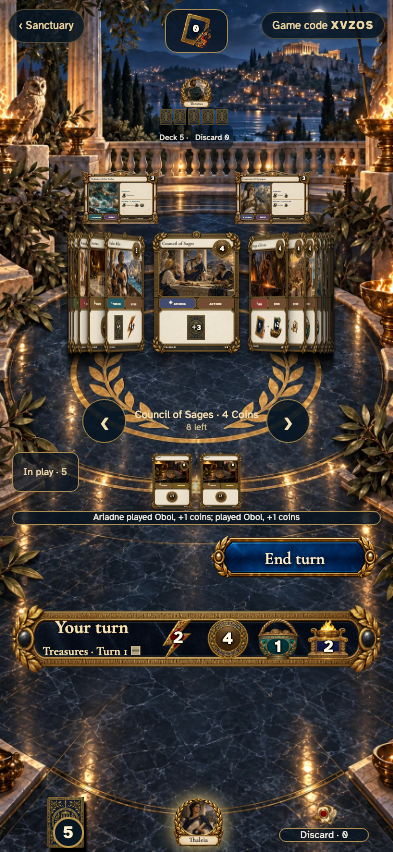</a></td>
</tr>
</table>

Tabletop · 3840 × 2160 — expand screenshot

- [x] Council of Sages costs all four Coins

## Spending the last Buy does not end the turn

Viewpoint: **Ariadne**.

<table>
<tr><th>Desktop · 1440 × 1000</th><th>Phone · 393 × 852</th></tr>
<tr>
<td valign="top"><a href="../../screenshots/keep-playing-a-temple-spend-the-last-buy-and-hand-the-turn-to-a-friend-exactly-once/014-last-buy-desktop-darwin.png">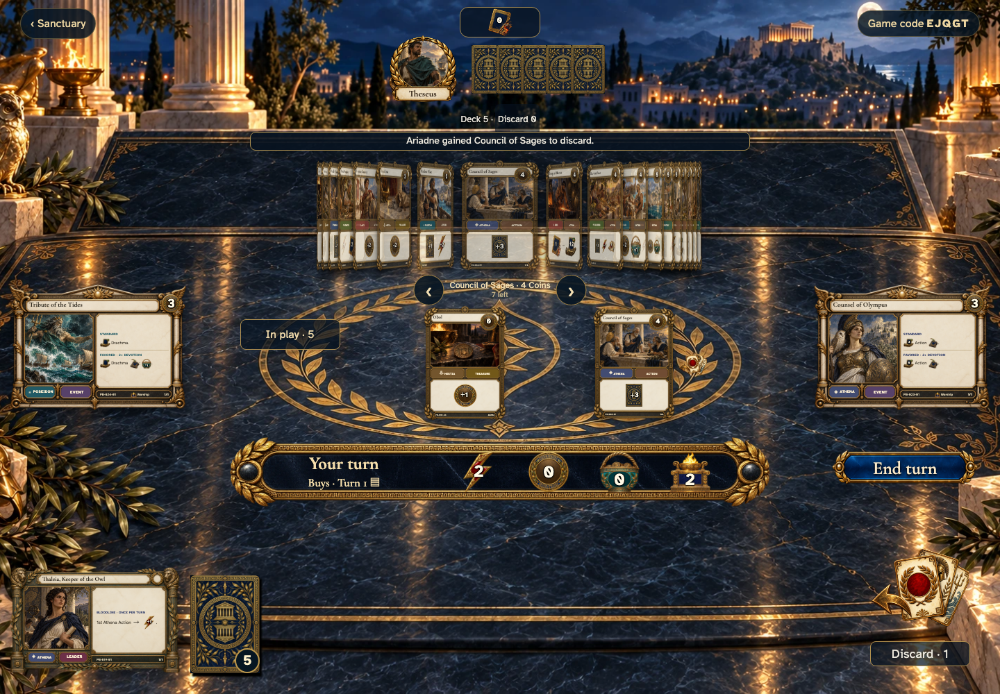</a></td>
<td valign="top"><a href="../../screenshots/keep-playing-a-temple-spend-the-last-buy-and-hand-the-turn-to-a-friend-exactly-once/014-last-buy-phone-darwin.png">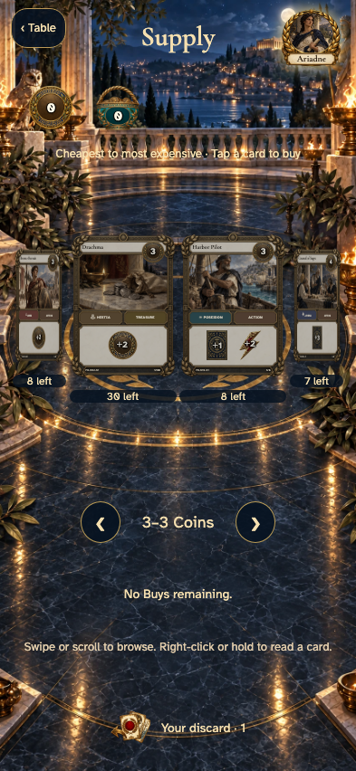</a></td>
</tr>
</table>

Tabletop · 3840 × 2160 — expand screenshot

<a href="../../screenshots/keep-playing-a-temple-spend-the-last-buy-and-hand-the-turn-to-a-friend-exactly-once/014-last-buy-tabletop-4k-darwin.png">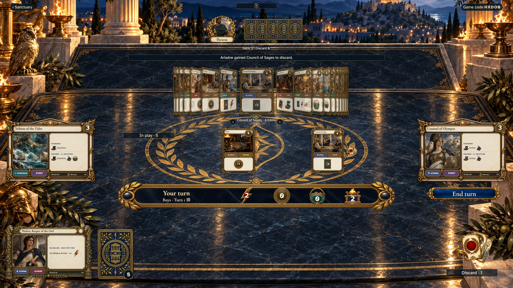</a>

- [x] Spending the last Buy does not end the turn

## Ariadne chooses when to finish her turn

Viewpoint: **Ariadne**.

<table>
<tr><th>Desktop · 1440 × 1000</th><th>Phone · 393 × 852</th></tr>
<tr>
<td valign="top"><a href="../../screenshots/keep-playing-a-temple-spend-the-last-buy-and-hand-the-turn-to-a-friend-exactly-once/015-finish-desktop-darwin.png">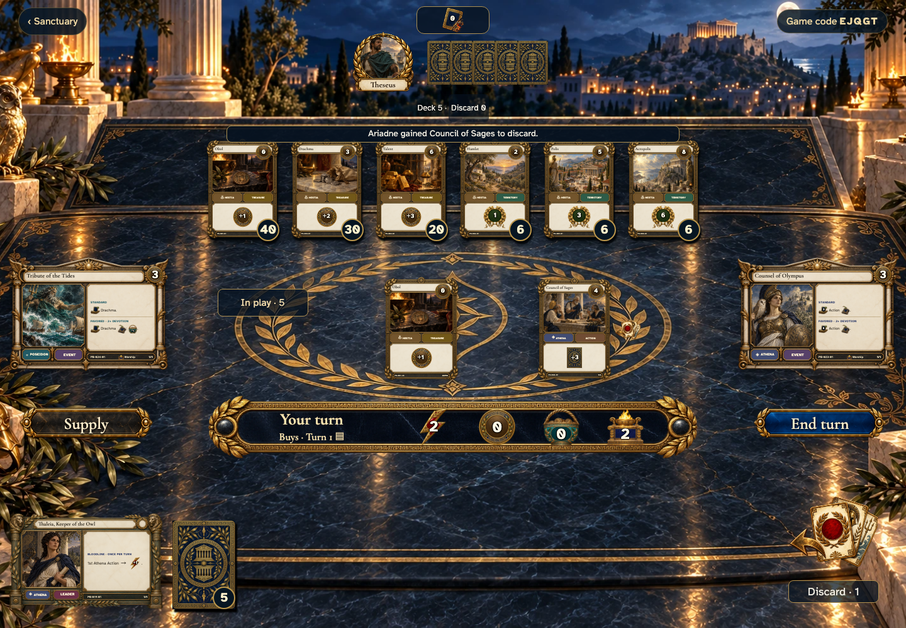</a></td>
<td valign="top"><a href="../../screenshots/keep-playing-a-temple-spend-the-last-buy-and-hand-the-turn-to-a-friend-exactly-once/015-finish-phone-darwin.png">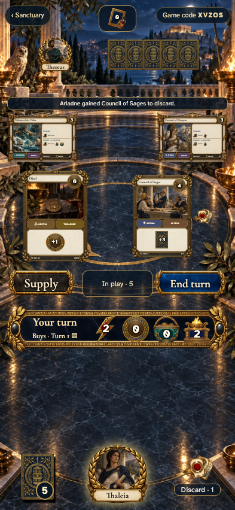</a></td>
</tr>
</table>

Tabletop · 3840 × 2160 — expand screenshot

- [x] Ariadne chooses when to finish her turn

## Theseus receives fresh counters after public cleanup finishes

Viewpoint: **Theseus**.

<table>
<tr><th>Desktop · 1440 × 1000</th><th>Phone · 393 × 852</th></tr>
<tr>
<td valign="top"><a href="../../screenshots/keep-playing-a-temple-spend-the-last-buy-and-hand-the-turn-to-a-friend-exactly-once/016-handoff-desktop-darwin.png">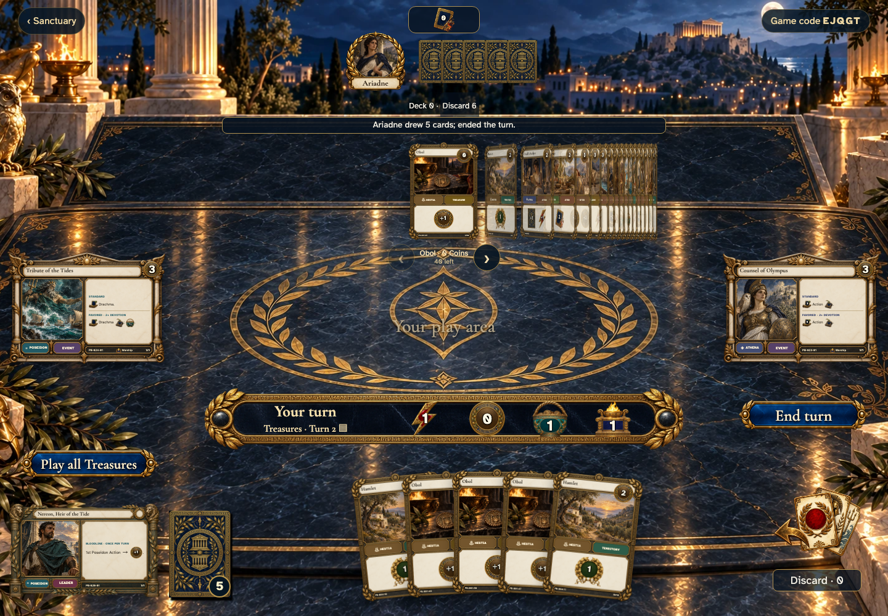</a></td>
<td valign="top"><a href="../../screenshots/keep-playing-a-temple-spend-the-last-buy-and-hand-the-turn-to-a-friend-exactly-once/016-handoff-phone-darwin.png">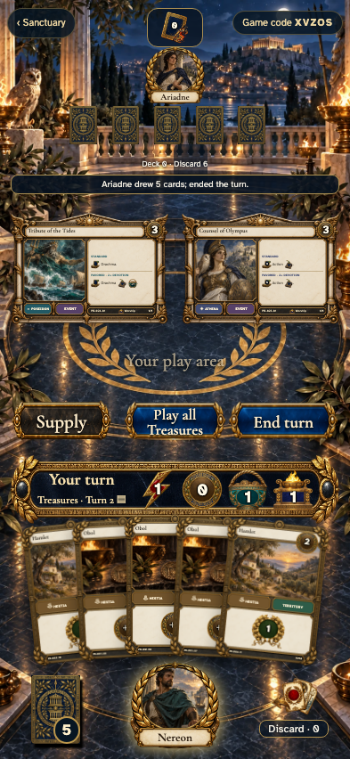</a></td>
</tr>
</table>

Tabletop · 3840 × 2160 — expand screenshot

<a href="../../screenshots/keep-playing-a-temple-spend-the-last-buy-and-hand-the-turn-to-a-friend-exactly-once/016-handoff-tabletop-4k-darwin.png">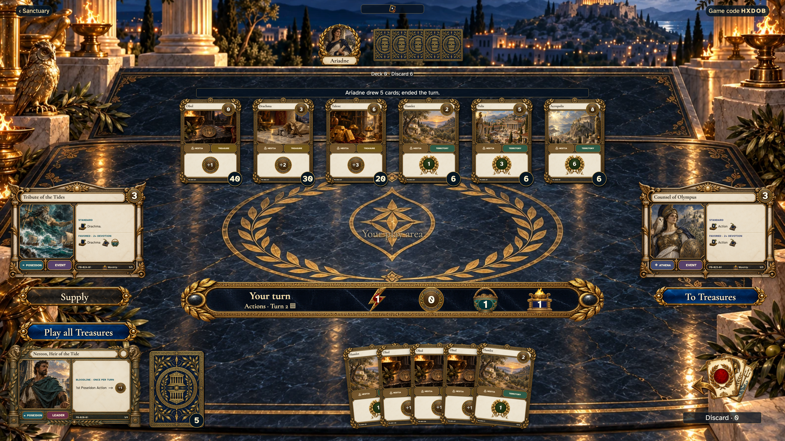</a>

- [x] Theseus receives fresh counters after public cleanup finishes

## Ariadne receives five private cards and waits for Theseus

Viewpoint: **Ariadne**.

<table>
<tr><th>Desktop · 1440 × 1000</th><th>Phone · 393 × 852</th></tr>
<tr>
<td valign="top"><a href="../../screenshots/keep-playing-a-temple-spend-the-last-buy-and-hand-the-turn-to-a-friend-exactly-once/017-waiting-hand-desktop-darwin.png">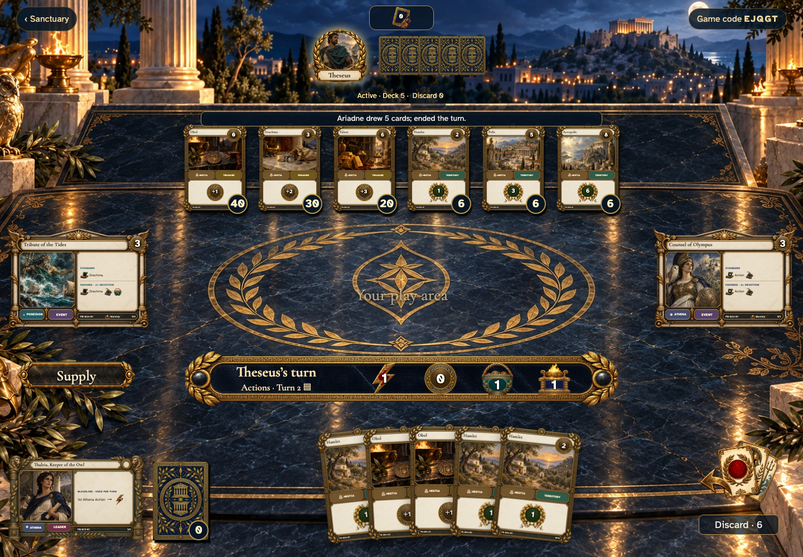</a></td>
<td valign="top"><a href="../../screenshots/keep-playing-a-temple-spend-the-last-buy-and-hand-the-turn-to-a-friend-exactly-once/017-waiting-hand-phone-darwin.png">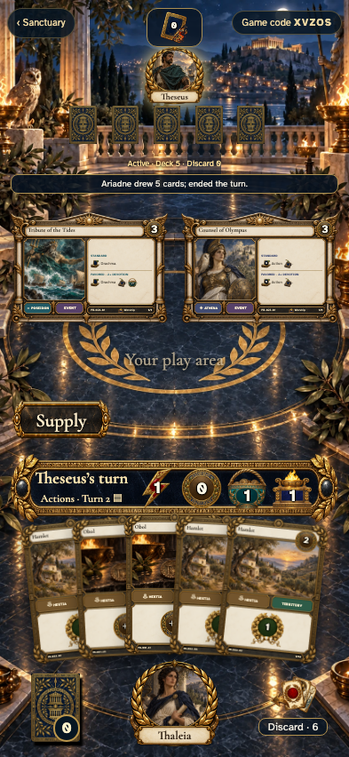</a></td>
</tr>
</table>

Tabletop · 3840 × 2160 — expand screenshot

<a href="../../screenshots/keep-playing-a-temple-spend-the-last-buy-and-hand-the-turn-to-a-friend-exactly-once/017-waiting-hand-tabletop-4k-darwin.png">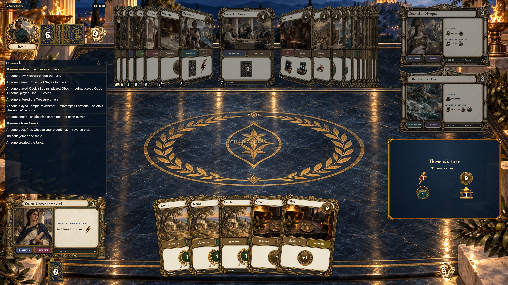</a>

- [x] Ariadne receives five private cards and waits for Theseus

## Returning does not repeat cleanup or draw another hand

Viewpoint: **Ariadne**.

<table>
<tr><th>Desktop · 1440 × 1000</th><th>Phone · 393 × 852</th></tr>
<tr>
<td valign="top"><a href="../../screenshots/keep-playing-a-temple-spend-the-last-buy-and-hand-the-turn-to-a-friend-exactly-once/018-return-desktop-darwin.png">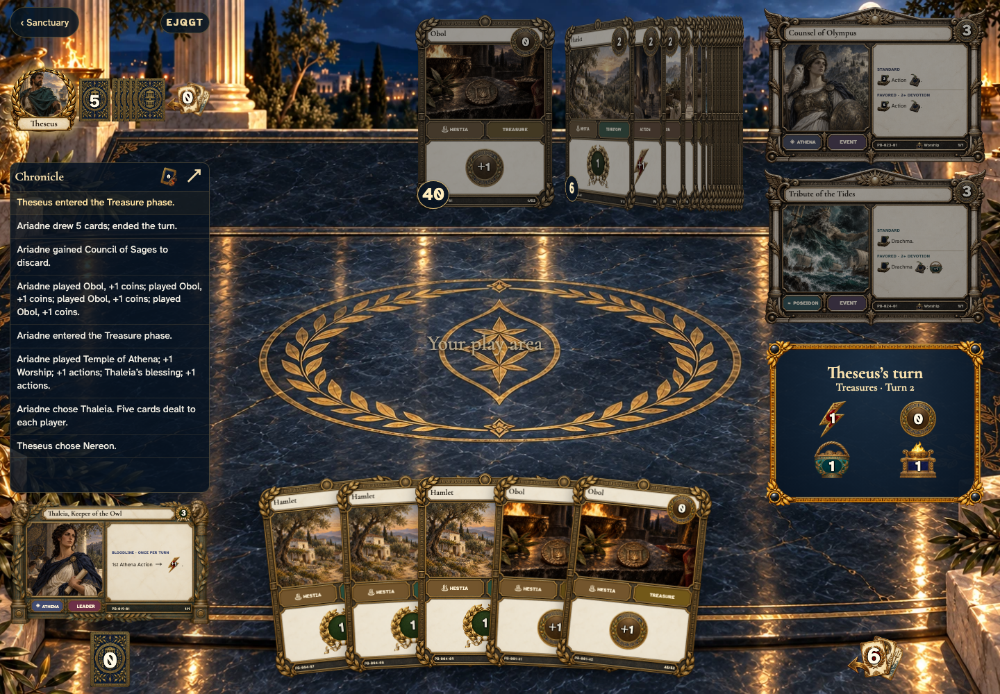</a></td>
<td valign="top"></td>
</tr>
</table>

Tabletop · 3840 × 2160 — expand screenshot

<a href="../../screenshots/keep-playing-a-temple-spend-the-last-buy-and-hand-the-turn-to-a-friend-exactly-once/018-return-tabletop-4k-darwin.png">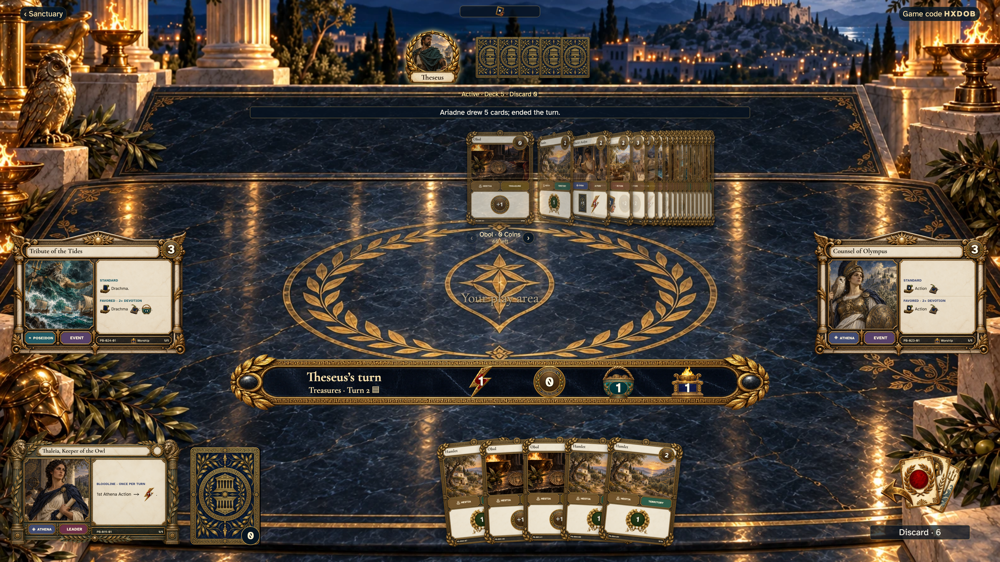</a>

- [x] Returning does not repeat cleanup or draw another hand
