# follow a friend from the first Temple through Worship and cleanup while reading the public table

## Ariadne invites Theseus to a two-player table

Viewpoint: **Ariadne**.

<table>
<tr><th>Desktop · 1440 × 1000</th><th>Phone · 393 × 852</th></tr>
<tr>
<td valign="top"><a href="../../screenshots/follow-a-friend-from-the-first-temple-through-worship-and-cleanup-while-reading-the-public-table/000-created-desktop-darwin.png">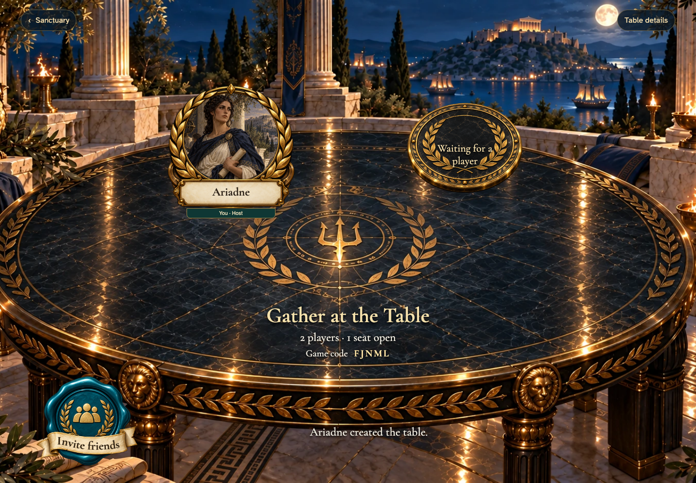</a></td>
<td valign="top"><a href="../../screenshots/follow-a-friend-from-the-first-temple-through-worship-and-cleanup-while-reading-the-public-table/000-created-phone-darwin.png">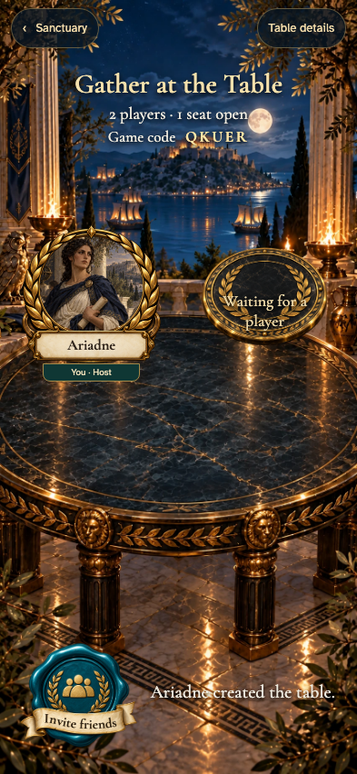</a></td>
</tr>
</table>

Tabletop · 3840 × 2160 — expand screenshot

<a href="../../screenshots/follow-a-friend-from-the-first-temple-through-worship-and-cleanup-while-reading-the-public-table/000-created-tabletop-4k-darwin.png">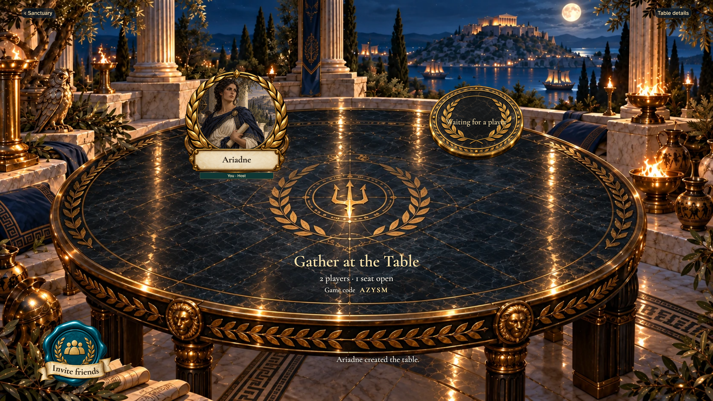</a>

- [x] Ariadne invites Theseus to a two-player table

## Both friends are seated and Ariadne can begin

Viewpoint: **Ariadne**.

<table>
<tr><th>Desktop · 1440 × 1000</th><th>Phone · 393 × 852</th></tr>
<tr>
<td valign="top"><a href="../../screenshots/follow-a-friend-from-the-first-temple-through-worship-and-cleanup-while-reading-the-public-table/001-joined-desktop-darwin.png">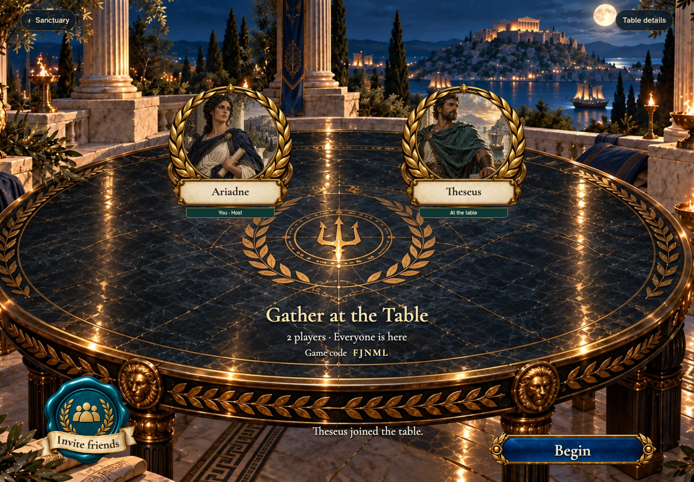</a></td>
<td valign="top"><a href="../../screenshots/follow-a-friend-from-the-first-temple-through-worship-and-cleanup-while-reading-the-public-table/001-joined-phone-darwin.png">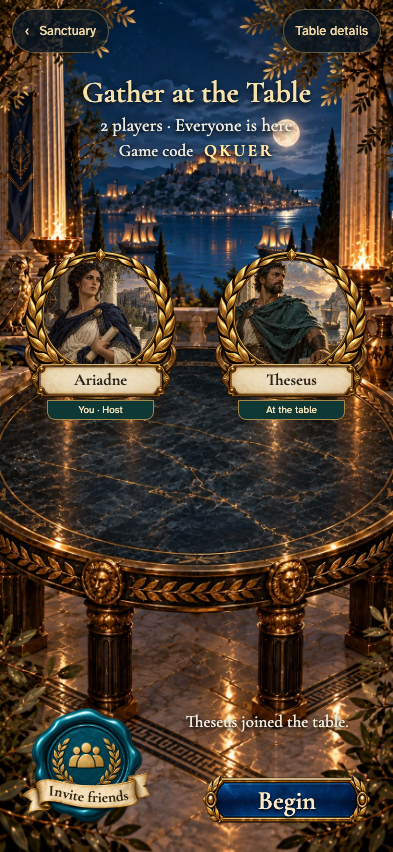</a></td>
</tr>
</table>

Tabletop · 3840 × 2160 — expand screenshot

<a href="../../screenshots/follow-a-friend-from-the-first-temple-through-worship-and-cleanup-while-reading-the-public-table/001-joined-tabletop-4k-darwin.png">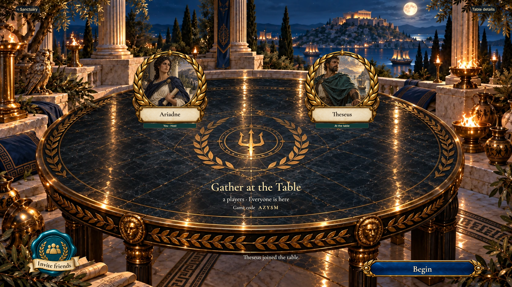</a>

- [x] Both friends are seated and Ariadne can begin

## Theseus chooses Thaleia first

Viewpoint: **Theseus**.

<table>
<tr><th>Desktop · 1440 × 1000</th><th>Phone · 393 × 852</th></tr>
<tr>
<td valign="top"><a href="../../screenshots/follow-a-friend-from-the-first-temple-through-worship-and-cleanup-while-reading-the-public-table/002-draft-desktop-darwin.png">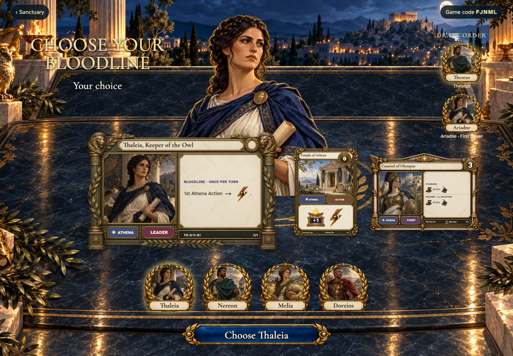</a></td>
<td valign="top"><a href="../../screenshots/follow-a-friend-from-the-first-temple-through-worship-and-cleanup-while-reading-the-public-table/002-draft-phone-darwin.png">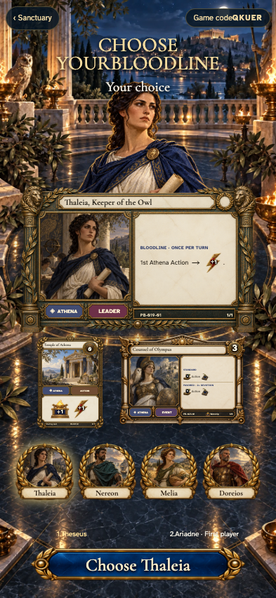</a></td>
</tr>
</table>

Tabletop · 3840 × 2160 — expand screenshot

<a href="../../screenshots/follow-a-friend-from-the-first-temple-through-worship-and-cleanup-while-reading-the-public-table/002-draft-tabletop-4k-darwin.png">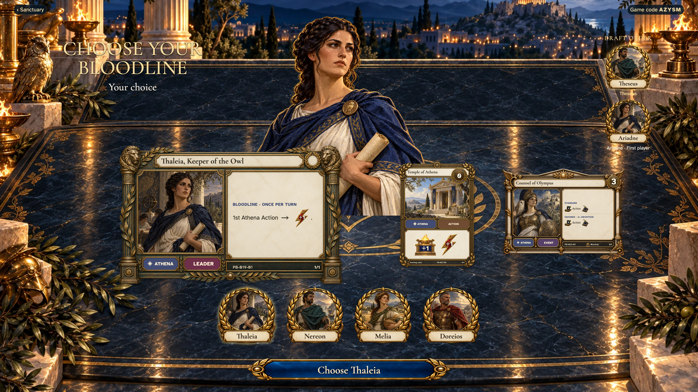</a>

- [x] Theseus chooses Thaleia first

## Ariadne chooses Nereon and the Temple of Poseidon

Viewpoint: **Ariadne**.

<table>
<tr><th>Desktop · 1440 × 1000</th><th>Phone · 393 × 852</th></tr>
<tr>
<td valign="top"><a href="../../screenshots/follow-a-friend-from-the-first-temple-through-worship-and-cleanup-while-reading-the-public-table/003-nereon-desktop-darwin.png">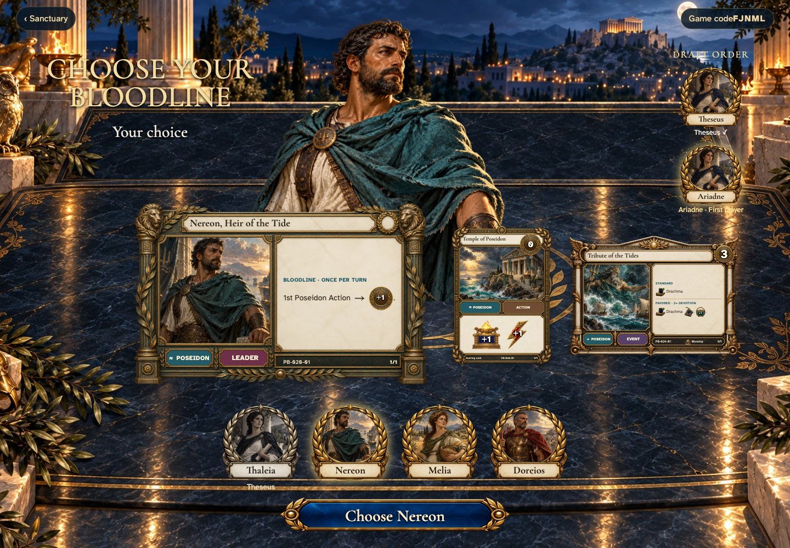</a></td>
<td valign="top"><a href="../../screenshots/follow-a-friend-from-the-first-temple-through-worship-and-cleanup-while-reading-the-public-table/003-nereon-phone-darwin.png">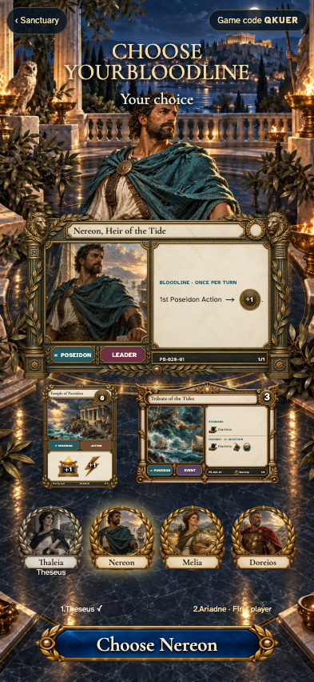</a></td>
</tr>
</table>

Tabletop · 3840 × 2160 — expand screenshot

<a href="../../screenshots/follow-a-friend-from-the-first-temple-through-worship-and-cleanup-while-reading-the-public-table/003-nereon-tabletop-4k-darwin.png">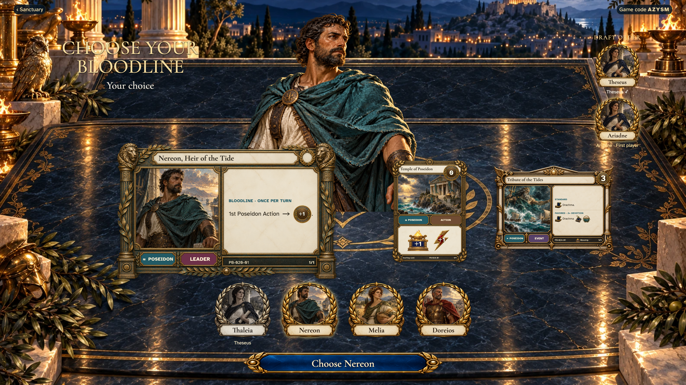</a>

- [x] Ariadne chooses Nereon and the Temple of Poseidon

## Ariadne holds her Temple and four Obols

Viewpoint: **Ariadne**.

<table>
<tr><th>Desktop · 1440 × 1000</th><th>Phone · 393 × 852</th></tr>
<tr>
<td valign="top"><a href="../../screenshots/follow-a-friend-from-the-first-temple-through-worship-and-cleanup-while-reading-the-public-table/004-opening-desktop-darwin.png">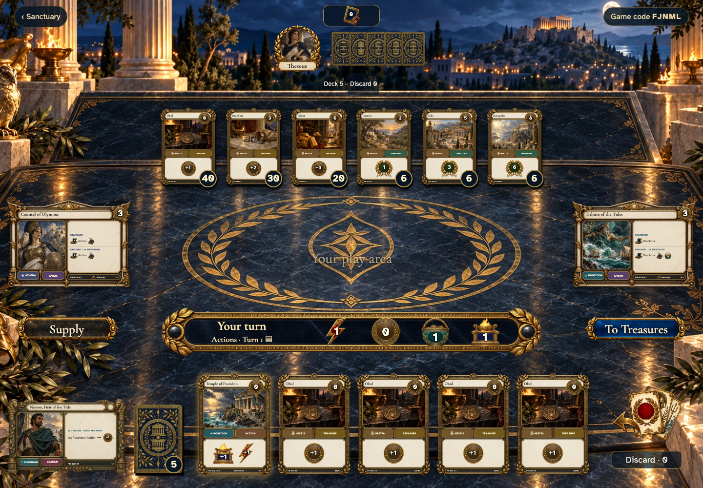</a></td>
<td valign="top"><a href="../../screenshots/follow-a-friend-from-the-first-temple-through-worship-and-cleanup-while-reading-the-public-table/004-opening-phone-darwin.png">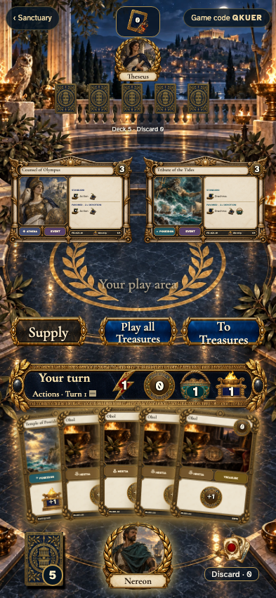</a></td>
</tr>
</table>

Tabletop · 3840 × 2160 — expand screenshot

<a href="../../screenshots/follow-a-friend-from-the-first-temple-through-worship-and-cleanup-while-reading-the-public-table/004-opening-tabletop-4k-darwin.png">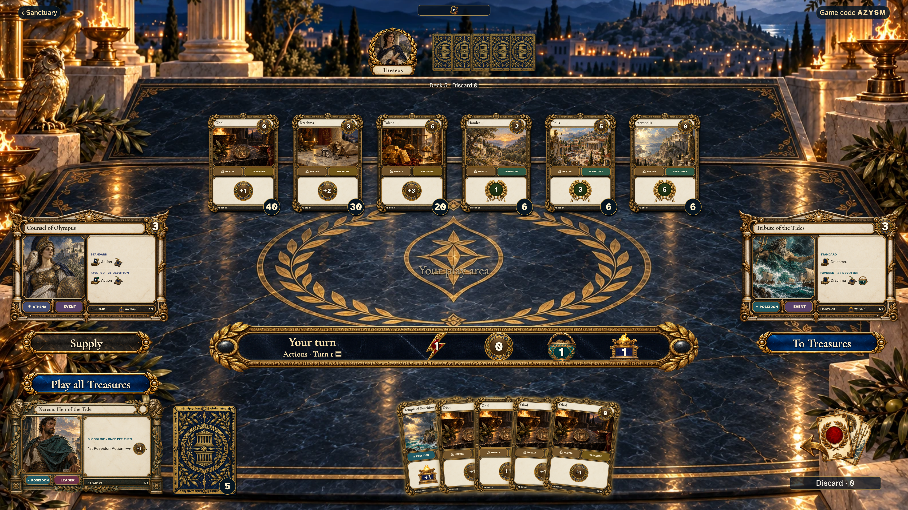</a>

- [x] Ariadne holds her Temple and four Obols

## Theseus sees whose turn it is and only common backs for Ariadne’s hand

Viewpoint: **Theseus**.

<table>
<tr><th>Desktop · 1440 × 1000</th><th>Phone · 393 × 852</th></tr>
<tr>
<td valign="top"><a href="../../screenshots/follow-a-friend-from-the-first-temple-through-worship-and-cleanup-while-reading-the-public-table/005-observer-desktop-darwin.png">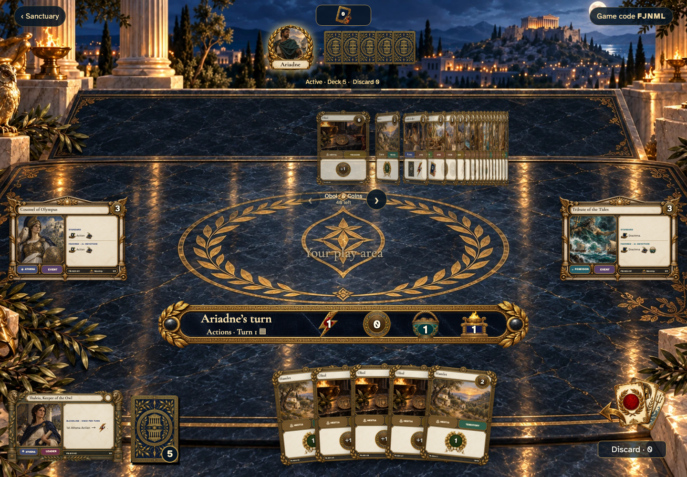</a></td>
<td valign="top"><a href="../../screenshots/follow-a-friend-from-the-first-temple-through-worship-and-cleanup-while-reading-the-public-table/005-observer-phone-darwin.png">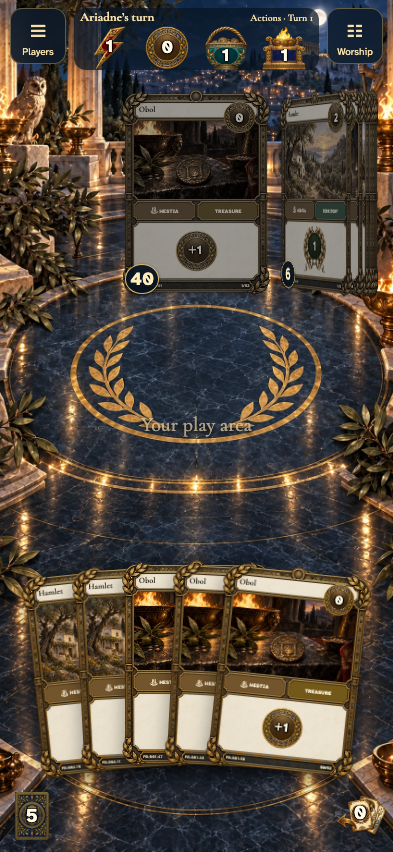</a></td>
</tr>
</table>

Tabletop · 3840 × 2160 — expand screenshot

<a href="../../screenshots/follow-a-friend-from-the-first-temple-through-worship-and-cleanup-while-reading-the-public-table/005-observer-tabletop-4k-darwin.png">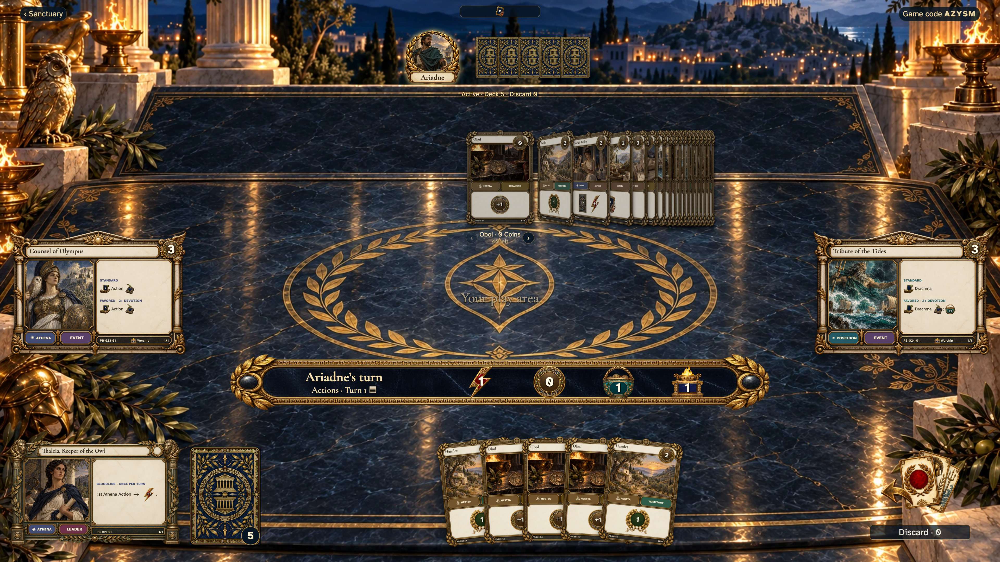</a>

- [x] Theseus sees whose turn it is and only common backs for Ariadne’s hand

## Ariadne reads her Temple before playing it

Viewpoint: **Ariadne**.

<table>
<tr><th>Desktop · 1440 × 1000</th><th>Phone · 393 × 852</th></tr>
<tr>
<td valign="top"><a href="../../screenshots/follow-a-friend-from-the-first-temple-through-worship-and-cleanup-while-reading-the-public-table/006-temple-desktop-darwin.png">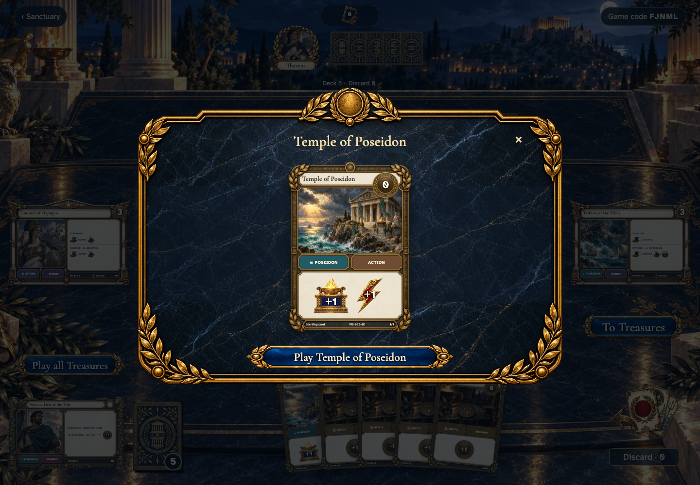</a></td>
<td valign="top"><a href="../../screenshots/follow-a-friend-from-the-first-temple-through-worship-and-cleanup-while-reading-the-public-table/006-temple-phone-darwin.png">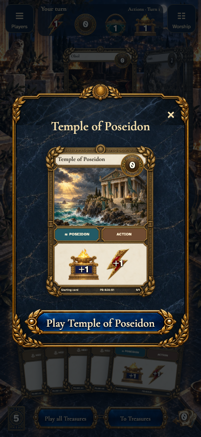</a></td>
</tr>
</table>

Tabletop · 3840 × 2160 — expand screenshot

<a href="../../screenshots/follow-a-friend-from-the-first-temple-through-worship-and-cleanup-while-reading-the-public-table/006-temple-tabletop-4k-darwin.png">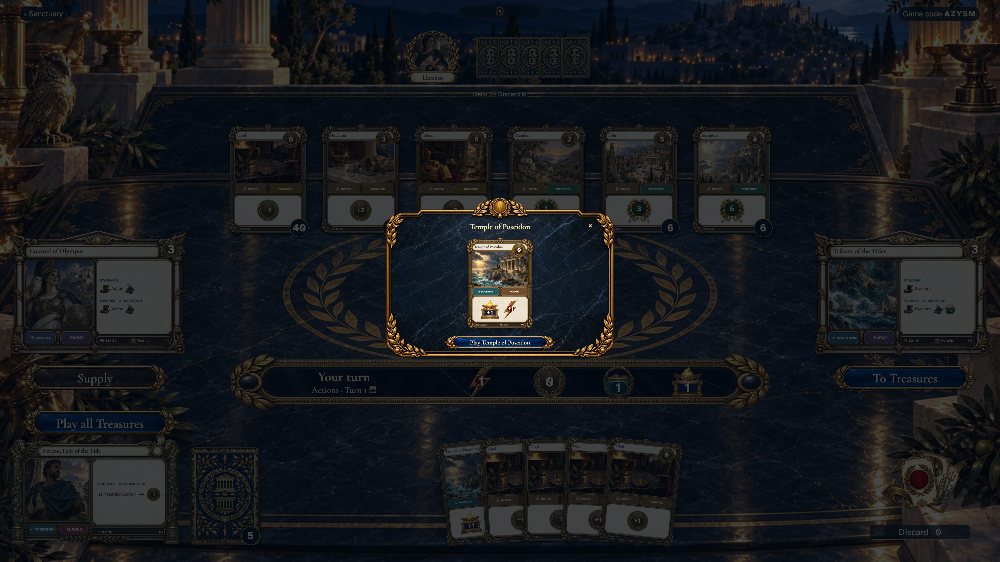</a>

- [x] Ariadne reads her Temple before playing it

## Theseus sees the Temple, Nereon’s blessing, and the resulting Coin

Viewpoint: **Theseus**.

<table>
<tr><th>Desktop · 1440 × 1000</th><th>Phone · 393 × 852</th></tr>
<tr>
<td valign="top"><a href="../../screenshots/follow-a-friend-from-the-first-temple-through-worship-and-cleanup-while-reading-the-public-table/007-played-desktop-darwin.png">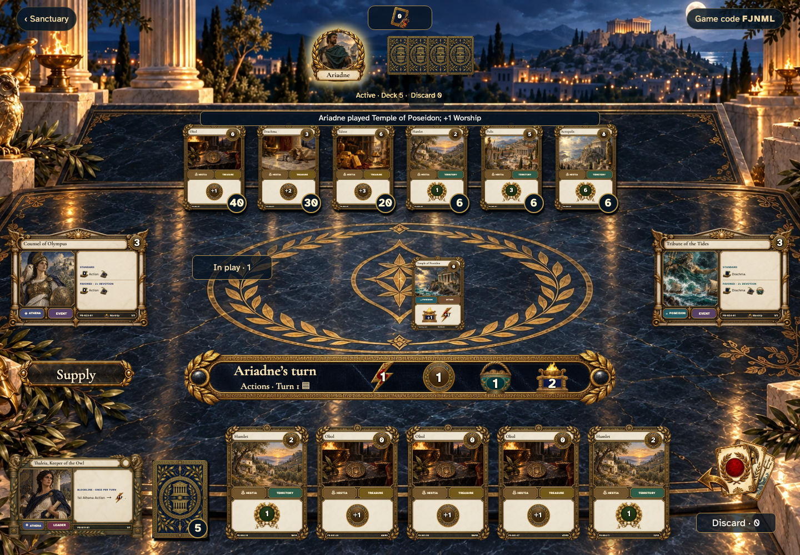</a></td>
<td valign="top"><a href="../../screenshots/follow-a-friend-from-the-first-temple-through-worship-and-cleanup-while-reading-the-public-table/007-played-phone-darwin.png">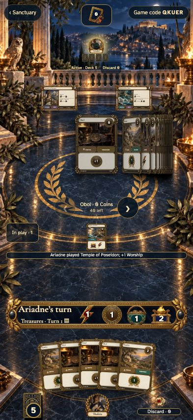</a></td>
</tr>
</table>

Tabletop · 3840 × 2160 — expand screenshot

<a href="../../screenshots/follow-a-friend-from-the-first-temple-through-worship-and-cleanup-while-reading-the-public-table/007-played-tabletop-4k-darwin.png">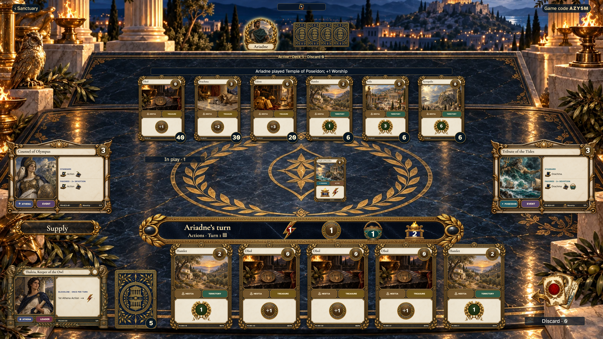</a>

- [x] Theseus sees the Temple, Nereon’s blessing, and the resulting Coin

## The Chronicle keeps the played Temple before the leader’s blessing

Viewpoint: **Theseus**.

<table>
<tr><th>Desktop · 1440 × 1000</th><th>Phone · 393 × 852</th></tr>
<tr>
<td valign="top"><a href="../../screenshots/follow-a-friend-from-the-first-temple-through-worship-and-cleanup-while-reading-the-public-table/008-chronicle-desktop-darwin.png">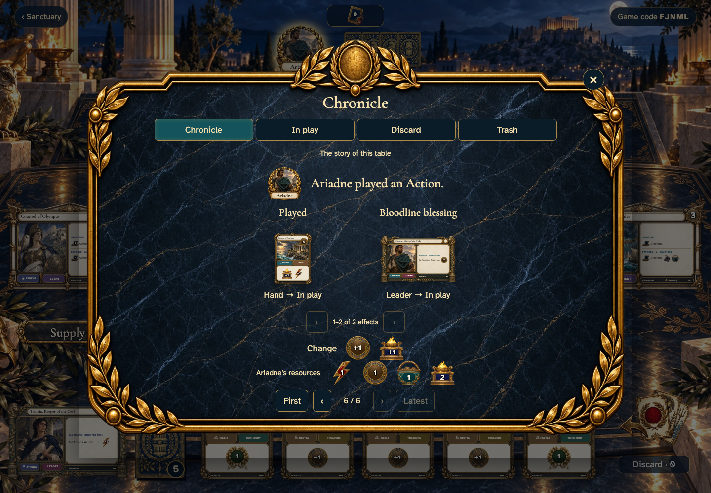</a></td>
<td valign="top"><a href="../../screenshots/follow-a-friend-from-the-first-temple-through-worship-and-cleanup-while-reading-the-public-table/008-chronicle-phone-darwin.png">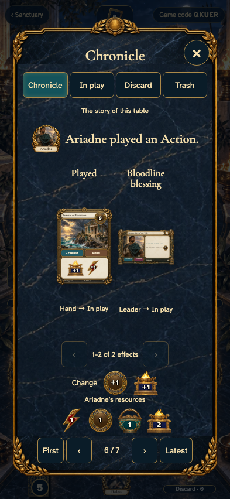</a></td>
</tr>
</table>

Tabletop · 3840 × 2160 — expand screenshot

<a href="../../screenshots/follow-a-friend-from-the-first-temple-through-worship-and-cleanup-while-reading-the-public-table/008-chronicle-tabletop-4k-darwin.png">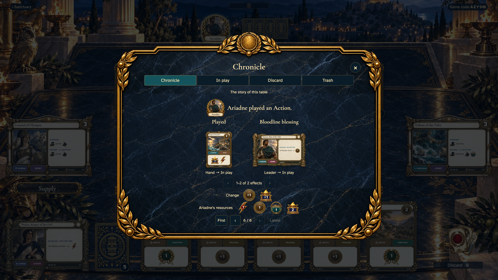</a>

- [x] The Chronicle keeps the played Temple before the leader’s blessing

## A public card opens at reading size without offering a play command

Viewpoint: **Theseus**.

<table>
<tr><th>Desktop · 1440 × 1000</th><th>Phone · 393 × 852</th></tr>
<tr>
<td valign="top"><a href="../../screenshots/follow-a-friend-from-the-first-temple-through-worship-and-cleanup-while-reading-the-public-table/009-public-inspector-desktop-darwin.png">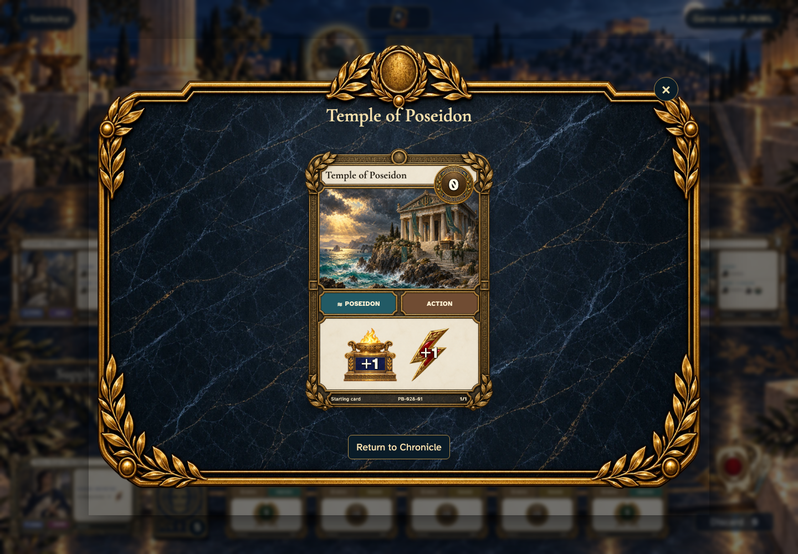</a></td>
<td valign="top"><a href="../../screenshots/follow-a-friend-from-the-first-temple-through-worship-and-cleanup-while-reading-the-public-table/009-public-inspector-phone-darwin.png">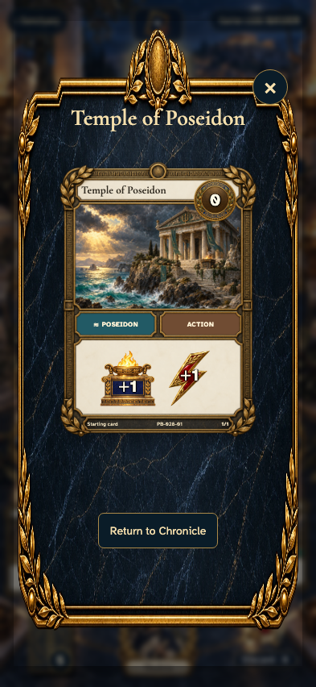</a></td>
</tr>
</table>

Tabletop · 3840 × 2160 — expand screenshot

<a href="../../screenshots/follow-a-friend-from-the-first-temple-through-worship-and-cleanup-while-reading-the-public-table/009-public-inspector-tabletop-4k-darwin.png">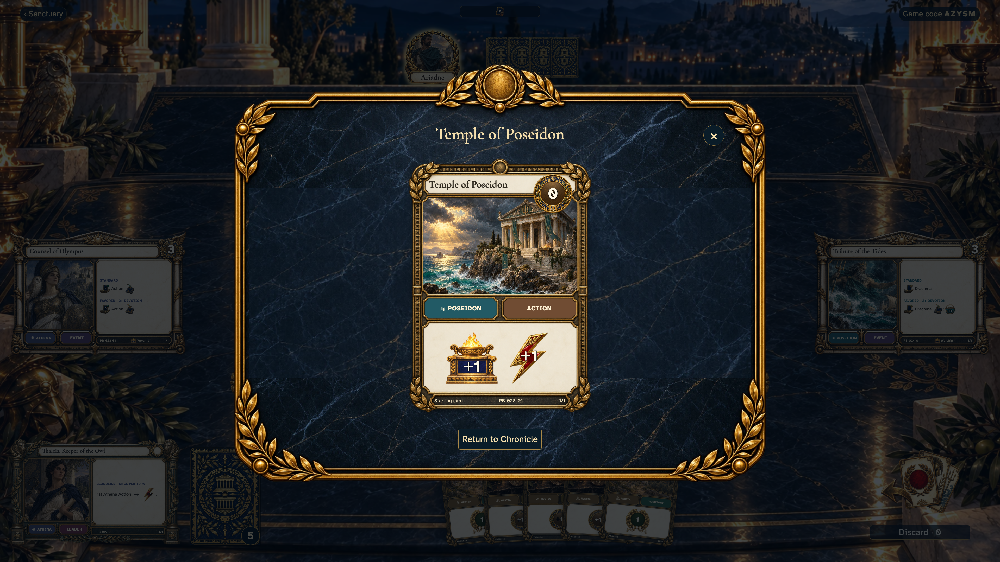</a>

- [x] A public card opens at reading size without offering a play command

## Escape returns to the same move and restores card focus

Viewpoint: **Theseus**.

<table>
<tr><th>Desktop · 1440 × 1000</th><th>Phone · 393 × 852</th></tr>
<tr>
<td valign="top"><a href="../../screenshots/follow-a-friend-from-the-first-temple-through-worship-and-cleanup-while-reading-the-public-table/010-return-history-desktop-darwin.png">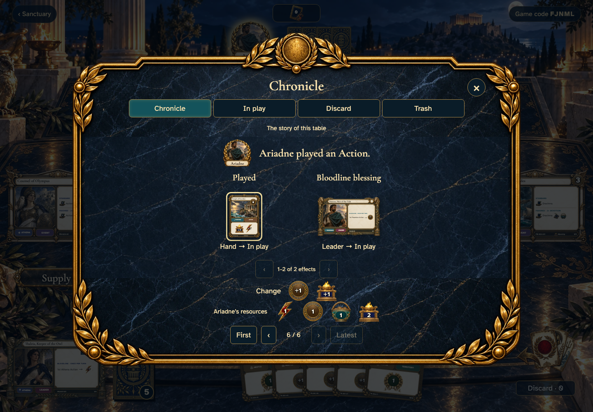</a></td>
<td valign="top"><a href="../../screenshots/follow-a-friend-from-the-first-temple-through-worship-and-cleanup-while-reading-the-public-table/010-return-history-phone-darwin.png">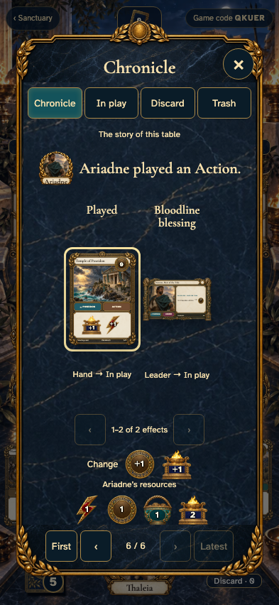</a></td>
</tr>
</table>

Tabletop · 3840 × 2160 — expand screenshot

<a href="../../screenshots/follow-a-friend-from-the-first-temple-through-worship-and-cleanup-while-reading-the-public-table/010-return-history-tabletop-4k-darwin.png">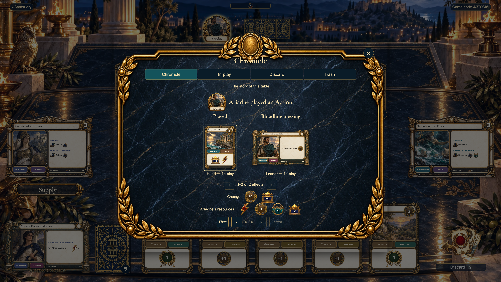</a>

- [x] Escape returns to the same move and restores card focus

## Ariadne plays Treasures while Theseus keeps his reading position

Viewpoint: **Theseus**.

<table>
<tr><th>Desktop · 1440 × 1000</th><th>Phone · 393 × 852</th></tr>
<tr>
<td valign="top"><a href="../../screenshots/follow-a-friend-from-the-first-temple-through-worship-and-cleanup-while-reading-the-public-table/011-new-move-desktop-darwin.png">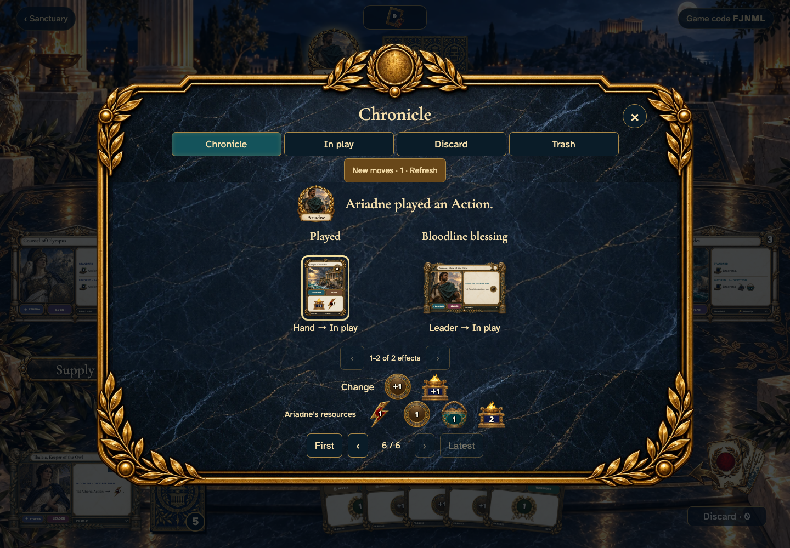</a></td>
<td valign="top"><a href="../../screenshots/follow-a-friend-from-the-first-temple-through-worship-and-cleanup-while-reading-the-public-table/011-new-move-phone-darwin.png">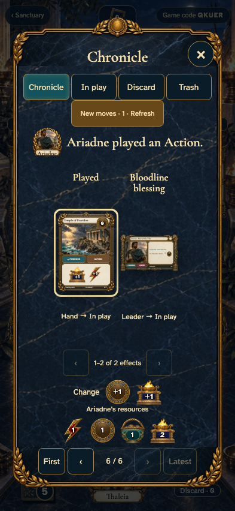</a></td>
</tr>
</table>

Tabletop · 3840 × 2160 — expand screenshot

<a href="../../screenshots/follow-a-friend-from-the-first-temple-through-worship-and-cleanup-while-reading-the-public-table/011-new-move-tabletop-4k-darwin.png">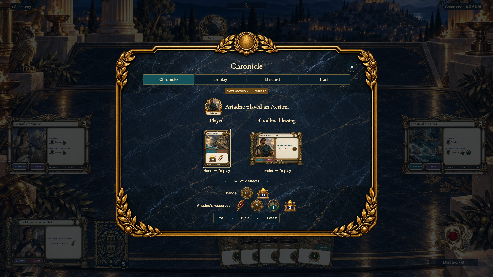</a>

- [x] Ariadne plays Treasures while Theseus keeps his reading position

## Ariadne plays four Obols and reaches five Coins

Viewpoint: **Ariadne**.

<table>
<tr><th>Desktop · 1440 × 1000</th><th>Phone · 393 × 852</th></tr>
<tr>
<td valign="top"><a href="../../screenshots/follow-a-friend-from-the-first-temple-through-worship-and-cleanup-while-reading-the-public-table/012-wealth-desktop-darwin.png">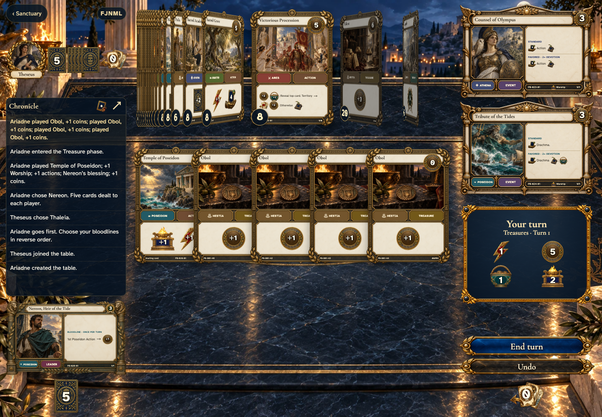</a></td>
<td valign="top"><a href="../../screenshots/follow-a-friend-from-the-first-temple-through-worship-and-cleanup-while-reading-the-public-table/012-wealth-phone-darwin.png">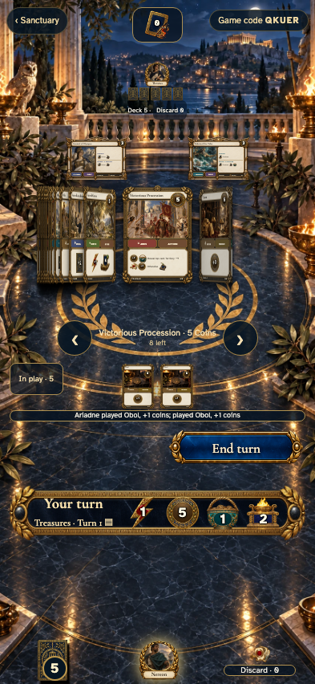</a></td>
</tr>
</table>

Tabletop · 3840 × 2160 — expand screenshot

<a href="../../screenshots/follow-a-friend-from-the-first-temple-through-worship-and-cleanup-while-reading-the-public-table/012-wealth-tabletop-4k-darwin.png">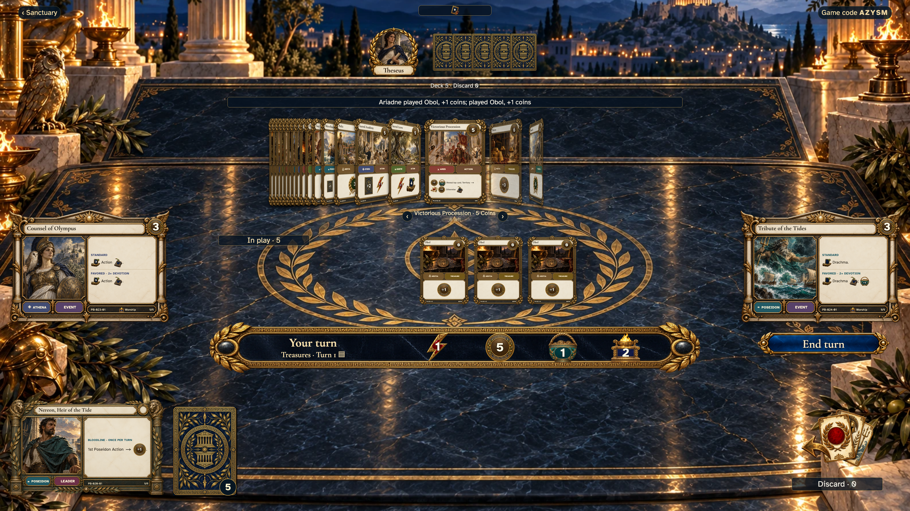</a>

- [x] Ariadne plays four Obols and reaches five Coins

## Theseus explicitly catches up to the played Treasures

Viewpoint: **Theseus**.

<table>
<tr><th>Desktop · 1440 × 1000</th><th>Phone · 393 × 852</th></tr>
<tr>
<td valign="top"><a href="../../screenshots/follow-a-friend-from-the-first-temple-through-worship-and-cleanup-while-reading-the-public-table/013-wealth-history-desktop-darwin.png">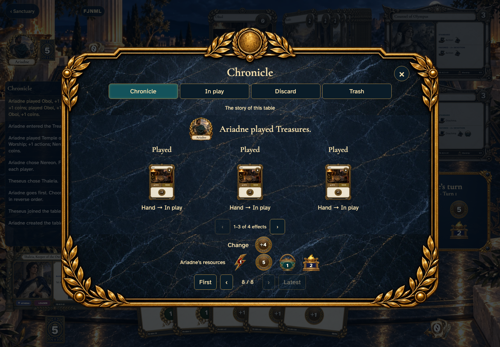</a></td>
<td valign="top"><a href="../../screenshots/follow-a-friend-from-the-first-temple-through-worship-and-cleanup-while-reading-the-public-table/013-wealth-history-phone-darwin.png">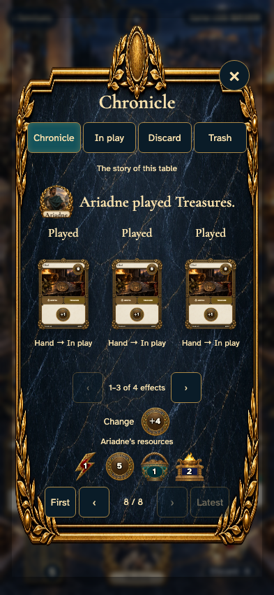</a></td>
</tr>
</table>

Tabletop · 3840 × 2160 — expand screenshot

<a href="../../screenshots/follow-a-friend-from-the-first-temple-through-worship-and-cleanup-while-reading-the-public-table/013-wealth-history-tabletop-4k-darwin.png">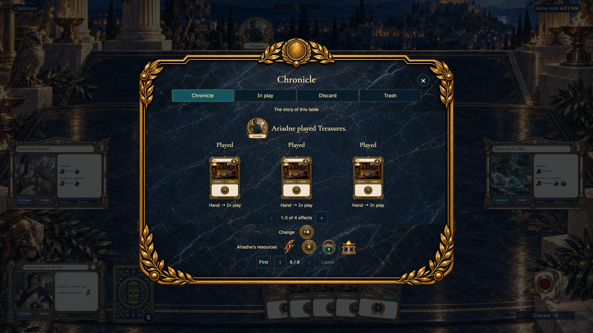</a>

- [x] Theseus explicitly catches up to the played Treasures

## Every Treasure remains reachable at the end of the move

Viewpoint: **Theseus**.

<table>
<tr><th>Desktop · 1440 × 1000</th><th>Phone · 393 × 852</th></tr>
<tr>
<td valign="top"><a href="../../screenshots/follow-a-friend-from-the-first-temple-through-worship-and-cleanup-while-reading-the-public-table/014-last-effect-desktop-darwin.png">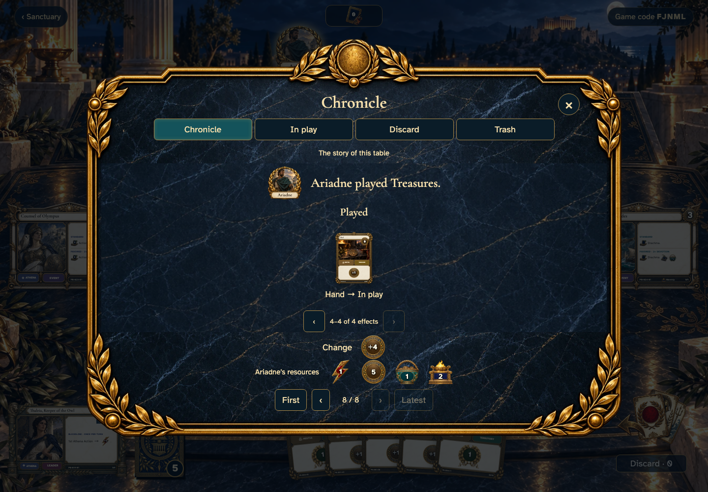</a></td>
<td valign="top"><a href="../../screenshots/follow-a-friend-from-the-first-temple-through-worship-and-cleanup-while-reading-the-public-table/014-last-effect-phone-darwin.png">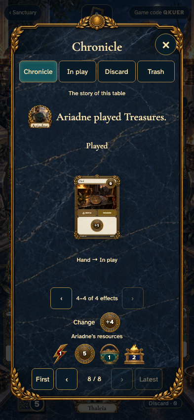</a></td>
</tr>
</table>

Tabletop · 3840 × 2160 — expand screenshot

<a href="../../screenshots/follow-a-friend-from-the-first-temple-through-worship-and-cleanup-while-reading-the-public-table/014-last-effect-tabletop-4k-darwin.png">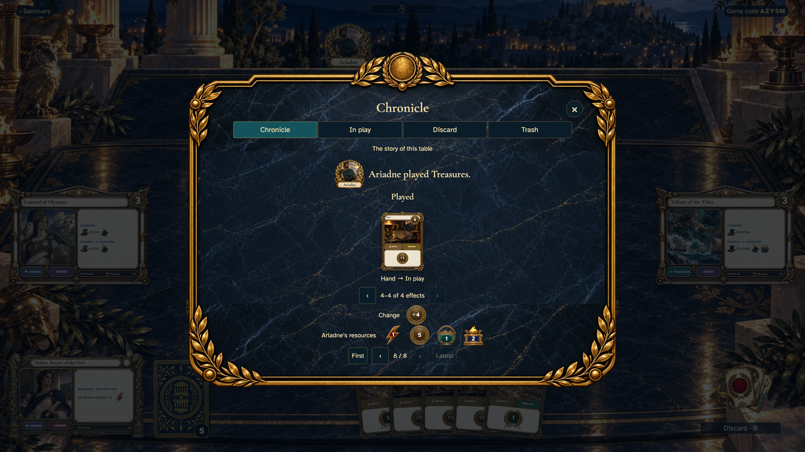</a>

- [x] Every Treasure remains reachable at the end of the move

## Ariadne’s empty discard and hidden deck count are explicit

Viewpoint: **Theseus**.

<table>
<tr><th>Desktop · 1440 × 1000</th><th>Phone · 393 × 852</th></tr>
<tr>
<td valign="top"><a href="../../screenshots/follow-a-friend-from-the-first-temple-through-worship-and-cleanup-while-reading-the-public-table/015-empty-pile-desktop-darwin.png">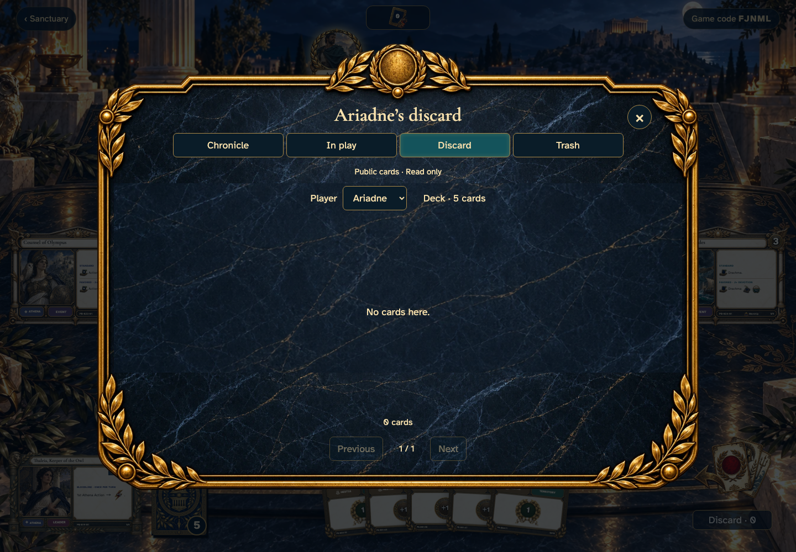</a></td>
<td valign="top"><a href="../../screenshots/follow-a-friend-from-the-first-temple-through-worship-and-cleanup-while-reading-the-public-table/015-empty-pile-phone-darwin.png">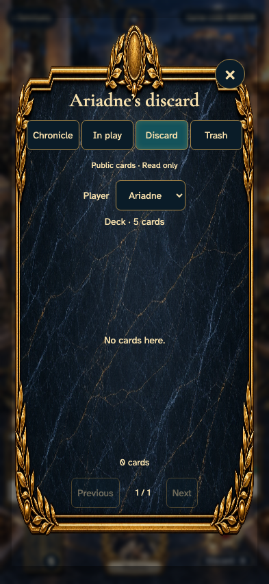</a></td>
</tr>
</table>

Tabletop · 3840 × 2160 — expand screenshot

<a href="../../screenshots/follow-a-friend-from-the-first-temple-through-worship-and-cleanup-while-reading-the-public-table/015-empty-pile-tabletop-4k-darwin.png">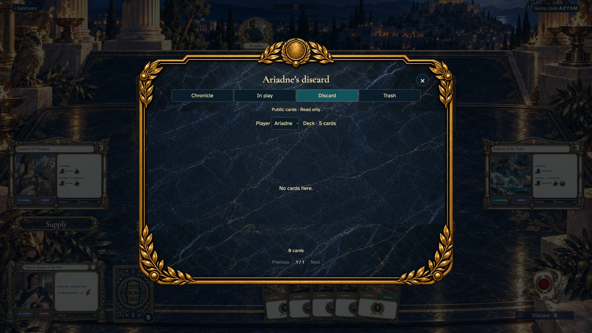</a>

- [x] Ariadne’s empty discard and hidden deck count are explicit

## Ariadne chooses a Hamlet for two Coins

Viewpoint: **Ariadne**.

<table>
<tr><th>Desktop · 1440 × 1000</th><th>Phone · 393 × 852</th></tr>
<tr>
<td valign="top"><a href="../../screenshots/follow-a-friend-from-the-first-temple-through-worship-and-cleanup-while-reading-the-public-table/016-purchase-desktop-darwin.png">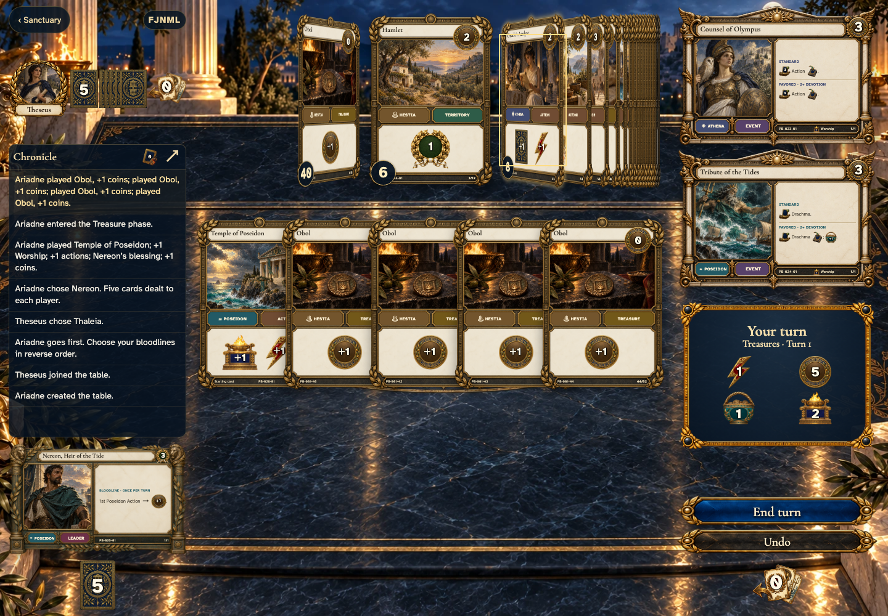</a></td>
<td valign="top"><a href="../../screenshots/follow-a-friend-from-the-first-temple-through-worship-and-cleanup-while-reading-the-public-table/016-purchase-phone-darwin.png">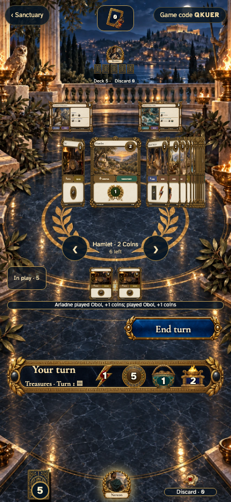</a></td>
</tr>
</table>

Tabletop · 3840 × 2160 — expand screenshot

<a href="../../screenshots/follow-a-friend-from-the-first-temple-through-worship-and-cleanup-while-reading-the-public-table/016-purchase-tabletop-4k-darwin.png">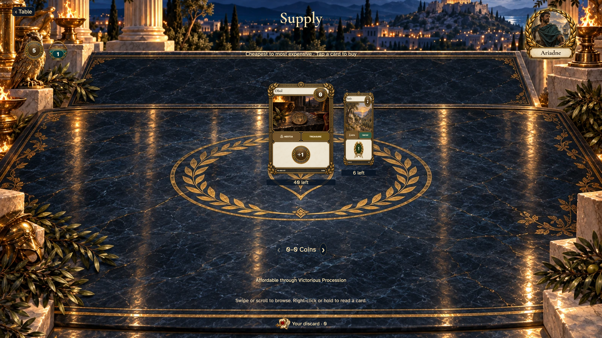</a>

- [x] Ariadne chooses a Hamlet for two Coins

## Ariadne’s purchase goes to discard and leaves three Coins

Viewpoint: **Ariadne**.

<table>
<tr><th>Desktop · 1440 × 1000</th><th>Phone · 393 × 852</th></tr>
<tr>
<td valign="top"><a href="../../screenshots/follow-a-friend-from-the-first-temple-through-worship-and-cleanup-while-reading-the-public-table/017-bought-desktop-darwin.png">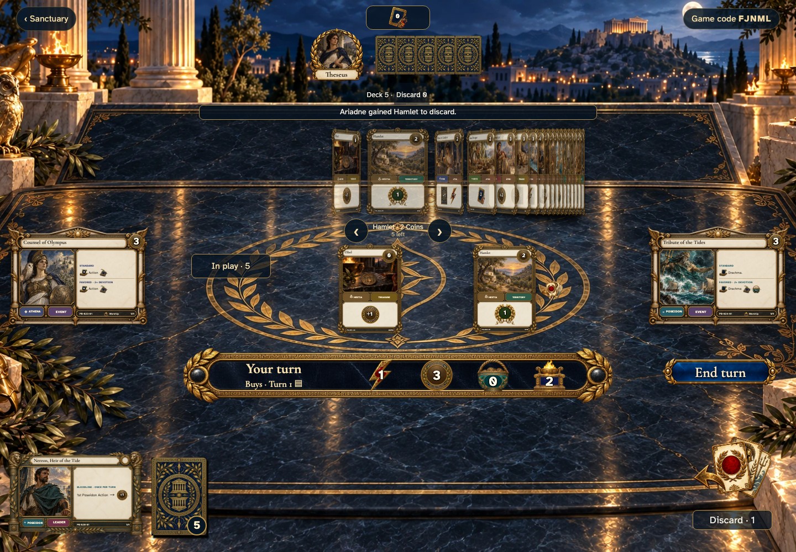</a></td>
<td valign="top"><a href="../../screenshots/follow-a-friend-from-the-first-temple-through-worship-and-cleanup-while-reading-the-public-table/017-bought-phone-darwin.png">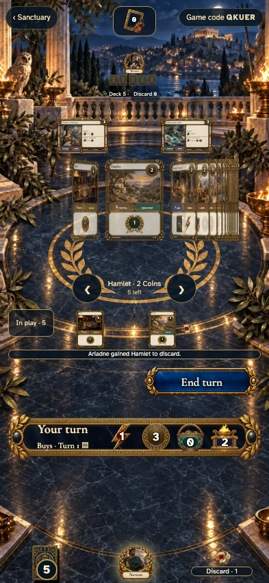</a></td>
</tr>
</table>

Tabletop · 3840 × 2160 — expand screenshot

<a href="../../screenshots/follow-a-friend-from-the-first-temple-through-worship-and-cleanup-while-reading-the-public-table/017-bought-tabletop-4k-darwin.png">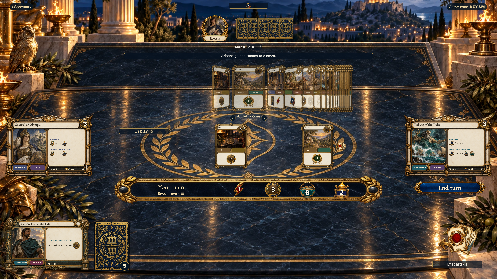</a>

- [x] Ariadne’s purchase goes to discard and leaves three Coins

## Incoming cards do not reorder or replace the open tray

Viewpoint: **Theseus**.

<table>
<tr><th>Desktop · 1440 × 1000</th><th>Phone · 393 × 852</th></tr>
<tr>
<td valign="top"><a href="../../screenshots/follow-a-friend-from-the-first-temple-through-worship-and-cleanup-while-reading-the-public-table/018-stable-pile-desktop-darwin.png">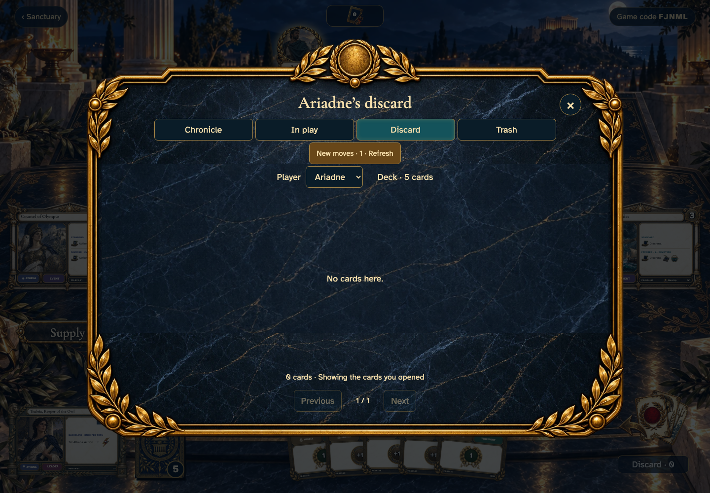</a></td>
<td valign="top"><a href="../../screenshots/follow-a-friend-from-the-first-temple-through-worship-and-cleanup-while-reading-the-public-table/018-stable-pile-phone-darwin.png">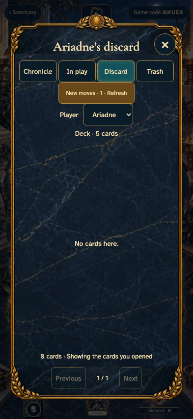</a></td>
</tr>
</table>

Tabletop · 3840 × 2160 — expand screenshot

<a href="../../screenshots/follow-a-friend-from-the-first-temple-through-worship-and-cleanup-while-reading-the-public-table/018-stable-pile-tabletop-4k-darwin.png">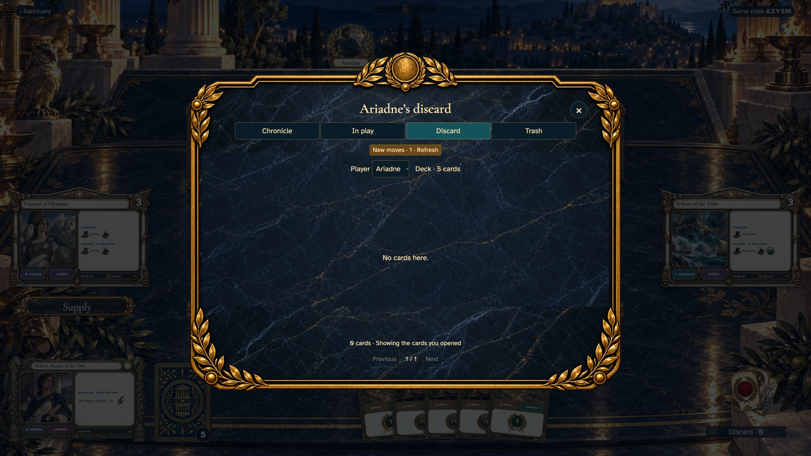</a>

- [x] Incoming cards do not reorder or replace the open tray

## Theseus finds the purchase beside the played cards

Viewpoint: **Theseus**.

<table>
<tr><th>Desktop · 1440 × 1000</th><th>Phone · 393 × 852</th></tr>
<tr>
<td valign="top"><a href="../../screenshots/follow-a-friend-from-the-first-temple-through-worship-and-cleanup-while-reading-the-public-table/019-refreshed-pile-desktop-darwin.png">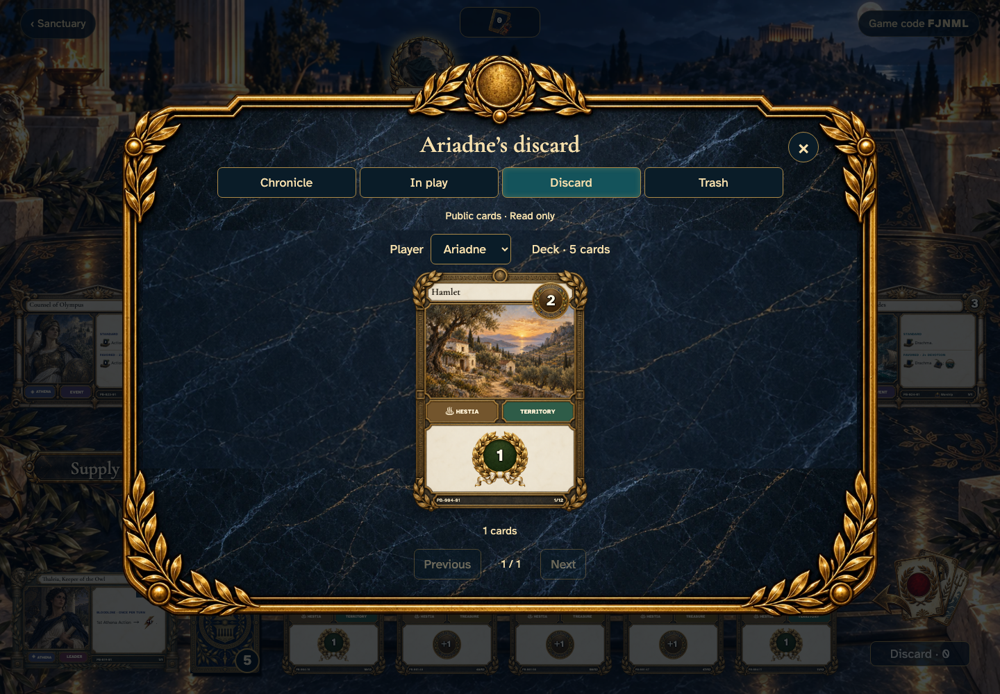</a></td>
<td valign="top"><a href="../../screenshots/follow-a-friend-from-the-first-temple-through-worship-and-cleanup-while-reading-the-public-table/019-refreshed-pile-phone-darwin.png">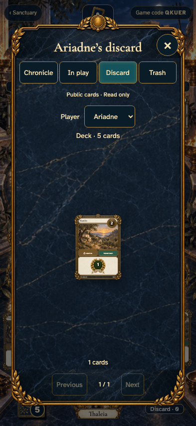</a></td>
</tr>
</table>

Tabletop · 3840 × 2160 — expand screenshot

<a href="../../screenshots/follow-a-friend-from-the-first-temple-through-worship-and-cleanup-while-reading-the-public-table/019-refreshed-pile-tabletop-4k-darwin.png">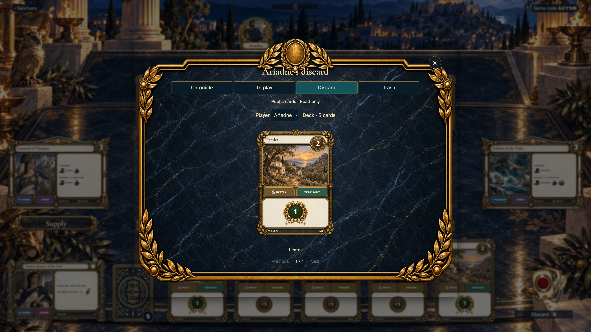</a>

- [x] Theseus finds the purchase beside the played cards

## The physical Hamlet copy can be read in full

Viewpoint: **Theseus**.

<table>
<tr><th>Desktop · 1440 × 1000</th><th>Phone · 393 × 852</th></tr>
<tr>
<td valign="top"><a href="../../screenshots/follow-a-friend-from-the-first-temple-through-worship-and-cleanup-while-reading-the-public-table/020-pile-inspection-desktop-darwin.png">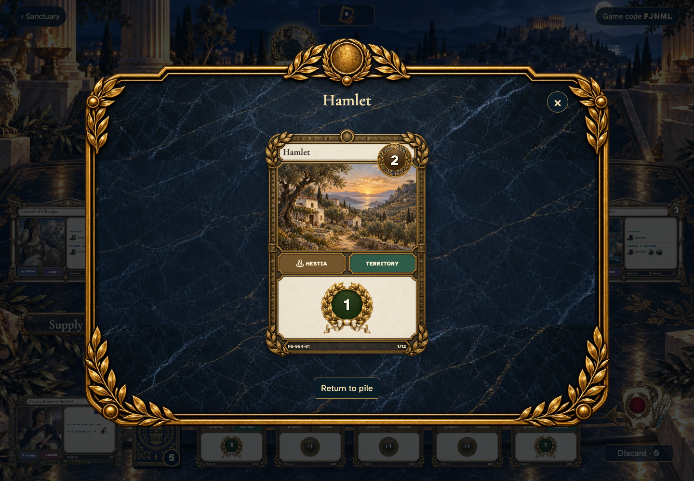</a></td>
<td valign="top"><a href="../../screenshots/follow-a-friend-from-the-first-temple-through-worship-and-cleanup-while-reading-the-public-table/020-pile-inspection-phone-darwin.png">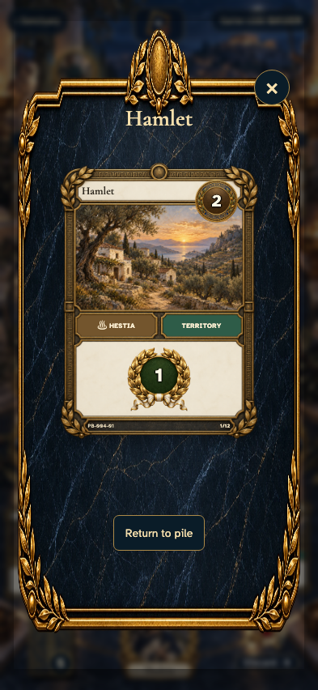</a></td>
</tr>
</table>

Tabletop · 3840 × 2160 — expand screenshot

<a href="../../screenshots/follow-a-friend-from-the-first-temple-through-worship-and-cleanup-while-reading-the-public-table/020-pile-inspection-tabletop-4k-darwin.png">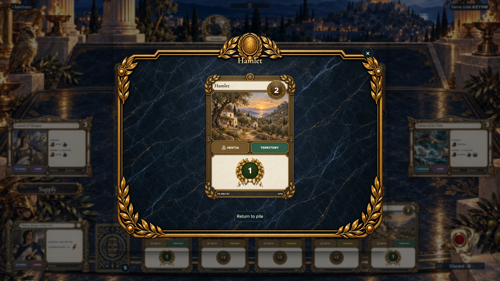</a>

- [x] The physical Hamlet copy can be read in full

## Five played cards and the purchase are available in a stable public tray

Viewpoint: **Theseus**.

<table>
<tr><th>Desktop · 1440 × 1000</th><th>Phone · 393 × 852</th></tr>
<tr>
<td valign="top"><a href="../../screenshots/follow-a-friend-from-the-first-temple-through-worship-and-cleanup-while-reading-the-public-table/021-play-pile-desktop-darwin.png">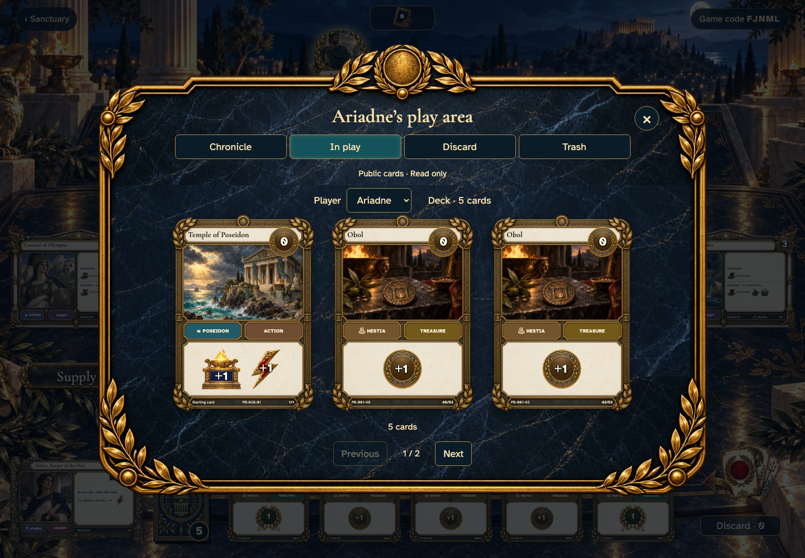</a></td>
<td valign="top"><a href="../../screenshots/follow-a-friend-from-the-first-temple-through-worship-and-cleanup-while-reading-the-public-table/021-play-pile-phone-darwin.png">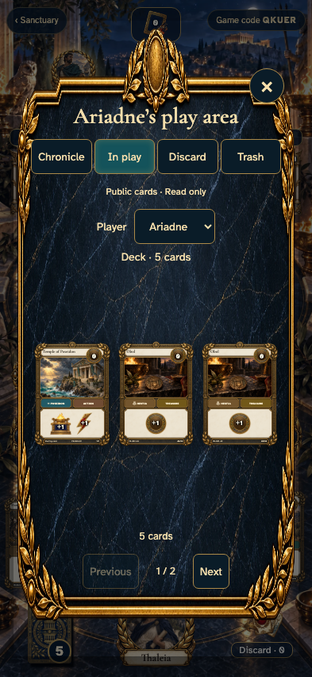</a></td>
</tr>
</table>

Tabletop · 3840 × 2160 — expand screenshot

<a href="../../screenshots/follow-a-friend-from-the-first-temple-through-worship-and-cleanup-while-reading-the-public-table/021-play-pile-tabletop-4k-darwin.png">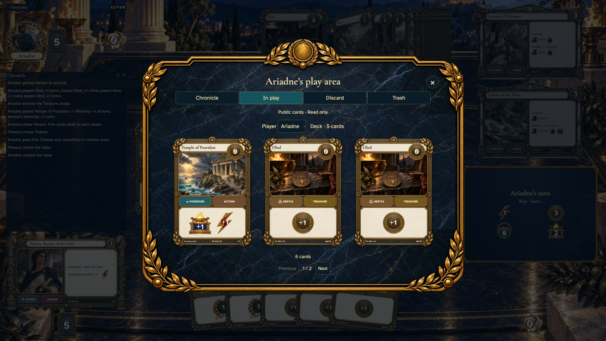</a>

- [x] Five played cards and the purchase are available in a stable public tray

## The remaining played cards and purchase are reachable without leaving the table

Viewpoint: **Theseus**.

<table>
<tr><th>Desktop · 1440 × 1000</th><th>Phone · 393 × 852</th></tr>
<tr>
<td valign="top"><a href="../../screenshots/follow-a-friend-from-the-first-temple-through-worship-and-cleanup-while-reading-the-public-table/022-last-pile-page-desktop-darwin.png">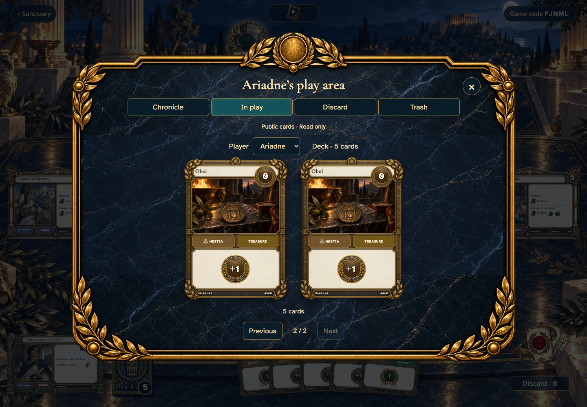</a></td>
<td valign="top"><a href="../../screenshots/follow-a-friend-from-the-first-temple-through-worship-and-cleanup-while-reading-the-public-table/022-last-pile-page-phone-darwin.png">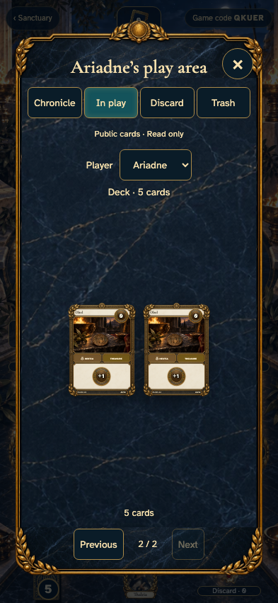</a></td>
</tr>
</table>

Tabletop · 3840 × 2160 — expand screenshot

<a href="../../screenshots/follow-a-friend-from-the-first-temple-through-worship-and-cleanup-while-reading-the-public-table/022-last-pile-page-tabletop-4k-darwin.png">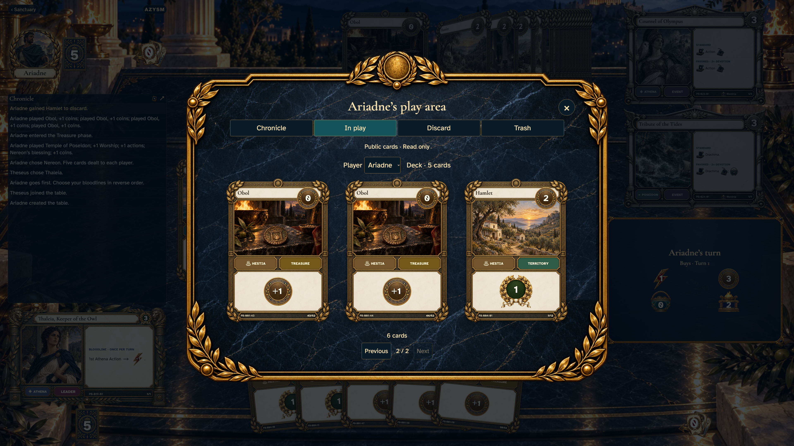</a>

- [x] The remaining played cards and purchase are reachable without leaving the table

## Ariadne can Worship Athena even after spending her last Buy

Viewpoint: **Ariadne**.

<table>
<tr><th>Desktop · 1440 × 1000</th><th>Phone · 393 × 852</th></tr>
<tr>
<td valign="top"><a href="../../screenshots/follow-a-friend-from-the-first-temple-through-worship-and-cleanup-while-reading-the-public-table/023-worship-desktop-darwin.png">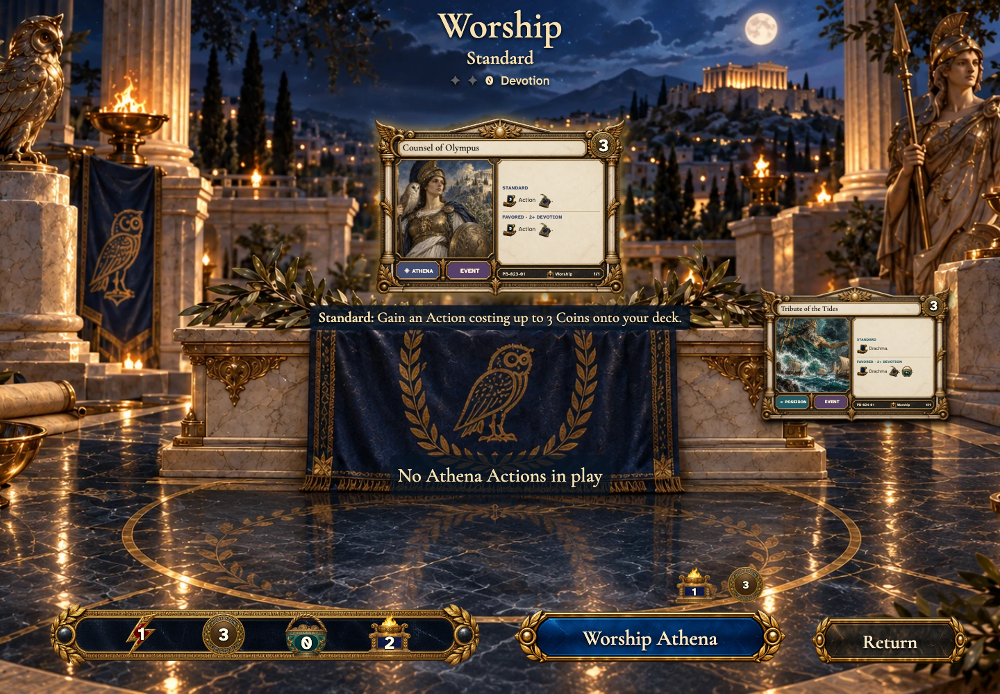</a></td>
<td valign="top"><a href="../../screenshots/follow-a-friend-from-the-first-temple-through-worship-and-cleanup-while-reading-the-public-table/023-worship-phone-darwin.png">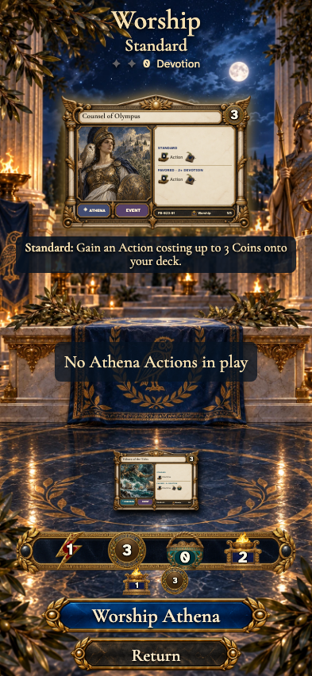</a></td>
</tr>
</table>

Tabletop · 3840 × 2160 — expand screenshot

<a href="../../screenshots/follow-a-friend-from-the-first-temple-through-worship-and-cleanup-while-reading-the-public-table/023-worship-tabletop-4k-darwin.png">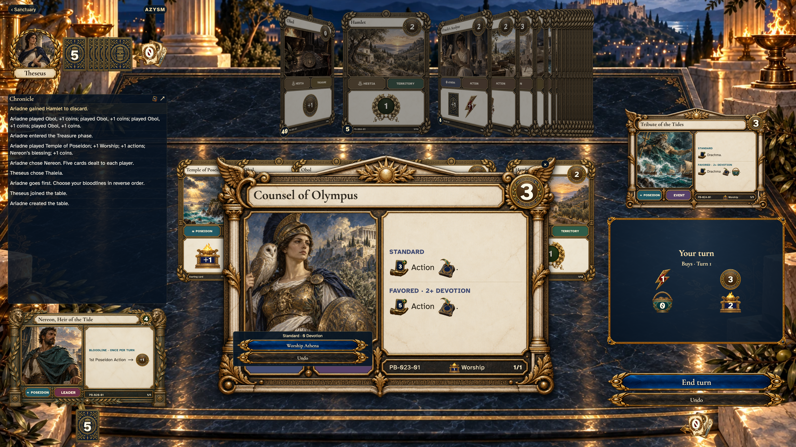</a>

- [x] Ariadne can Worship Athena even after spending her last Buy

## Ariadne pays for Worship and chooses a topdeck gain

Viewpoint: **Ariadne**.

<table>
<tr><th>Desktop · 1440 × 1000</th><th>Phone · 393 × 852</th></tr>
<tr>
<td valign="top"><a href="../../screenshots/follow-a-friend-from-the-first-temple-through-worship-and-cleanup-while-reading-the-public-table/024-gain-choice-desktop-darwin.png">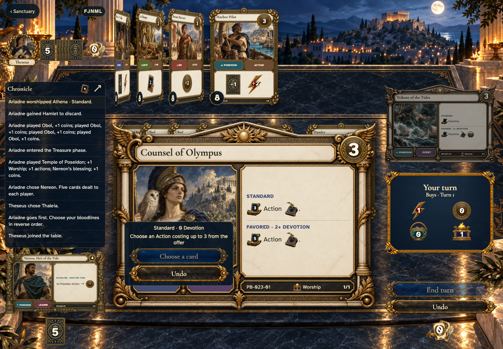</a></td>
<td valign="top"><a href="../../screenshots/follow-a-friend-from-the-first-temple-through-worship-and-cleanup-while-reading-the-public-table/024-gain-choice-phone-darwin.png">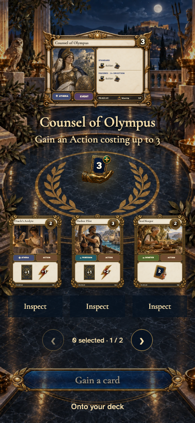</a></td>
</tr>
</table>

Tabletop · 3840 × 2160 — expand screenshot

<a href="../../screenshots/follow-a-friend-from-the-first-temple-through-worship-and-cleanup-while-reading-the-public-table/024-gain-choice-tabletop-4k-darwin.png">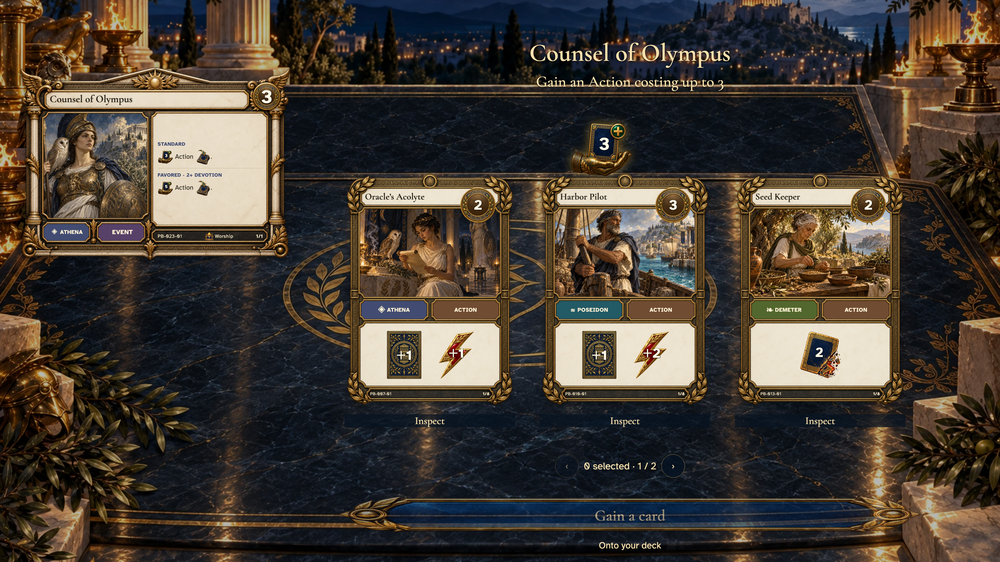</a>

- [x] Ariadne pays for Worship and chooses a topdeck gain

## Oracle’s Acolyte is selected as the gift from Athena

Viewpoint: **Ariadne**.

<table>
<tr><th>Desktop · 1440 × 1000</th><th>Phone · 393 × 852</th></tr>
<tr>
<td valign="top"><a href="../../screenshots/follow-a-friend-from-the-first-temple-through-worship-and-cleanup-while-reading-the-public-table/025-selected-gain-desktop-darwin.png">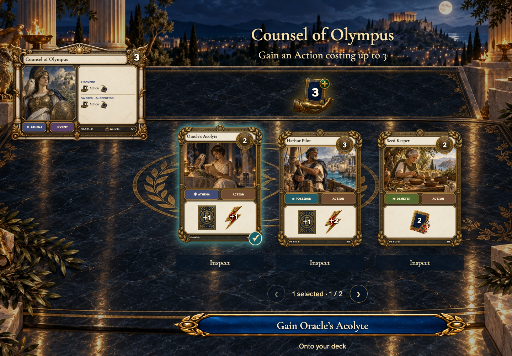</a></td>
<td valign="top"><a href="../../screenshots/follow-a-friend-from-the-first-temple-through-worship-and-cleanup-while-reading-the-public-table/025-selected-gain-phone-darwin.png">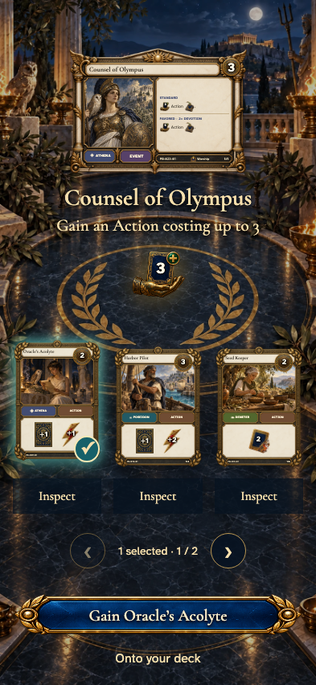</a></td>
</tr>
</table>

Tabletop · 3840 × 2160 — expand screenshot

<a href="../../screenshots/follow-a-friend-from-the-first-temple-through-worship-and-cleanup-while-reading-the-public-table/025-selected-gain-tabletop-4k-darwin.png">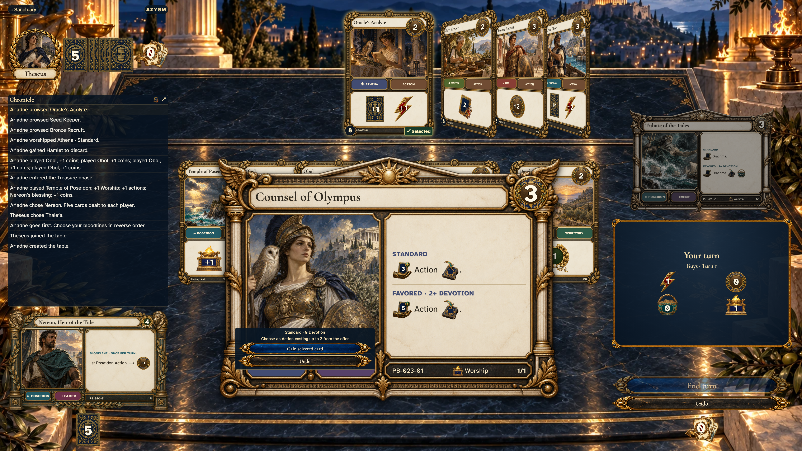</a>

- [x] Oracle’s Acolyte is selected as the gift from Athena

## Theseus remains on the same last pile page through Worship and its choice

Viewpoint: **Theseus**.

<table>
<tr><th>Desktop · 1440 × 1000</th><th>Phone · 393 × 852</th></tr>
<tr>
<td valign="top"><a href="../../screenshots/follow-a-friend-from-the-first-temple-through-worship-and-cleanup-while-reading-the-public-table/026-kept-page-desktop-darwin.png">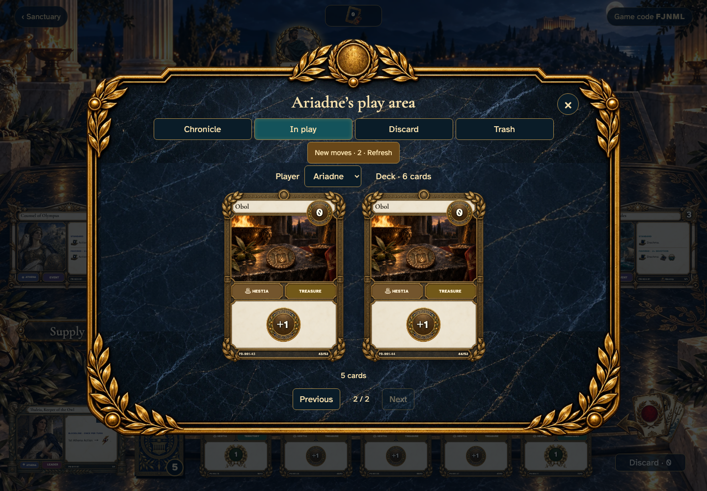</a></td>
<td valign="top"><a href="../../screenshots/follow-a-friend-from-the-first-temple-through-worship-and-cleanup-while-reading-the-public-table/026-kept-page-phone-darwin.png">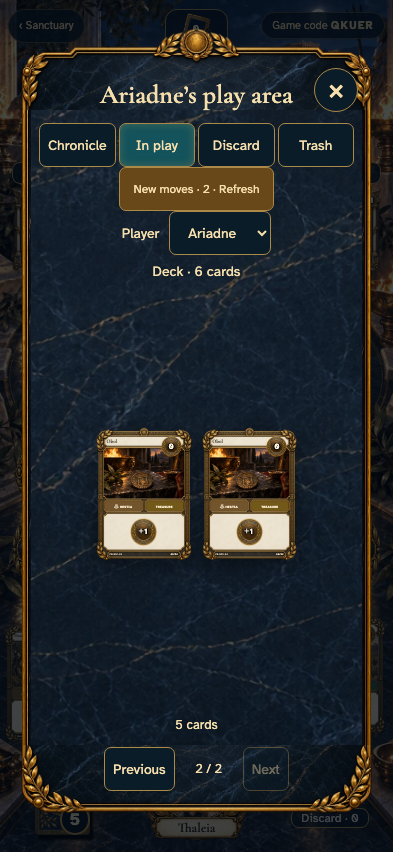</a></td>
</tr>
</table>

Tabletop · 3840 × 2160 — expand screenshot

<a href="../../screenshots/follow-a-friend-from-the-first-temple-through-worship-and-cleanup-while-reading-the-public-table/026-kept-page-tabletop-4k-darwin.png">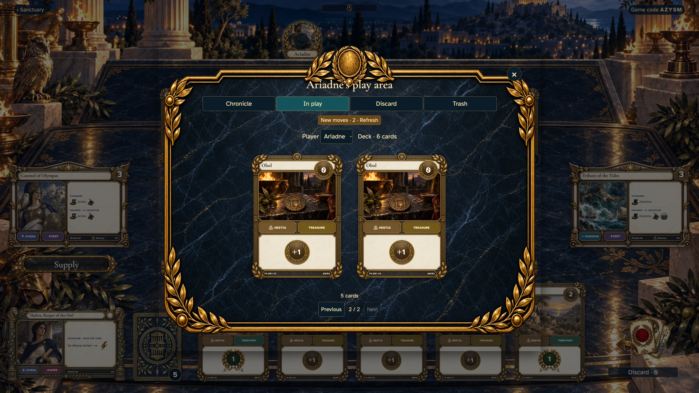</a>

- [x] Theseus remains on the same last pile page through Worship and its choice

## Athena’s gift names Supply and Deck as its actual path

Viewpoint: **Theseus**.

<table>
<tr><th>Desktop · 1440 × 1000</th><th>Phone · 393 × 852</th></tr>
<tr>
<td valign="top"><a href="../../screenshots/follow-a-friend-from-the-first-temple-through-worship-and-cleanup-while-reading-the-public-table/027-topdeck-desktop-darwin.png">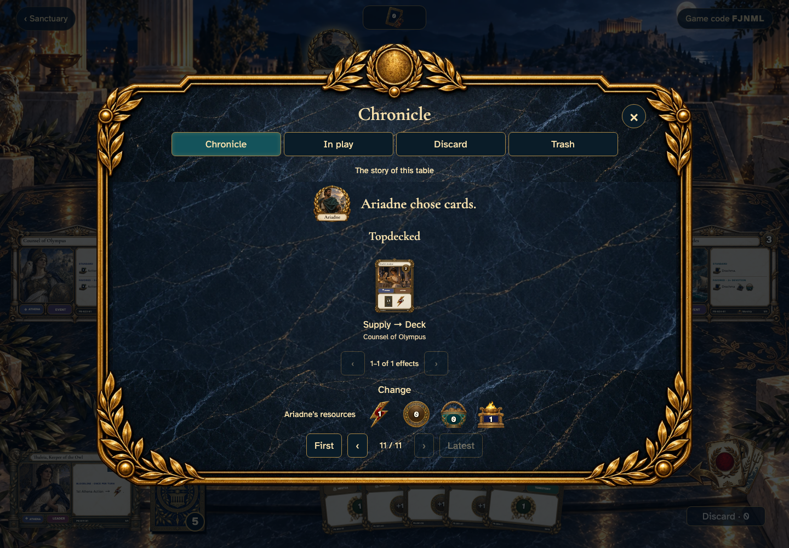</a></td>
<td valign="top"><a href="../../screenshots/follow-a-friend-from-the-first-temple-through-worship-and-cleanup-while-reading-the-public-table/027-topdeck-phone-darwin.png">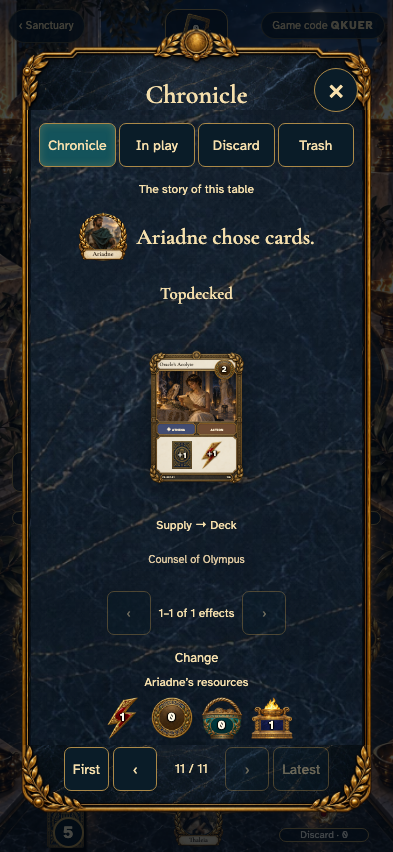</a></td>
</tr>
</table>

Tabletop · 3840 × 2160 — expand screenshot

<a href="../../screenshots/follow-a-friend-from-the-first-temple-through-worship-and-cleanup-while-reading-the-public-table/027-topdeck-tabletop-4k-darwin.png">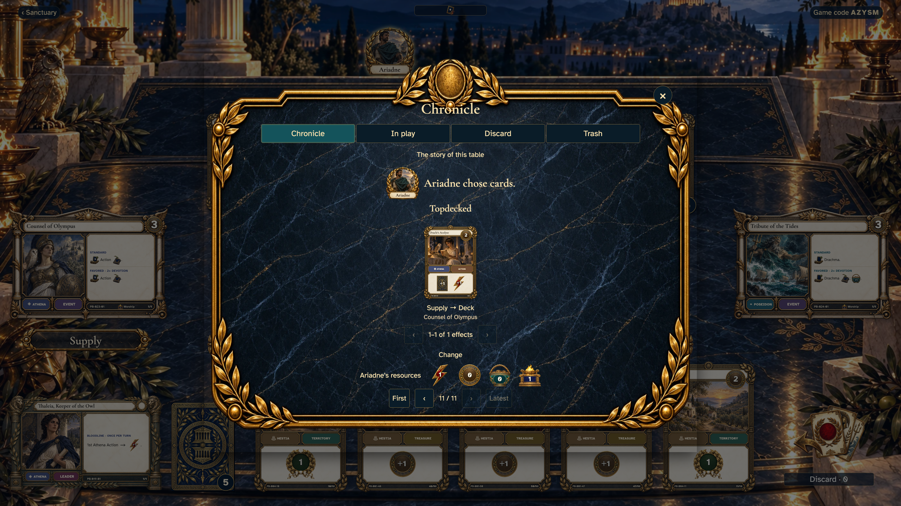</a>

- [x] Athena’s gift names Supply and Deck as its actual path

## The Chronicle also retains the shared market browsing

Viewpoint: **Theseus**.

<table>
<tr><th>Desktop · 1440 × 1000</th><th>Phone · 393 × 852</th></tr>
<tr>
<td valign="top"></td>
<td valign="top"><a href="../../screenshots/follow-a-friend-from-the-first-temple-through-worship-and-cleanup-while-reading-the-public-table/028-market-browse-0-phone-darwin.png">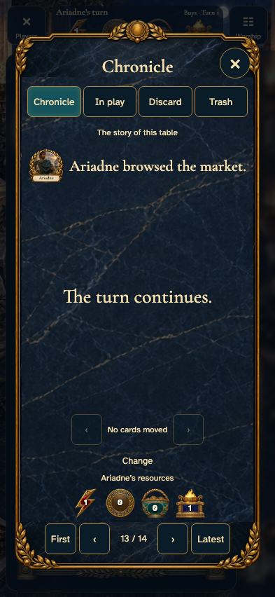</a></td>
</tr>
</table>

Tabletop · 3840 × 2160 — expand screenshot

<a href="../../screenshots/follow-a-friend-from-the-first-temple-through-worship-and-cleanup-while-reading-the-public-table/028-market-browse-0-tabletop-4k-darwin.png">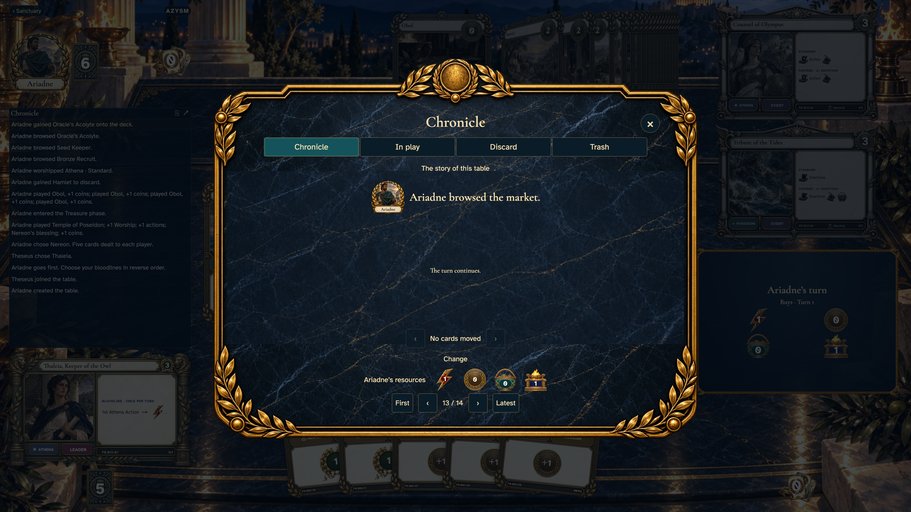</a>

- [x] The Chronicle also retains the shared market browsing

## The Chronicle also retains the shared market browsing

Viewpoint: **Theseus**.

<table>
<tr><th>Desktop · 1440 × 1000</th><th>Phone · 393 × 852</th></tr>
<tr>
<td valign="top"><a href="../../screenshots/follow-a-friend-from-the-first-temple-through-worship-and-cleanup-while-reading-the-public-table/029-market-browse-1-desktop-darwin.png">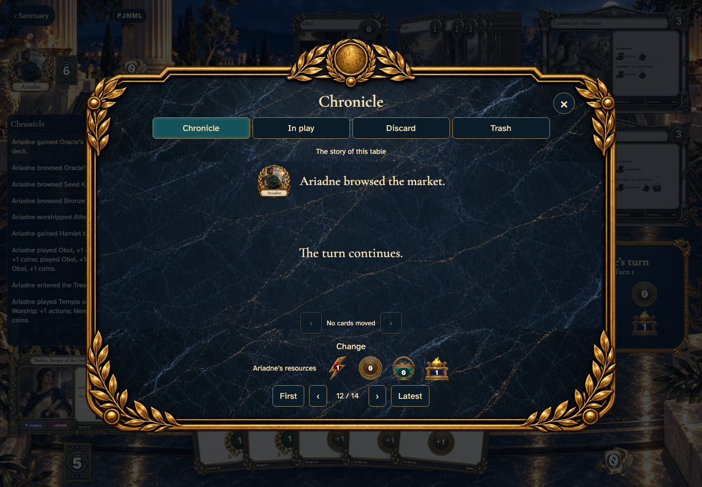</a></td>
<td valign="top"><a href="../../screenshots/follow-a-friend-from-the-first-temple-through-worship-and-cleanup-while-reading-the-public-table/029-market-browse-1-phone-darwin.png">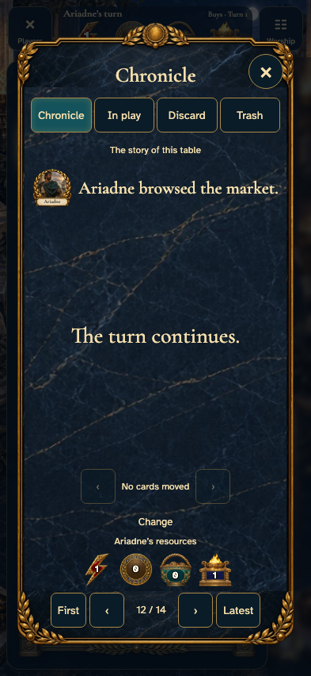</a></td>
</tr>
</table>

Tabletop · 3840 × 2160 — expand screenshot

- [x] The Chronicle also retains the shared market browsing

## The Chronicle also retains the shared market browsing

Viewpoint: **Theseus**.

<table>
<tr><th>Desktop · 1440 × 1000</th><th>Phone · 393 × 852</th></tr>
<tr>
<td valign="top"></td>
<td valign="top"></td>
</tr>
</table>

Tabletop · 3840 × 2160 — expand screenshot

- [x] The Chronicle also retains the shared market browsing

## Worship has its own altar source and exact payment

Viewpoint: **Theseus**.

<table>
<tr><th>Desktop · 1440 × 1000</th><th>Phone · 393 × 852</th></tr>
<tr>
<td valign="top"><a href="../../screenshots/follow-a-friend-from-the-first-temple-through-worship-and-cleanup-while-reading-the-public-table/031-payment-desktop-darwin.png">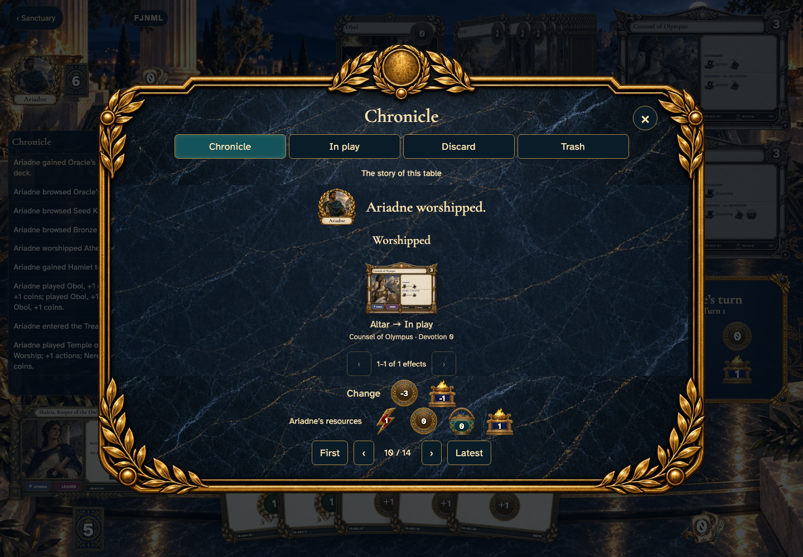</a></td>
<td valign="top"><a href="../../screenshots/follow-a-friend-from-the-first-temple-through-worship-and-cleanup-while-reading-the-public-table/031-payment-phone-darwin.png">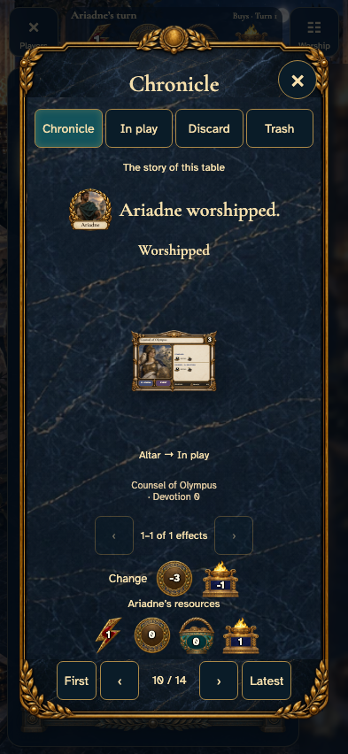</a></td>
</tr>
</table>

Tabletop · 3840 × 2160 — expand screenshot

<a href="../../screenshots/follow-a-friend-from-the-first-temple-through-worship-and-cleanup-while-reading-the-public-table/031-payment-tabletop-4k-darwin.png">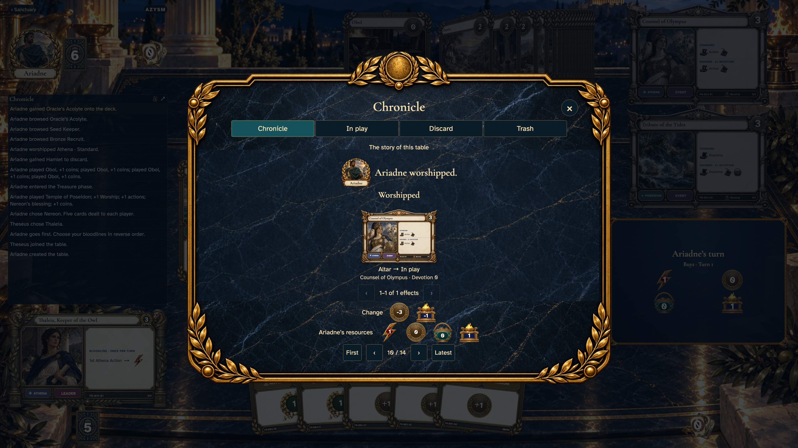</a>

- [x] Worship has its own altar source and exact payment

## Theseus receives the turn while Ariadne’s new cards stay hidden

Viewpoint: **Theseus**.

<table>
<tr><th>Desktop · 1440 × 1000</th><th>Phone · 393 × 852</th></tr>
<tr>
<td valign="top"><a href="../../screenshots/follow-a-friend-from-the-first-temple-through-worship-and-cleanup-while-reading-the-public-table/032-handoff-desktop-darwin.png">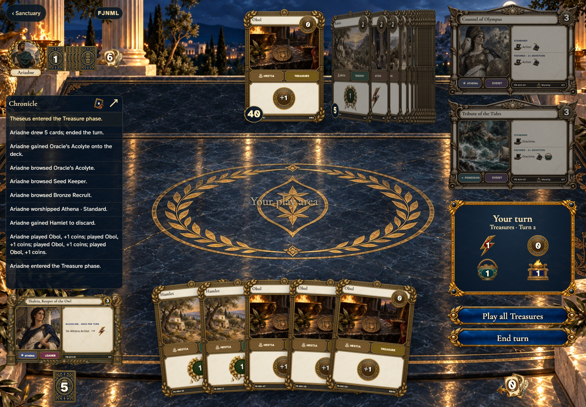</a></td>
<td valign="top"><a href="../../screenshots/follow-a-friend-from-the-first-temple-through-worship-and-cleanup-while-reading-the-public-table/032-handoff-phone-darwin.png">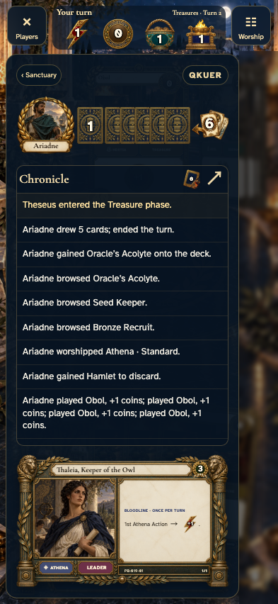</a></td>
</tr>
</table>

Tabletop · 3840 × 2160 — expand screenshot

<a href="../../screenshots/follow-a-friend-from-the-first-temple-through-worship-and-cleanup-while-reading-the-public-table/032-handoff-tabletop-4k-darwin.png">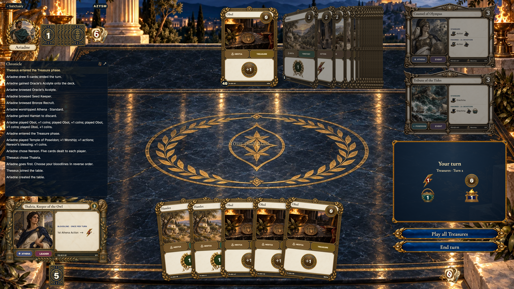</a>

- [x] Theseus receives the turn while Ariadne’s new cards stay hidden

## Cleanup and hidden draws persist as backs in the Chronicle

Viewpoint: **Theseus**.

<table>
<tr><th>Desktop · 1440 × 1000</th><th>Phone · 393 × 852</th></tr>
<tr>
<td valign="top"><a href="../../screenshots/follow-a-friend-from-the-first-temple-through-worship-and-cleanup-while-reading-the-public-table/033-cleanup-desktop-darwin.png">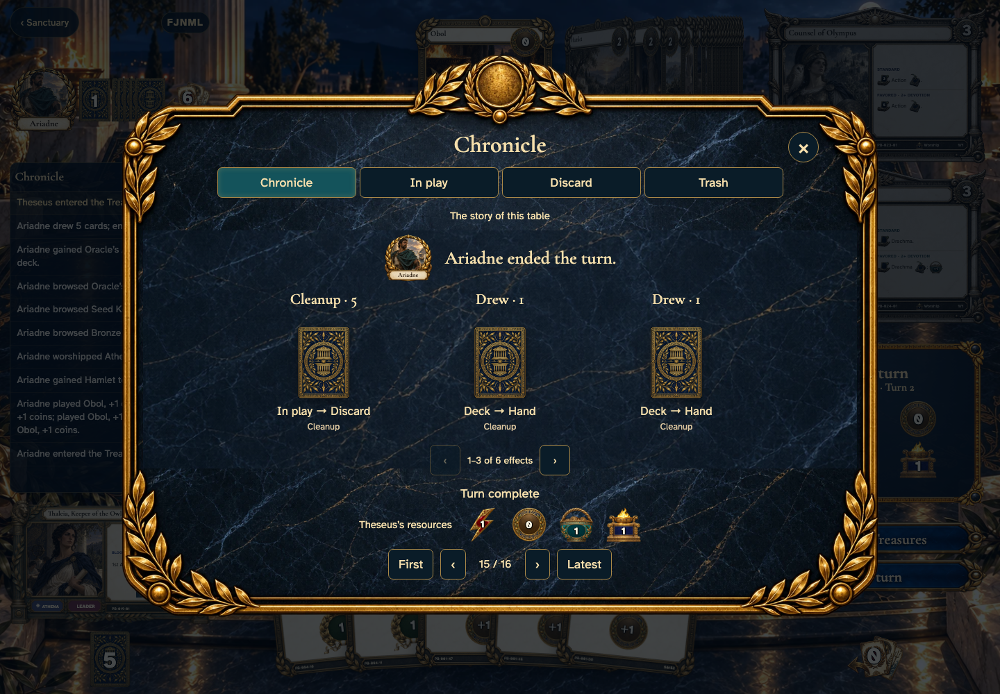</a></td>
<td valign="top"><a href="../../screenshots/follow-a-friend-from-the-first-temple-through-worship-and-cleanup-while-reading-the-public-table/033-cleanup-phone-darwin.png">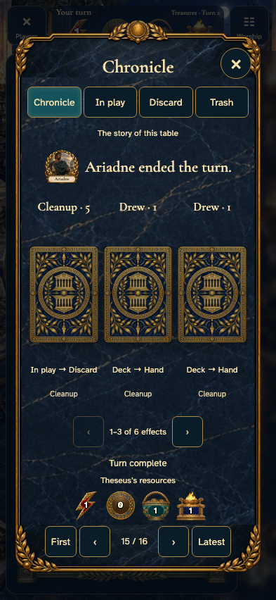</a></td>
</tr>
</table>

Tabletop · 3840 × 2160 — expand screenshot

<a href="../../screenshots/follow-a-friend-from-the-first-temple-through-worship-and-cleanup-while-reading-the-public-table/033-cleanup-tabletop-4k-darwin.png">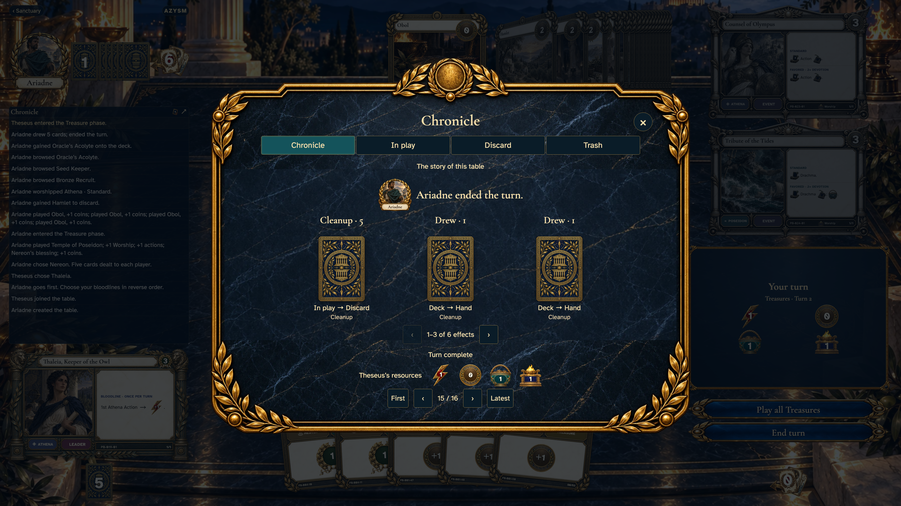</a>

- [x] Cleanup and hidden draws persist as backs in the Chronicle

## The beginning of the table is retained alongside gameplay

Viewpoint: **Theseus**.

<table>
<tr><th>Desktop · 1440 × 1000</th><th>Phone · 393 × 852</th></tr>
<tr>
<td valign="top"><a href="../../screenshots/follow-a-friend-from-the-first-temple-through-worship-and-cleanup-while-reading-the-public-table/034-first-move-desktop-darwin.png">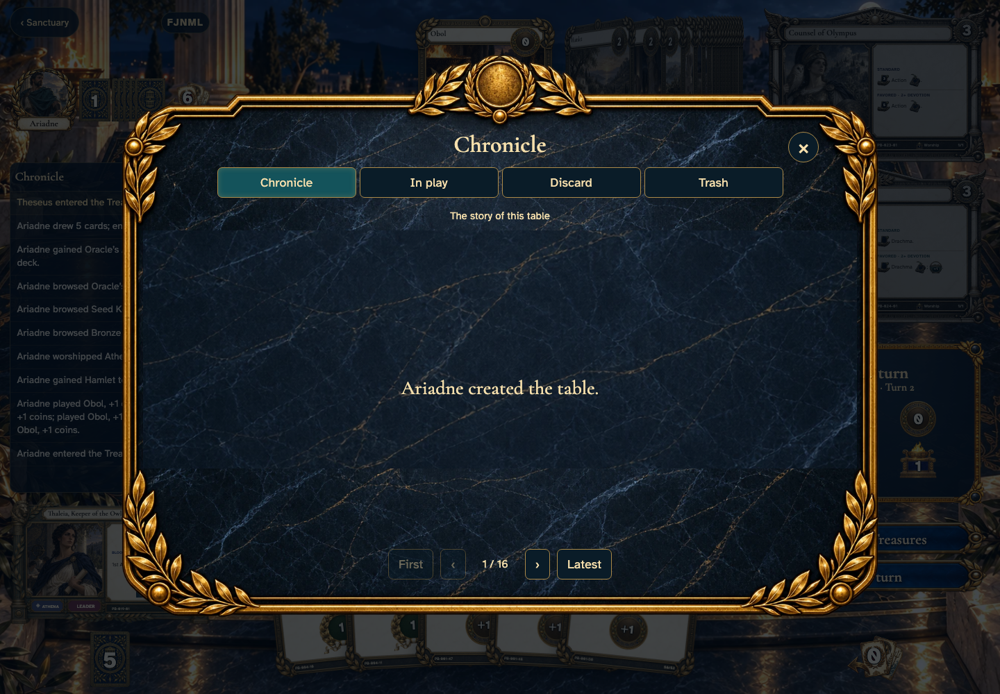</a></td>
<td valign="top"><a href="../../screenshots/follow-a-friend-from-the-first-temple-through-worship-and-cleanup-while-reading-the-public-table/034-first-move-phone-darwin.png">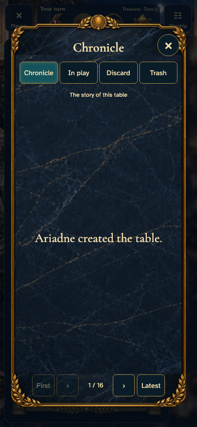</a></td>
</tr>
</table>

Tabletop · 3840 × 2160 — expand screenshot

<a href="../../screenshots/follow-a-friend-from-the-first-temple-through-worship-and-cleanup-while-reading-the-public-table/034-first-move-tabletop-4k-darwin.png">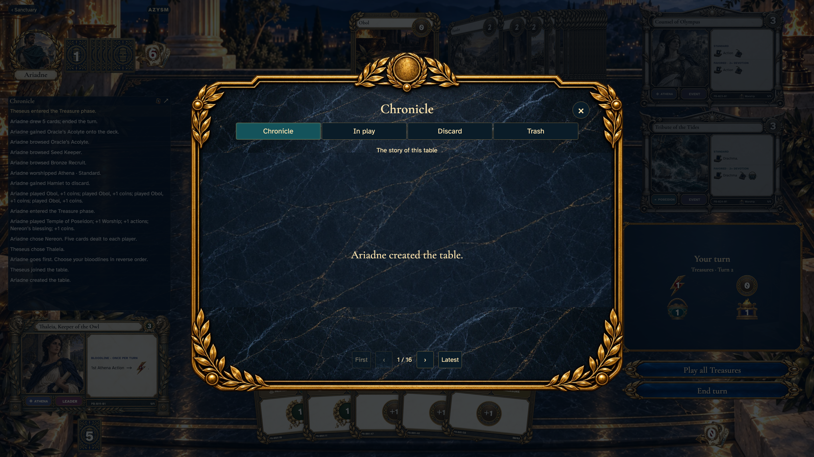</a>

- [x] The beginning of the table is retained alongside gameplay

## The shared trash is empty and never shows a private deck list

Viewpoint: **Theseus**.

<table>
<tr><th>Desktop · 1440 × 1000</th><th>Phone · 393 × 852</th></tr>
<tr>
<td valign="top"><a href="../../screenshots/follow-a-friend-from-the-first-temple-through-worship-and-cleanup-while-reading-the-public-table/035-empty-trash-desktop-darwin.png">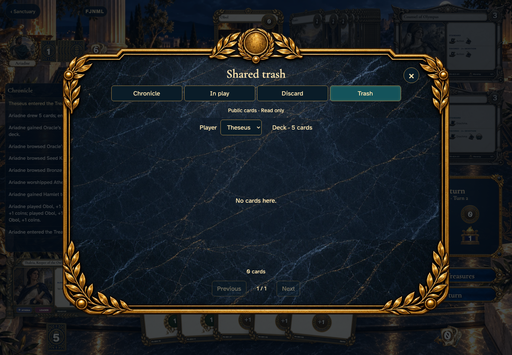</a></td>
<td valign="top"><a href="../../screenshots/follow-a-friend-from-the-first-temple-through-worship-and-cleanup-while-reading-the-public-table/035-empty-trash-phone-darwin.png">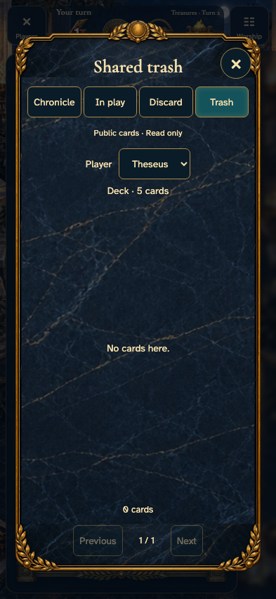</a></td>
</tr>
</table>

Tabletop · 3840 × 2160 — expand screenshot

<a href="../../screenshots/follow-a-friend-from-the-first-temple-through-worship-and-cleanup-while-reading-the-public-table/035-empty-trash-tabletop-4k-darwin.png">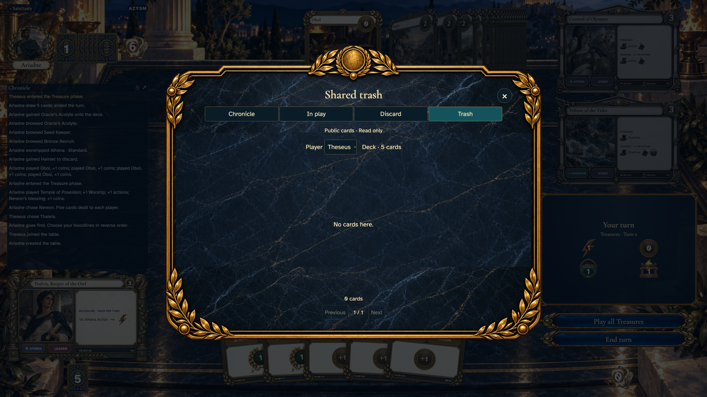</a>

- [x] The shared trash is empty and never shows a private deck list
