# follow cleanup shuffling discards before hidden draws exactly once

Recorded-history integration scenario. A legal event history prepares the starting position directly in the emulator. This verifies the illustrated effect from that position; it does not demonstrate the player journey to reach it.

## Ariadne holds the Action at a legal recorded table

Viewpoint: **Ariadne**.

<table>
<tr><th>Desktop · 1440 × 1000</th><th>Phone · 393 × 852</th></tr>
<tr>
<td valign="top"></td>
<td valign="top"><a href="../../screenshots/follow-cleanup-shuffling-discards-before-hidden-draws-exactly-once/000-table-phone-darwin.png">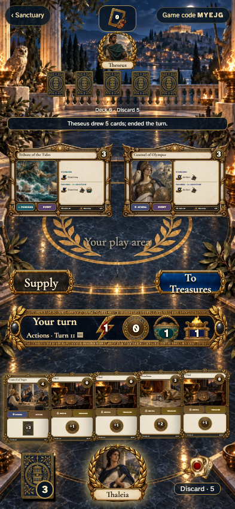</a></td>
</tr>
</table>

Tabletop · 3840 × 2160 — expand screenshot

<a href="../../screenshots/follow-cleanup-shuffling-discards-before-hidden-draws-exactly-once/000-table-tabletop-4k-darwin.png">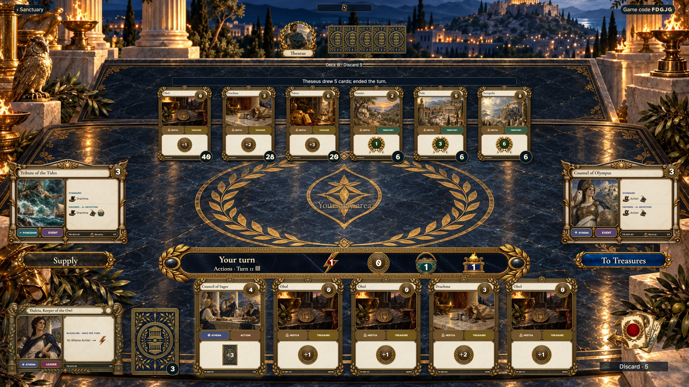</a>

- [x] Ariadne holds the Action at a legal recorded table

## Theseus can follow the active player while keeping his own hand

Viewpoint: **Theseus**.

<table>
<tr><th>Desktop · 1440 × 1000</th><th>Phone · 393 × 852</th></tr>
<tr>
<td valign="top"><a href="../../screenshots/follow-cleanup-shuffling-discards-before-hidden-draws-exactly-once/001-waiting-desktop-darwin.png">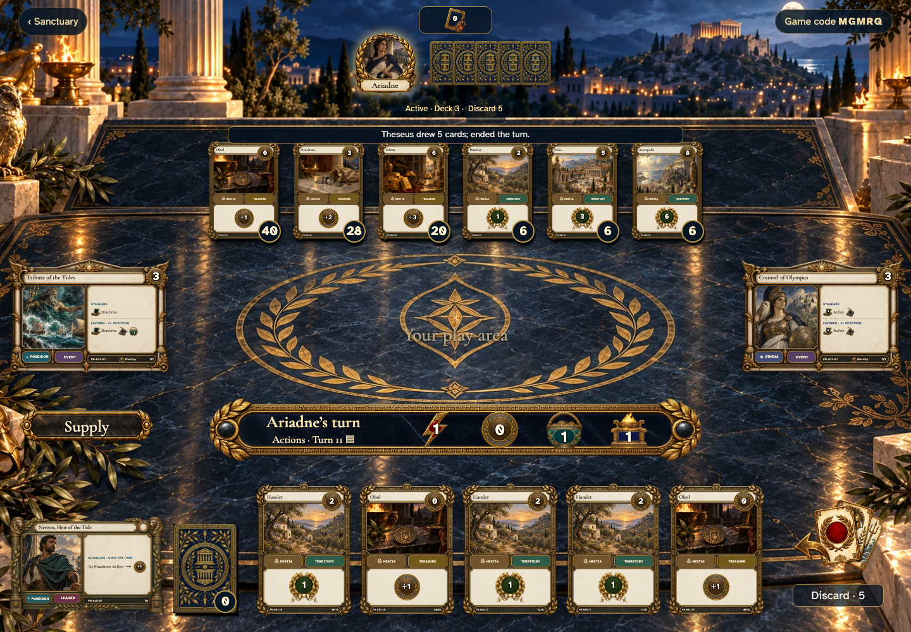</a></td>
<td valign="top"><a href="../../screenshots/follow-cleanup-shuffling-discards-before-hidden-draws-exactly-once/001-waiting-phone-darwin.png">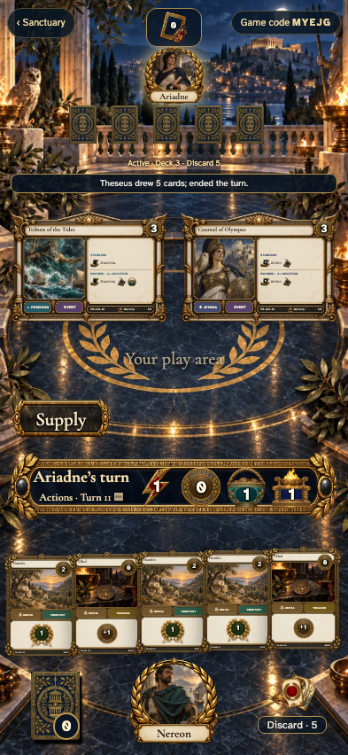</a></td>
</tr>
</table>

Tabletop · 3840 × 2160 — expand screenshot

<a href="../../screenshots/follow-cleanup-shuffling-discards-before-hidden-draws-exactly-once/001-waiting-tabletop-4k-darwin.png">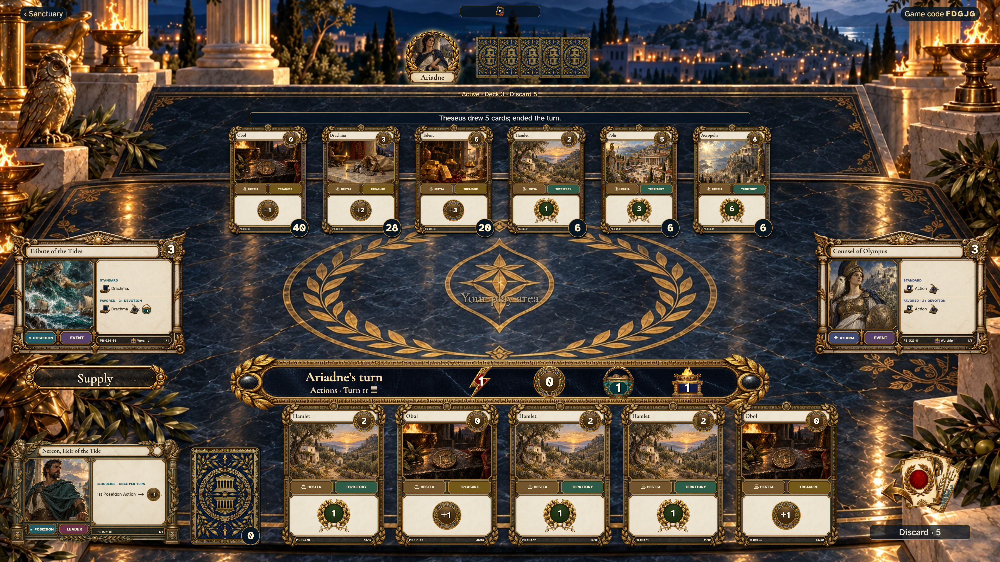</a>

- [x] Theseus can follow the active player while keeping his own hand

## Council of Sages has drawn three cards and finished its blessing

Viewpoint: **Ariadne**.

<table>
<tr><th>Desktop · 1440 × 1000</th><th>Phone · 393 × 852</th></tr>
<tr>
<td valign="top"><a href="../../screenshots/follow-cleanup-shuffling-discards-before-hidden-draws-exactly-once/002-drawn-desktop-darwin.png">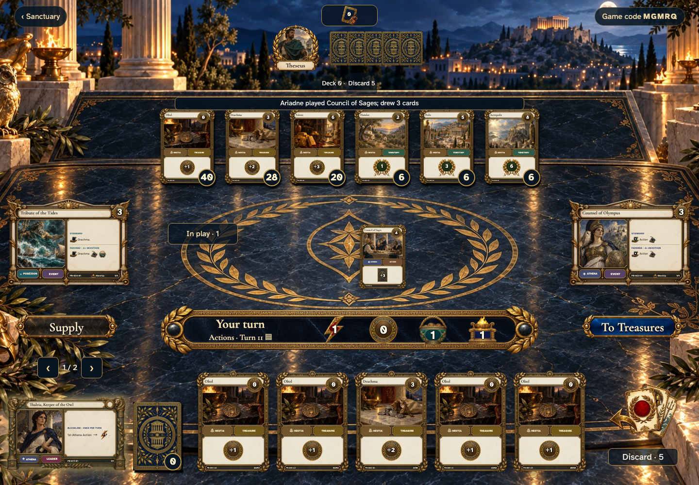</a></td>
<td valign="top"><a href="../../screenshots/follow-cleanup-shuffling-discards-before-hidden-draws-exactly-once/002-drawn-phone-darwin.png">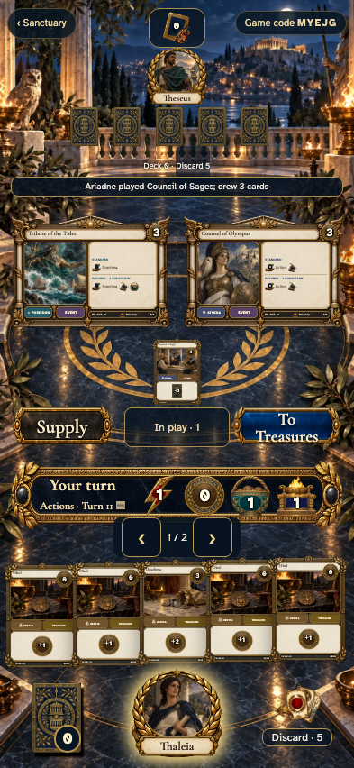</a></td>
</tr>
</table>

Tabletop · 3840 × 2160 — expand screenshot

- [x] Council of Sages has drawn three cards and finished its blessing

## Ariadne can end the turn with retained Treasures

Viewpoint: **Ariadne**.

<table>
<tr><th>Desktop · 1440 × 1000</th><th>Phone · 393 × 852</th></tr>
<tr>
<td valign="top"><a href="../../screenshots/follow-cleanup-shuffling-discards-before-hidden-draws-exactly-once/003-treasures-desktop-darwin.png">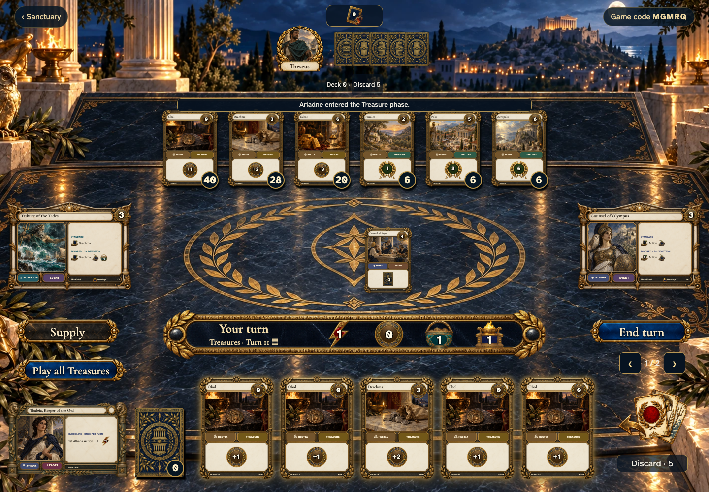</a></td>
<td valign="top"><a href="../../screenshots/follow-cleanup-shuffling-discards-before-hidden-draws-exactly-once/003-treasures-phone-darwin.png">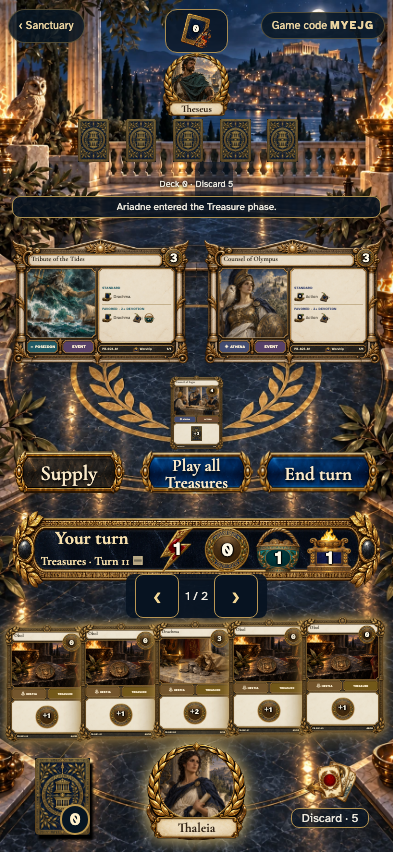</a></td>
</tr>
</table>

Tabletop · 3840 × 2160 — expand screenshot

<a href="../../screenshots/follow-cleanup-shuffling-discards-before-hidden-draws-exactly-once/003-treasures-tabletop-4k-darwin.png">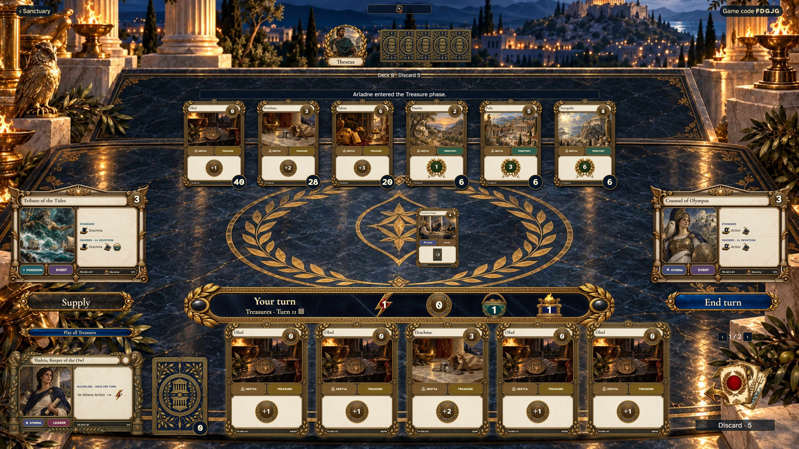</a>

- [x] Ariadne can end the turn with retained Treasures

## Ariadne confirms the remaining option before cleanup

Viewpoint: **Ariadne**.

<table>
<tr><th>Desktop · 1440 × 1000</th><th>Phone · 393 × 852</th></tr>
<tr>
<td valign="top"><a href="../../screenshots/follow-cleanup-shuffling-discards-before-hidden-draws-exactly-once/004-confirm-desktop-darwin.png">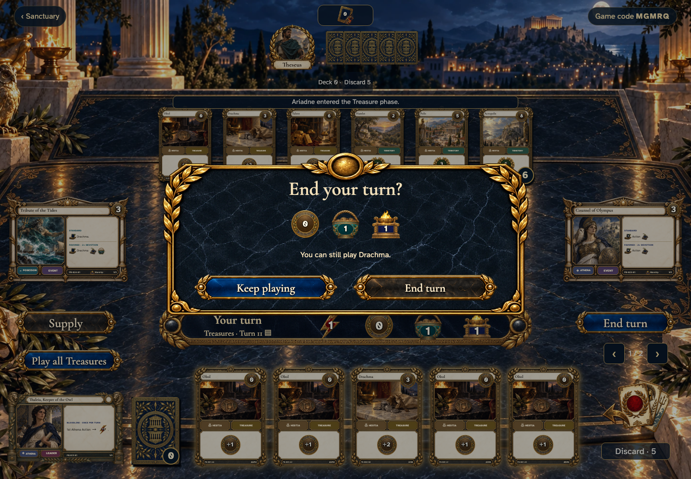</a></td>
<td valign="top"><a href="../../screenshots/follow-cleanup-shuffling-discards-before-hidden-draws-exactly-once/004-confirm-phone-darwin.png">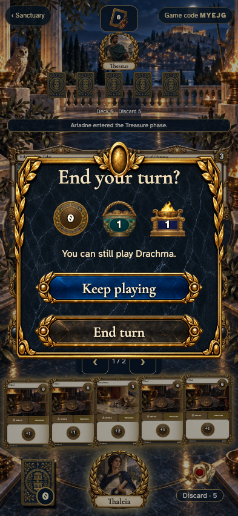</a></td>
</tr>
</table>

Tabletop · 3840 × 2160 — expand screenshot

<a href="../../screenshots/follow-cleanup-shuffling-discards-before-hidden-draws-exactly-once/004-confirm-tabletop-4k-darwin.png">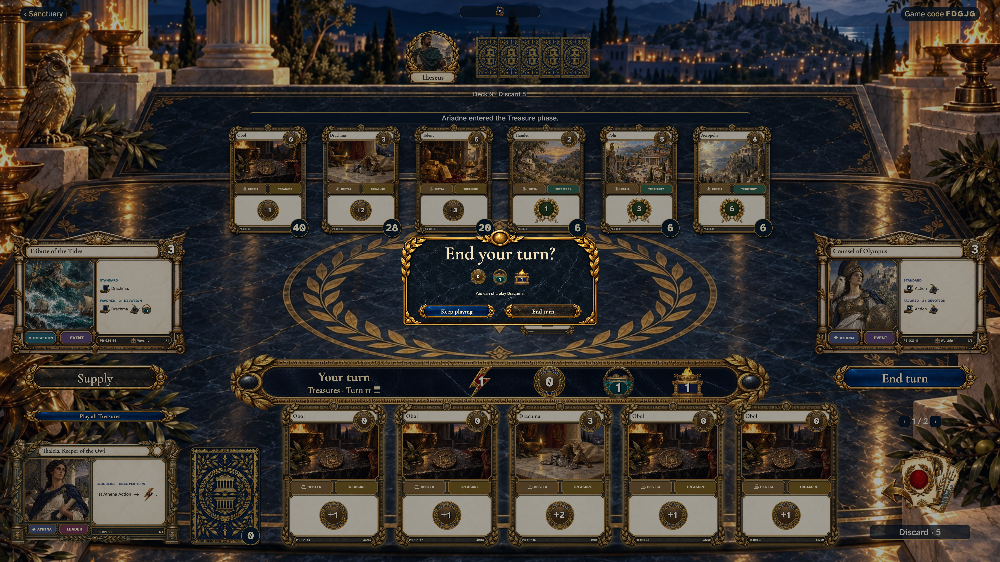</a>

- [x] Ariadne confirms the remaining option before cleanup

## Every public movement arrived in order while hidden cards stayed backs

Viewpoint: **Theseus**.

<table>
<tr><th>Desktop · 1440 × 1000</th><th>Phone · 393 × 852</th></tr>
<tr>
<td valign="top"><a href="../../screenshots/follow-cleanup-shuffling-discards-before-hidden-draws-exactly-once/005-result-desktop-darwin.png">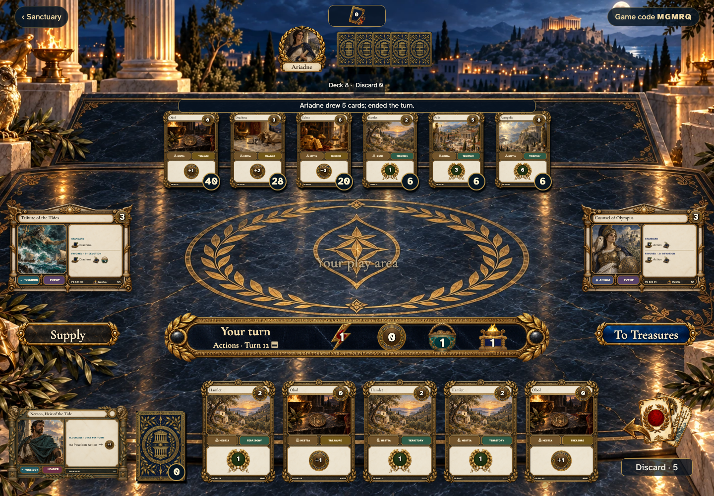</a></td>
<td valign="top"><a href="../../screenshots/follow-cleanup-shuffling-discards-before-hidden-draws-exactly-once/005-result-phone-darwin.png">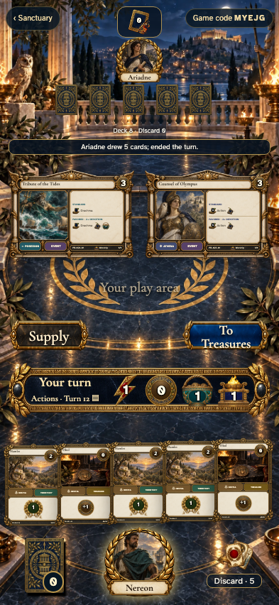</a></td>
</tr>
</table>

Tabletop · 3840 × 2160 — expand screenshot

- [x] Every public movement arrived in order while hidden cards stayed backs

## The same source, destination, and resource result remain after motion

Viewpoint: **Theseus**.

<table>
<tr><th>Desktop · 1440 × 1000</th><th>Phone · 393 × 852</th></tr>
<tr>
<td valign="top"><a href="../../screenshots/follow-cleanup-shuffling-discards-before-hidden-draws-exactly-once/006-history-desktop-darwin.png">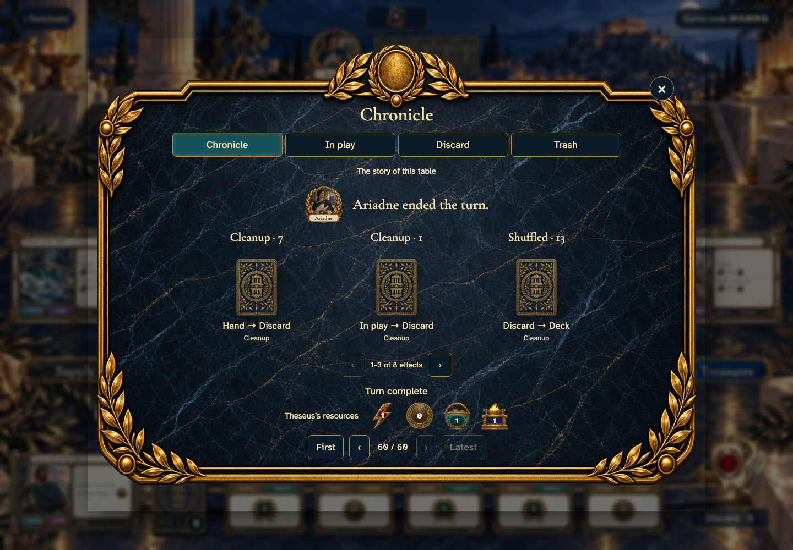</a></td>
<td valign="top"><a href="../../screenshots/follow-cleanup-shuffling-discards-before-hidden-draws-exactly-once/006-history-phone-darwin.png">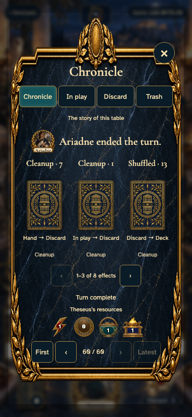</a></td>
</tr>
</table>

Tabletop · 3840 × 2160 — expand screenshot

<a href="../../screenshots/follow-cleanup-shuffling-discards-before-hidden-draws-exactly-once/006-history-tabletop-4k-darwin.png">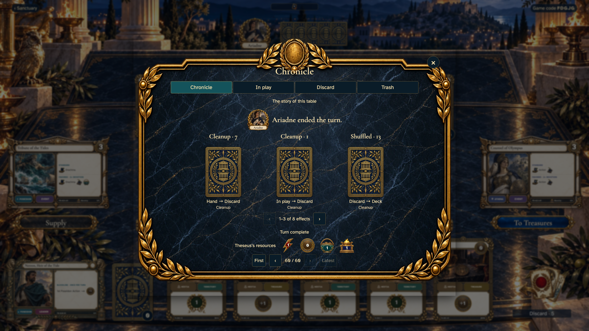</a>

- [x] The same source, destination, and resource result remain after motion

## Returning to this table restores its result without replaying old motion

Viewpoint: **Theseus**.

<table>
<tr><th>Desktop · 1440 × 1000</th><th>Phone · 393 × 852</th></tr>
<tr>
<td valign="top"></td>
<td valign="top"><a href="../../screenshots/follow-cleanup-shuffling-discards-before-hidden-draws-exactly-once/007-returned-phone-darwin.png">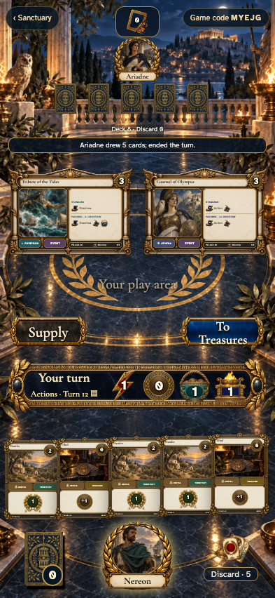</a></td>
</tr>
</table>

Tabletop · 3840 × 2160 — expand screenshot

<a href="../../screenshots/follow-cleanup-shuffling-discards-before-hidden-draws-exactly-once/007-returned-tabletop-4k-darwin.png">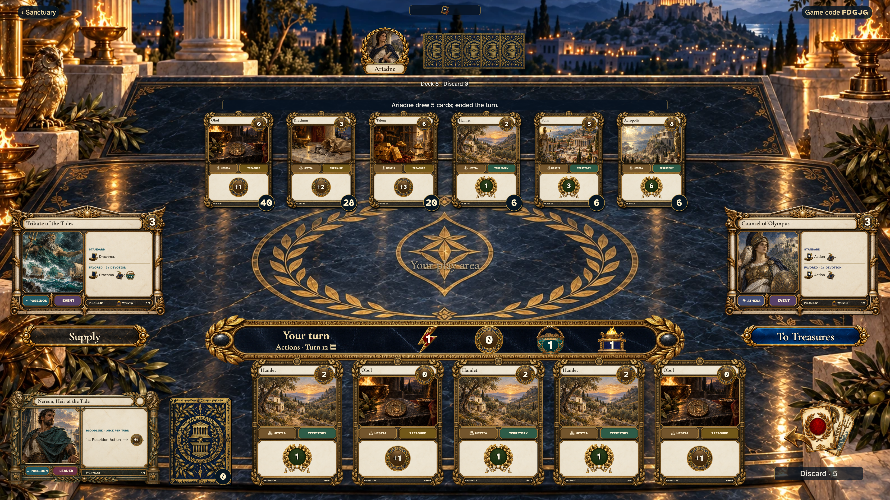</a>

- [x] Returning to this table restores its result without replaying old motion
