# follow Worship and a purchase once while reconnecting without an animation backlog

Recorded-history integration scenario. A legal event history prepares the starting position directly in the emulator. This verifies the illustrated effect from that position; it does not demonstrate the player journey to reach it.

## Ariadne is ready to play Sea Trade at a legal recorded table

Viewpoint: **Ariadne**.

<table>
<tr><th>Desktop · 1440 × 1000</th><th>Phone · 393 × 852</th></tr>
<tr>
<td valign="top"><a href="../../screenshots/follow-worship-and-a-purchase-once-while-reconnecting-without-an-animation-backlog/000-table-desktop-darwin.png">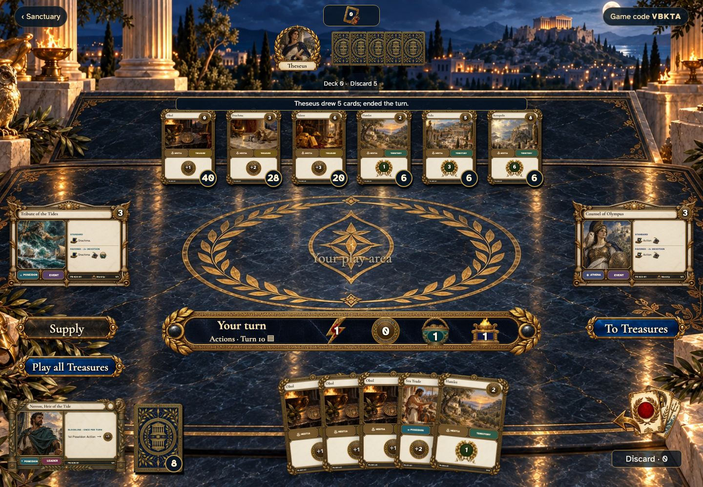</a></td>
<td valign="top"><a href="../../screenshots/follow-worship-and-a-purchase-once-while-reconnecting-without-an-animation-backlog/000-table-phone-darwin.png">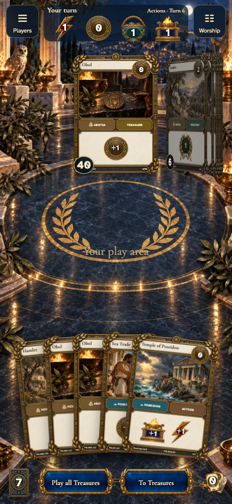</a></td>
</tr>
</table>

Tabletop · 3840 × 2160 — expand screenshot

<a href="../../screenshots/follow-worship-and-a-purchase-once-while-reconnecting-without-an-animation-backlog/000-table-tabletop-4k-darwin.png">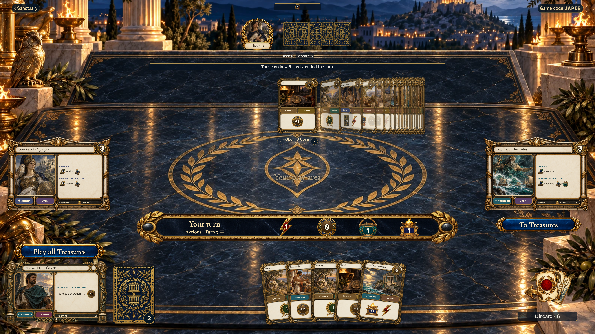</a>

- [x] Ariadne is ready to play Sea Trade at a legal recorded table

## Sea Trade and Nereon grant three Coins

Viewpoint: **Ariadne**.

<table>
<tr><th>Desktop · 1440 × 1000</th><th>Phone · 393 × 852</th></tr>
<tr>
<td valign="top"><a href="../../screenshots/follow-worship-and-a-purchase-once-while-reconnecting-without-an-animation-backlog/001-wealth-desktop-darwin.png">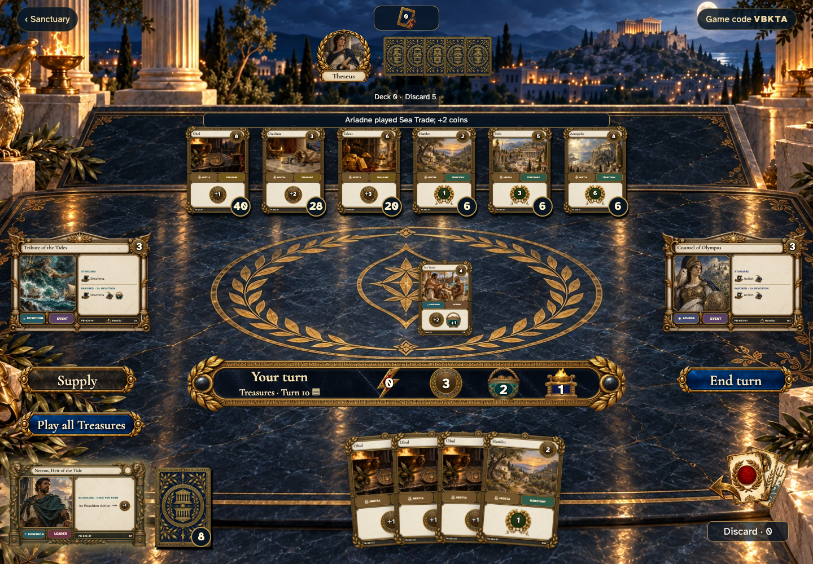</a></td>
<td valign="top"><a href="../../screenshots/follow-worship-and-a-purchase-once-while-reconnecting-without-an-animation-backlog/001-wealth-phone-darwin.png">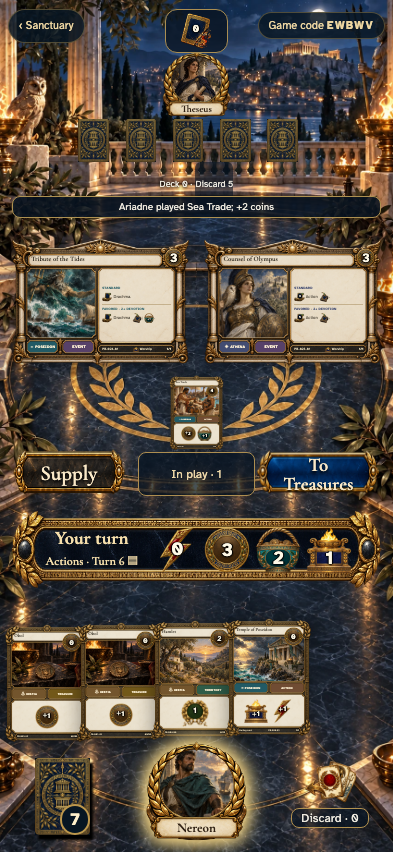</a></td>
</tr>
</table>

Tabletop · 3840 × 2160 — expand screenshot

<a href="../../screenshots/follow-worship-and-a-purchase-once-while-reconnecting-without-an-animation-backlog/001-wealth-tabletop-4k-darwin.png">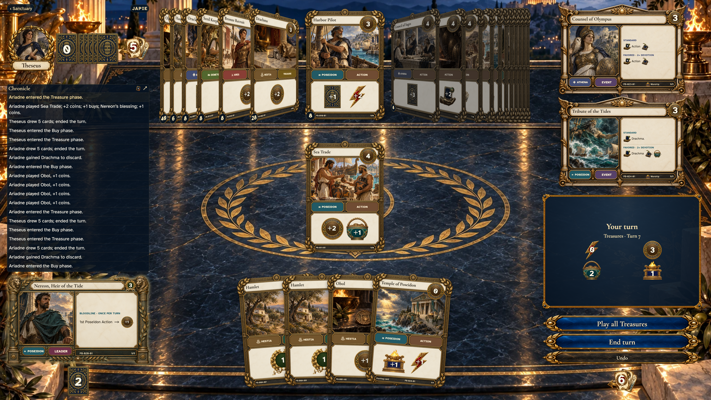</a>

- [x] Sea Trade and Nereon grant three Coins

## Ariadne can pay Poseidon before the Treasure phase

Viewpoint: **Ariadne**.

<table>
<tr><th>Desktop · 1440 × 1000</th><th>Phone · 393 × 852</th></tr>
<tr>
<td valign="top"><a href="../../screenshots/follow-worship-and-a-purchase-once-while-reconnecting-without-an-animation-backlog/002-altar-desktop-darwin.png">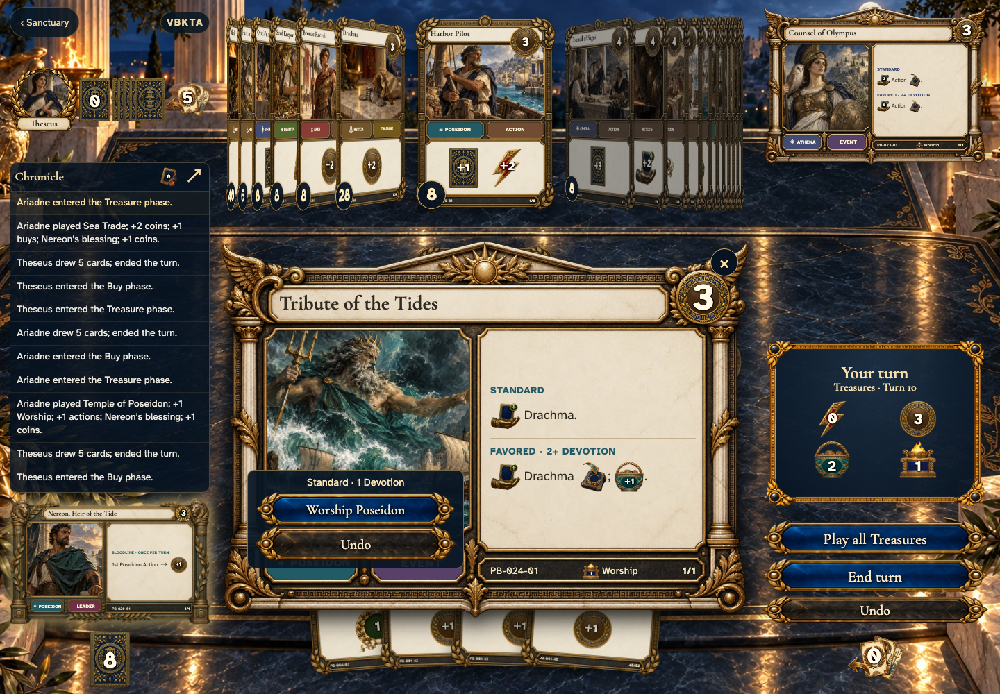</a></td>
<td valign="top"><a href="../../screenshots/follow-worship-and-a-purchase-once-while-reconnecting-without-an-animation-backlog/002-altar-phone-darwin.png">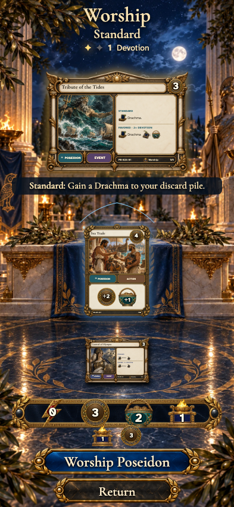</a></td>
</tr>
</table>

Tabletop · 3840 × 2160 — expand screenshot

<a href="../../screenshots/follow-worship-and-a-purchase-once-while-reconnecting-without-an-animation-backlog/002-altar-tabletop-4k-darwin.png">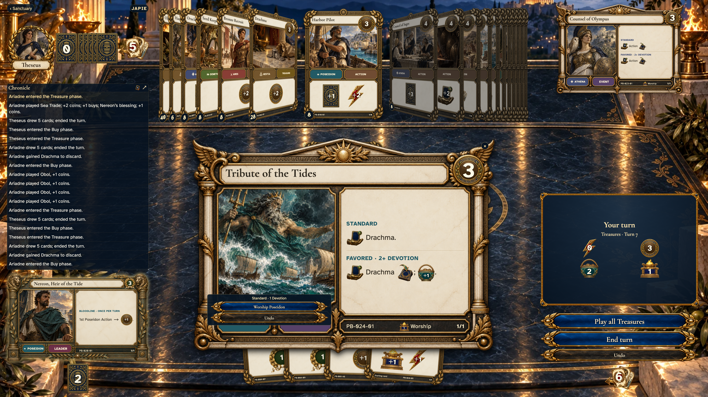</a>

- [x] Ariadne can pay Poseidon before the Treasure phase

## Poseidon sends a Drachma to Ariadne’s discard

Viewpoint: **Ariadne**.

<table>
<tr><th>Desktop · 1440 × 1000</th><th>Phone · 393 × 852</th></tr>
<tr>
<td valign="top"><a href="../../screenshots/follow-worship-and-a-purchase-once-while-reconnecting-without-an-animation-backlog/003-gift-desktop-darwin.png">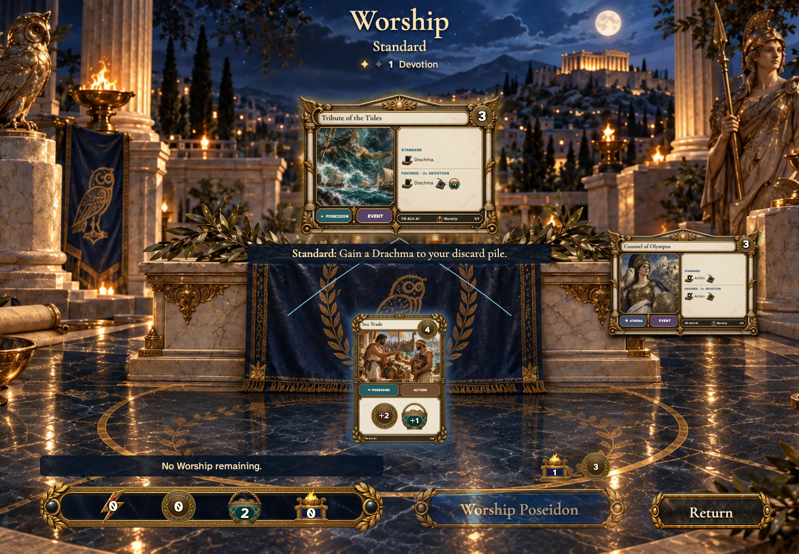</a></td>
<td valign="top"><a href="../../screenshots/follow-worship-and-a-purchase-once-while-reconnecting-without-an-animation-backlog/003-gift-phone-darwin.png">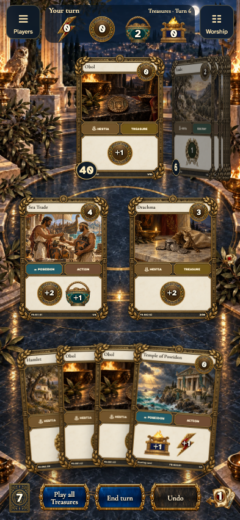</a></td>
</tr>
</table>

Tabletop · 3840 × 2160 — expand screenshot

<a href="../../screenshots/follow-worship-and-a-purchase-once-while-reconnecting-without-an-animation-backlog/003-gift-tabletop-4k-darwin.png">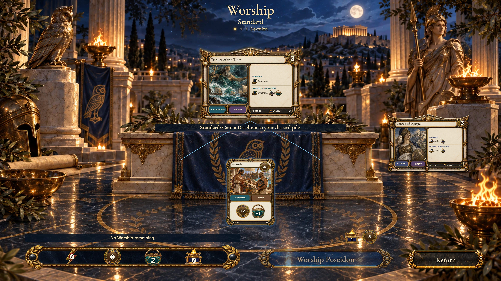</a>

- [x] Poseidon sends a Drachma to Ariadne’s discard

## Theseus sees the public gift without an extra leader blessing

Viewpoint: **Theseus**.

<table>
<tr><th>Desktop · 1440 × 1000</th><th>Phone · 393 × 852</th></tr>
<tr>
<td valign="top"><a href="../../screenshots/follow-worship-and-a-purchase-once-while-reconnecting-without-an-animation-backlog/004-observer-desktop-darwin.png">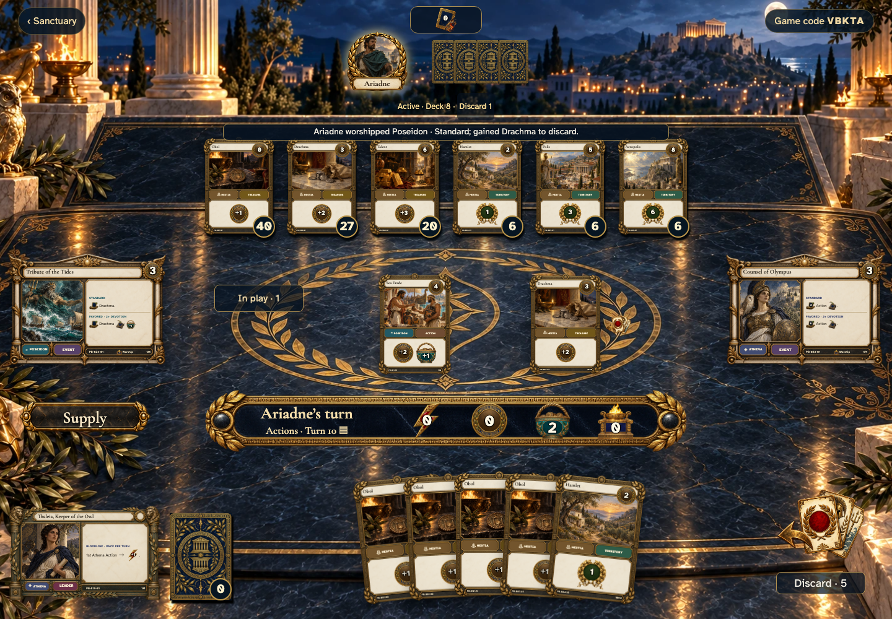</a></td>
<td valign="top"><a href="../../screenshots/follow-worship-and-a-purchase-once-while-reconnecting-without-an-animation-backlog/004-observer-phone-darwin.png">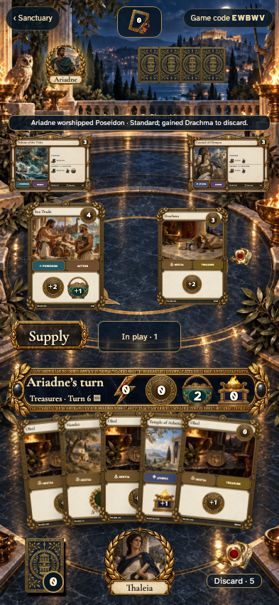</a></td>
</tr>
</table>

Tabletop · 3840 × 2160 — expand screenshot

<a href="../../screenshots/follow-worship-and-a-purchase-once-while-reconnecting-without-an-animation-backlog/004-observer-tabletop-4k-darwin.png">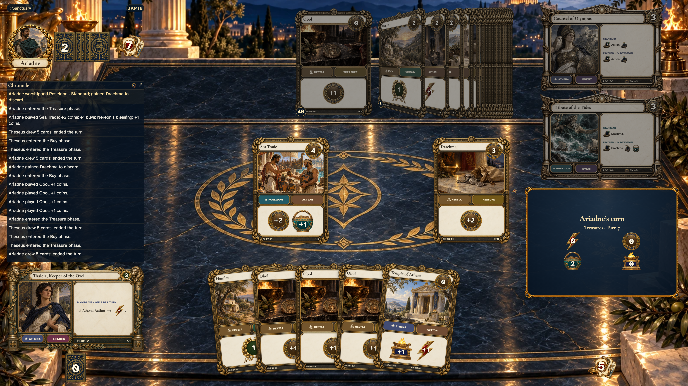</a>

- [x] Theseus sees the public gift without an extra leader blessing

## Theseus keeps his table when the connection is interrupted

Viewpoint: **Theseus**.

<table>
<tr><th>Desktop · 1440 × 1000</th><th>Phone · 393 × 852</th></tr>
<tr>
<td valign="top"><a href="../../screenshots/follow-worship-and-a-purchase-once-while-reconnecting-without-an-animation-backlog/005-interrupted-desktop-darwin.png">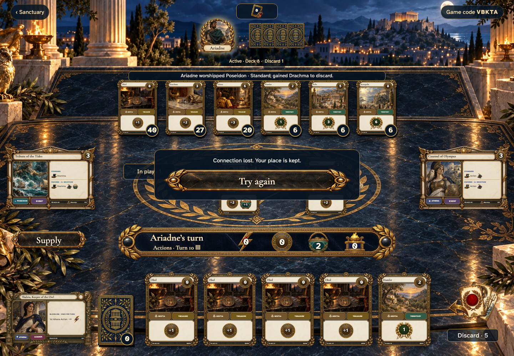</a></td>
<td valign="top"><a href="../../screenshots/follow-worship-and-a-purchase-once-while-reconnecting-without-an-animation-backlog/005-interrupted-phone-darwin.png">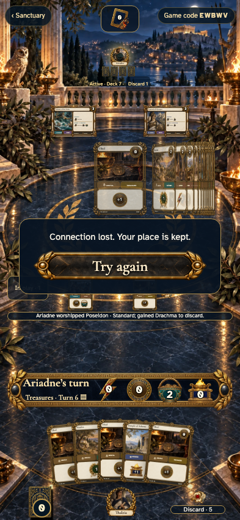</a></td>
</tr>
</table>

Tabletop · 3840 × 2160 — expand screenshot

<a href="../../screenshots/follow-worship-and-a-purchase-once-while-reconnecting-without-an-animation-backlog/005-interrupted-tabletop-4k-darwin.png">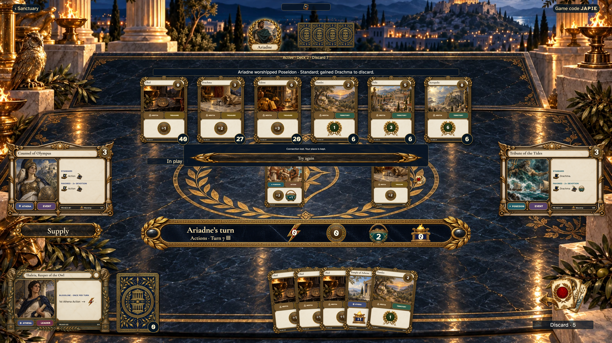</a>

- [x] Theseus keeps his table when the connection is interrupted

## Ariadne can continue into Treasures during the interruption

Viewpoint: **Ariadne**.

<table>
<tr><th>Desktop · 1440 × 1000</th><th>Phone · 393 × 852</th></tr>
<tr>
<td valign="top"><a href="../../screenshots/follow-worship-and-a-purchase-once-while-reconnecting-without-an-animation-backlog/006-treasures-desktop-darwin.png">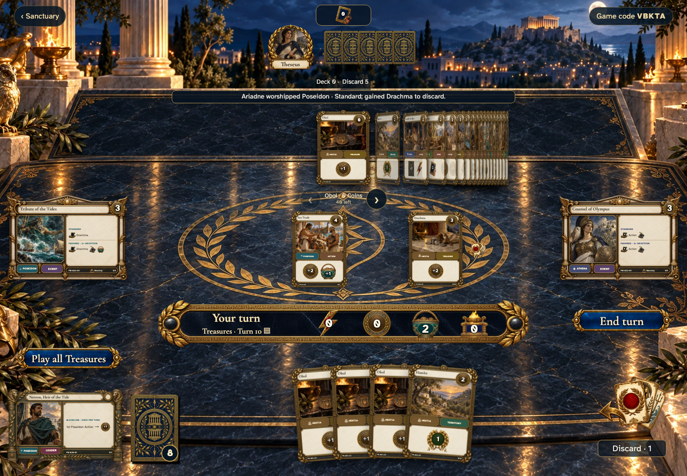</a></td>
<td valign="top"><a href="../../screenshots/follow-worship-and-a-purchase-once-while-reconnecting-without-an-animation-backlog/006-treasures-phone-darwin.png">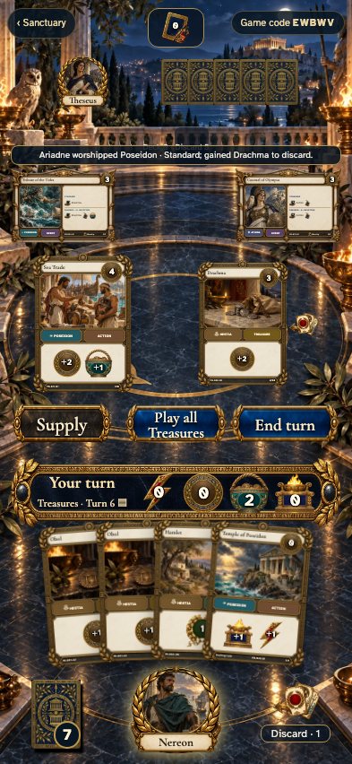</a></td>
</tr>
</table>

Tabletop · 3840 × 2160 — expand screenshot

<a href="../../screenshots/follow-worship-and-a-purchase-once-while-reconnecting-without-an-animation-backlog/006-treasures-tabletop-4k-darwin.png">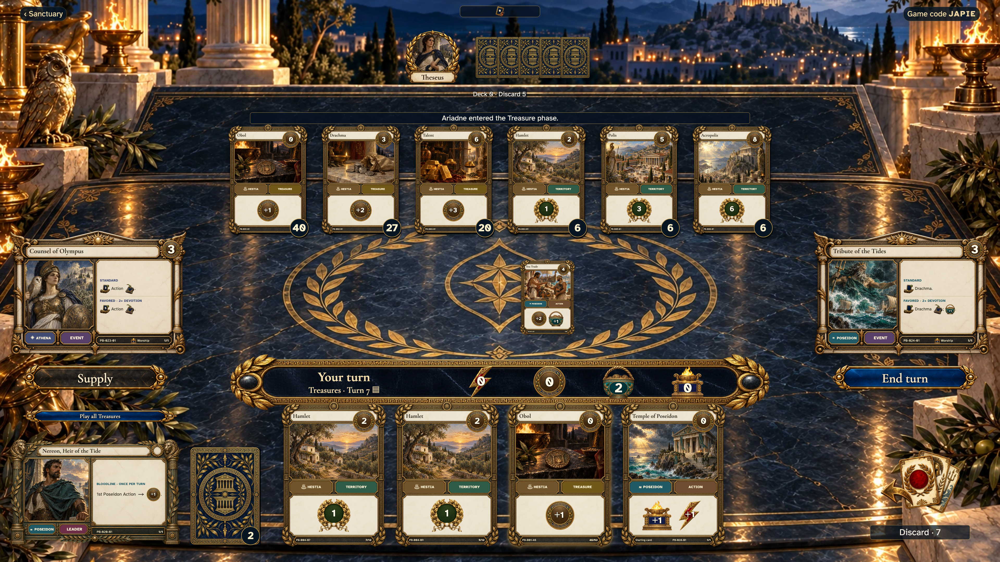</a>

- [x] Ariadne can continue into Treasures during the interruption

## Ariadne’s played wealth remains part of the public history

Viewpoint: **Ariadne**.

<table>
<tr><th>Desktop · 1440 × 1000</th><th>Phone · 393 × 852</th></tr>
<tr>
<td valign="top"><a href="../../screenshots/follow-worship-and-a-purchase-once-while-reconnecting-without-an-animation-backlog/007-played-desktop-darwin.png">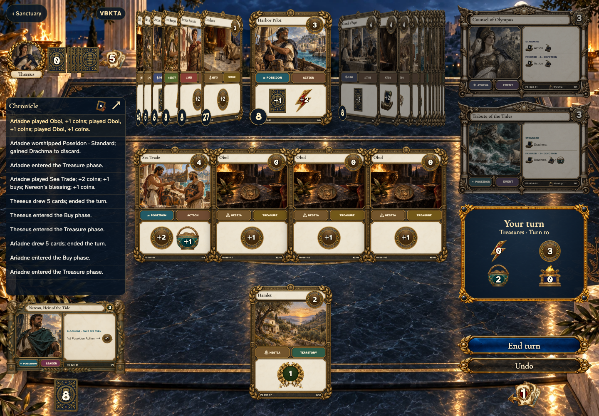</a></td>
<td valign="top"><a href="../../screenshots/follow-worship-and-a-purchase-once-while-reconnecting-without-an-animation-backlog/007-played-phone-darwin.png">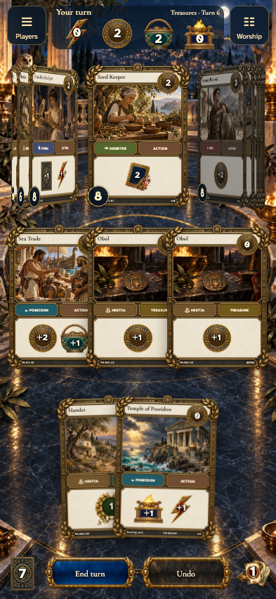</a></td>
</tr>
</table>

Tabletop · 3840 × 2160 — expand screenshot

<a href="../../screenshots/follow-worship-and-a-purchase-once-while-reconnecting-without-an-animation-backlog/007-played-tabletop-4k-darwin.png">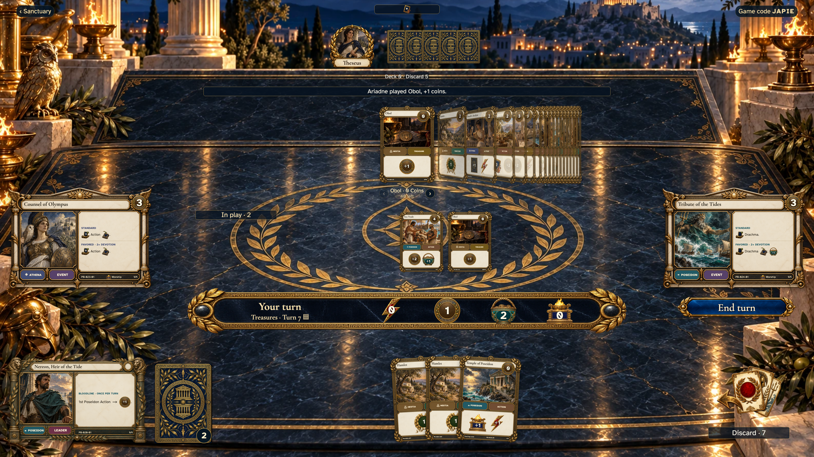</a>

- [x] Ariadne’s played wealth remains part of the public history

## Theseus catches up to the latest counters without a burst of old motion

Viewpoint: **Theseus**.

<table>
<tr><th>Desktop · 1440 × 1000</th><th>Phone · 393 × 852</th></tr>
<tr>
<td valign="top"><a href="../../screenshots/follow-worship-and-a-purchase-once-while-reconnecting-without-an-animation-backlog/008-reconnected-desktop-darwin.png">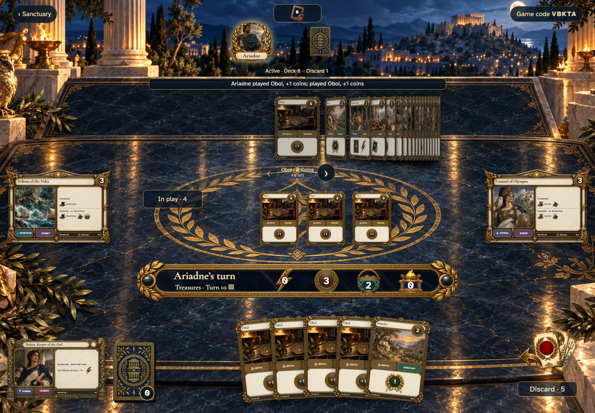</a></td>
<td valign="top"><a href="../../screenshots/follow-worship-and-a-purchase-once-while-reconnecting-without-an-animation-backlog/008-reconnected-phone-darwin.png">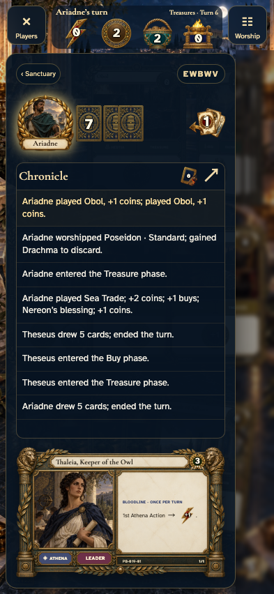</a></td>
</tr>
</table>

Tabletop · 3840 × 2160 — expand screenshot

<a href="../../screenshots/follow-worship-and-a-purchase-once-while-reconnecting-without-an-animation-backlog/008-reconnected-tabletop-4k-darwin.png">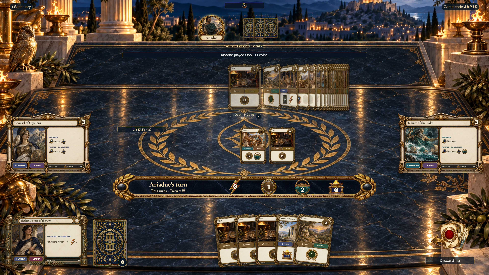</a>

- [x] Theseus catches up to the latest counters without a burst of old motion

## Ariadne chooses a cost-zero Obol after reconnect

Viewpoint: **Ariadne**.

<table>
<tr><th>Desktop · 1440 × 1000</th><th>Phone · 393 × 852</th></tr>
<tr>
<td valign="top"><a href="../../screenshots/follow-worship-and-a-purchase-once-while-reconnecting-without-an-animation-backlog/009-purchase-desktop-darwin.png">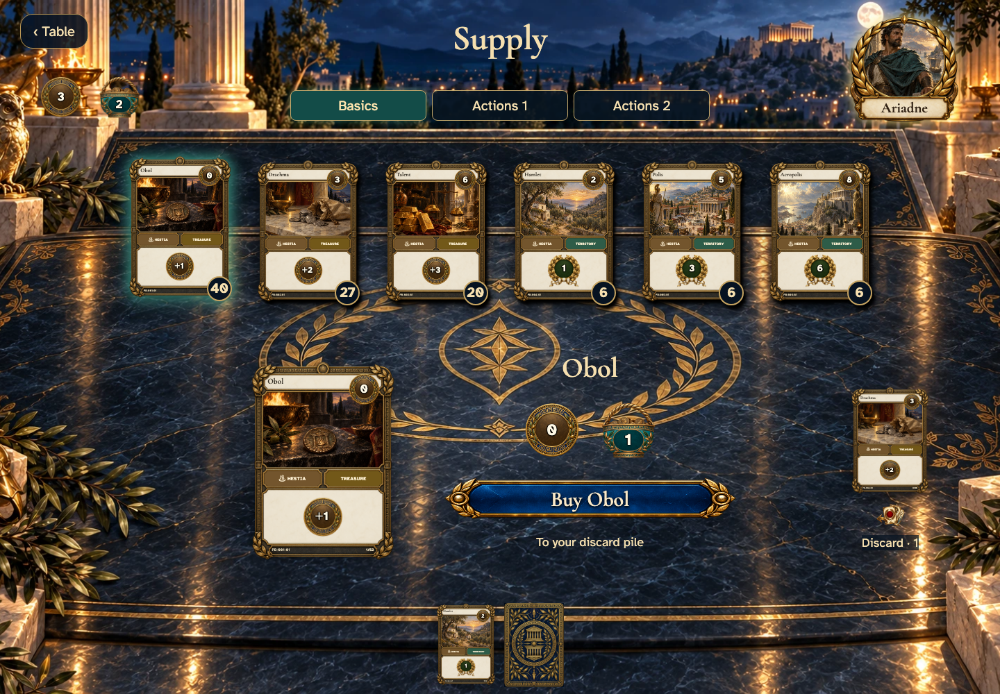</a></td>
<td valign="top"><a href="../../screenshots/follow-worship-and-a-purchase-once-while-reconnecting-without-an-animation-backlog/009-purchase-phone-darwin.png">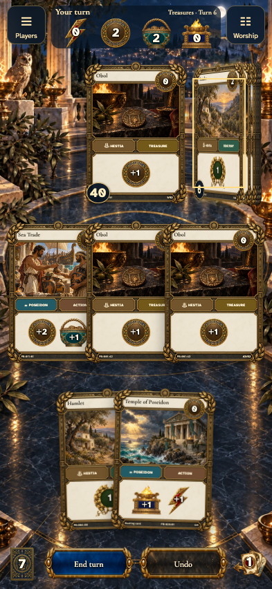</a></td>
</tr>
</table>

Tabletop · 3840 × 2160 — expand screenshot

- [x] Ariadne chooses a cost-zero Obol after reconnect

## The next live purchase lands beside played cards

Viewpoint: **Theseus**.

<table>
<tr><th>Desktop · 1440 × 1000</th><th>Phone · 393 × 852</th></tr>
<tr>
<td valign="top"><a href="../../screenshots/follow-worship-and-a-purchase-once-while-reconnecting-without-an-animation-backlog/010-live-again-desktop-darwin.png">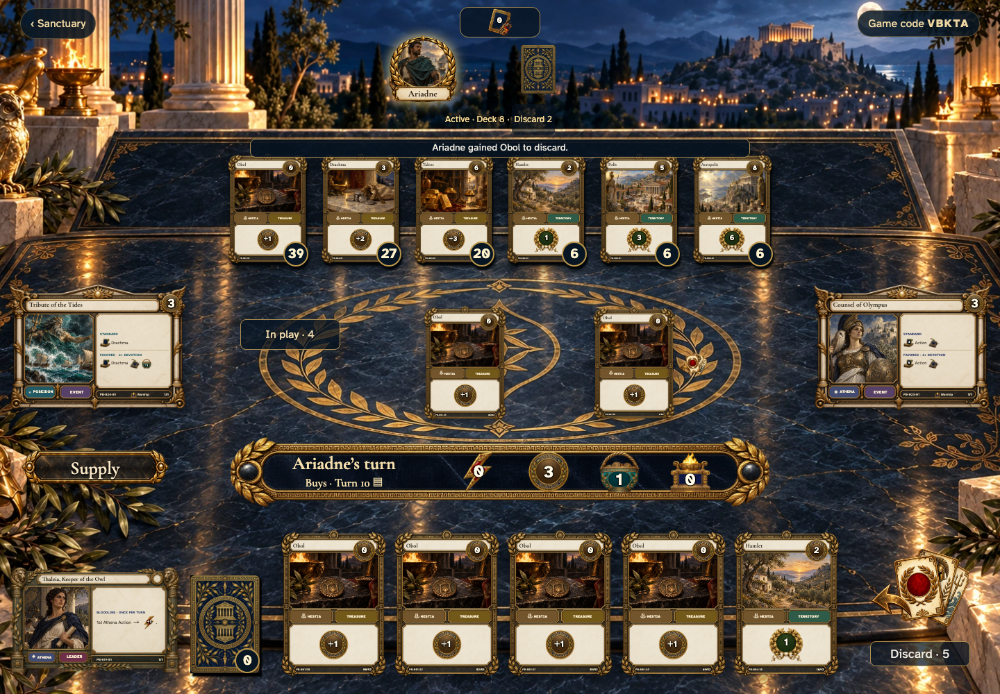</a></td>
<td valign="top"><a href="../../screenshots/follow-worship-and-a-purchase-once-while-reconnecting-without-an-animation-backlog/010-live-again-phone-darwin.png">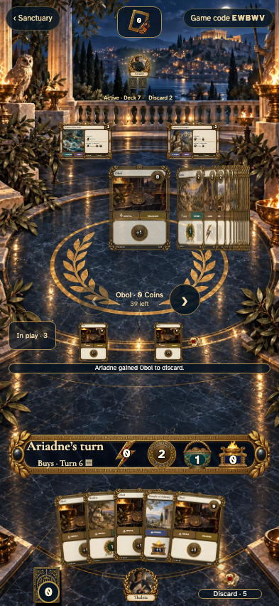</a></td>
</tr>
</table>

Tabletop · 3840 × 2160 — expand screenshot

<a href="../../screenshots/follow-worship-and-a-purchase-once-while-reconnecting-without-an-animation-backlog/010-live-again-tabletop-4k-darwin.png">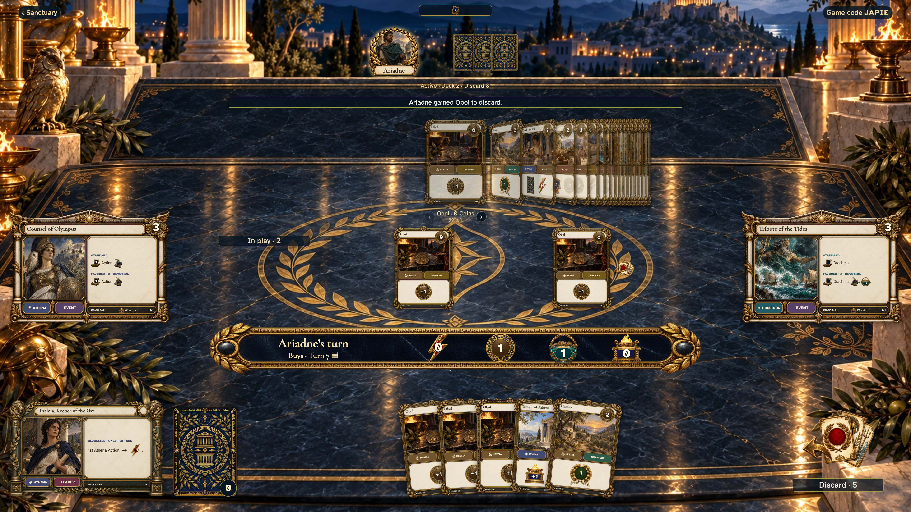</a>

- [x] The next live purchase lands beside played cards

## Reduced motion preserves the same purchase path and cost without travel

Viewpoint: **Theseus**.

<table>
<tr><th>Desktop · 1440 × 1000</th><th>Phone · 393 × 852</th></tr>
<tr>
<td valign="top"><a href="../../screenshots/follow-worship-and-a-purchase-once-while-reconnecting-without-an-animation-backlog/011-reduced-desktop-darwin.png">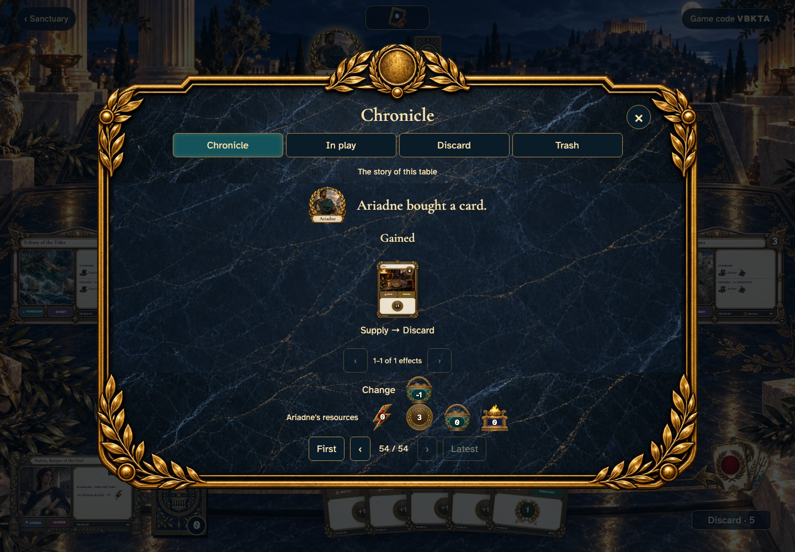</a></td>
<td valign="top"><a href="../../screenshots/follow-worship-and-a-purchase-once-while-reconnecting-without-an-animation-backlog/011-reduced-phone-darwin.png">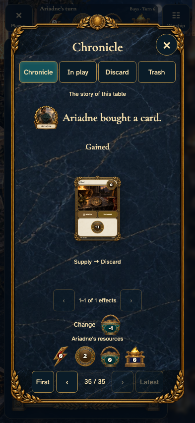</a></td>
</tr>
</table>

Tabletop · 3840 × 2160 — expand screenshot

<a href="../../screenshots/follow-worship-and-a-purchase-once-while-reconnecting-without-an-animation-backlog/011-reduced-tabletop-4k-darwin.png">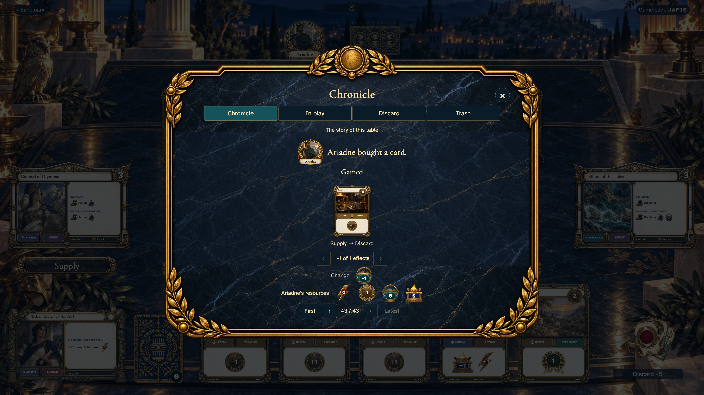</a>

- [x] Reduced motion preserves the same purchase path and cost without travel
