# inspect portrait and landscape gallery cards in the shared dialog frame

## Read Sacred Academy and its complete rules

<table>
<tr><th>Desktop · 1440 × 1000</th><th>Phone · 393 × 852</th></tr>
<tr>
<td valign="top"><a href="../../screenshots/inspect-portrait-and-landscape-gallery-cards-in-the-shared-dialog-frame/000-action-desktop-darwin.png">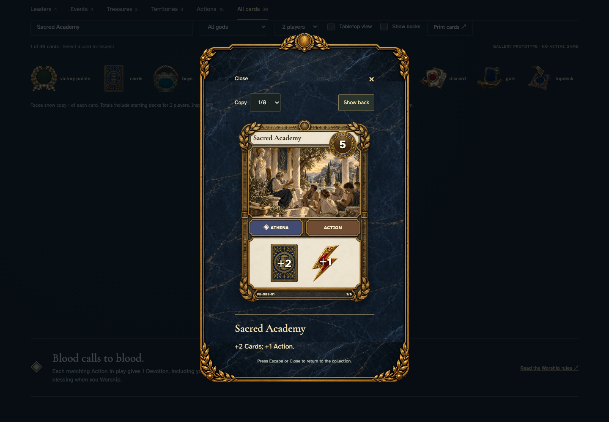</a></td>
<td valign="top"><a href="../../screenshots/inspect-portrait-and-landscape-gallery-cards-in-the-shared-dialog-frame/000-action-phone-darwin.png">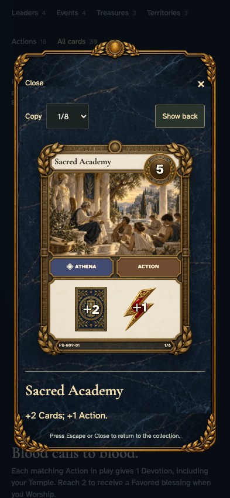</a></td>
</tr>
</table>

Tabletop · 3840 × 2160 — expand screenshot

<a href="../../screenshots/inspect-portrait-and-landscape-gallery-cards-in-the-shared-dialog-frame/000-action-tabletop-4k-darwin.png">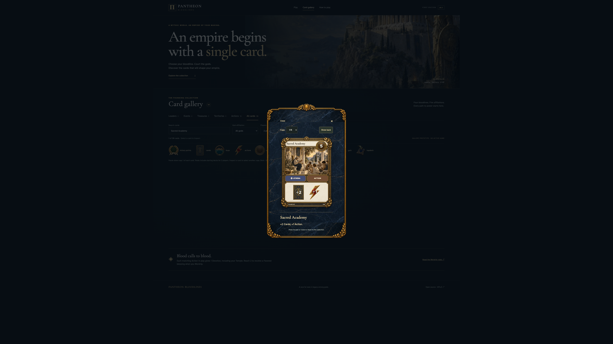</a>

- [x] The card, written rules, copy selector, and Close control fit inside the dialog.

## Turn over Sacred Academy

<table>
<tr><th>Desktop · 1440 × 1000</th><th>Phone · 393 × 852</th></tr>
<tr>
<td valign="top"><a href="../../screenshots/inspect-portrait-and-landscape-gallery-cards-in-the-shared-dialog-frame/001-action-back-desktop-darwin.png">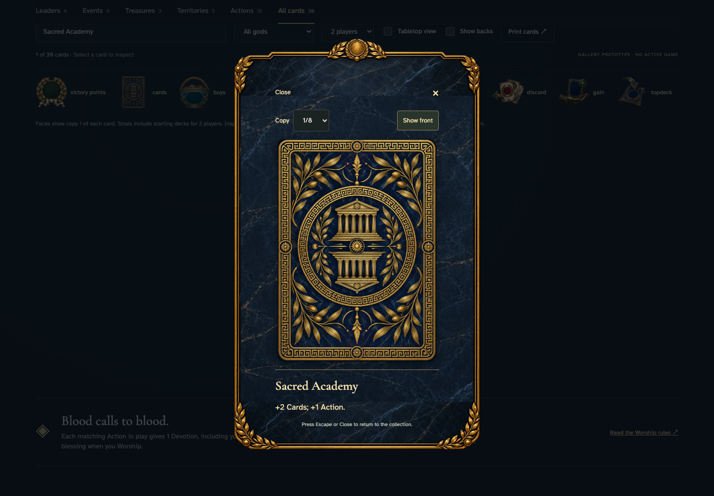</a></td>
<td valign="top"><a href="../../screenshots/inspect-portrait-and-landscape-gallery-cards-in-the-shared-dialog-frame/001-action-back-phone-darwin.png">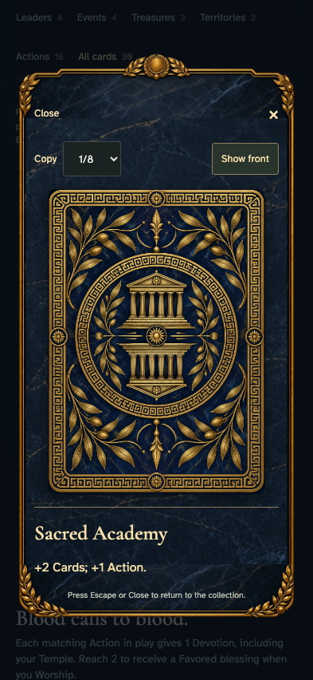</a></td>
</tr>
</table>

Tabletop · 3840 × 2160 — expand screenshot

<a href="../../screenshots/inspect-portrait-and-landscape-gallery-cards-in-the-shared-dialog-frame/001-action-back-tabletop-4k-darwin.png">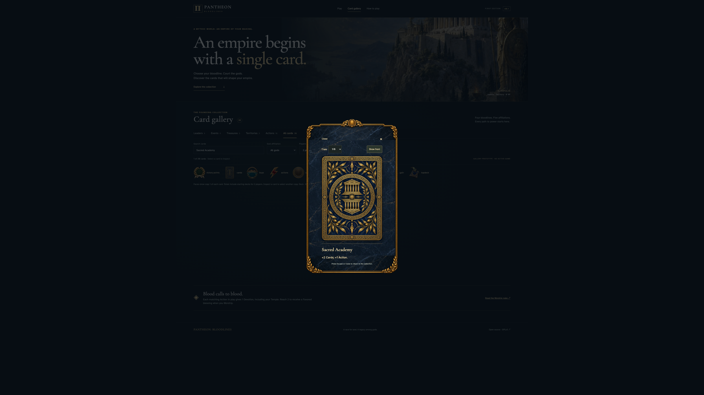</a>

- [x] The matching back replaces the face and can be turned back.

## Read Trial of the Spear and its complete rules

<table>
<tr><th>Desktop · 1440 × 1000</th><th>Phone · 393 × 852</th></tr>
<tr>
<td valign="top"><a href="../../screenshots/inspect-portrait-and-landscape-gallery-cards-in-the-shared-dialog-frame/002-event-desktop-darwin.png">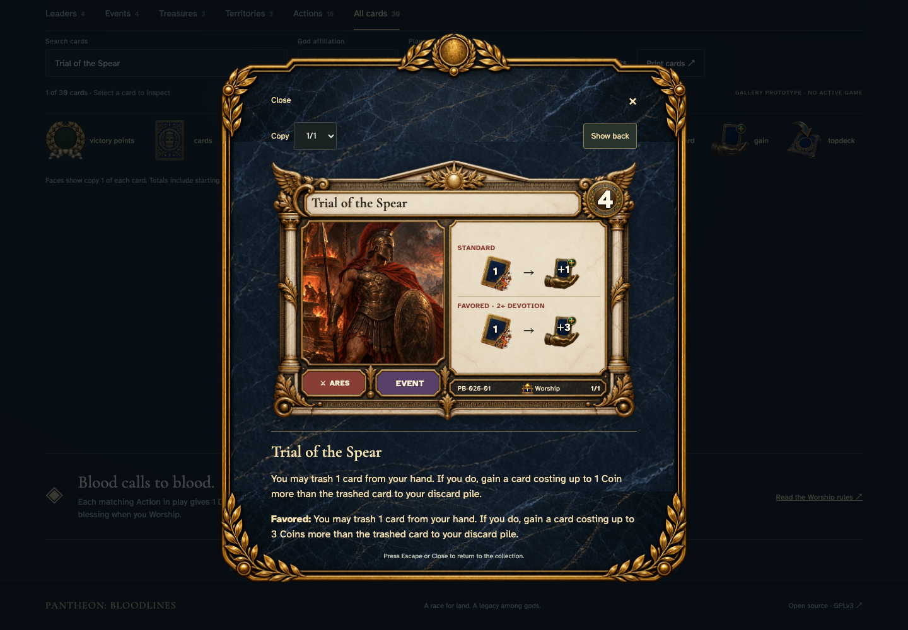</a></td>
<td valign="top"><a href="../../screenshots/inspect-portrait-and-landscape-gallery-cards-in-the-shared-dialog-frame/002-event-phone-darwin.png">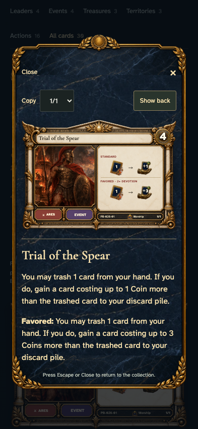</a></td>
</tr>
</table>

Tabletop · 3840 × 2160 — expand screenshot

<a href="../../screenshots/inspect-portrait-and-landscape-gallery-cards-in-the-shared-dialog-frame/002-event-tabletop-4k-darwin.png">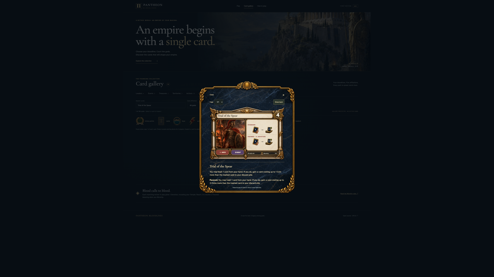</a>

- [x] The card, written rules, copy selector, and Close control fit inside the dialog.

## Turn over Trial of the Spear

<table>
<tr><th>Desktop · 1440 × 1000</th><th>Phone · 393 × 852</th></tr>
<tr>
<td valign="top"><a href="../../screenshots/inspect-portrait-and-landscape-gallery-cards-in-the-shared-dialog-frame/003-event-back-desktop-darwin.png">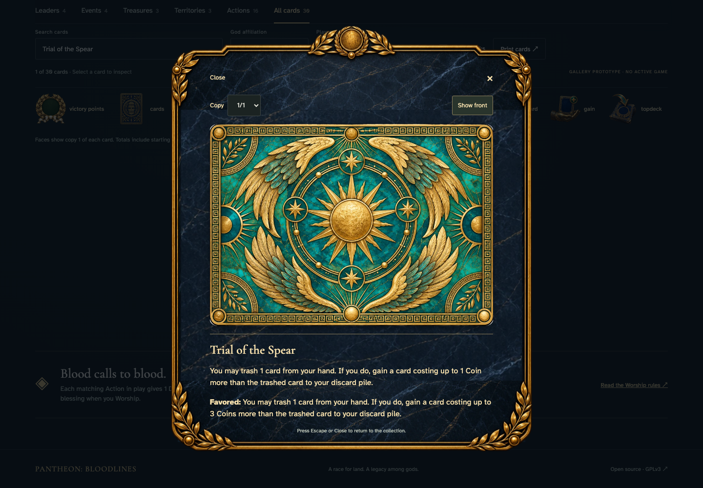</a></td>
<td valign="top"><a href="../../screenshots/inspect-portrait-and-landscape-gallery-cards-in-the-shared-dialog-frame/003-event-back-phone-darwin.png">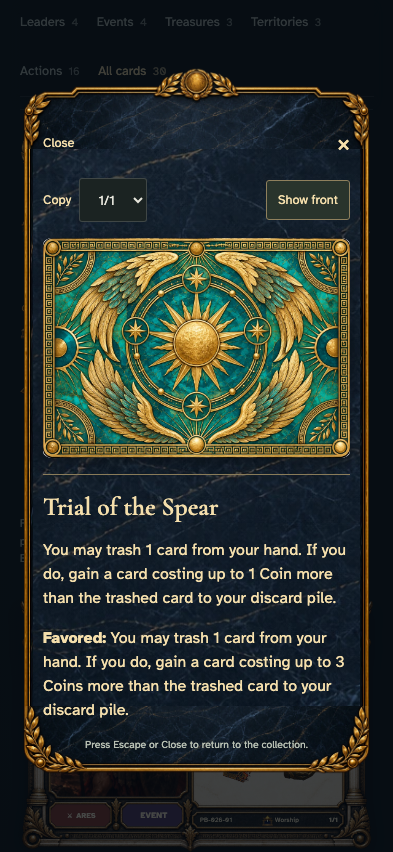</a></td>
</tr>
</table>

Tabletop · 3840 × 2160 — expand screenshot

<a href="../../screenshots/inspect-portrait-and-landscape-gallery-cards-in-the-shared-dialog-frame/003-event-back-tabletop-4k-darwin.png">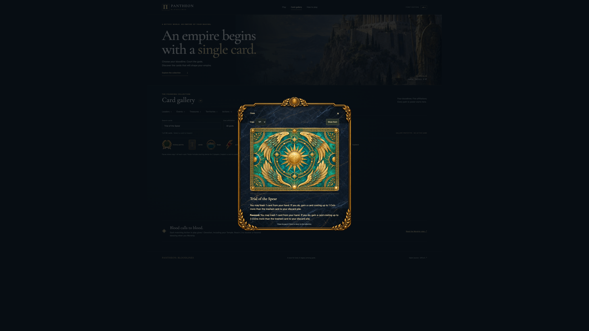</a>

- [x] The matching back replaces the face and can be turned back.

## Read Thaleia, Keeper of the Owl and its complete rules

<table>
<tr><th>Desktop · 1440 × 1000</th><th>Phone · 393 × 852</th></tr>
<tr>
<td valign="top"><a href="../../screenshots/inspect-portrait-and-landscape-gallery-cards-in-the-shared-dialog-frame/004-leader-desktop-darwin.png">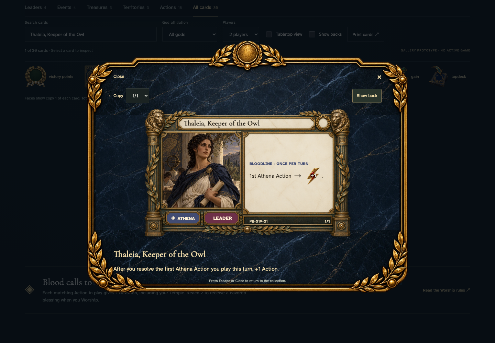</a></td>
<td valign="top"><a href="../../screenshots/inspect-portrait-and-landscape-gallery-cards-in-the-shared-dialog-frame/004-leader-phone-darwin.png">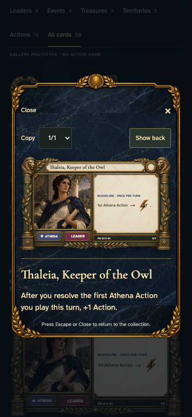</a></td>
</tr>
</table>

Tabletop · 3840 × 2160 — expand screenshot

<a href="../../screenshots/inspect-portrait-and-landscape-gallery-cards-in-the-shared-dialog-frame/004-leader-tabletop-4k-darwin.png">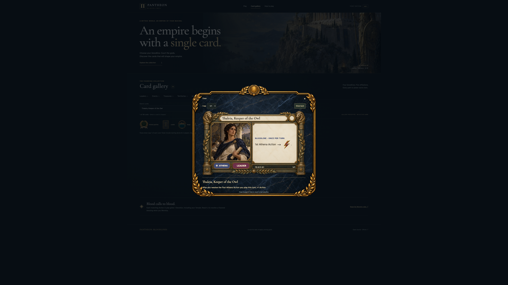</a>

- [x] The card, written rules, copy selector, and Close control fit inside the dialog.

## Turn over Thaleia, Keeper of the Owl

<table>
<tr><th>Desktop · 1440 × 1000</th><th>Phone · 393 × 852</th></tr>
<tr>
<td valign="top"><a href="../../screenshots/inspect-portrait-and-landscape-gallery-cards-in-the-shared-dialog-frame/005-leader-back-desktop-darwin.png">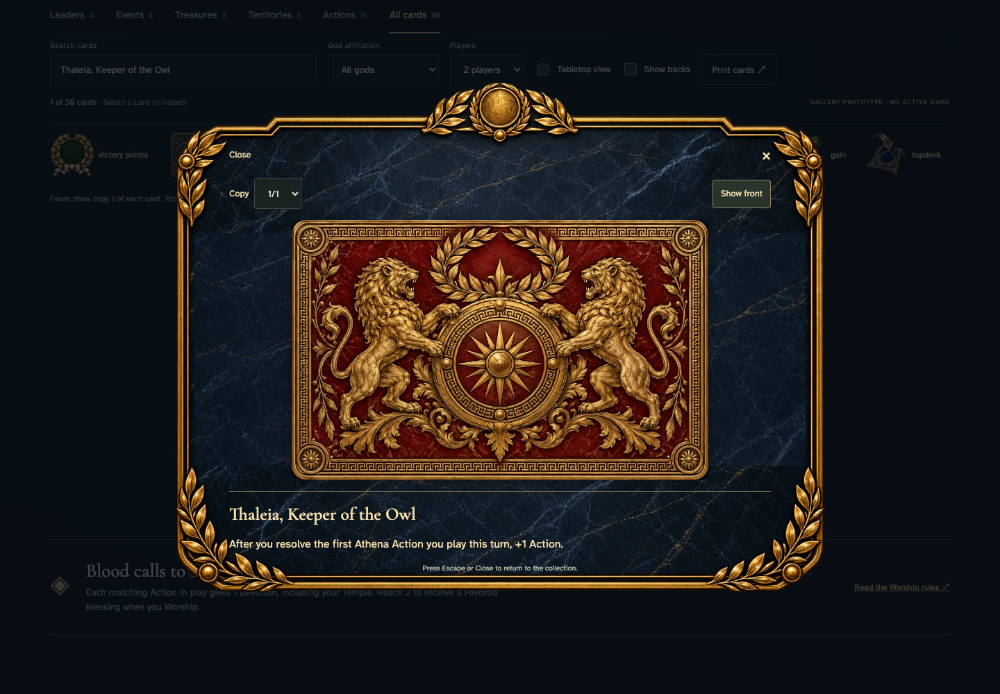</a></td>
<td valign="top"><a href="../../screenshots/inspect-portrait-and-landscape-gallery-cards-in-the-shared-dialog-frame/005-leader-back-phone-darwin.png">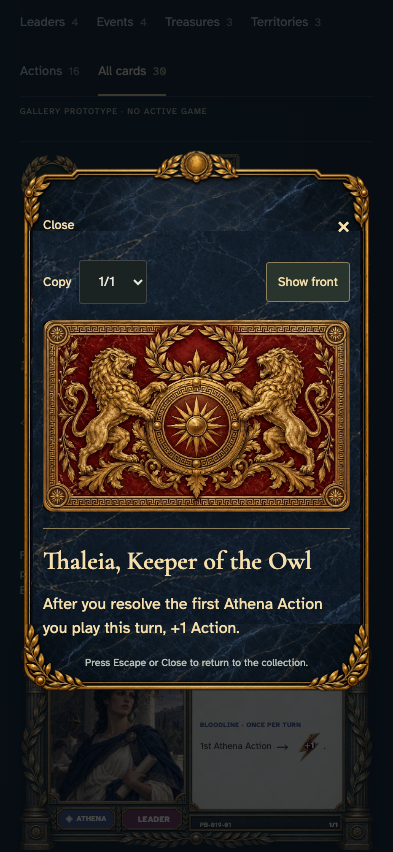</a></td>
</tr>
</table>

Tabletop · 3840 × 2160 — expand screenshot

<a href="../../screenshots/inspect-portrait-and-landscape-gallery-cards-in-the-shared-dialog-frame/005-leader-back-tabletop-4k-darwin.png">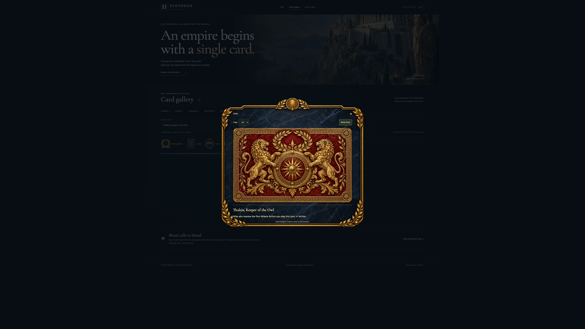</a>

- [x] The matching back replaces the face and can be turned back.
