# keep a private hand inspection open while another player moves

Recorded-history integration scenario. A legal event history prepares the starting position directly in the emulator. This verifies the illustrated effect from that position; it does not demonstrate the player journey to reach it.

## Theseus can inspect his own hand while Ariadne takes her turn

Viewpoint: **Theseus**.

<table>
<tr><th>Desktop · 1440 × 1000</th><th>Phone · 393 × 852</th></tr>
<tr>
<td valign="top"><a href="../../screenshots/keep-a-private-hand-inspection-open-while-another-player-moves/000-waiting-desktop-darwin.png">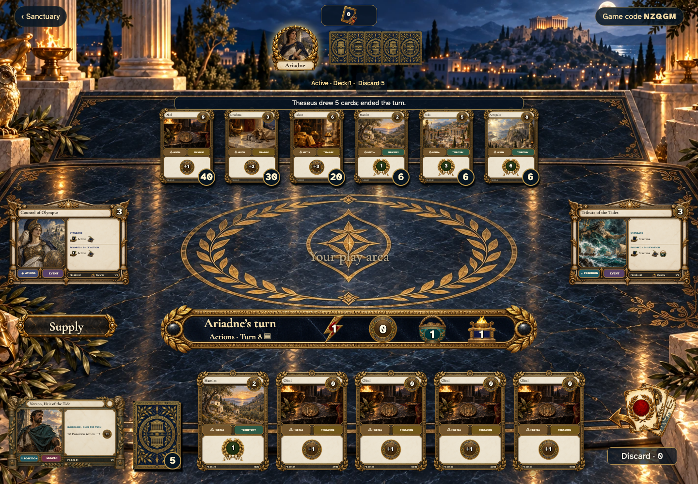</a></td>
<td valign="top"><a href="../../screenshots/keep-a-private-hand-inspection-open-while-another-player-moves/000-waiting-phone-darwin.png">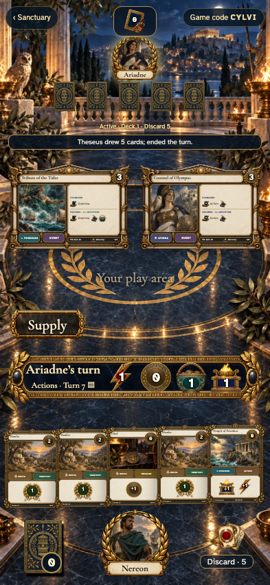</a></td>
</tr>
</table>

Tabletop · 3840 × 2160 — expand screenshot

<a href="../../screenshots/keep-a-private-hand-inspection-open-while-another-player-moves/000-waiting-tabletop-4k-darwin.png">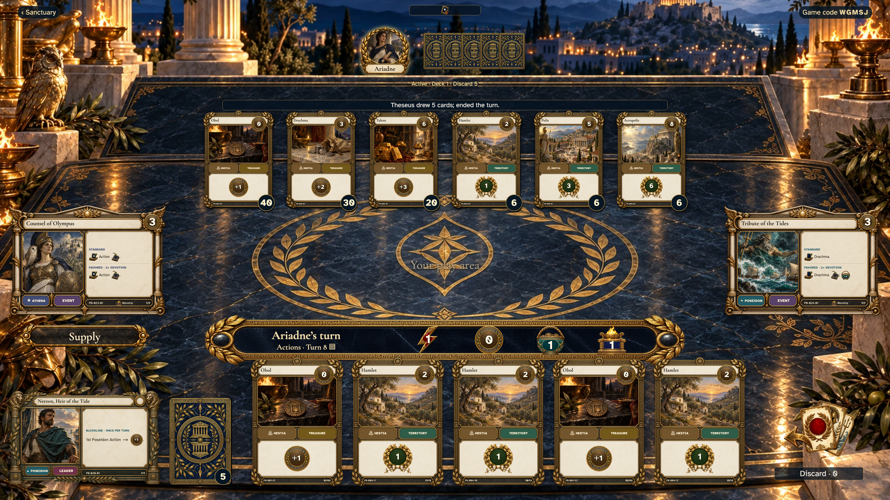</a>

- [x] The observer has five private hand cards and cannot play out of turn.

## Theseus reads his own card without exposing Ariadne’s hand

Viewpoint: **Theseus**.

<table>
<tr><th>Desktop · 1440 × 1000</th><th>Phone · 393 × 852</th></tr>
<tr>
<td valign="top"><a href="../../screenshots/keep-a-private-hand-inspection-open-while-another-player-moves/001-private-card-desktop-darwin.png">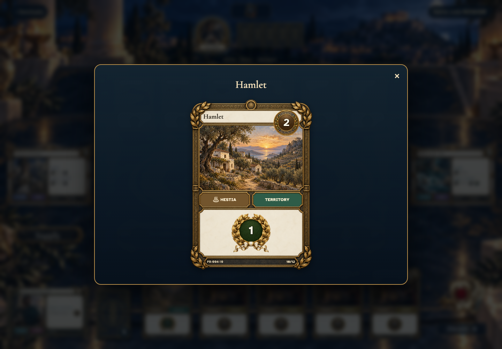</a></td>
<td valign="top"><a href="../../screenshots/keep-a-private-hand-inspection-open-while-another-player-moves/001-private-card-phone-darwin.png">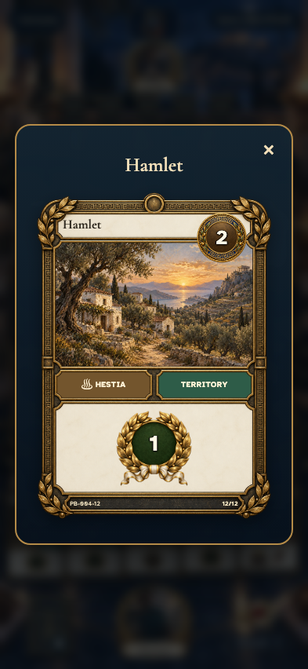</a></td>
</tr>
</table>

Tabletop · 3840 × 2160 — expand screenshot

<a href="../../screenshots/keep-a-private-hand-inspection-open-while-another-player-moves/001-private-card-tabletop-4k-darwin.png">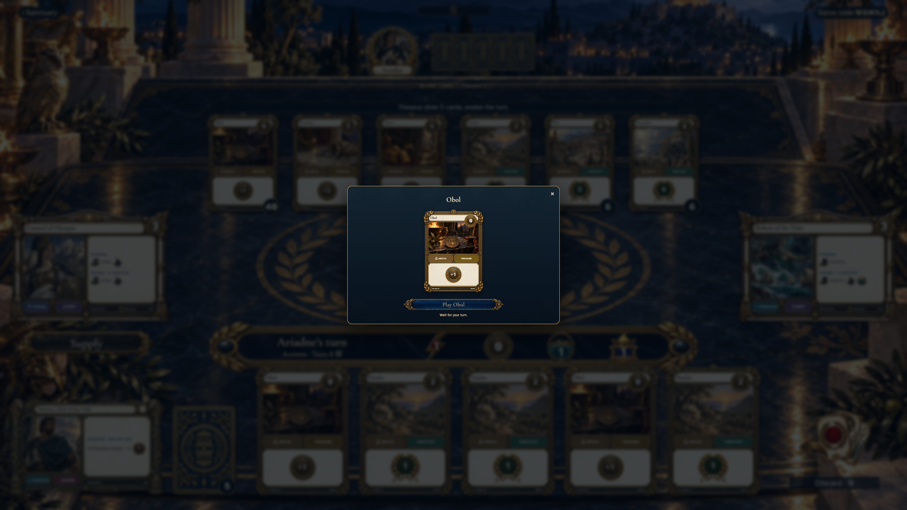</a>

- [x] Inspection is read-only during the other player’s turn.

## Ariadne’s Action updates the table without interrupting Theseus’s reading

Viewpoint: **Theseus**.

<table>
<tr><th>Desktop · 1440 × 1000</th><th>Phone · 393 × 852</th></tr>
<tr>
<td valign="top"><a href="../../screenshots/keep-a-private-hand-inspection-open-while-another-player-moves/002-kept-desktop-darwin.png">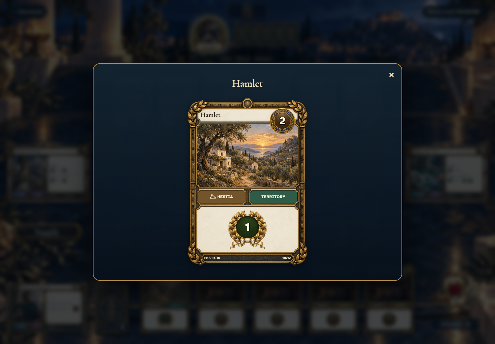</a></td>
<td valign="top"><a href="../../screenshots/keep-a-private-hand-inspection-open-while-another-player-moves/002-kept-phone-darwin.png">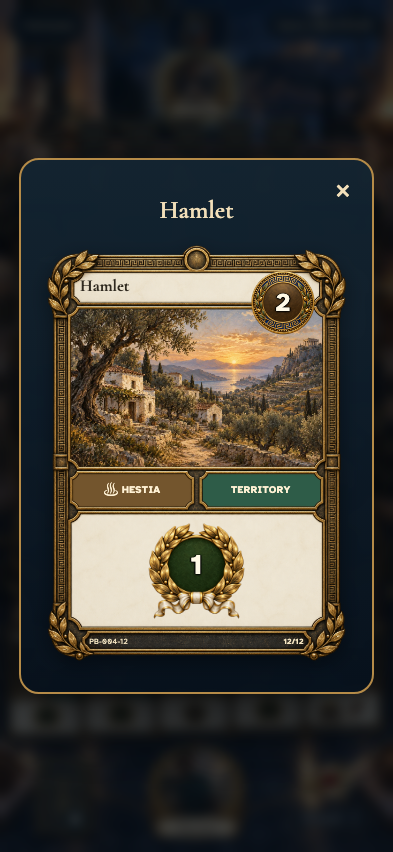</a></td>
</tr>
</table>

Tabletop · 3840 × 2160 — expand screenshot

<a href="../../screenshots/keep-a-private-hand-inspection-open-while-another-player-moves/002-kept-tabletop-4k-darwin.png">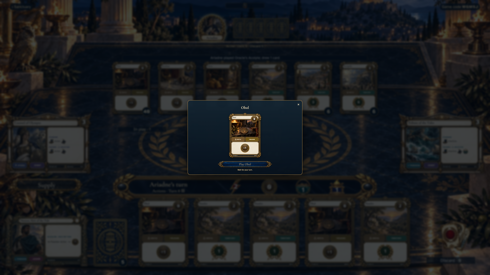</a>

- [x] The same private card remains open and no travel runs over it.

## Theseus returns to the same hand position

Viewpoint: **Theseus**.

<table>
<tr><th>Desktop · 1440 × 1000</th><th>Phone · 393 × 852</th></tr>
<tr>
<td valign="top"><a href="../../screenshots/keep-a-private-hand-inspection-open-while-another-player-moves/003-returned-desktop-darwin.png">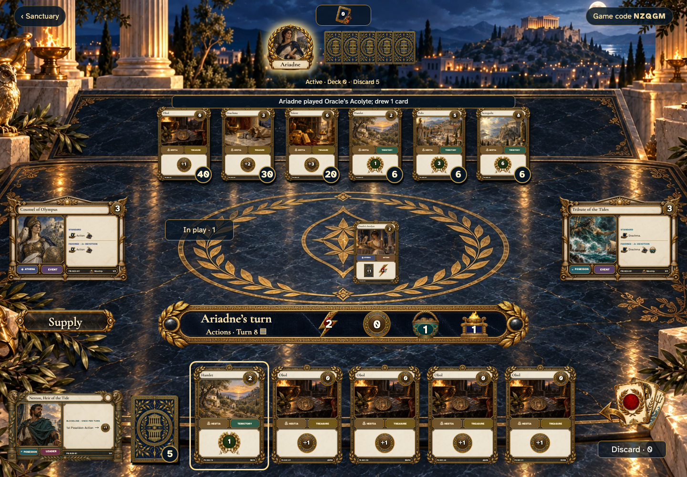</a></td>
<td valign="top"><a href="../../screenshots/keep-a-private-hand-inspection-open-while-another-player-moves/003-returned-phone-darwin.png">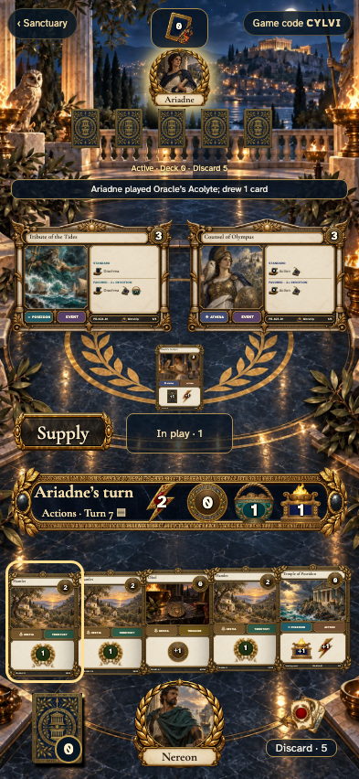</a></td>
</tr>
</table>

Tabletop · 3840 × 2160 — expand screenshot

<a href="../../screenshots/keep-a-private-hand-inspection-open-while-another-player-moves/003-returned-tabletop-4k-darwin.png">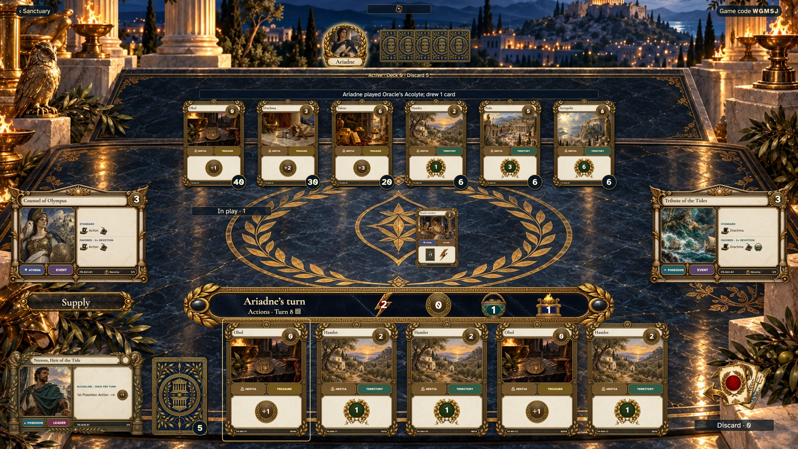</a>

- [x] Focus returns to the inspected card and old travel is not replayed.
