# keep reading the Chronicle when a friend completes the match

Recorded-history integration scenario. A complete legal match prepares the last cleanup in the emulator. The illustrated journey begins before the ending turn is confirmed; the prior turns are not presented as UI interactions.

## Ariadne is about to complete a legal recorded match

<table>
<tr><th>Desktop · 1440 × 1000</th><th>Phone · 393 × 852</th></tr>
<tr>
<td valign="top"><a href="../../screenshots/keep-reading-the-chronicle-when-a-friend-completes-the-match/000-last-turn-desktop-darwin.png">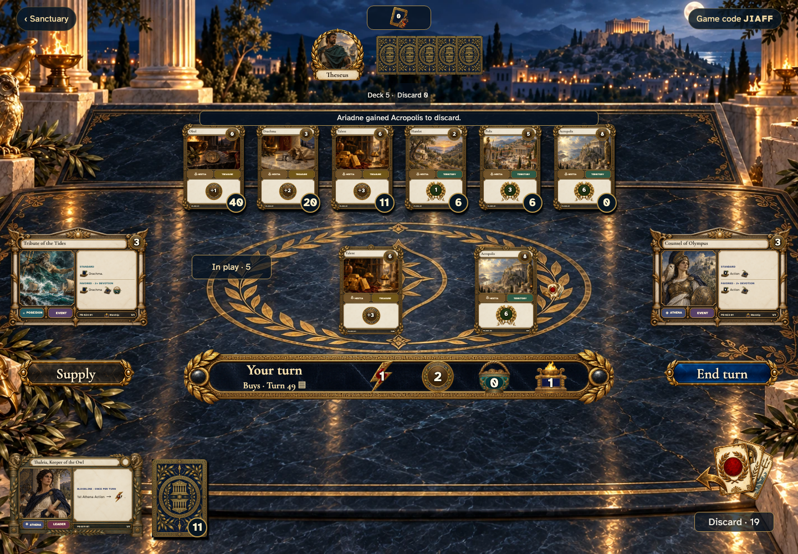</a></td>
<td valign="top"><a href="../../screenshots/keep-reading-the-chronicle-when-a-friend-completes-the-match/000-last-turn-phone-darwin.png">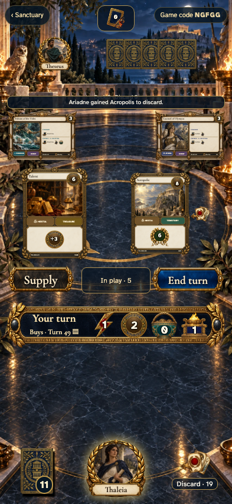</a></td>
</tr>
</table>

Tabletop · 3840 × 2160 — expand screenshot

<a href="../../screenshots/keep-reading-the-chronicle-when-a-friend-completes-the-match/000-last-turn-tabletop-4k-darwin.png">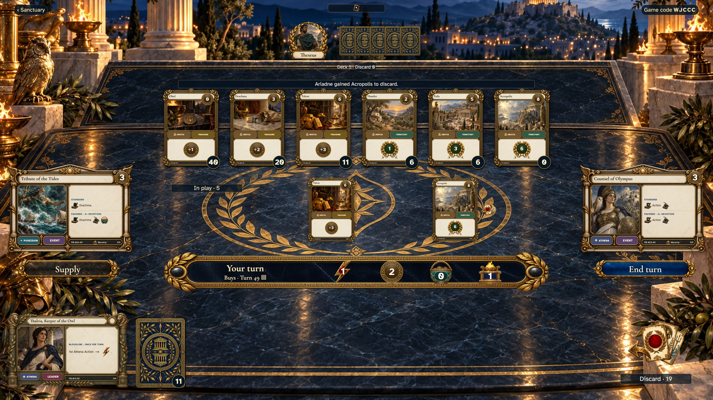</a>

- [x] The last cleanup has not happened yet.

## Theseus reads the beginning of the match

Viewpoint: **Theseus**.

<table>
<tr><th>Desktop · 1440 × 1000</th><th>Phone · 393 × 852</th></tr>
<tr>
<td valign="top"><a href="../../screenshots/keep-reading-the-chronicle-when-a-friend-completes-the-match/001-reading-desktop-darwin.png">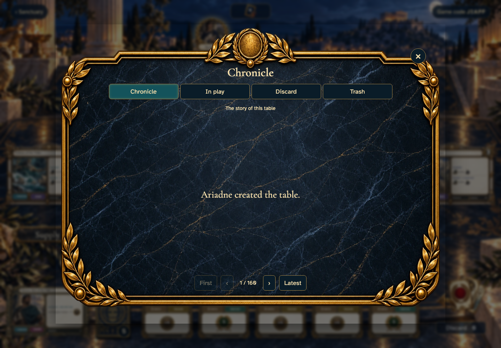</a></td>
<td valign="top"><a href="../../screenshots/keep-reading-the-chronicle-when-a-friend-completes-the-match/001-reading-phone-darwin.png">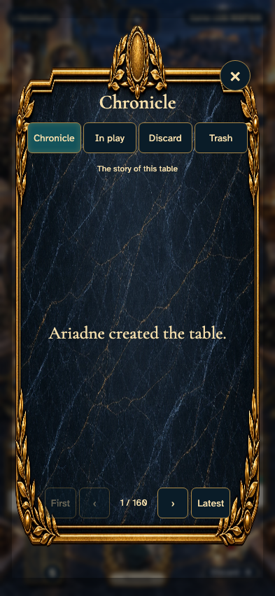</a></td>
</tr>
</table>

Tabletop · 3840 × 2160 — expand screenshot

<a href="../../screenshots/keep-reading-the-chronicle-when-a-friend-completes-the-match/001-reading-tabletop-4k-darwin.png">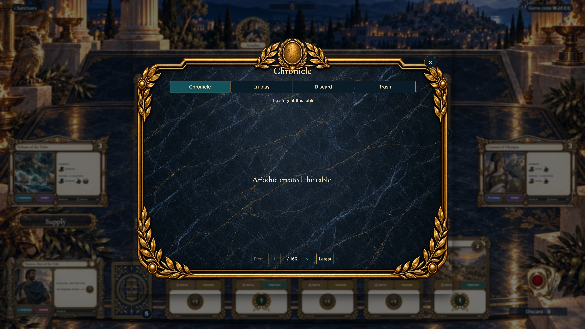</a>

- [x] Creation remains on the first page of the Chronicle.

## Ariadne receives the final standings

<table>
<tr><th>Desktop · 1440 × 1000</th><th>Phone · 393 × 852</th></tr>
<tr>
<td valign="top"></td>
<td valign="top"></td>
</tr>
</table>

Tabletop · 3840 × 2160 — expand screenshot

<a href="../../screenshots/keep-reading-the-chronicle-when-a-friend-completes-the-match/002-finished-tabletop-4k-darwin.png">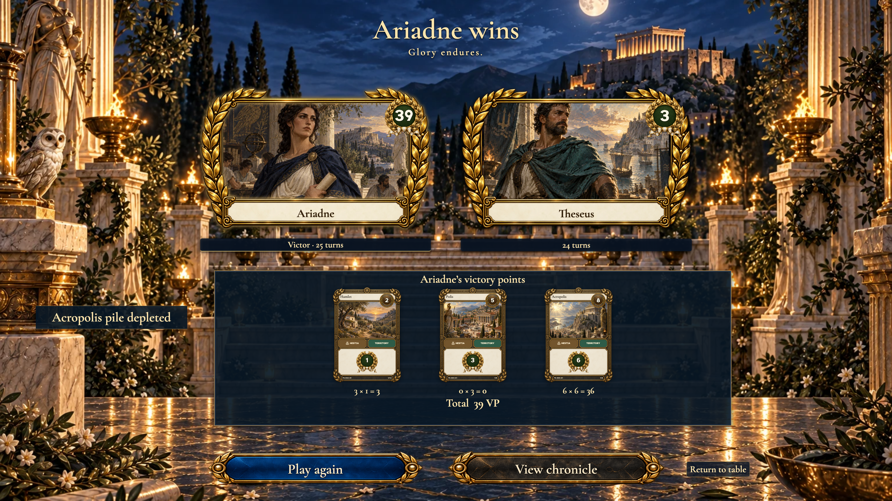</a>

- [x] Both empires have final scores.

## The finished game does not tear Theseus away from the Chronicle

Viewpoint: **Theseus**.

<table>
<tr><th>Desktop · 1440 × 1000</th><th>Phone · 393 × 852</th></tr>
<tr>
<td valign="top"><a href="../../screenshots/keep-reading-the-chronicle-when-a-friend-completes-the-match/003-undisturbed-desktop-darwin.png">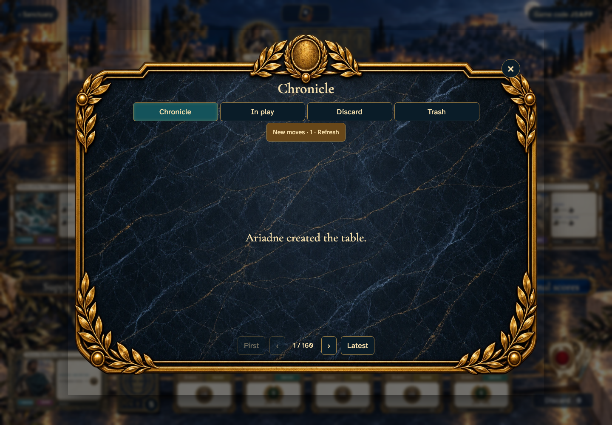</a></td>
<td valign="top"><a href="../../screenshots/keep-reading-the-chronicle-when-a-friend-completes-the-match/003-undisturbed-phone-darwin.png">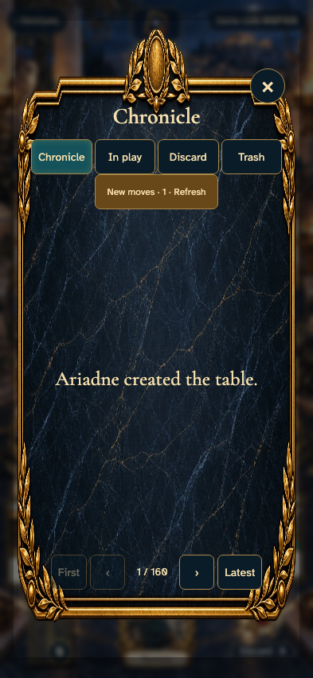</a></td>
</tr>
</table>

Tabletop · 3840 × 2160 — expand screenshot

<a href="../../screenshots/keep-reading-the-chronicle-when-a-friend-completes-the-match/003-undisturbed-tabletop-4k-darwin.png">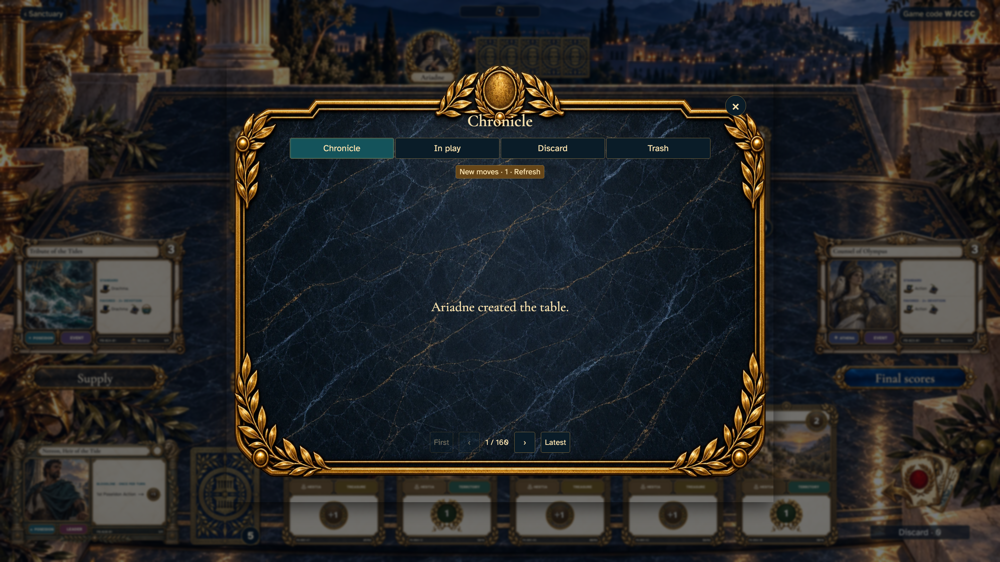</a>

- [x] His first page stays open, with the final move available explicitly.

## Theseus chooses to read the final cleanup

Viewpoint: **Theseus**.

<table>
<tr><th>Desktop · 1440 × 1000</th><th>Phone · 393 × 852</th></tr>
<tr>
<td valign="top"><a href="../../screenshots/keep-reading-the-chronicle-when-a-friend-completes-the-match/004-last-move-desktop-darwin.png">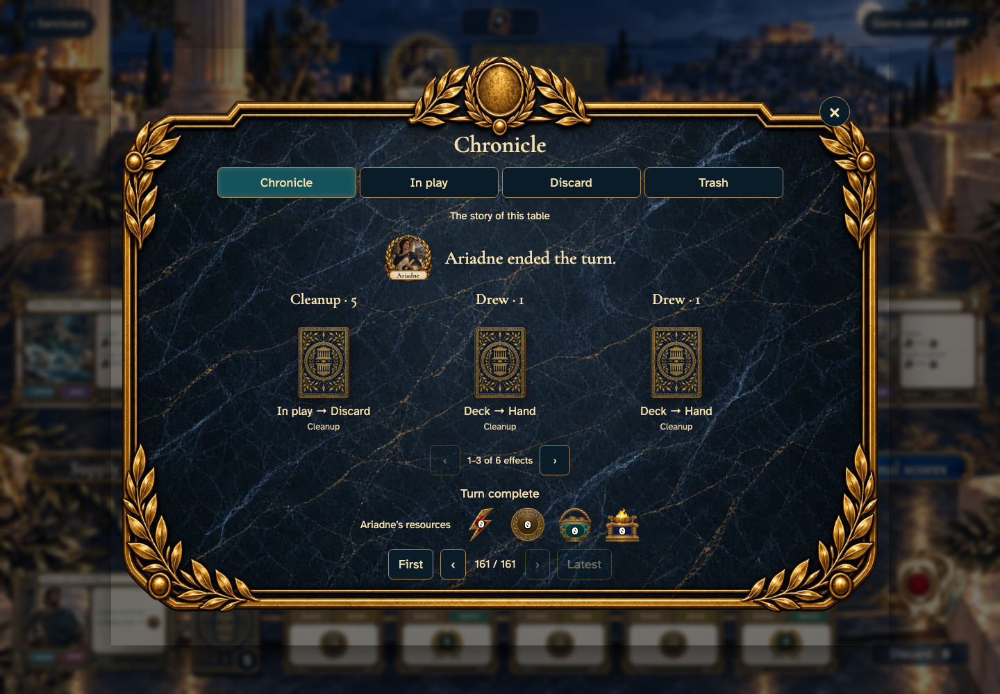</a></td>
<td valign="top"><a href="../../screenshots/keep-reading-the-chronicle-when-a-friend-completes-the-match/004-last-move-phone-darwin.png">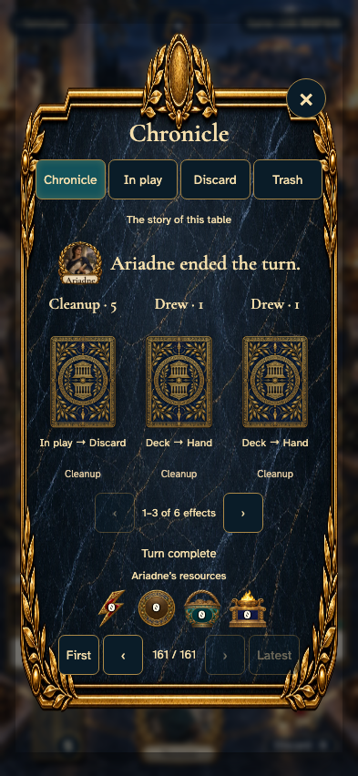</a></td>
</tr>
</table>

Tabletop · 3840 × 2160 — expand screenshot

<a href="../../screenshots/keep-reading-the-chronicle-when-a-friend-completes-the-match/004-last-move-tabletop-4k-darwin.png">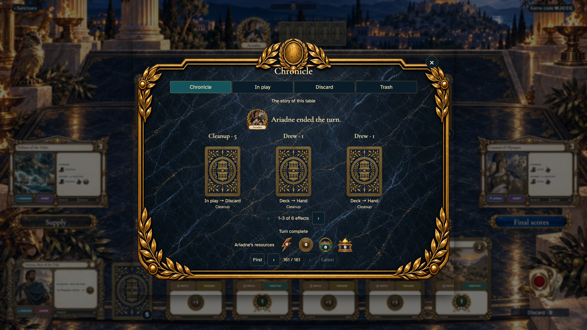</a>

- [x] The final entry names the actor and shows cleared resources.

## Theseus opens the same final standings when ready

Viewpoint: **Theseus**.

<table>
<tr><th>Desktop · 1440 × 1000</th><th>Phone · 393 × 852</th></tr>
<tr>
<td valign="top"><a href="../../screenshots/keep-reading-the-chronicle-when-a-friend-completes-the-match/005-scores-desktop-darwin.png">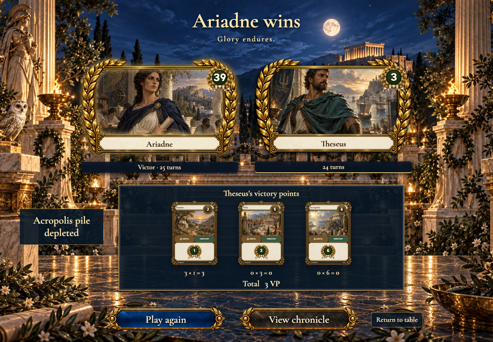</a></td>
<td valign="top"><a href="../../screenshots/keep-reading-the-chronicle-when-a-friend-completes-the-match/005-scores-phone-darwin.png">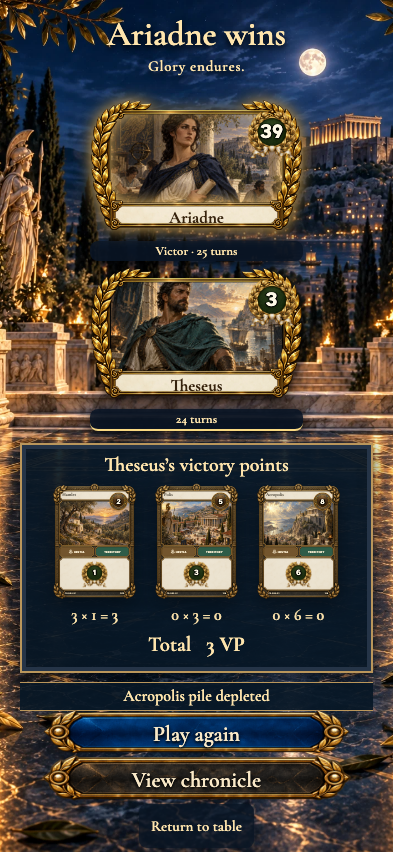</a></td>
</tr>
</table>

Tabletop · 3840 × 2160 — expand screenshot

- [x] The winner agrees with Ariadne’s view.
