# tap to play and hold or right-click to inspect without committing

Recorded-history integration scenario. A legal event history prepares the starting position directly in the emulator. This verifies the illustrated effect from that position; it does not demonstrate the player journey to reach it.

## Right-click to inspect before deciding

<table>
<tr><th>Desktop · 1440 × 1000</th><th>Phone · 393 × 852</th></tr>
<tr>
<td valign="top"><a href="../../screenshots/tap-to-play-and-hold-or-right-click-to-inspect-without-committing/000-right-click-desktop-darwin.png">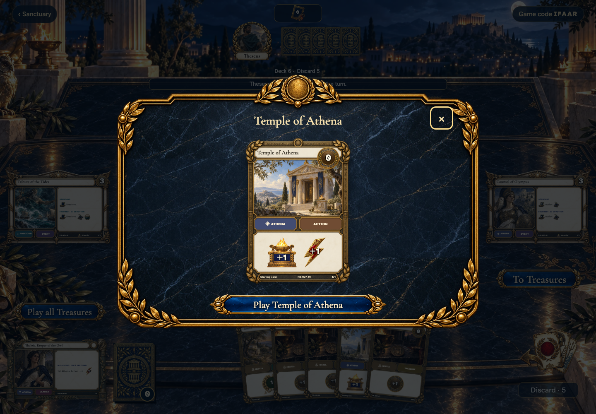</a></td>
<td valign="top"><a href="../../screenshots/tap-to-play-and-hold-or-right-click-to-inspect-without-committing/000-right-click-phone-darwin.png">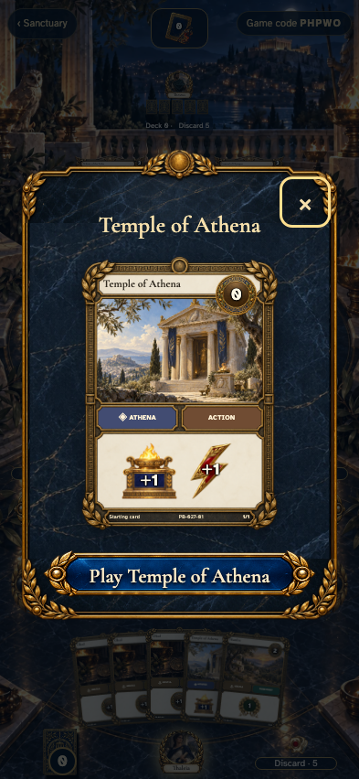</a></td>
</tr>
</table>

Tabletop · 3840 × 2160 — expand screenshot

<a href="../../screenshots/tap-to-play-and-hold-or-right-click-to-inspect-without-committing/000-right-click-tabletop-4k-darwin.png">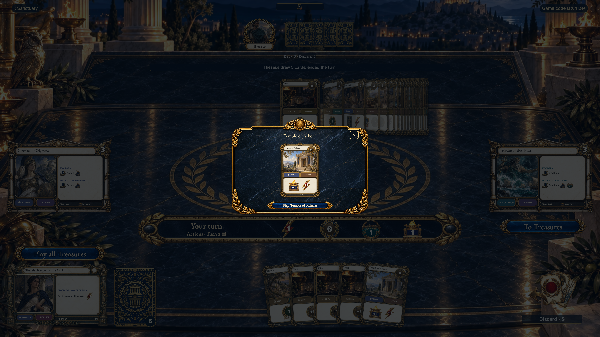</a>

- [x] Inspection offers Play and leaves the recorded game untouched.

## Hold a card to inspect it

<table>
<tr><th>Desktop · 1440 × 1000</th><th>Phone · 393 × 852</th></tr>
<tr>
<td valign="top"><a href="../../screenshots/tap-to-play-and-hold-or-right-click-to-inspect-without-committing/001-long-press-desktop-darwin.png">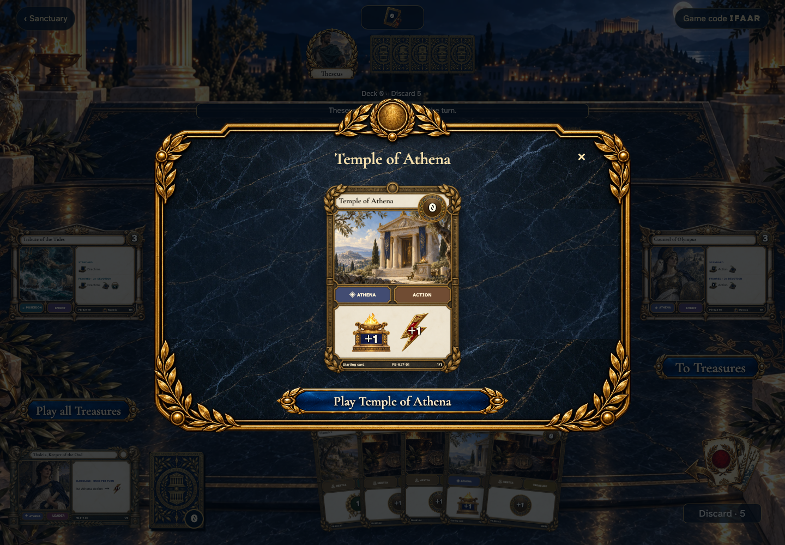</a></td>
<td valign="top"><a href="../../screenshots/tap-to-play-and-hold-or-right-click-to-inspect-without-committing/001-long-press-phone-darwin.png">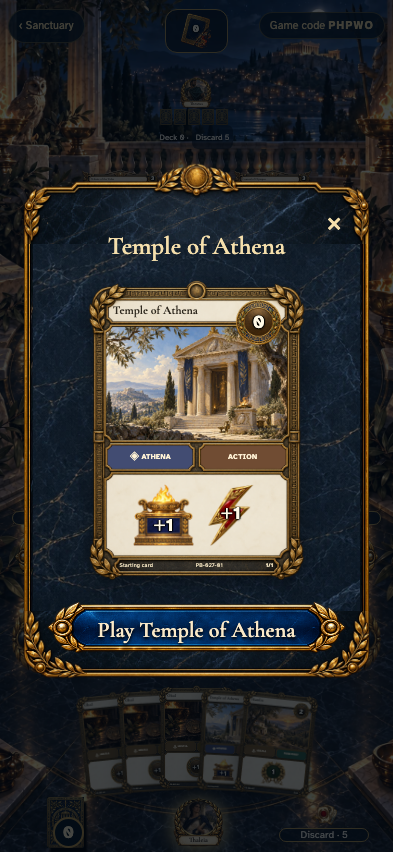</a></td>
</tr>
</table>

Tabletop · 3840 × 2160 — expand screenshot

<a href="../../screenshots/tap-to-play-and-hold-or-right-click-to-inspect-without-committing/001-long-press-tabletop-4k-darwin.png">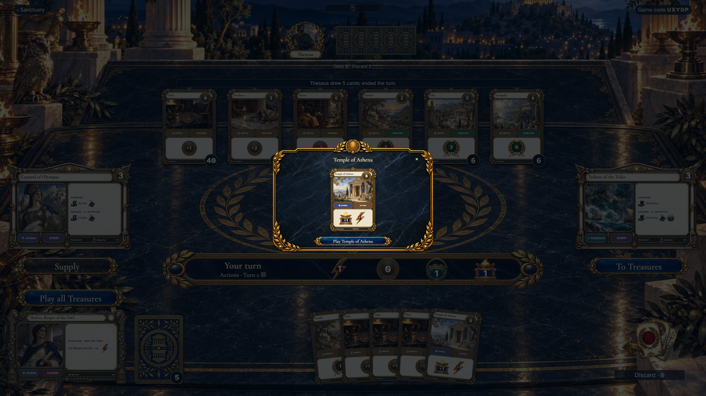</a>

- [x] Releasing a long press keeps the card in hand and does not play it.

## A quick tap plays the Action immediately

<table>
<tr><th>Desktop · 1440 × 1000</th><th>Phone · 393 × 852</th></tr>
<tr>
<td valign="top"><a href="../../screenshots/tap-to-play-and-hold-or-right-click-to-inspect-without-committing/002-tap-action-desktop-darwin.png">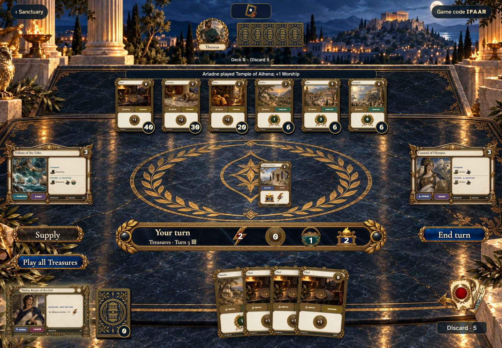</a></td>
<td valign="top"><a href="../../screenshots/tap-to-play-and-hold-or-right-click-to-inspect-without-committing/002-tap-action-phone-darwin.png">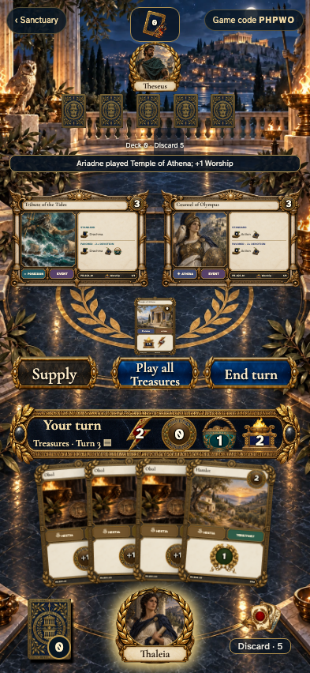</a></td>
</tr>
</table>

Tabletop · 3840 × 2160 — expand screenshot

<a href="../../screenshots/tap-to-play-and-hold-or-right-click-to-inspect-without-committing/002-tap-action-tabletop-4k-darwin.png">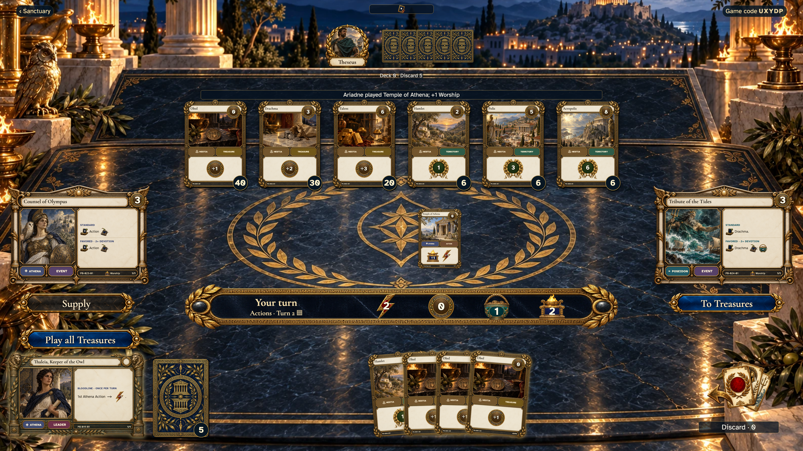</a>

- [x] The card enters play once with no confirmation dialog.

## Play a Treasure straight from Actions

<table>
<tr><th>Desktop · 1440 × 1000</th><th>Phone · 393 × 852</th></tr>
<tr>
<td valign="top"><a href="../../screenshots/tap-to-play-and-hold-or-right-click-to-inspect-without-committing/003-direct-treasure-desktop-darwin.png">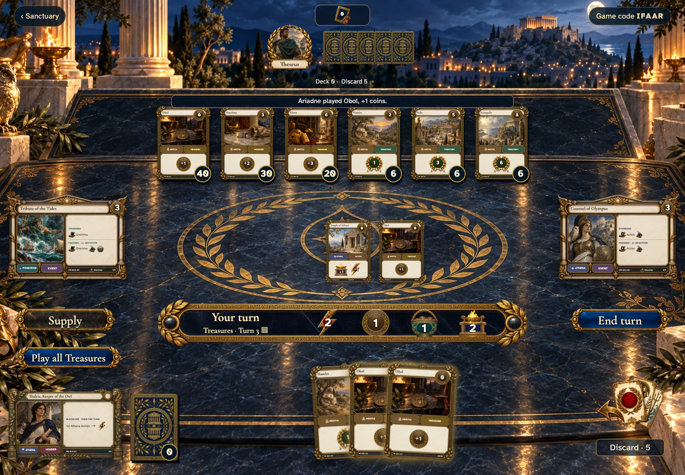</a></td>
<td valign="top"><a href="../../screenshots/tap-to-play-and-hold-or-right-click-to-inspect-without-committing/003-direct-treasure-phone-darwin.png">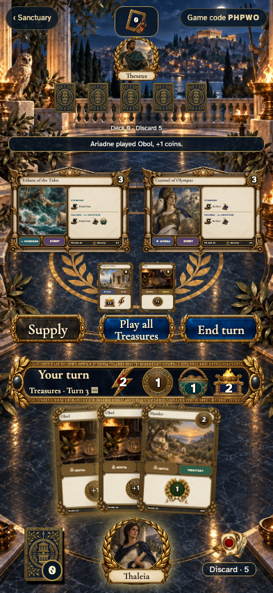</a></td>
</tr>
</table>

Tabletop · 3840 × 2160 — expand screenshot

<a href="../../screenshots/tap-to-play-and-hold-or-right-click-to-inspect-without-committing/003-direct-treasure-tabletop-4k-darwin.png">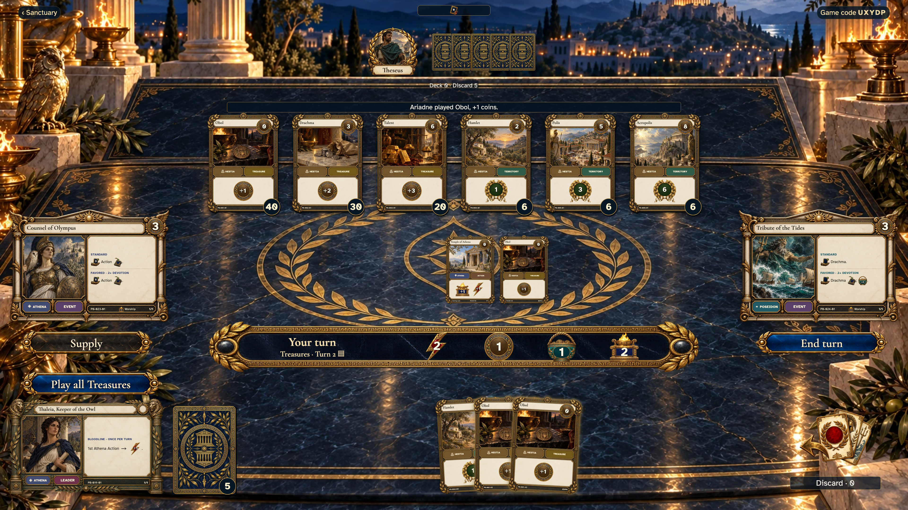</a>

- [x] Keyboard activation plays once and advances to Treasures in the same command.
