# invite an Engine bot to the real table and take turns together

## Ariadne opens a normal two-player table

<table>
<tr><th>Desktop · 1440 × 1000</th><th>Phone · 393 × 852</th></tr>
<tr>
<td valign="top"><a href="../../screenshots/invite-an-engine-bot-to-the-real-table-and-take-turns-together/000-created-desktop-darwin.png">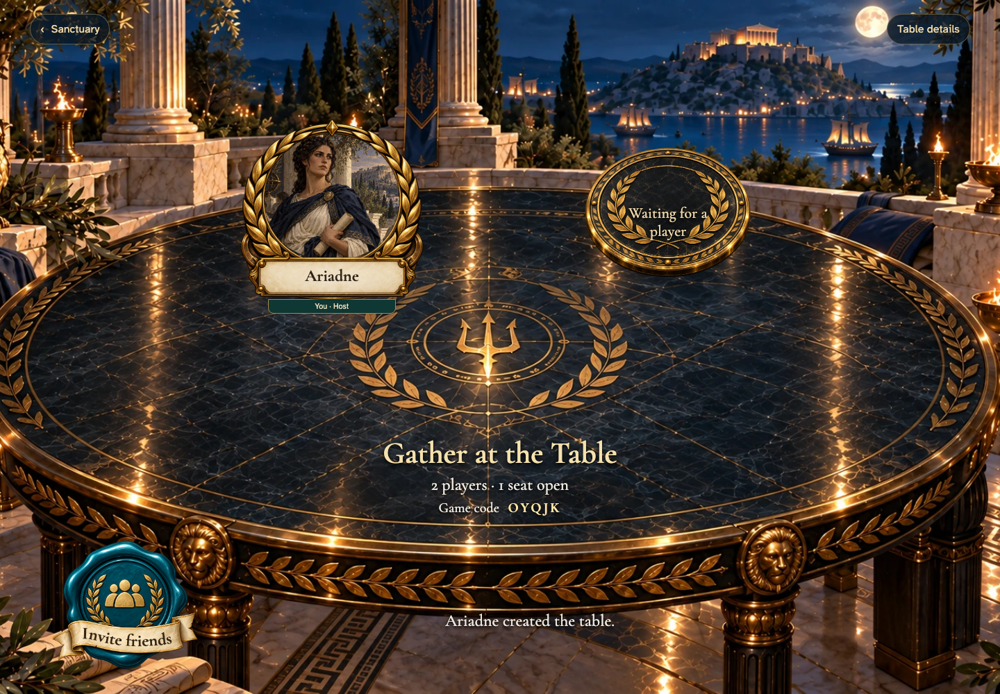</a></td>
<td valign="top"><a href="../../screenshots/invite-an-engine-bot-to-the-real-table-and-take-turns-together/000-created-phone-darwin.png">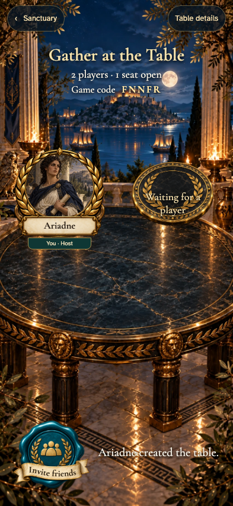</a></td>
</tr>
</table>

Tabletop · 3840 × 2160 — expand screenshot

<a href="../../screenshots/invite-an-engine-bot-to-the-real-table-and-take-turns-together/000-created-tabletop-4k-darwin.png">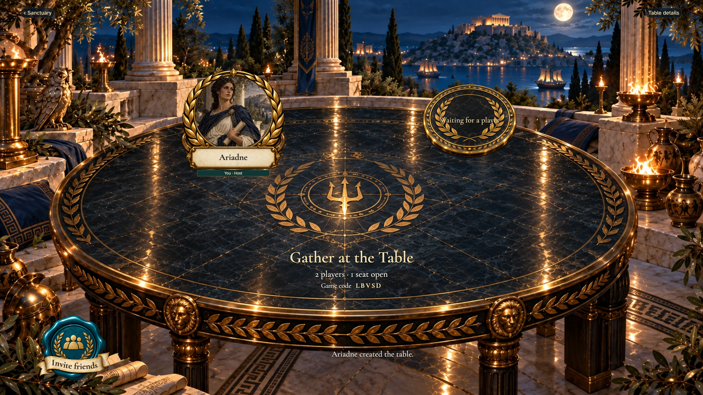</a>

- [x] Her host seat is occupied and another player can join.

## Choose the historical Engine as a table guest

<table>
<tr><th>Desktop · 1440 × 1000</th><th>Phone · 393 × 852</th></tr>
<tr>
<td valign="top"><a href="../../screenshots/invite-an-engine-bot-to-the-real-table-and-take-turns-together/001-invite-desktop-darwin.png">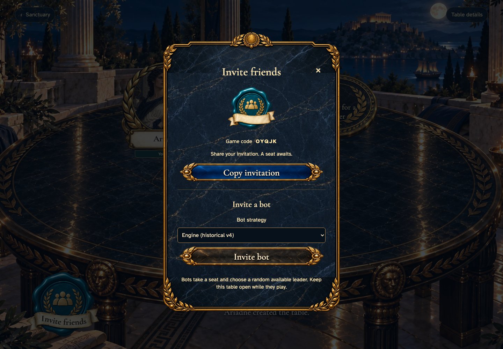</a></td>
<td valign="top"><a href="../../screenshots/invite-an-engine-bot-to-the-real-table-and-take-turns-together/001-invite-phone-darwin.png">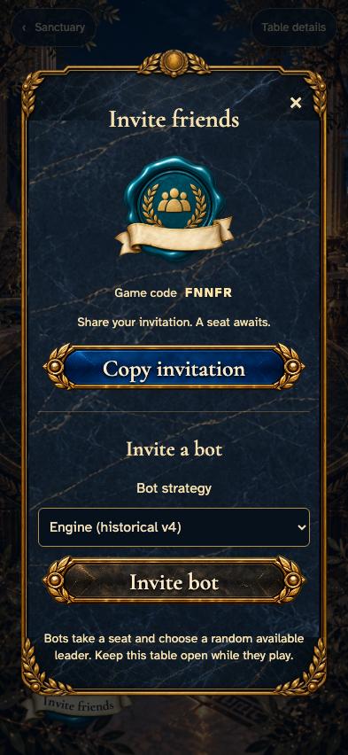</a></td>
</tr>
</table>

Tabletop · 3840 × 2160 — expand screenshot

<a href="../../screenshots/invite-an-engine-bot-to-the-real-table-and-take-turns-together/001-invite-tabletop-4k-darwin.png">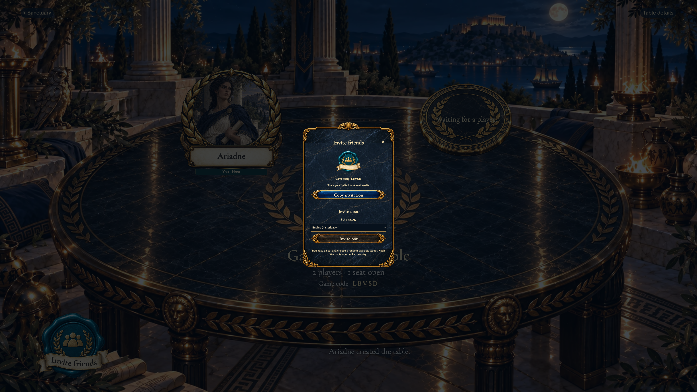</a>

- [x] The same invitation dialog offers a human invitation and a bot seat.

## The bot occupies its own seat

<table>
<tr><th>Desktop · 1440 × 1000</th><th>Phone · 393 × 852</th></tr>
<tr>
<td valign="top"><a href="../../screenshots/invite-an-engine-bot-to-the-real-table-and-take-turns-together/002-joined-desktop-darwin.png">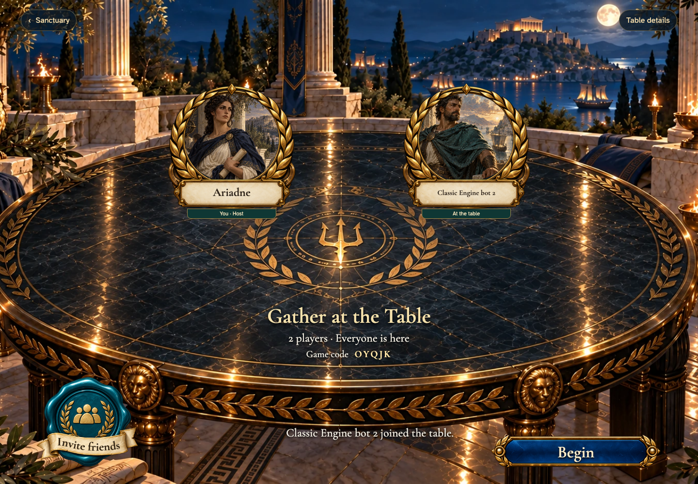</a></td>
<td valign="top"><a href="../../screenshots/invite-an-engine-bot-to-the-real-table-and-take-turns-together/002-joined-phone-darwin.png">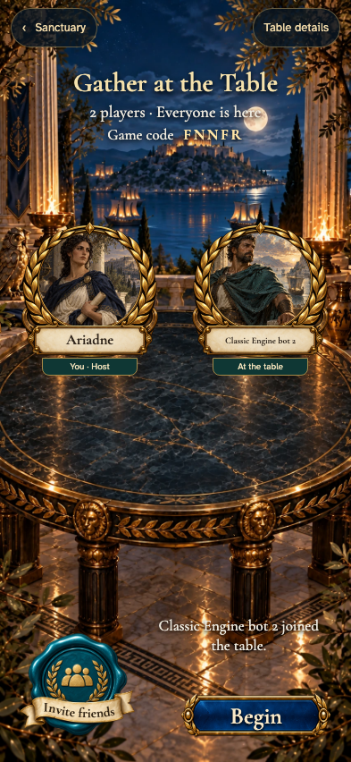</a></td>
</tr>
</table>

Tabletop · 3840 × 2160 — expand screenshot

<a href="../../screenshots/invite-an-engine-bot-to-the-real-table-and-take-turns-together/002-joined-tabletop-4k-darwin.png">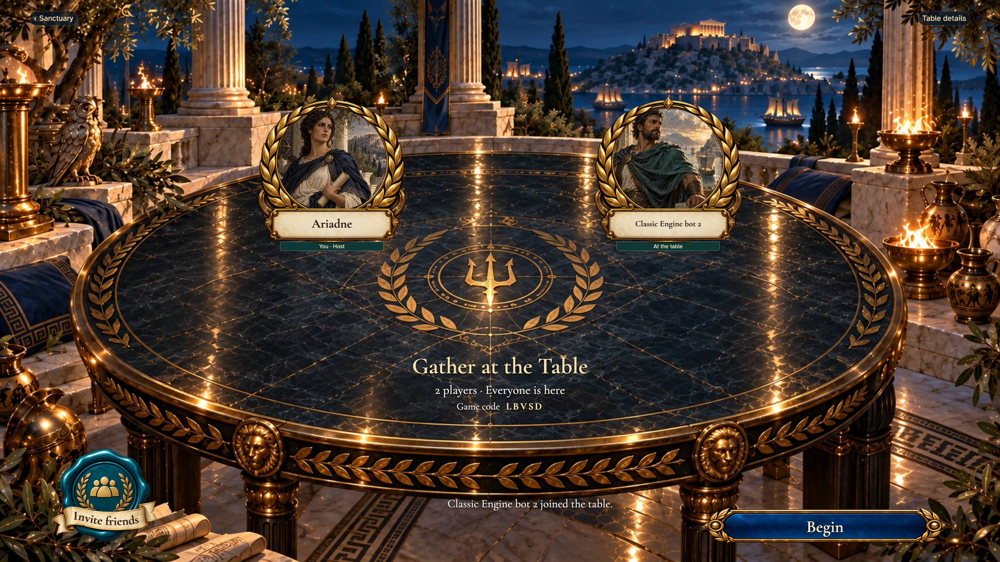</a>

- [x] Both seats are filled and the host can begin.

## The bot chooses a free bloodline when its draft turn arrives

<table>
<tr><th>Desktop · 1440 × 1000</th><th>Phone · 393 × 852</th></tr>
<tr>
<td valign="top"><a href="../../screenshots/invite-an-engine-bot-to-the-real-table-and-take-turns-together/003-draft-desktop-darwin.png">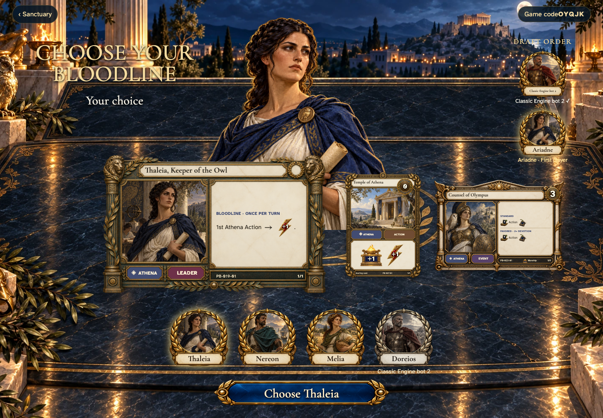</a></td>
<td valign="top"><a href="../../screenshots/invite-an-engine-bot-to-the-real-table-and-take-turns-together/003-draft-phone-darwin.png">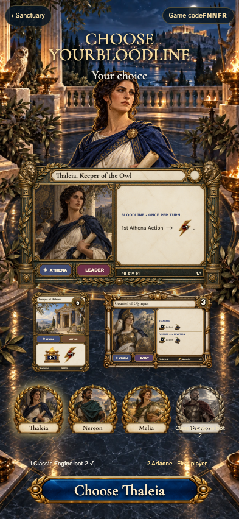</a></td>
</tr>
</table>

Tabletop · 3840 × 2160 — expand screenshot

<a href="../../screenshots/invite-an-engine-bot-to-the-real-table-and-take-turns-together/003-draft-tabletop-4k-darwin.png">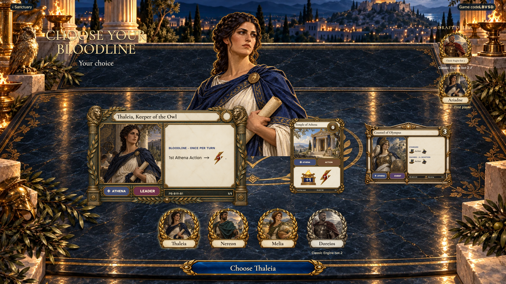</a>

- [x] Ariadne receives her normal draft choice.

## Ariadne plays on the same table as her bot opponent

<table>
<tr><th>Desktop · 1440 × 1000</th><th>Phone · 393 × 852</th></tr>
<tr>
<td valign="top"><a href="../../screenshots/invite-an-engine-bot-to-the-real-table-and-take-turns-together/004-playing-desktop-darwin.png">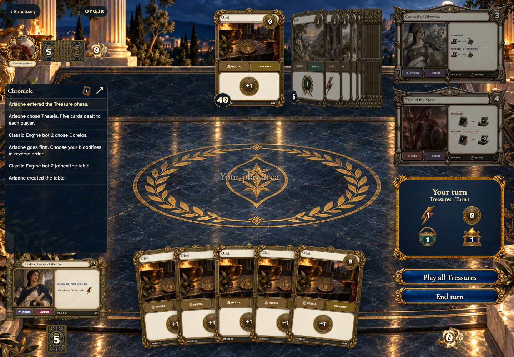</a></td>
<td valign="top"><a href="../../screenshots/invite-an-engine-bot-to-the-real-table-and-take-turns-together/004-playing-phone-darwin.png">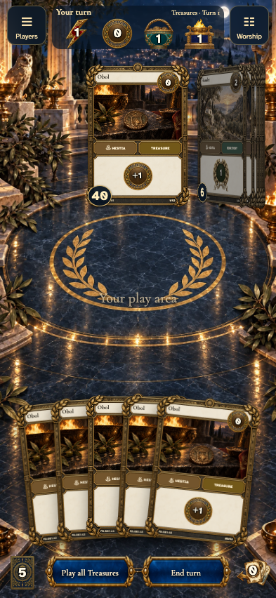</a></td>
</tr>
</table>

Tabletop · 3840 × 2160 — expand screenshot

<a href="../../screenshots/invite-an-engine-bot-to-the-real-table-and-take-turns-together/004-playing-tabletop-4k-darwin.png">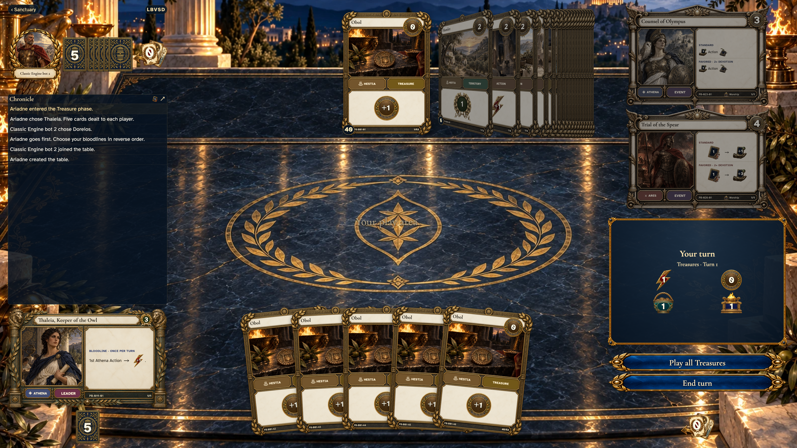</a>

- [x] The normal table shows her private hand and one opponent, without a separate practice toolbar.

## The Engine completes its turn and returns play to Ariadne

<table>
<tr><th>Desktop · 1440 × 1000</th><th>Phone · 393 × 852</th></tr>
<tr>
<td valign="top"></td>
<td valign="top"></td>
</tr>
</table>

Tabletop · 3840 × 2160 — expand screenshot

<a href="../../screenshots/invite-an-engine-bot-to-the-real-table-and-take-turns-together/005-bot-turn-tabletop-4k-darwin.png">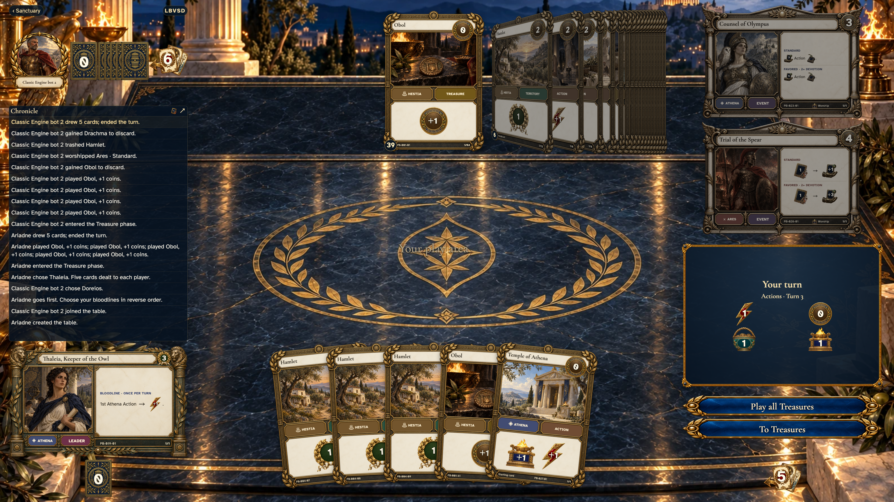</a>

- [x] Ariadne has a fresh hand and can take her next turn.

## Refresh restores the shared game rather than starting a new practice match

<table>
<tr><th>Desktop · 1440 × 1000</th><th>Phone · 393 × 852</th></tr>
<tr>
<td valign="top"><a href="../../screenshots/invite-an-engine-bot-to-the-real-table-and-take-turns-together/006-restored-desktop-darwin.png">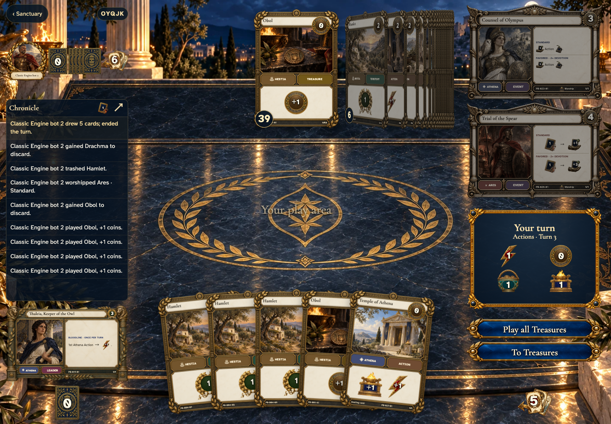</a></td>
<td valign="top"><a href="../../screenshots/invite-an-engine-bot-to-the-real-table-and-take-turns-together/006-restored-phone-darwin.png">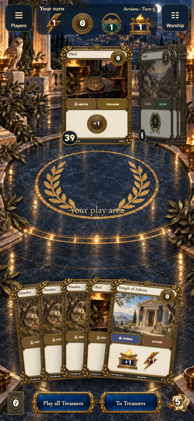</a></td>
</tr>
</table>

Tabletop · 3840 × 2160 — expand screenshot

- [x] Both seats and the active human turn are preserved.
