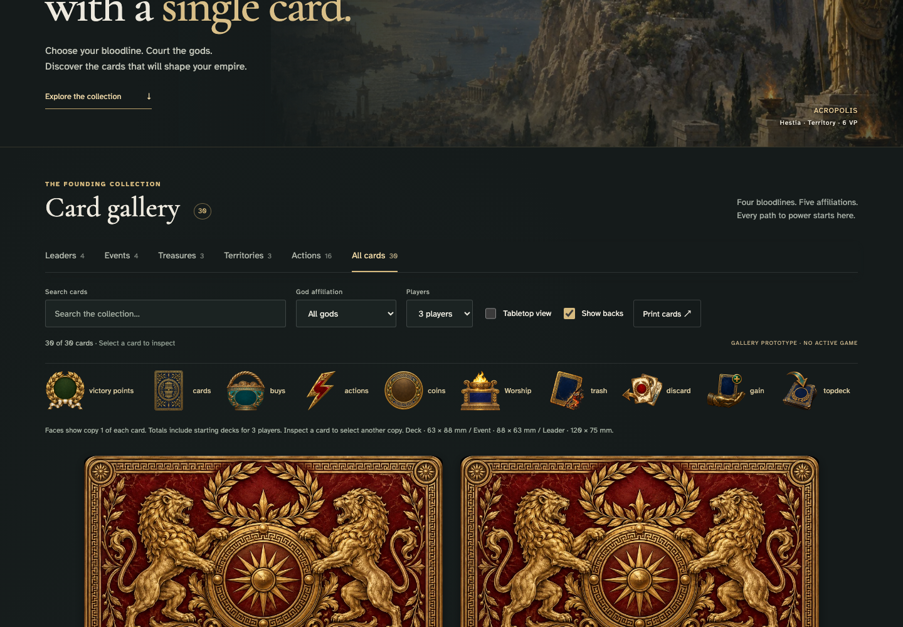

# copy totals follow setup and three back families keep deck identity hidden

## Distinguish the three card back families

[phone](../../screenshots/copy-totals-follow-setup-and-three-back-families-keep-deck-identity-hidden/000-backs-phone-darwin.png) · [desktop](../../screenshots/copy-totals-follow-setup-and-three-back-families-keep-deck-identity-hidden/000-backs-desktop-darwin.png) · [tabletop-4k](../../screenshots/copy-totals-follow-setup-and-three-back-families-keep-deck-identity-hidden/000-backs-tabletop-4k-darwin.png)

