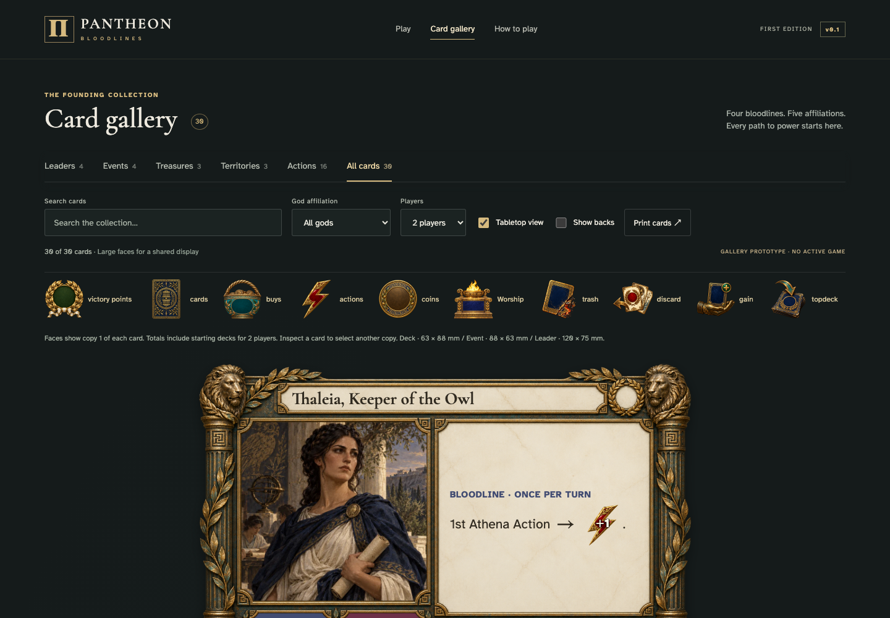

# tabletop view preserves every card and print uses physical card dimensions

## Browse cards at tabletop scale

[phone](../../screenshots/tabletop-view-preserves-every-card-and-print-uses-physical-card-dimensions/000-tabletop-phone-darwin.png) · [desktop](../../screenshots/tabletop-view-preserves-every-card-and-print-uses-physical-card-dimensions/000-tabletop-desktop-darwin.png) · [tabletop-4k](../../screenshots/tabletop-view-preserves-every-card-and-print-uses-physical-card-dimensions/000-tabletop-tabletop-4k-darwin.png)

